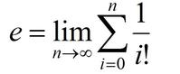
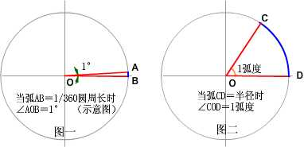
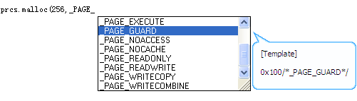
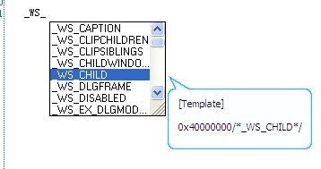
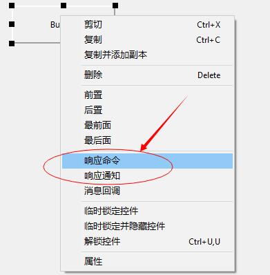
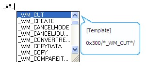
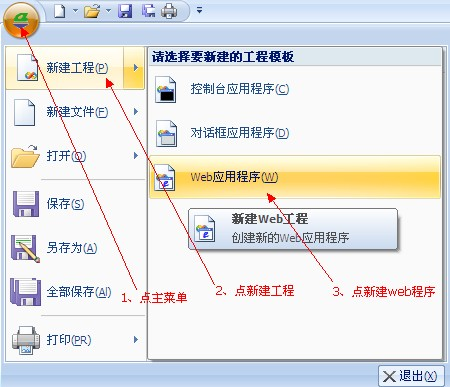
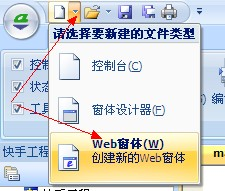
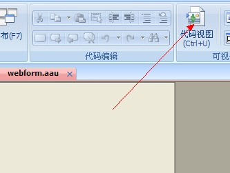
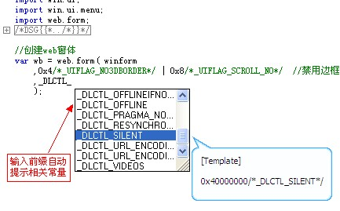

# **aardio 使用手册 [>> 官方网站 www.aardio.com](http://www.aardio.com)** 
本文档包含 aardio 基础语法、内核库、部分标准库的文档。内核库、标准库的文档应与 aardio 工具中的《库函数文档》结合使用，库函数说明应当以《库函数文档》为准，如果增加了新函数将会添加到《库函数文档》而不一定会添加到《aardio 使用手册》。

本文档会保持活跃地更新。使用第三方单独分发、擅自改动的文档可能导致大家阅读到过时、误导性的内容。根据 aardio 相应许可条款 —— 分发 aardio 必须保持 aardio 的所有原始完整文件与原始压缩包不作改动，因此未经aardio 作者书面许可，任何人不得单独重新分发本文档（少量摘抄引用可不受限制）。 

**基本语法**

**数据类型**

关于基本数据类型的详细说明请查看：[数据类型](#chmtopic4)

**标识符**

标识符是指编程语言中由起标识作用的英文字母、数字或中文字符、以及下划线组成的命名符号，
一般用来标识用户或系统定义的数据或方法，例如常量名、变量名、函数名等。

**标识符基本规则：**

- 标识符由英文字母、中文字符、数字、下划线“\_”三种字符组成。
- 数字不允许作为首字符。
- 标识符包含中文时，中文字符前面不能有字母或数字。
- 可以使用美元符号($)作为标识符的第一个字符。
- 可以使用下划线作为标识符的首字符,当下划线作为首字符时表示常量,单个下划线表示变量。
- 标识符区分大小写。

**关键字**

语法系统保留的关键字，关键字在编辑器默认显示为蓝色。aardio全部关键字如下:

var 用于定义局部变量
def 用于定义关键字
null 用于表示空值
and not or 逻辑运算符
begin end  用于包含语句块
false true 用于表示布尔值
if else elseif 用于条件判断语句
select case 用于条件判断语句
for in 用于循环语句
while do 用于循环语句
break continue 循环中断语句
try catch 用于捕获异常
class ctor 用于创建类
function 用于创建函数
return 用于函数中返回值
namespace 用于创建或打开名字空间
import 用于引用库
with 用于打开名字空间
this 用于在类内部表示当前实例对象
owner 用于成员函数中表示调用函数的主体对象
global 用于表示全局名字空间
self 用于表示当前名字空间 

另外aardio中的关键函数在编辑器中也默认显示为蓝色。请参考：[关键函数](#chmbookmark1)

aardio支持自定义关键字，例如：

def 如果 = if
def 否则 = else
def 否则是 = elseif
def 名字空间= namespace
def 循环 = while

io.open();

如果 1== 1 {
`    `io.print(" 1等于1 ")
}
否则{
`    `io.print(" 1不等于1 ")
}

如果在库中定义关键字、需要在preload库中加载定义关键字的库，才能保证在编译前生效。

**当关键字置于成员符之后,aardio会将关键字作为普通成员变量名,如下:**

io.namespace = "io"

**分隔符**

aardio使用半角空格、制表符、回车换行、分号等作为分隔符，不允许使用全角空格('\u3000')或HTML空格('\u00A0')作为语法分隔符。在HTML模板语法中，还可以使用<? ?> 作为代码分隔符。

**注释** 

注释是被标明不是程序代码、在运行时跳过不执行的附加说明内容。
### **1、单行注释**
单行注释以 //开始，到行尾结束;
###
### **2、 多行注释**
多行注释以 /\*开始，到 \*/结束，首尾的\*字符可以有一或多个，但\*字符的数目必须首尾匹配。

**操作数(operand)**

操作数是指代码中表示数据的最小数据单元：[变量、常量](#chmtopic3)

**操作符(operator)**

操作符指代码中的所有标点符号(不允许使用全角标点、在aardio编辑器中全角标点、全角空格将以红色纠错背景显示)。 用于表达式中对操作数计算求值的操作符本手册称为运算符。

关于运算符请参考下面的链接：

[算术运算符](#chmtopic11)

[按位运算符](#chmtopic12)

[等式运算符](#chmtopic14)

[逻辑运算符](#chmtopic16)

[关系运算符](#chmtopic17)

[连接运算符](#chmtopic13)

[取长运算符](#chmtopic15)

[优先级](#chmtopic9)

[运算符重载](#chmtopic18)

其他操作符将在其他语法章节介绍，例如你可以在[数据类型](#chmbookmark2)中了解到构造操作符“{}”，成员操作符“.”，索引操作符“[]”

**表达式(expression)**

表达式用来表示右值数据，右值都是表达式，左值都是具名对象。

右值是指存储在内存，并使用表达式表示的只读数据值(read value)，通常用于赋值语句的等号右侧、或作为函数的输入参数、函数的返回值使用，它与左值相对，不能对右值执行赋值操作(即不能置于等号左侧)。

单个操作数可以构成一个表达式。
操作数、运算符可以组成表达式，使用运算符对操作数进行运算并返回一个新的值。
一个表达式可以作为另一个表达式的操作数。
函作返回值可以作为表达式。
赋值语句不能作为表达式。

**语句(statement)**

我们编写的程序由语句组成，
程序中的最小指令单元称为语句。

基本语句由关键字、操作数、操作符、表达式等组成。
包含多个语句、或语句块的语句称为复合语句。

一个基本语句是由尾部的分号表示结束的逻辑行，
如果能保持语句在语义上的独立完整性，分号“;”通常可以省略。

语句块由一对大括号界定（ 也可以使用 begin end 替代 ）
语句块可以包含多个基本语句或者复合语句。

1、基本语句:
[赋值语句](#chmtopic20)
[函数调用语句](#chmbookmark4)
[import语句](#chmtopic41)

2、语句块
[语句块](#chmtopic21)

3、控制语句
[条件判断语句](#chmtopic22)
[循环语句](#chmtopic23)
[容错语句](#chmtopic25)

4、定义语句
[定义名字空间](#chmtopic33)
[定义函数](#chmtopic26)
[定义类](#chmtopic34)

**语句与表达式的概念区别**

aardio语言严格区分表达式、语句的概念，单独的表达式不能作为语句。

1+1; //错误：单独的表达式不能作为语句 
var num = 1+1: //正确，表达式组成语句 
io.print( num ); //函数调用构成独立语句 
io.print; //错误：函数对象不能作为语句 
var func = io.print: //正确，函数对象可以作为操作数构成表达式  
var tfunc = type( func ); //函数返回值是一个表达式
num++; //正确，自增赋值语句 
num = num++;//错误：赋值语句不能作为表达式 
###
### **1、表达式只能用来表示右值**
表达式只能用来表示右值。

右值是指存储在内存，并使用表达式表示的只读数据值(read value)，通常用于赋值语句的等号右侧、或作为函数的输入参数、函数的返回值使用，它与左值相对，不能对右值执行赋值操作(即不能置于等号左侧)。

你可以像下面这样写:

num = 1+1

1+1是一个表达式，下面这样写就是错的:

1+1 = num; //表达式只能存在于右值中，不能置于等号左侧作为左值使用
{} = tab; //这样也是错的 
###
### **2、表达式可以包含在括号里**
你可以像下面这样写:

num = ( (1+1)+2 )

所有表达式都可以放在括号里。

但是下面这样就不对了： 

 (num) = ( (1+1)+2 ) //出错了

等号左侧不是表达式、不能用括号包含。
### **3、语句可以用分号标明结束**
你可以像下面这样写:

num = ( (1+1)+2 );

赋值语句是一个语句，可以用语句分隔符。

但是下面这样就不对了： 

 num = ( **(1+1);** +2 ) //在表达式后面加分号出错了
###
### **3、返回值表达式**
函数调用语句的返回值是一个右值表达式，可以作为表达式使用。

**变量、常量**

变量、常量指代码中表示数据的对象，通常使用合法的标志符、字面值(数值、字符串)来表示。

**变量**

在程序运行过程中，用来存储数据值并且其**值能被改变的对象**称为变量。
变量的名称用字母、数字、中文字符、下划线等组成的合法标识符来表示。

变量名开始字符不能为数字。
变量名包含中文时，中文字符前面不能有字母或数字。
可以使用美元符号($)作为变量名或变量名的第一个字符。
可以使用下划线作为变量名或常量名的首字符,当下划线作为首字符时表示常量,单个下划线表示变量.

应遵循就近原则(Principle of Proximity):在第一次使用局部变量之前定义该变量，以使代码保持清晰的结构。 
### **1、成员变量**
成员变量是属于一个[名字空间](#chmtopic33)的成员对象。
变量的默认名字空间为global名字空间，并可以使用namespace改变指定代码块的名字空间。
可以使用self关键字访问当前名字空间。使用..操作符访问global名字空间

//没有用var语句显式声明的变量，默认就是当前名字空间的成员变量

变量 = "字符串:普通变量";
变量 = "变量的值是可以改变的" 

..str = 123; //..str等价于 ..global.str
###
### **2、局部变量**
var声明一个局部变量，作用域为当前语句块，以及被当前语句块所包含的语句块。
var语句声明的局部变量可以指定一个初始值，也可以不指定，建议对所有变量指定初始值。

例如：

var 局部变量;
局部变量 = 123;

var a,b,c = 1,2,3
io.print( a,b,c,局部变量 )

请参考：[var赋值语句](#chmbookmark6) [函数局部变量](#chmbookmark7)

**常量**

在程序运行过程中，用来存储数据值并且其**值不能被改变的对象**称为常量，常量仅可初始化赋值一次，不可以修改其常量的值。
### **1、字面常量**
指以数值、字符串等字面值表示数据的对象。
象123,"abc"这样的值被称之为字面值，被称为字面值是因为它的值就是代码直接描述的值，并且没有名字可以称呼它，只能用它的值来表示。

常量只能赋值一次，重复赋于相同的数字或字符串等常量值将会被忽略，赋于不同的值将会抛出错误。
aardio中的常量以下划线作为起始字符的标识符来表示。
### **2、具名常量**
用合法的标识符来表示不可修改数据的对象称为常量，与字面值不同的是它具有类似变量名的常量名称。
常量名以下划线作为首字符，或使用::操作符将普通的变量转换为常量。

具名常量可以理解为赋值后不可修改的变量。

**2.1 成员常量**

用字母、数字、中文字符、下划线等组成的标识符来表示，并且必须以下划线作为起始字符。
成员常量与成员变量一样默认创建于当前名字空间(self名字空间)、也可以指成员常量的名字空间前缀。
**成员常量的长度必须大于1并小于256个字节**(单个下划线不是常量,在aardio中通常用作匿名变量占位符)

例如： 

\_const = 123;

\_const = 123;//没有修改常量，被忽略

\_const = 456;//出错，抛出异常：不能修改只读成员

在元表中指定元属性\_readonly = false 可禁用读成员保护，
如果元表中不设置\_readonly 则默认启用只读成员保护（所有名字以下划线开头的禁止修改非null值）。

如果元表中设置 \_readonly 为任何非null值都会被强制转换为 false,
该值一旦设置以后即不可修改，如果希望启用只读成员保护，唯一的方法就是不设置该属性。

global对象无论元属性\_readonly怎么设置都会被忽略,只读成员保护总是启用状态。

**2.2 全局常量**

用大写字母、数字、下划线等组成的标识符来表示，并且必须以“下划线+大写字母”作为起始字符。
全局常量类似于成员常量，区别是必须大写、并且位于globle根名字空间。

实际上使用全局对象是不好的习惯，你应当尽可能的避免使用全局对象、将它们放入适当的名字空间。
不要介意多打几个字多写几个名字空间前缀，理解了全局对象会不知不觉增加程序的复杂度、并且努力地去避免使用全局对象(这里不是指名字空间、相反应当更多地使用名字空间来组织数据)，意谓着你已经成为了一名有经验的程序员。 

而且全局常量在aardio是运行时对象，意谓着会增加发布后的程序体积。
把它们改为字面常量并加上注释是一个不错的优化方案，aardio提供相应的工具。
这种优化技术被用于libs\\win\#DEFINE.aardio(这不是一个库，放在库目录下仅仅是为了让扫描常量声明到智能提示数据库)，效果如下：

**2.3 转换全局常量**

将一个变量名转换为 global名字空间下的全局常量名 - 并保护该常量在其后加载的代码中一旦赋为非空值后即不可修改，例如 

::Kernel32 := raw.loadDll("Kernel32.dll");

全局常量需要遵守以下使用规则:

1、全局常量名首字母大写（以区别普通变量 ）。 

aardio默认定义了少量全局常量函数名 - 这些关键函数全部小写首字母，但在aardio编辑器中显示为蓝色高亮状态。关键函数属于global名字空间，并在所有名字空间下可以直接使用。 

以下为aardio提供的关键函数列表，关于这些关键函数的具体用法，请参考《库函数文档》或aardio编辑器的函数提示。 

type 关键函数,用于获取对象的数据类型
eval 运行aardio代码，并计算表达式的值
assert 断言函数
assertf 反断言函数
error 抛出异常
tostring 用于转换参数为字符串
topointer 用于转换参数为指针
tonumber 用于转换参数为数值
loadcode 用于加载代码
loadcodex 用于加载执行代码
dumpcode 用于编译代码
rget 用于选择返回值
collectgarbage 用于回收内存
invoke 用于调用函数
call 用于调用函数
callex 用于调用函数
sleep 用于休眠
execute 用于调用系统命令
setlocale 用于区域设置
setprivilege 用于指定进程权限

2、当一个变量被定义为全局常量，赋于非空值以后其值即不能再随意更改 。 

全局常量一般使用 ::Name := 初始值 赋值，等价于使用 ::Name = ::Name or 初始值 以避免重复初始化。 

3、::的作用域是根据代码的载入顺序向下向后的，所以在同一文件中已定义的全局常量名再次使用时可以省略::前缀，但因为代码文件的载入有不确定性 - 在其他文件首次使用该常量名时仍然应该使用::定义一次。 

下图显示了win库定义的全局常量：

###
### **3、使用初始化赋值语句定义常量**
常量是仅能初始化赋值一次，对于数值常量，重复赋于相同的值会被自动忽略。

如果常量的值是非数值对象，即不能保证每次创建的值是相同的，为避免无意中修改常量值导致异常，可使用:=操作符赋值。

例如: 

::Func := function() begin

end; 

上面的代码等效于

: 

::Func = Func or function() begin

end;

**数据类型**

**基本数据类型**

|**基本数据类型** |**存储值** |**说明** |
| :-: | :-: | :-: |
|type.null |null |空值，所有变量默认初始值为null |
|type.boolean |true、false |布尔值，表示条件真、假，注意在静态类型中布尔值为32位长度， flase 存为0，而 true 存为非零值，|
|type.number |数值 |数值默认存储为 64位浮点数（即静态类型中的 double 类型），在 API 函数中如果未加类型声明默认转为 32 位 int 类型，aardio 提供 math.size64() 函数用于 创建 64 位无符号整数（类据类型为 cdata，兼容 API 静态类型中的 LONG 类型）。 |
|type.string |字符串 |字符串，字符串指向的内存是只读的字节数组，可用下标读取每个字节的 8 位无符号数值（但不可写入）， 任何对字符串的修改都会返回新的字符串（而非修改原来的内存）。在调用静态 API 函数时可作为只读的字符串指针参数使用。 aardio 字符串尾部总会保护性地放置2个隐藏的字节'\0\0'（不计入字符串长度，不包含在字符串中）， 因此 aardio 字符串可兼容 C 风格字符串。 |
|type.buffer |原生字节数组|
原生字节数组( buffer ) 是使用 raw.buffer() 函数分配的可读写、固定长度的内存，可存取各种二进制数据。可用 [] 下标操作符读写内存中原生字节的 8 位无符号数值，可以用 # 操作符取字节数组长度。 不支持连接操作符，但支持 raw.concat,string.concat,string.join 等函数以不同方式拼接。  buffer 在几乎所有字符串函数中都可以作为字符串使用。在结构体中也可作为指针、 BYTE[]数组的值。在原生 API 参数中可作为内存指针、字符串、输出字符串使用。在 COM 函数中可作为安全数组使用。 

 注意：如果在一个结构体中，将 buffer 赋值为一个结构体的指针字段，并将这个结构体作为输出参数调用 API， 在 API 函数返回以后，只要指针地址没有改变 —— 则这个字段的值仍然是指向原来的 buffer 对象（ 如果指针地址被修改，则会变为新的指针值 ）。 

  buffer 在 json 中会转换为 {type="Buffer";data={} } 格式的表对象, 这种表对象可作为 raw.buffer() 函数的唯一参数还原为 buffer 对象  buffer 尾部总会保护性地放置2个隐藏的字节'\0\0'（不计入字符串长度，不包含在字符串中）。 与动态指针不同的是，即使你不指定初始值，aardio 仍然会初始化 buffer 中所有字节的值为0，buffer 的长度是不可变的。 请参考: [raw.buffer 函数](#chmtopic61)
|
|type.pointer |指针 |内存指针一般用于存储内存地址.但有时候也可能用于存储句柄地址或者无效的内存地址，内存指针给你最大的自由，同时也带来最大的风险，应谨慎使用。 |
||动态指针 |动态指针并不是一个新的类型 - 而是与普通内存指针拥有相同的数据类型， raw.realloc()函数可用于分配、释放一个动态指针，也可以使用 raw.realloc() 重新调整动态指针分配的内存大小，动态指针的地址是可变的，调整大小后应废弃旧的指针地址并更新为 raw.realloc() 返回的新指针。   动态指针会在返回给用户的指针地址前面倒退8个字节记录2个32位字段的内存长度、数据长度信息，然后总是向后移动8个字节将可用的指针地址返回给用户， 动态指针尾部总会保护性地放置2个隐藏的字节'\0\0'（不计入内存长度，不包含在存储数据中）。   动态指针可以作为普通内存指针使用，也可以用于支持动态指针的 raw.realloc() raw.concat() raw.sizeof() 等函数， 用 raw.sizeof() 获取动态指针指向内存的大小，用 raw.concat() 函数可以对动态指针的内存追加拼接数据。 要记住这些操作动态指针的函数不要误传不是由 raw.realloc() 分配的非动态指针进去，aardio 不会检查或阻止这种错误操作。   与 buffer 不同的是，如果不指定初始化值，raw.realloc 就不会对分配的内存设定初始化值， 并且 aardio 不负责自动释放动态指针分配的内存，显式的调用 raw.realloc(0，动态指针) 才能释放一个动态指针。 |
|type.table |数组、 哈希表、 静态结构体 |请参考[《表》](#chmtopic7)|
|type.function |函数 |请参考：[定义函数](#chmtopic26)|
||||
|type.cdata |内核对象 |aardio 内核对象，例如 math.size64() 函数创建的长整数对象。|
|type.fiber |纤程 |fiber.create()创建并返回的纤程对象。 纤程类似线程，但不是线程. 纤程有独立的运行堆栈，并且也可以暂停或继续运行，但是纤程并不会创建新的线程，也不能同时运行多个纤程.  请参考《库函数文档》：内核库->纤程库|
|type.class |类 |请参考：[class](#chmtopic34)|
**null(空值)**

null即变量没有存储任何数据，将一个变量赋值为null等于删除这个变量

**boolean(逻辑布尔值)**

有两个值，true表示真、 false 表示假。通常用在条件表达式中。
通俗一点说，true表示是、符合条件，false表示不是、不符合条件。

在条件表达式(恒等式除外)中， null、数值0这认为是false，
其他有效的数据都被认为是true。

 与C++类似，aardio认为0为false，非零数值为true，在外部api函数中可以保持一致。 

在 aardio 中如果一个函数说明应该返回布尔值（true 或 false ），但是实际允许返回任意类型的值 - 不会再额外说明。 任意类型的值可按上述规则自动转换为布尔值使用，不再额外作出说明。 如果一个函数返回值的用途被描述为“是否 ……” 或相同语义的类似说明，即说明该函数应该返回一个布尔值，不再额外作出说明。

**number(数值)**

aardio中的数值为64位双精度浮点数，数值类型可以使用不同的进制来表示，参考：[数值与进制](#chmtopic8) 
使用0x前缀表示十六进制数，例：num = 0xA1 + 0xFF，而使用2#前缀可以表示2进制数，使用8#前缀可以表示8进制数。也可以用科学计算法表示数值 num = 6e+20

把一个大于10的数写成a \* 10n 的形式，其中a称为尾数、n称为指数，是整数数位只有一位的数，这种计数法叫做科学计数法，也叫10的幂计数法。例如 x= -3.5×105 这里最前面有一个负号，3.5是尾数，两个有效数字，后面以10为基数的指数为5。我们可以将它表示为-3.5E5。

数值的字面值允许加入下划线作为数值分隔符，
例如 123\_456 等价于 123456， 2#1010\_1100 等价于 2#10101100，
数值分隔符不能使用连续多个下划线，并且不能在字符串中使用数值分隔符，例如: 

tonumber("123\_456") 返回的是123 
("123456") + 1 返回的是一个数值 123457
("123\_456") + 1 会报错

**string(字符串)**

请参考[《字符串与编码》](#chmtopic5)

**table(表)**

请参考[《表》](#chmtopic7)

**function(函数)**

函数是一个子程序，可以接收零个或多个参数、返回一个或多个值。使用function关键字定义函数，使用()操作符调用函数。请参考：[定义函数](#chmtopic26)

**class(类)**

使用class关键字定义类。类可以动态创建数据结构相同的table对象。 请参考：[class](#chmtopic34)

**fiber(纤程)**

fiber.create()创建并返回的纤程对象。 纤程类似线程，但不是线程.
纤程有独立的运行堆栈，并且也可以暂停或继续运行，但是纤程并不会创建新的线程，也不能同时运行多个纤程.

请参考《库函数文档》：内核库->纤程库

[转换数据类型](#chmbookmark9)

aardio提供三个强制转换动态类型的函数

- tostring(v) 转换参数v为字符串，可使用\_tostring元方法自定义转换函数。 
- tonumber(v) 转换参数v为数值，忽略首尾空白字符，可使用 \_tonumber 元方法自定义转换函数。 
- topointer(v) 转换参数v为指针，可使用\_topointer元方法自定义转换函数。 

io.open(); //打开控制台窗口，用来支持io.print函数
n = tonumber( "2" );//tonumber函数强制转换一个变量为数字，如果失败返回null空值
str = tostring( 2 );//强制转换一个变量为字符串，如果失败返回null空值
ptr = topointer( 123 ); //强制转换为指针，如果失败返回null空值
io.print( type(n)，type(str)，type(ptr) );
execute("pause") 

另外，使用2个逻辑非操作符可以将任何值转换为布尔值，例如: 

var num = 0;

import console
console.log( !!num )
console.pause()

**aardio 也允许数据类型自动转换，规则如下:**

1、在逻辑运算中，非 0、非 null、非 false 为 true，反之为 false。

2、使用 [等式运算符](#chmtopic14) 比较 2 个值时：
a)、任意值与 true,false 比较则先转换为布尔值。
b)、非布尔值与数值比较，则先转换为数值，然后比较数值是否相等。

要注意 ""== 0 或 ' \t\r\n'== 0 会返回 true，空白字符串自动转换为数值时返回0，
null == 0 会返回 false，因为 null 转换为数值还是 null，null 与 0 不是相等的数值。

3、在算术运算中，字符串会尝试转换为数值，转换失败则抛出异常。

要注意字符串在自动转换为数值时，忽略首尾空白字符，空白字符串会转换为 0，而 tonumber 函数会将空白字符串转换为 null。而且 tonumber 函数会调用 \_tonumber 元主法，但自动转换忽略 \_tonumber 元主法。

示例:

import console; 
console.log( ("") + ('\r\n\t ') + 0 ); //显示 0
console.log( tonumber("") === null ); //显示 true
console.pause(true); 

4、在字符串连接操作时，数值会自动转换为字符串。

要特别注意字符串的字面值两侧的 + 会自动转换为 ++。
例如 "1" + 0 会自动转换为 "1" ++ 0 做字符串连接操作，但 ("1") + 0 会执行加法运算。

**函数或属性的类型转换:**

除非文档有特别说明，函数参数应使用准确的类型。少量函数会支持可兼容的类型转换 —— 如果文档没有特别说明，一般属于一种容错做法，代码中不应当依赖这种转换。过多的类型转换是不必要的 —— 使用准确的类型是更好的选择。

**原生静态类型中的类型转换:**

请参考：[原生静态类型](#chmtopic55) [不声明调用 API](#chmtopic58) 

**使用type函数可以读取数据类型。**

**1、函数原型：**

dataType[，structType][，metaType] = type( any )

**2、函数说明：**

type函数返回对象的基本数据类型dataType。
如果对象是一个struct结构体，则返回结构体类型structType。
如果对象在元表中指定了\_type字段的值，则返回元类型metaType。

aardio用字符串描述类型，所以返回的类型都是字符串，
如果没有任何参数，type函数无返回值. 

**3、调用示例：** 
**

**

----------------------------------------------------------------
io.open(); //打开控制台窗口

io.print( type(null) ， type.null );//显示null ， null
io.print( type("Hello world") ， type.string );//显示 string ， string
io.print( type(1000) ， type.number );//显示 number ， number
io.print( type(io.print) ， type.function );//function ， function
io.print( type( class{} ) ， type.class );//显示 class ， class
io.print( type(true) ， type.boolean );//boolean ， boolean
io.print( type( io.stdin ) ， type.cdata );//显示 cdata ， cdata
io.print( type( {x=0;y=0} ) ， type.table );//显示 table ， table
io.print( type( topointer( 1 ) ) ， type.pointer );//显示 pointer ， pointer

**使用type.eq比较数据类型** 

**1、函数原型：**

eq = type.eq( obj，obj2 )

**2、函数说明：**

比较参数一、参数二的类型、元类型、struct类型，如果完全相等返回true，否则返回false。 请注意在 aardio 中如果一个函数说明会返回布尔值( true，false) ，如果未加特别说明则允许返回任何可自动转换为布尔值的其他数据类型的值。 例如 type.eq() 可能会返回 null 值以替代 false，aardio 中的函数说明不再重复说明此类自动类型转换规则。

**3、调用示例:**

import console;
import time.ole

var tmOle = time.ole();
var tm = time();

//type.eq 严格比较所有类型(基础类型、元类型、struct类型)
if( type.eq( tmOle，tm ) ){
`    `console.log("tmOle，tm 类型相同")
}
else{
`    `console.log("tmOle，tm 类型不相同")
}

//time.istime 不比较元类型，因此兼容 oletime
console.log( "是 time 对象吗?"，time.istime(tmOle) )

console.pause();
## **string(字符串)**
计算机中以八个二进制位表示一个八位字节 - 这称为一个单字节字符。

一组连续的字节就构成一个字符串，在aardio中字符串是基于二进制的，可以包含任何数据（例如图像、文本、或者'\0'等不可打印字符）。

字符串本质上是字节构成的数组，但这个数组是只读的，每次对字符串做替换、连接等操作都会生成新的字符串，
每个字符串指向的内存不应该被直接修改。

下面的代码定义了一个最基本的字符串：

var str ="C:\Documents and Settings\admin\Desktop\string.aardio" 

可以用 #str 取该字符串占用的内存字节长度，可以使用下标获取每个字节的数值，
例如 str[1] 取出第一个字节的数值是67, 内存中的67在文本中显示出来的就是字符"C" - 这是ASCII编码规定的。

前面说过，一个字节只有8个二进制位，那它能表示的字符就很有限，所以就有了很多不同的编码规则用多个字节
来表示更多的字符，例如 GBK,UTF-8 等多字节字符集，用小于0x80的单字节表示ASCII字符（英文字母数字这些），
GBK用双字节表示汉字（首字符大于0x80)，而UTF8用两个以上的字节表示宽字符（所有字节大于0x7F)。

GBK编码的第二个字节还是会与ASCII冲突，所以处理GBK字符串需要从头开始才能准确的检测一个字节属于谁，
这导致容易出现串码问题。而 UTF8 的宽字符总是大于0x7F，首字符的两个二进制位总是1,而附加字节的前两个
二进制位总是10，这就让我们处理文本非常方便，也不会出现串码问题。因为格式化的文本，例如HTML,JSON它的分隔标记通常都是
固定小于0x7F的ASCII字符，但要注意UTF8的字符是变长的，理论一个字符可以是1，2，3，4 .....个字节。

不同的编码还存在不同的系统环境不兼容的问题，例如GBK的软件在繁体系统上就会乱码，而Unicode编码可以
避免这一问题，Unicode编码有多种方案，主要被采用的则是UTF-8,UTF-16。 windows系统使用的是UTF-16,
而 aardio 10开始，aardio的源代码文件、字符串等等默认使用UTF-8编码。

注意在aardio文档中一般提到Unicode指的是UTF 16.
例如 string.fromUnicode() string.toUnicode() 函数默认都是从UTF-8到 UTF-16(Unicode)双向转换。
###
### **一、文本字符串**
文本字符串放在双引号中，字符串可以包含换行，aardio保证双引号中的字符串换行使用'\n'换行符,不包含'\r'回车符。

例如：

strPath ="C:\Documents and Settings\admin\Desktop\string.aardio" 

strLine ="第一行 第二行"

如果在双引号中的字符串本身包含双引号，可以用两个连续的双引号表示双引号自身。

另外在 aardio 10中，可以使用反引号（键盘左上角ESC下方的键）代替双引号，它们的作用与用法相同，

、

例如：

**strPath = `**C:\Documents and Settings\admin\Desktop\string.aardio`** 

**strLine = `**第一行 第二行`

aardio代码中双引号、反引号内的都是纯文本字符串，并被aardio标记为UTF-8编码。
aardio中每个字符串都有一个UTF格式标记，可以使用 string.getUtf() , string.setUtf() 函数获取或修改UTF标记。
UTF标记是按位设置的，utf & 8 表示一个UTF8编码的字符串，utf & 16表示一个UTF16编码的Unicode字符串。
而UTF & 1 表示一个ANSI字符串，用户在编写程序中一般不应去获取或修改该UTF标记，该格式标记应由aardio自动
维护，用于优化自动编码转换的效率。用户应当明确的了解一个文本的来源编码，并且有有需要时使用string.fromto()
等转换函数进行编码转换。aardio只要在能确认一个字符串的编码格式时才会对字符串进行标记（例如：直接写在aardio
源码中的字符串字面值，或者经过string.fromto函数成功转换编码的字符串）。
###
### **二、转义字符串**
转义字符串放在单引号中。支持\转义符，语法与C\C++相同。 
需要注意的aardio中双引号中的字符串不能使用转义符，这一点与C语言有别。

在单引号中的字符串可以换行书写，但是aardio会忽略所有的换行，
aardio保证单引号中只能以'\r\n'表示回车换行符,所有字面值的回车换行被忽略 。
转义字符串支持的转义符与C,JS等类似：

|**转义符** |**说明** |
| :-: | :-: |
|\\ |表示普通\字符 |
|\ddd |用一到三个数字组成十进制数值表示一个字符 ， 如果只想表示'\0'，并且后面有其他不相关的数字， 可以在\0后面加一个换行，例如 str ='\0 86'|
|\xAA |用x后面的两位十六进制表示一个字符 |
|\uAAAA |用u后面的4位十六进制表示一个Unicode字符， 可使用一对代理字符表示Unicode编码大于0x10000的4字节字符，例如：'\uD86E\uDC1C' 注意普通字符串里默认会解析为UTF-8编码的多字节字符， 而在Unicode字符串中解析为UTF-16编码的字符。|
|||
|\uAAAAAA |\U大写时， 可在其后跟随4个或6个十六进制字符表表示一个Unicode字符， 支持Unicode编码大于0x10000的4字节字符。  注意普通字符串里默认会解析为UTF-8编码的多字节字符，例如'\U02b81c' 而在Unicode字符串中解析为UTF-16编码的字符，例如'\U02b81c'u。|
|\a |响铃符(常用于print函数发出警告铃声，例如 io.print('\a') |
|\b |退格 |
|\f |换页 |
|\e |ESC码。等价于 \x1b |
|\r |回车 |
|\n |换行 |
|\r\n |回车换行 |
|\t |制表符(横向跳格) |
|\v |匹配一个垂直制表符。等价于 \x0b |
|\" |双引号 |
|\' |单引号 |
|\[ |方括号[ |
|\] |方括号] |
转义字符串可以换行、但是aardio会忽略换行符，必须使用\n表示换行、用\r\n表示回车换行。
如果单引号中仅包含一个字符、并且后面附加#号后缀、则表示该字符的字节码数值。

**示例：**

io.open()

// 字符串中也可以直接用十六进制表示字符，例：

io.print('Hel\x6c\x6f world\x21'); //换行被忽略

//字符串也可以直用三位十进制数表示字符，例：

io.print('Hel\108\111 world\33') 

//如果单引号中仅包含一个字符，并且在后面加上#号标记,则表示字符的ASCII值

io.print( 'A'# ) //显示65

注意在转义符串结束后附加#符号表示字节码，附加U或u表示Unicode字符串（UTF16编码），例如： 

//用于在代码中输入UTF-16 LE编码字符串(代码页：1200)

var wstr = 'UTF16字符串'u 

//UTF-8编码字符串(代码页：65001)

var utf8str = 'UTF8字符串'

Unicode字符串（UTF16编码）用下标取字节或字符时，返回的是双字节的值，例如

import console; 

var wstr ='中文abc'u;
for(i=1;#wstr/2;1){
`    `console.log(wstr[ i ]) //宽字节码
`    `console.log(wstr[[ i ]]) //宽字节字符
}

console.pause(true);
###
### **三、包含字符串**
包含字符串用于将一个文件直接嵌入aardio代码中，并加载为一个二进制字符串。 例如： 

` `var str = $"/test/test.jpg"

在aardio程序编译发布以后，该文件就会直接被编译到aardio代码中，不再需要原来的文件也可以运行。
###
### **四、注释字符串**
在aardio的赋值语句中，可以将行注释、段注释作为一个字符串组成赋值语句。
因为aardio中段注定可以自定义注释标记里 星号数目 - 只要首尾匹配就可以，这就可以方便的用来表示复杂的字符串。
而不用担心所包含的字符串里可能出现字符串的结束标记。

注释字符串的作用与双引号类似，表示的是纯文本字符串，aardio解析后会将起标记为UTF8编码，
但是段注释保证将换行解释为\r\n'，并且忽略首尾紧邻星号的第一个空行（如果有的话）,而行注释保证字符串没有回车符('\r')或换行符('\n')

请参考:[回车换行符](#chmtopic6)

示例：

str = //表示原始单行字符串，到行尾结束;

str = /\* 
表示原始多行字符串，首尾的\*字符可以有一或多个，但\*字符的数目必须首尾匹配
\*/

**附：字符串导航图

**
----------------------------------------------------------------------
**回车换行符**

**回车换行符**

在计算机还没有出现之前，有一种叫做电传打字机（Teletype Model 33）的玩意，每秒钟可以打10个字符。但是它有一个问题，就是打完一行换行的时候，要用去0.2秒，正好可以打两个字符。要是在这0.2秒里面，又有新的字符传过来，那么这个字符将丢失。于是，研制人员想了个办法解决这个问题，就是在每行后面加两个表示结束的字符。一个叫做“回车”，告诉打字机把打印头定位在左边界；另一个叫做“换行”，告诉打字机把纸向下移一行。这就是“换行”和“回车”的来历，从它们的英语名字上也可以看出一二。 

后来，计算机发明了，这两个概念也就被搬到了计算机上。那时，存储器很贵，一些科学家认为在每行结尾加两个字符太浪费了，加一个就可以。于是，就出现了分歧。 

Unix 系统里，每行结尾只有“<换行>”，即'\n'；
Windows系统里面，每行结尾是“<回车 ><换行>”，即'\r\n'；
Mac系统里，每行结尾是“<回车>”。
在aardio中可使用string.crlf() 函数格式化换行为统一风格。

一个直接后果是，Unix/Mac系统下的文件在Windows里打开的话，所有文字会变成一行；
而Windows里的文件在Unix/Mac下打开的话，在每行的结尾可能会多出一个^M符号

0x0D（asc码是13） 指的是“回车” aardio中写为'\r' 是把光标置于本行行首 
0x0A（asc码是10） 指的是“换行” aardio中写为'\n' 是把光标置于下一行的同一列 
0x0D + 0x0A 回车换行 aardio中写为'\r\n' 把光标置于下一行行首 

**文本模式**

在windows中默认的以'\r\n'表示文本换行,如果指定文本模式读写文件时,则读取文件时会自动将回车换行转换为'\n',而在写入时又自动将'\n'转换为'\r\n'

在使用io.open函数时,可以用'b'标记指定二进制模式,而使用't'标记指定文本模式(默认设置),具体请参考:[io.open 函数](#chmtopic51)

在设置winform程序时,要注意普通文本框控件使用'\r\n'表示换行,而richedit控件则使用'\n'表示换行.

**在字符串中表示回车换行**

aardio有多种表示字符串的方法，
而这些表示方法都有预定义的回车换行解析规则。
这些规则不会受到源文件实际使用的换行字符影响，即无论你是以'\r','\n'或者'\r\n'换行。
aardio会按下面的规则解析回车换行:

在赋值语句中以段注释表示的字符串，保证换行为'\r\n'
例如：

`  `str = /\*

`  `我后面是回车符 

`  `我前面是换行符

`  `\*/

在赋值语句以行注释表示的字符串，保证没有回车换行

str = //我后面即没有回车，也没有换行

放到双引号中的字符串，保证没有回车符，但是有换行

str = "我后面是换行符

我前面是换行符"

放到单引号中的字符串，保证没有字面值的回车换行符，只能以'\r\n'来表示

str ='我后面没有回车也没有换行

我前面没有回车也没有换行'
## **table(表)**
table（表）是aardio中唯一的复合数据类型，除了非复合的基础数据类型以外，aardio中几乎所有的复合对象都是表，即使是变量的命名空间也是表。表的本质是一个集合(collection)，可以用于容纳其他的数据成员，并且表也可以嵌套的包含其他的表（table），在aardio里表几乎可以容纳一切其他对象。

如果我们把字符串、buffer、数值、函数、指针.....这些基础数据类型比喻为盘子中的菜，那么表这样的复合数据类型就是装菜的盘子，如果没有了盘子，所以就没有办法愉快的吃菜了（相当于在程序代码中传输、使用数据）。 

### **一、表的类型**
表（table）包含的数据结构也被称为字典(dictionaries)、列表（list）、映射(map)、关联数组(associative arrays)、对象(object)......等等.虽然在不同的编程语言里的具体实现存在差异（例如有序或无序存储、使用或不使用哈希算法），但基本都是用来包含不定个数的键值对成员。 

aardio中的表可以包含不定个数的成员，每个成员都由一个键值对组成（键用来指定成员的名称，值用来指定成员的值）。“键”可以任何除null以外的数据类型,甚至可以在table元素中包含table，table允许嵌套。“值”也可以任意数据类型，当值为null时表示删除该成员。

通常把“键”放在索引操作符“[]”中来索引一个元素的值，这时候键又称为“下标”或“索引”。例如 tab["键"] tab[1]，“[]”则被称为下标操作符。也可以把一个符合变量命名规则的键放在成员操作符“.”后面,例如 tab.key tab.key2 ; 

根据键的存取排序规则，表包含的成员分为以下两种类型（ 表可以同时包含以下两种类型的成员 ）

**a)、哈希表（无序集合）**

aardio中的表是哈希表（hashtable），哈希表使用哈希算法存取，不会按其他特定顺序排序（在代码中添加成员的顺序将被忽略），所以在遍历哈希表时的顺序并不一定会保持代码中书写、添加表成员的顺序，因为我们把这种集合称为无序集合。哈希表的优势是查找速度非常快，即使表包含的成员非常多，仍然可以快速的访问成员键值对。

下面是一个创建哈希表的例子： 

tab = {
`    `a = 123;
`    `str = "字符串";
`    `[123] = "不符合变量命名规则的键应放在下标内。";
`    `["键 名"] = "不符合变量命名规则的键应放在下标内。";
`    `键名 = {
`        `test = "表也可以包含表";
`    `}
}

**b)、数组（有序集合）**

如果表中不定个数的成员的“键”是从1开始、有序、连续的数值，那么这些成员构成一个有序数组。 在创建数组时，数组的键可以省略不写。表总是可以同时包含数组、以及非数组成员， 即使不包含数组成员，我们也可以将表作为空数组处理。

如果表中包含的成员使用了数值作为键，但是多个成员的键并不是从1开始的连续数值 - 则构成稀疏数组。 在aardio一般我们提到的数组 - 如果未加特别说明则是特指有序连续数组（不包含稀疏数组）。

如果表中包含了稀疏数组，或者成员的数值键包含不连续的、中断的数值，那么不应当作为有序数组使用。 aardio中几乎所有针对数组操作的函数或操作符 - 如果未加特别说明都要求参数是有序数组。

有序数组可以使用for循环（或者table.eachIndex）有序的遍历成员，下面我们看一个在aardio中使用数组的简单演示:

import console; 

//在表中创建数组
var array = { 
`    `[1] = 123;
`    `[2] = "数组的值可以是任何其他对象"; 
`    `[3] = { "也可以嵌套包含其他表或数组"}
} 

//数组的键可以省略，下面这样写也可以（并且建议省略）
var array = { 
`    `123;
`    `"数组的值可以是任何其他对象"; 
`    `{ "也可以嵌套包含其他表或数组"}
} 

//遍历数组成员,#array取数组长度
for(i=1;#array;1){
`    `console.dump(i,array[ i ]);
}

//使用 table.eachIndex 遍历也可以
for i,v in table.eachIndex(array){
`    `console.dump(i,v);
}

console.pause();

### **二、构造表** 
用{}操作符构造新的table对象，
并以分号;分隔每一个元素 (允许使用逗号代替分号)。如果成员是一个函数并以}或end结束时，可以省略分隔符。

{}操作符在表达式中只能作为赋值语句的右值、函数参数、或被包含在另一个table构造器中，而不允许与其他操作符结合，不允许向前结合、向后结合，仅允许被括号{}包含。

创建一个空的table。

var days = {}

创建一个table数组。

var days = { "Sunday"; "Monday"; "Tuesday"; "Wednesday"; "Thursday"; "Friday"; "Saturday" }

//days[1] 的内容是 "Sunday".days[2]的内容就是"Monday"......

table元素可以使用各种数据类型的变量，甚至可以是一个表达式或者一个函数，如果我们为table中的值赋于一个键名字，则在table中添加一个键值对。

point = { x=100 ; y=200 }

//point.x 的值是100;point.y 的值是200

可以在一个table中同时包括有序数组、以及其他键值对。 

tab = {x=100;y=200;"Sunday"; "Monday"}

//tab.x 的值是100;tab.y 的值是200

table的键名并不要求符合变量命名规则，键可以是任何除null以外的值或字符串。不符合变量命名规则的键名必须置于下标操作符内（并且必须是字符串，例如包含在引号中字面值）。

 在任何时候，table中不符合变量命名规则的键必须通过[]操作符访问，以下是正确的写法：
tab = { [1]=300;[2]=400;["+"]=200;[1+1]=200 }; //因为变量名不能以数字开始,更不能包含运算符。

以上的写法等价于
tab ={};
tab[1]=300;
tab[2]=400;
tab["+"]=200;
tab[1+1]=200;

我们可以把多个变量用一对花括号包含起来以转换为table数组，也可以通过table.unpack函数将table数组转换为多个变量。 

var tab = {"a";"abc";"abcd"} ; //创建一个table;
a,b,c = table.**unpack**(tab);
var tab2 ={ table.**unpack**(tab) }; //将所有返回值转换为table变量tab2

默认表的键值等使用"="号分隔，表的元素使用";"号分隔。
新版 aardio 支持用","号代替";"号分隔表元素，支持用 ":" 号代替"="号分隔键值对（结构体字段仍然必用"="号分隔键值对，不允许用":" 号代替）

如果键名为字符串，新版 aardio 允许将键名置入引号，因此可以使用类JSON的语法定义表对象，例如： 

var tag ={"name1":123,"name2":456}

**三、在函数参数中构造表**

---------------
当在函数内部有且只有一个使用{}构造器构建的table参数时，并且不包含数组元素，则{}可以省略。

例如： 

` `func( { k = 123 ;  k2=456 }  )

可以省略{}写成如下格式： 

` `func( k = 123 ;  k2=456 )

注意在函数参数中省略{}构造表参数时 —— 不能再使用":" 号代替"="号分隔键值对。 
### **四、访问table成员**
在访问table中的元素时，用元素的键作为下标查询元素的值，例如:

tab = {}; //用一对花括号创建一个空的table
tab["x"] = 200; //下标为字符串"x"，键名为字符串"x"，值为数值200。
tab[1] = "hellor world"; //下标为数字1,键索引为1，值为字符串 "hellor world" 

如果“键”是一个数字索引称为“键索引”，如果键是一个字符串称为“键名” ，
对于符合变量命名规范的键名，可以用"."成员符访问。例如：

tab["x"] = 200; 也可以写为 tab.x = 200;

当我们将tab元素赋值为null会删除这个元素。例如：

` `tab.x = null; //删除tab.x
###
### **五、遍历table**
遍历table列表中的全部元素

import console; 

var tab = { a111="字符串"; b2=123; c="字符串2"; d=23; e=56; 78; 99; 123; 0 }

for k,v in tab  { 
`    `/\*
`    `k为键,v是匹配的值,
`    `在这里键值并不会按上面创建表的键值顺序输出
`    `\*/
`    `console.log(k,v);
};

console.pause(true); 

遍历table列表中的数组元素

import console; 

var array = { 
`    `a="字符串";b=123;c="字符串2";d=23;e=56; 
`    `78; 99; 123; 0 
}

//#array取数组长度
for( i=1; #array;1){ 
`    `//i为当前数值索引,tab[ i ]为当前值
`    `console.log( i ,array[ i ] );
}

//也可以用while语句模拟for循环语句遍历数组
while( var i = 0; i++ ; i <= #array ) {
`   `console.log( i ,array[ i ] );
}

console.pause(true); 
###
### **附：table导航图**

**数值与进制**

aardio中可使用自定义进制表示整数,表示的有效整数范围在正负 (2\*\*53 - 1) 之间,64位无符号整数请使用 [math.size64](#chmtopic43) 表示 ）

**常用进制表示法** 

var dec = 10; //普通十进制数值,即使在前面加上0前缀仍然表示10进制数
var hex = 0xA5; //0x前缀表示一个十六进制数
var  num = -0; //字面值常量-0自动转换为0,但运算得到的-0其值不变

**自定义进制表示法**

自定义进制语法:

num = radix#number

如果一个数字包含#号，则#号前面是自定义进制(大于2小于36)，#号后面是数值，10以上的数用a-z的大小写字母表示。

a = 2#010 //表示一个2进制数010
c = 36#Z7 //表示一个36进制数Z7 

例如： 

io.open()

io.print( 2#10000000000000000 /\*aardio可以直接表示2进制数,1后面16个0\*/ );
io.print( 2#10000000000000000 >>> 16 ,"65536右移16位变成了1") 
io.print( 2#1010\_1100 ) //自定义进制的数值也可以使用下划线作为数值分隔符

**在字符串中使用数值与进制**

在字符串中使用\转义符+数值表示字符(字符串必须置于单引号内） 

str = '六进制字符 \x2A'; // \x前缀表示一个十六进制字符
str3 = '十进制字符 \65'; // \前缀表示一个十进制字符

参考：[数据类型-字符串](#chmbookmark8)

**格式化字符串函数中使用进制与数值**

%b 二进制数
%x %X 大小写十六进制数
%o 八进制数
%d 十进制数 

io.open(); //打开控制台窗口
io.print( string.format("%X",123) ) 

参考： [格式化字符串](#chmtopic65)

**转换进制**

io.open()

var str =  tostring(123,16) //转换为十六进制字符串

var num = tonumber(str,16) //将十六进制字符串转换为数值

io.print(

`	`"二进制",tostring( 123,2) ,

`	`"八进制",tostring( 123,8) ,

`	`"十六进制",tostring( 123,16) ,

`	`"十进制",tostring( 123 ) 

);

将数值转换为字符串的tostring()函数,以及将字符串转换为数值的tonumber()函数,都可选使用第二个参数指定应用于转换的进制(2到36之间).

**操作符优先级**

aardio操作符优先级与C系语言基本兼容，唯一的区别是：位运算符优先级略高于等式、不等式运算符。从而保证各组运算符的优先级更加有序、并容易记忆。 

 试图记住所有的运算符优先级是不明智的、不要太过于依赖语言内定的优先级，在易于混淆优先级的位置应当用括号明确标明优先级、括号是免费的、它可以明确优先级、产生清晰的表达式

**一、成员符、括号、乘方**
---------------

|**操作符**|**优先级**|**结合**|**说明**|
| :-: | :-: | :-: | :-: |
|**成员符[] .** |1(最高)|左向右|用于访问table成员的操作符。|
|()|2|左向右|用于组合表达式并改变优先级，或用于函数调用。|
|\*\*|3|右向左|乘方运算|
###
### **二、单目运算符**

|**操作符**|**优先级**|**结合**|**说明**|
| :-: | :-: | :-: | :-: |
|!|4|左向右|逻辑非 |
|not|5|左向右|逻辑非 |
|-|6|左向右|取负|
|~ |7|左向右|~ 按位取反 |
###
### **三、算术运算符** 

|**操作符**|**优先级**|**结合**|**说明**|
| :-: | :-: | :-: | :-: |
|\*乘 /除 %取模|8|左向右||
|+加 -减|9|左向右||
###
### **四、按位运算符**

|**操作符**|**优先级**|**结合**|**说明**|
| :-: | :-: | :-: | :-: |
|<<左移 >>右移 >>>无符号右移|10|左向右||
|&按位与 ^按位异或 |按位或|11|左向右|C语言中位运算符的优先级低于==、!= |
###
### **五、连接运算符**

|**操作符**|**优先级**|**结合**|**说明**|
| :-: | :-: | :-: | :-: |
|++|12|右向左|连接运算符|
###
### **六、关系运算符**

|**操作符**|**优先级**|**结合**|**说明**|
| :-: | :-: | :-: | :-: |
|<小于 <=小于等于 >=大于等于 >大于|13|左向右||
###
### **七、逻辑运算符**

|**操作符**|**优先级**|**结合**|**说明**|
| :-: | :-: | :-: | :-: |
|== != === !===|14|左向右|等于、不等于、恒等、非恒等于|
|&& and|15|左向右|逻辑与 |
||| or|16|左向右|逻辑或|
|?|17|左向右|逻辑与、该运算符类似于and但优先级更低 |
|:|18|左向右|逻辑或、该运算符类似于or但优先级更低|
###
### **八、赋值操作**

|**操作符**|**优先级**|**结合**|**说明**|
| :-: | :-: | :-: | :-: |
|= += -= \*= /=  &= ^= |= <<= >>= |最低优先级|由右向左|aardio中赋值操作符不能用于表达式并返回值,只能用于独立的赋值语句|
 除了\*\*和++外所有的二元运算符都是左连接的.

**成员操作符**

参考:[表对象](#chmbookmark2) [元表 ](#chmtopic73)[重载操作符](#chmtopic18)

成员符访问对象的成员.设有下面的table对象:

tab = {

`    `member = 123;

`    `count = 20;

}

|**操作符**|**示例**|**说明**|
| :-: | :-: | :-: |
|**.** |var a = tab.member|成员操作符|
|[]|var a = tab["member"]|下标操作符|
|[[]]|var a = tab[["member"]]|直接下标操作符  获取或设置对象成员，不会调用元方法。 可用此操作符在元方法中避免递归调用元方法。|
自以上示例可以看出,以上几种访问对象成员的方法作用类似.都可以存取访问对象的成员.

下标操作符也可以用于字符串、或buffer对象，返回的是指定位置的字节码（数值），例如： 

import console;
var str = "test测试"
var wstr = 'Unicode/UTF16宽字符串'u
var buf = raw.buffer("abc测试");
console.log( str[1], wstr[1], buf[1] );
console.pause(true);

下标用于字符串只能进行只读访问（只能读不能写），
而buffer对象各方面与字符串类似，很多字符串函数都可以兼容buffer对象，
下标的用法跟字符串也类似，但buffer对象的下标操作符是可读可写的（可使用下标修改字节码）

**要特别注意的是：**

Unicode/UTF16字符串使用下标操作符返回的是宽字节码（2个字节组成的16位数值）。
如果需要返回字符而不是字节码，需要改用直接下标操作符 [[ ]] 

比较特殊的是直接下标[[]],这个操作符会禁止aardio调用对象的元方法.
直接下标仅支持table对象、字符串对象，其中字符串为只读访问(只能读取成员,不能写入),使用直接下标访问字符串成员时返回的是字符(字符串对象),而使用普通下标返回的是该字符的字节码(数值对象),示例如下:

`  `str ="abc"

`  `io.open();

`  `io.print( str[1] == 'a'# ) //下标越界会返回0

`  `io.print( str[[1]] == 'a' ) //下标越界会返回null

将直接下标用于没有成员的数据类型,例如数值变量等,直接下标操作符不会象普通成员下标操作符那样抛出运行时异常,而是返回一个null值.使用这个特性,我们可以同时判断一个对象是不是集合对象,并且是否拥有指定的成员.

在win.ui库中有很多的函数,部分参数兼容win.form对象或普通的窗口句柄,这时需要快速的判断对象是不是一个表,是否有hwnd成员,而win.form创建的对象有指定\_get元方法,对于不存在的对象不是返回null值,而是返回一个table,这样我们写起来可能非常麻烦,大概要这样写: 

hwnd = ( type(arg)==type.table && type(arg.hwnd)==type.number ) ? arg.hwnd : arg

或者写直白一点:

if( type(arg)==type.table && type(arg.hwnd)==type.number ) 

`   `hwnd = arg.hwnd 

else

`   `hwnd = arg;

因为arg可能是一个数值,对数值写arg.hwnd会出错,所以要先判断它是不是一个type.table,因为win.form对象还有元方法不存在的对象会返回table,这时后面又要判断它返回的是不是一个数值.

这时候我们可以用直接下标操作符,可以很简单的完成上面的所有事,禁止元方法,检测对象是否一个table,并且是否拥有指定的成员:

hwnd = arg[["hwnd"]]: arg

aardio要求你使用这种麻烦一点的操作符郑重其事地表明：你真的知道这个arg对象可能会是一个数值或什么其他的东西。这不是一个粗心的失误。

**算术运算符**

对两个操作数进行算术运算

如果其中是一个操作数是字符串则尝试转换为数值运算，转换失败则抛出异常。
如果是其他类据类型则查找对象的元方法进行运算，如果对象并未定义元方法则抛出异常。

 aardio会将引号前后的+运算符自动转换为字符串[连接运算符](#chmtopic13)++

|**运算符**|**说明**|
| :-: | :-: |
|+|加|
|-|减(二元运算符)、取负(单目运算符)|
|\*|乘|
|/|除|
|\*\*|幂|
|%|模|
###
**按位运算符**

所有按位运算符总是将操作数转换为32位整数所有按位运算符总是将操作数转换为32位整数(除 >>> 转为无符号32位整数以外,其他位运算符转为32位有符号整数)，然后以二进制形式按位运算，0为假，1为真。不支持运算符重载。

aardio支持自定义进制数值，语法为　自定义进值 + '#' + 数值。
因此可以用 2#101表示二进制数101，按位运算符都是针对二进制数的操作，因此下面使用二进制数来演示。
在实际使用时可以使用十进制数值(所有进制最终都是以二进制存储、按位运算并无区别。)

**按位取反 ~** 

求反运算符~为单目运算符，具有右结合性。 其功能是对参与运算的数的各二进位按位求反。
例如: 

var b  = string.format("2#%b",~2#101  ); 

io.open();io.print( b); //显示2#11111111111111111111111111111010

**按位与 &**

按位与运算 按位与运算符"&"是双目运算符。其功能是参与运算的两数各对应的二进位相与。只有对应的两个二进位均为1时，结果位才为1 ，否则为0。参与运算的数以补码方式出现。
例如 :

var b  = string.format("2#%b",2#101 & 2#100 ); 

io.open();io.print( b); //显示2#100

**按位或 |**

按位或运算符“|”是双目运算符。其功能是参与运算的两数各对应的二进位相或。只要对应的二个二进位有一个为1时，结果位就为1。参与运算的两个数均以补码出现。
例如 : 

var b  = string.format("2#%b",2#101 | 2#110 ); 

io.open();io.print( b); //显示2#111

**按位异或 ^**

按位异或运算符“^”是双目运算符。其功能是参与运算的两数各对应的二进位相异或。只要对应的二个二进位相同，结果位就为0,否则为1。参与运算的两个数均以补码出现。
例如 : 

var b  = string.format("2#%03b",2#101 ^ 2#110 ); 

io.open();io.print( b); //显示2#011

**按位左移 <<**

a << n 将数值a按位向左移动n位(如果n大于等于32，则为n对32取模结果的位数)。
左移n位就相当于乘以2的n次方(在没有溢出的前提下) 。
例如 : 

var b  = string.format("2#%b",2#101 << 1  ); 

io.open();io.print( b); //显示2#1010

**按位右移 >>**

a >> n 将数值a按位向右移动n位(如果n大于等于32，则为n对32取模结果的位数) ，保留符号位(负数保持最高位为1)
右移n位就相当于除以2的n次方(在没有溢出的前提下)
例如 :

var b  = string.format("2#%b",2#101 >>1 ); 

io.open();io.print( b); //显示2#10

**按位无符号右移 >>>**

a >>> n 将数值a按位向右移动n位(如果n大于等于32，则为n对32取模结果的位数) ，不保留符号位(负数不保持最高位为1，因此右移后会变成正数)。

例如 : 

io.open();

io.print( -2>>>18 ); //显示16383

可以通过右移 0 位将有符号数强制转换为无符号数。例如 -1 >>> 0 的值为 0xFFFFFFFF —— 其作用等价于 raw.convert( {int value = -1},{INT value}).value。 [不声明调用静态 API ](#chmtopic58)默认会返回 32位有符号整数，如果原 API 返回的是 32位无符号整数，那么只要简单的将返回值 >>> 0 就可以得到原来的无符号数值了。

**连接运算符**

对两个操作数进行字符串连接操作

如果操作数不是字符串，aardio将尝试自动转换为字符串，如果转换失败会报错

|**运算符**|**说明**|
| :-: | :-: |
|++|连接运算符|
 aardio会将引号前后的+运算符自动转换为字符串连接运算符++

例如：

str = "hello " ++ "world" // str为“hello world” 

str = 123 + "456" // 表达式仍然会被解释为 123 ++ "456" 

**等式运算符**

等式运算符比较两个操作数是否相等，并返回 boolean 类型的值(true 或 false)。

**一、等式运算符**

等式运算符判断两个操作数是否相等。

|**运算符**|**说明**|
| :-: | :-: |
|==|等式运算符|
|!=|不等式运算符|
|=|在表达式中可以替代==|
###
### **1.1、操作数数据类型相同**

对于数值( type.number )、字符串( type.string )、指针( type.pointer )，布尔值( type.boolean )等传值类型比较值是否相等。

|**示例**|**结果**|
| :-: | :-: |
|"abc" == "abc"|true|
|123 != 456|true|

对于table、cdata等传引用类型，当引用同一个对象时相等、或者调用\_eq元方法判断是否相等

|**示例**|**结果**|**说明**|
| :-: | :-: | :-: |
|::User32 != ::Kernel32 |true|引用了不同的对象|
|{} == {}|false|引用了不同的对象|
|time.now() == time.now()|true|调用time.now().\_eq元方法比较|

### **1.2、非布尔值与布尔值比较**
0, null 与 false 相等，而所有非零、非 false、非 null 值与 true 相等。

|**表达式**|**结果**|
| :-: | :-: |
|0==false|true|
|null==false|true|
|1==false|false|
|if( 1 ) io.print("true")|条件符合，执行代码 io.print("true")|

### **1.2、非布尔非数字值与数字值比较**
非布尔非数字值与数值比较，则先转换为数值，然后比较数值是否相等。 要注意字符串在自动转换为数值时，空白字符串会转换为 0，转换忽略 \_tonumber 元主法。 

|**表达式**|**结果**|
| :-: | :-: |
|"123"==123|true|
|"abc"==123|false|
|""==0|true|
|'\r\n\t '==0|true|
|null==0|false|

### **1.2、其他不同类型的操作数**
如果数据类型不同、会尝试进行类型转换、或调用 \_eq 元方法进行比较。如果类型转换失败、该对象也无 \_eq 元方法、则返回false。

**二、全等式运算符**

全等式又称为恒等式，要求数据类型绝对相等、并且不会调用\_eq元方法.
因此，不能重载恒等操作符,恒等操作符的运行速度也快于普通的等式操作符。 

|**运算符**|**说明**|
| :-: | :-: |
|===|恒等运算符|
|!==|非恒等运算符|
如果是数字，字符串，指针，布尔值，在值与类型都相等时恒等式返回真，返则返回假．
如果是其他传址对象，指向同一个对象返回真，否则返回假．

|**示例**|**结果**|
| :-: | :-: |
|"abc" === "abc"|true|
|null === false|false|

**取长运算符**

取字符串长度、或table数组元素个数。

如果对象是null空值,返回0,
如果对象是字符串返回字符串长度,
如果对象是table数组,返回table数组长度 - 该操作符取的是索引自1开始的序列数组的长度，而稀疏数组应使用table.range()函数获取索引范围。

否则检查对象是否定义了\_len元方法，如果存在就调用\_len元方法返回值,否则抛出异常.

|**运算符**|**说明**|
| :-: | :-: |
|#|取长运算符(单目运算符)|

例如： 

str = ""

if( #str ){

`    `io.print ( "字符串非空",str )  

}

else{

`    `io.print ( "null或空串" )  

}

因为#操作符对于一个空字符串或null值都会返回0,如果要判断非null并非空字符串时,可以使用#操作符简化判断语句.

**逻辑运算符**

逻辑操作符将其操作数视为条件表达式(与布尔值true比较的等式,请参考：[等式运算符 ](#chmtopic14))，首先将操作数求值，并转换为逻辑值(boolean值)，0,null转换为false，而所有非零、非false、非null值转换为true，如果结果为false则条件为假，结果为true则条件为真。

**一、逻辑非**

逻辑非运算符首先取得操作数的布尔值(boolean)，然后取反比较。
如要操作数为true则返回false,如果操作数为false则返回true.也就是反过来取值的意思。 

|**运算符**|**说明**|
| :-: | :-: |
|!|逻辑非|
|not|逻辑非|
** 

**二、逻辑或**

逻辑或要求两个操作数其中之一为真( true ),如果第一个操作数为真则直接返回第一个操作数，否则返回第二个操作数。表达式会直接返回操作数的原值（不是转换为逻辑值的true或false）

|**运算符**|**说明**|
| :-: | :-: |
||||逻辑或|
|or|逻辑或|
|:|逻辑或，注意当 : 号作为键值对分隔符时不表示逻辑或。|
** 

**三、逻辑与**

逻辑与要求两个操作数取布尔值后都为true,如果第一个操作数为真则返回第二个操作数，如果第一个操作数为假则返回第一个操作数(注意返回的是操作数原值，而不是转换后的布尔值)。

|**运算符**|**说明**|
| :-: | :-: |
|&&|逻辑与|
|and|逻辑与|
|?|逻辑与|
** 

**四、惰性求值**

逻辑与、逻辑或运算符支持惰性求值，当取得第一个操作数的值并满足条件时，即不再计算第二个表达式的值。

io.open()

a = true || io.print("偷懒成功,第一个操作数已经能决定返回值了") 

a = false && io.print("偷懒成功,第一个操作数已经能决定返回值了") 

a = true && io.print("偷懒失败,第一个操作数已经不能决定返回值") 

**五、条件取值**

逻辑或、逻辑运算符返回的不是转换后的布尔值，而是操作的原值，利用此特性，可以有条件的取得操作数的值。

io.open()

io.print( true ? 123 ) //显示123

io.print( false ? 123 ) //显示false

io.print( 0 : 123 ) //显示123

io.print( 1 : 123 ) //显示1 

io.print( false ? 2 : 3 ) //显示3

io.print( true ? 2 : 3 ) //显示2 

io.print( true ? false : 3 ) //显示3

io.print( true && false || 3 ) //同上

 使用逻辑操作符构建a?b:c的三元表达式时，如果a为真但是b为false，返回的是c的原值， 这一点与C++的三元操作符略有区别。

**四、条件赋值**

逻辑或、逻辑与操作符可以用于赋值语句，进行有有条件赋值。

a = a : 123;//如果a为false、null、0时赋值为123

a := 123; //等价于上面的语句，通常用于常量赋值，以避免重复赋值。

a := b 是复合赋值语句，等价于 a = a : b

a ?= b(a) 也是经常会用到的赋值技巧。表达式b依赖于左值a，如果a为null，则b(a)会失败，使用条件赋值可以避免程序抛出错误并中断运行。请看下面的示例：

io.open()

str = "abcdefg"

str ?= string.left(str,3); //如果str为null，则不赋值，以避免string.left抛出错误

io.print( str )

**关系运算符**

关系运算符比较两个操作数，返回boolean类型的值(true或false)

**一、关系运算符**

关系运算符小于、大于、小于等于和大于等于通常用于两个数值的比较运算，比较方式与算术比较运算相同。

|**运算符**|**说明**|
| :-: | :-: |
|>|大于|
|<|小于|
|>=|大于等于|
|<=|小于等于|
**二、比较规则**

关系运算符要求两个操作数都是数值、或者都是字符串，
数值之间直接比较大小，而两个字符串则从第一个字符开始比较字节码大小。

关系运算符不能用于字符串与数值之间的比较。
如果将字符串与数值比较，大于、小于会抛出异常、而大于等于、小于等于则永远返回false.因此这种比较是无意义的。

对于其他数据类型，如果指定了\_lt运算符，则大于或小于运算符调用\_lt元方法进行比较。
如果指定了\_le运算符，则大于等于或小于等于调用\_le元方法进行比较。
例如datetime对象即支持关系运算符的元方法：

io.open();//打开控制台

tm = time.now()//创建当前时间

tm2 = time(tm);//复制时间对象

io.print( tm > tm2 ); //显示false

tm.addday(2); //增加2天

io.print( tm > tm2 ); //显示true 

execute("pause") //按任意键继续

io.close();//关闭控制台

**运算符重载**

对于一个table对象，我们可以重载运算符使操作数执行自定义的运算函数。

**一、元方法**

每个table都可以指定一个[元表(metatable)](#chmtopic72)，在元表中可以重载运算符。
重载的操作符实际上是一个函数，称之为表的[元方法](#chmbookmark16)。

以@操作符表示元表。例如tab@表示tab的元表。
也可以在表构造器中直接用@指定元表，例如：tab={ n=123;n2=456;@{ \_type = "自定义元表"} }

table的元表可以是table自已。例: tab@ = tab;

下面是使用元表重载运算符的示例： 

io.open(); tab = { x=10 ; y=20 };

tab2 = { x=12 ; y=22 }

//c = tab + tab2; //这样肯定会出错，因为 table默认是不能相加的

//创建一个元素，元表中的\_\_add函数重载加运算符。

tab@ = {

`	`\_add = function(b) { 

`		`return owner.x + b.x

`	`};

}

c = tab + tab2; //这时候会调用重载的操作符 tab@.\_add(tab2)

io.print( c ) //显示22

请参考：[元属性/元方法 列表](#chmbookmark16)

一个常见的技巧，table是按引用比较的，即使它们的值相同，但只要不是指向同一个对象都被认为是不相等，
我们通过重载==运算符可以让两个tab按它们的存储值比较。

io.open(); 

tab = { x=10 ; y=20 };
tab2 = { x=10 ; y=20 }
io.print( tab == tab2 ); //默认是按引用比较，不指向同一个对象就不相等，结果为false

//创建一个元素，元表中的\_\_eq函数重载比较运算符"=="。
tab@ = {
`    `\_eq = function( b){ 
`        `return ( (owner.x == b.x) and (owner.y == b.y) )
`    `};
}
tab2@ = tab@;//为tab2添加元表， 比较运算符需要为两个操作数添加同一个元表。

io.print( tab==tab2 ); //现在可以使用重载的==操作符按值比较了

**避免元方法递归调用导致溢出**

dic ={

`	`//创建元表

`	`@{ 

`		`\_tostring = function() {

`			`..io.print( owner ); //递归调用了\_tostring元方法，会导致堆栈溢出。

`			`return "aaa";

`		`}

`	`} 

}

io.print( dic )  //io.print会自动调用tostring(参数)

例如你有这么一个对象dic，它重载了\_tostring这个元方法。
那么在调用 io.print( dic ) 时就会自动调用 io.print( tostring(dic) )
可是你在元方法里又写了..io.print( owner ) ，问题就来了，**owner就是它自已**，这样又要调用**tostring(owner) 而这样又会调用元方法，而元方法又再次调用　tostring(owner)**  这样没完没了的递归，所以就出错了。

这里只是举一个例子，类似的还有在索引元方法\_get 的内部写owner["key"]
**owner["key"] 又会调用 \_get元方法，而\_get元方法又会调用 owner["key"]** 也是这样没完没了。

**aardio为了避免这个问题，提供了raw操作符**。
而[[]] 就是一个raw操作符，它与[]不同的是，它不会调用元方法，也就是不能重载。
也就是说，在\_get元方法里写 owner[["key"]] 就可以避免出现上述的递归调用错误。

**包含操作符**

包含操作符可以将外部文件链接到当前代码中。

|**运算符**|**说明**|
| :-: | :-: |
|$|包含操作符|

这是一个编译时生效的操作符,指示编译器将该文件连接到代码中,并返回一个字符串 

io.open()

io.print ( $"/my.txt" ) //my.txt文件内容

在程序发布后,程序即可脱离原来的文件运行,
因为该文件已经被编译为一个普通字符串变量并内嵌到EXE中了。

如果$包含的文件路径以"~/"或"~\"开始，并且查找文件失败，
aardio会移除路径前面的~，转换为"\"或"/"开头的应用程序根目录路径继续查找。
应用程序根目录在开发时指工程根目录（工程之外的aardio文件指启动aardio文件所在目录）。

反之，如果包含的文件以"/"或"\"开始，并且查找包含文件失败，
aardio不会在路径前面添加"~"到EXE目录下查找（EXE目录在开发时指aardio开发环境所在目录）。

默认如果找不到包含文件会报错，但是如果包含文件路径前面添加一个问号, 
找不到文件时不报错而是返回null，示例： 

io.open()

io.print ( $"?不存在的路径" ) //不报错而是返回null

需要注意的是:

1. 包含操作符并非在源代码中包含文件,而是在编译后、运行以前生效，
   在发布EXE或编译单个aardio文件时都会执行包含操作.
1. 被包含的文件发布后已内嵌入生成的EXE中,因此没有必要将被包含的文件放入资源目录.
   资源目录的文件也会嵌入生成的EXE,这样会导致一个文件被包含两次.
1. 包含的是原始二进制文件,aardio不会进行任何改变,即使你包含的是aardio源码文件,aardio不会编译该文件。 你必须单独编译该aardio文件.

**赋值语句**

**一、普通赋值语句**

赋值语句改变一个变量的值。
赋值语句不会返回操作数，不能作为表达式的一部分。
赋值语句必须是独立的语句。v = v2 = 100 的写法是错误的。
### **1.1、赋值**
例如: a = 120;

如果将一个变量赋值为null等同删除这个变量
table,cdata,function.类型的数据在赋值时并不会创建新的值而只是添加一个引用(即新变量仍然指向同一个对象)。将数据作为函数的参数时也会进行赋值操作，作为参数table,cdata,function 同样是按引用传递的。
### **1.2、多重赋值**
a,b,c = 1,2,3;
以上的写法等效于 a=1;b=2;c=3; 

多重赋值时，右边的操作数如果多于左边的变量数目则丢弃多余的，不足则返回null。
a,b,c = 0; 结果是a等于 0 ,b,c都等于null。而不是a,b,c都等于0。

如果一个函数有多个返回值时，也可以使用多重赋值的方法，例如：

a,b,c = table.unpack( { 1 ; 2 ; 3 } )
### **1.2、使用赋值语句定义变量、常量**
对于一个从未使用过的变量，其值为null，首次使用赋值语句声明一个变量。

//将变量声明为当前名字空间下的成员变量
value = 100;

//以下划线开始的成员常量，只能赋值一次
\_value = 100; 

//以下划线开始的全局常量，只能赋值一次 
\_VALUE = 100; 

//使用::操作符定义的全局常量，只能赋值一次 
::Value = 100; 
### **1.3、使用var赋值语句定义局部变量** 
局部变量需要用var语句声明。
使用局部变量有两个好处 1.避免命名冲突 2.访问局部变量的速度比全局变量更快.

请参考：[局部变量](#chmbookmark5) [函数局部变量](#chmbookmark7)

示例: 

io.open();

var str = "123"; //声明一个变量str,str是一个合乎语法的标识符，存储的值为字符串"123"，您可以改变str的值。

begin //语句块开始
`   `var str = "hello" //var语句声明的局部变量str仅在语句块内部有效
`   `str ="hello world!" //变量的值是可以改变的
`   `io.print(str); //显示hello world
end; //语句块结束

io.print(str); //显示123 

允许合并定义局部变量的var语句，格式如下： 

var ( 

`	`a = 123;

`	`b = 456

);

如果var后面使用一对括号,则内部可以写多条var语句并省略前面的var关键字 
### **1.2、使用赋值语句删除变量**
将一个变量赋值为null，删除这个变量。例：

x = null

**二、复合赋值语句**

a= a + b 可以写成 a += b
所有二元操作符都可以按上述规则书写。

例如：
a -= b;
a \*= b;

复合赋值操作符不能包含空格，如 a + = b; 是错误的，正确的应当是 a += b;

**三、初始赋值语句**

A := c 也就是 A = A:c
如果A为null空值，则将c赋值给A。 

定义常量时，为避免重复赋值，通常使用初始化赋值语句。

**四、条件赋值语句**

**str ?= string.lower(str)** 

上面的语句等价于： str = str and string.lower(str)

如果str不为null空值，则执行后面的赋值语句。
其语义如下：

if(str != null)
{
`    `str = string.lower(str)
} 

这样可以避免str为null空值时，string.lower抛出错误。
如果str为空，则等号右侧的语句根本不会执行。

**五、自增自减赋值**

a++; 等价于 a += 1;
a--; 等价于 a -= 1;

**语句块(block)**

参考:[基本语法 - 语句](#chmbookmark3)

**语句块**

语句块由一组顺序执行的语句组成。
### **1、嵌套**
语句块是允许多重嵌套的，一个语句块可以嵌套另一个语句块。
为了清晰的表示嵌套的层次，需要根据嵌套的层次使用tab制表符缩进。

不要使用超过三层的嵌套，这样会使代码变得混乱难以理解，增加代码复杂度。 
### **2、局部变量**
在语句块中可以使用var语句定义局部变量( 参考：[var赋值语句](#chmbookmark6) )。
语句块有独立的局部变量作用域，语句块内部的局部变量拥有最高存取优先级。
aardio根据标志符查找对象的顺序依次为：

- 当前语句块局部变量。
- 上层语句块局部变量(upvar)。
- 当前名字空间(self)成员变量。
###
### **3、语句块标记** 
语句块标记要首尾配对使用。
在aardio中你可以使用“{”符号标记语句块开始、用“}”符号标记语句块结束。
也可以使用begin关键字标记语句块开始、用end关键字标记语句块结束。

在任何时候，begin ... end 与　{ } 都是等价的，可以相互替换使用。 

aardio是目前唯一同时支持多种语句块标记的语言。 
不但可以书写不同风格的代码、而且交替使用两种语句块标记亦有利于构造清晰的语句块层次。 

**C样式语句块**

使用“{ }” 标明语句块，“{”表示语句块的开始, “}”表式语句块的结束。

例如：

{ 
`    `var str = "我是局部变量" ;
`    `io.open();
`    `io.print(str); //输出：我是局部变量
};

io.print(str);  //输出：null

**PASCAL样式语句块**

也可以使用 begin end; 标明语句块，begin表示语句块开始，end表示语句块结束。

例如： 

var str = "我是局部变量1" ;

begin
`    `var str = "我是局部变量2" ;
`    `io.open();
`    `io.print(str); //输出：我是局部变量2
end;

io.print(str);  //输出：我是局部变量1

**判断语句**

参考：[等式运算符](#chmtopic14) [逻辑运算符](#chmtopic16) [关系运算符](#chmtopic17)

**if语句**

if语句包含条件判断部分、执行代码部分。 执行代码部分可以是一句代码，或者一个语句块，语句块可以是{ } 包含的[语句块](#chmtopic21)，也可以是begin end包含的[语句块](#chmtopic21)

而if语句将条件语句返回的结果与布尔值true进行比较、比较使用[等式运算符](#chmtopic14)(支持自动类型转换、\_eq元方法)。

if语句可选包含任意多个elseif分支判断语句，可选包含一个else语句。并可以嵌套使用。

一个标准的if语句如下:

io.open() //打开控制台

var a=1

if(b==1){
`    `if(a==1) begin
`        `io.print("if")
`    `end
}
elseif(a==11){
`    `io.print("elseif")
}
else{
`    `io.print("else")
}

**select case语句**

select指定一个选择器变量或表达式，case语句列举不同的值或条件值，第一个符合条件的case语句将会执行（执行第一个符合条件的case语句以后退出select语句，不会执行多个case语句）。

 case语句默认调用[恒等式运算符](#chmtopic14)进行比较。也可以自行指定操作符。

例如：

io.open() //打开控制台

var a = 0;

select( a ) {

`    `case 1 { //判断 1===a 是否为真 
`        `io.print("a==1")
`        `//其他代码
`    `}
`    `case 1,9,10 { //判断 a　是否其中的一个
`        `io.print("a是1,9,10其中之一")
`    `}
`    `case 10;20 { //判断 ( 10<=a and a <=20 ) 是否为真
`        `io.print("a在10到20的范围")
`    `}
`    `case !=0{ //判断 a是否不等于0，这是自已指定关系运算符的示例
`        `io.print("a不等于0")
`    `}
`    `else{ //所有条件不符时执行else语句块
`        `io.print("a是其他值(0)")
`    `}
} 

select case语句可以嵌套使用。

**循环语句**

参考： [条件判断语句](#chmtopic22) [等式运算符](#chmtopic14) [逻辑运算符](#chmtopic16) [关系运算符](#chmtopic17)

**while条件循环语句**

while语句包含条件判断部分、执行代码部分。
而循环体可以是一个单独的语句，也可以是用{ } 包含的[语句块](#chmtopic21)，也可以是begin end包含的[语句块](#chmtopic21).

while 语法如下：

while( 条件判断语句 ) {　 
`  `//需要循环执行的语句
} 

示例代码：

io.open()

var countLoop = 0

while( countLoop<10 /\*这里指定进入并重复执行循环语句的条件\*/ ){ 

`	`countLoop++ 

`	`io.print("循环次数", countLoop); 

}; 

execute("pause") //按任意键继续

io.close();//关闭控制台

**while var 条件循环语句**

while var 语句类似while语句,但可以条件判断前添加循环变量初始化、判断条件前执行语句。

语法如下：

while( var 初始化循环变量列表;判断条件前执行语句;条件判断语句 ) {　 
`  `//需要循环执行的语句
} 

示例代码：

io.open()

while( 

`    `var next,line = io.lines("~\lib\console\\_.aardio"); //在循环开始前初始化局部变量

`    `line = next(); //语句或语句块，可省略不写,但不能省略分号

`    `line //循环条件表达式,不可省略

){  

`    `io.print(  line );  

}; 

while var 语句允许合并条件语句中的循环变量初始化赋值、判断为一个单独的var语句，例如： 

while( 

`    `var i = test()

) { 

`	`io.print(i)

}

上面的循环语句会在循环语句内部定义 i 变量(也可以定义多个局部变量)， 并且在每次循环前都执行 i = test()，并判断i的值(如果定义了多个局部变量,仅判断第一个变量的值)，如果i为真值则继续循环。 

**do...while条件循环语句**

do...while语句包含条件判断部分、执行代码部分。
执行代码部分可以是一句代码，或者一个语句块，语句块可以是{ } 包含的语句块，也可以是begin end包含的语句块.

do...while语句是首先执行循环体，然后再判断循环条件。
循环体至少会执行一次。

语法如下：

do{　 
`  `//需要循环执行的语句
} while( 条件判断语句 )

下面是do..while语句示例:

do{ 
`    `io.print(countLoop)
`    `countLoop++
}while( **countLoop<123** ); //判断条件

**for计数循环语句(for loop)**

for循环执行一个固定次数的循环，语法如下：

for( 计数器变量= 初始数值; 最大数值; 步进数值) {　//步进可以省略，默认值为1。
`  `//需要循环执行的语句
} 

for循环在开始指定循环计数范围(该语句可选被包含在括号中)，指定计数器范围的语句仅在循环开始时执行一次。
而循环体可以是一个单独的语句，也可以是用{ } 包含的语句块，也可以是begin end包含的语句块.

计数器变量仅在循环内部有效，你可以在循环体内部修改计数器到一个合法数值，但是不推荐你这么做。
循环体内部代码应当尽可能遵循黑盒原则、使循环体的条件控制仅仅置于循环体的开始或结束是好的习惯。

 可以在for循环内部改变计数器变量的值,改变为非数字值将会自动恢复正常计数器值。

for计数循环它可以简化循环条件控制为简单的递增或递减，使代码结构清晰可读。
可能的话，应优先选择使用for计数循环来替代其他的循环语句。 

下面是一个例子，计数器i从1循环到10，每次递增2。

io.open();

for( i=1;10;2 ){ //计数器i从1循环到10，每次递增2 
`   `io.print(i)
}

//支持修改计数器变量
for( i=1;10;1 )begin 
`   `i++;//如果你将i赋值为非数字，在下次循环以前将会被自动恢复为计数器值
end;

//递减计数器
for( i=1;-10;-1 )begin 
`   `io.print(i) 
end;

execute("pause") //按任意键继续
io.close();//关闭控制台

下面是用for循环计算阶乘的示例：

//计算阶乘(指从1乘以2乘以3乘以4一直乘到所要求的数)
math.factorial = function(n){
`   `var result = 1;
`   `for(i=2;n) result \*= i; 
`   `return result; 
}

io.open()
io.print( math.factorial(15) )

execute("pause") //按任意键继续
io.close();//关闭控制台

**for...in泛型循环语句。**

请参考：[泛型for与迭代器](#chmtopic24)

**循环中断语句**

一个好的习惯是：使循环的条件控制集中在循环体的开始或结束，使循环体内部保持良好的内聚性。
从而使代码的结构清晰并容易理解、中断语句在一定程度上破坏了这一规则，是以应谨慎的使用中断语句。
并且尽可能的使中断语句的使用简洁而清晰、并使它们保持一致性的规律(例如在相同的深度的嵌套层)。
### **1、break语句**
break语句中断并退出循环并跳转到指定循环的结束点以后开始执行。
### **2、continue语句**
continue语句跳过循环体剩下的部分，跳转到循环体的开始处并继续执行下一次循环。
类似一种不执行循环体剩余部分代码的条件语句。

可以在循环体的开始处使用continue语句是一种好的习惯，可以避免将循环体代码包含在一个大的if语句中。
使程序拥有清晰的结构。
### **3、带标号的break、continue语句(labeled break、labeled continue)**
aardio支持带标号的break、continue语句。

标号可以是一个数值，例如 break N; continue N;
N指定循环语句的嵌套序号。当前循环用1表示，上层循环为2，再上层为3，依此累加......

也可以在循环语句的开始，为循环语句指定一个具名标号，
然后使用break lable、continue lable中断指定的循环。

示例代码：

io.open(); //打开控制台 

while( true ){ **循环体2:** //可以在循环体的开始指定一个标号 

`	`io.print("循环体2开始" );

`	`while( true )begin 

`	 	`io.print("循环体1开始" );

`		`break 2;//中断上层循环

`		`break **循环体2**; //这句的作用与上面的break作用是一样的

`		`io.print("循环体1结束" );

`	`end; 

`	`io.print("循环体2结束" );

}

execute("pause") //按任意键继续

io.close();//关闭控制台

**巧用中断语句减少嵌套**

请看下面的判断语句。

io.open() //打开控制台窗口

var cond = 2;

if( cond == 1 ){
`    `io.print(1);
}
else{
`    `//可以在if语句块前面添加代码
`    `if( cond == 2 ){
`        `io.print(2);
`    `}
`    `else{
`        `//可以在if语句块前面添加代码
`        `if( cond == 3 ){
`            `io.print(3);
`        `}
`    `}

} 

按上面的思路，你可以继续写下去，嵌套十层八层应当很容易，代码也会越来越混乱。
但是它的确符合了结构化编程的原则：一个入口、一个出口。

这时候我们不能再默守成规，将上面的判断语句放在一个do...while(false)语句块内部，这个“循环”语句块只会执行一次，并且可以随时可以用中断语句退出循环.改进后的代码如下：

io.open();

var cond = 2;
do { // 循环

`    `if(cond == 1 ) begin 
`         `io.print(1);
`         `break;//可以随时跳出语句块
`    `end;

`    `//可以在if语句块外部添加代码

`    `if(cond == 2 )begin
`         `io.print(2);
`         `break;//可以随时跳出语句块
`    `end;

`    `if(cond == 3 )begin
`       `io.print(3);
`        `break;//可以随时跳出语句块
`    `end;

}while( false ); //while条件为false则不再循环

这里我们虽然使用了break中断语句，但是所有break语句位于相同深度的嵌套层次，中断过程清晰一致。

现在我们不再需要else语句块来“**多管闲事**”，if语句完成自已的任务就可以离开。
**每个代码块(指语句块、子程序、或类、名字空间、甚至是按就近原则放在一起的逻辑语句块)都应当尽可能减少自已的责任**。

我们同样可以在函数中使用上面的技巧来避免条件语句过深的嵌套。
这时候我们需要创建一个函数、并用return语句代替退出子程序。

io.open();

func = function(cond) { // 循环

`    `if(cond == 1 ) begin 
`         `io.print(1);
`         `return;//可以随时跳出语句块
`    `end;

`    `//可以在if语句块外部添加代码

`    `if(cond == 2 )begin
`         `io.print(2);
`         `return;//可以随时跳出语句块
`    `end;

`    `if(cond == 3 )begin
`       `io.print(3);
`        `return;//可以随时跳出语句块
`    `end;

}

func (2); 

**嵌套循环**

循环语句是允许多重嵌套的，一个循环语句允许包含另一个循环语句。
为了清晰的表示嵌套的层次，需要根据嵌套的层次使用tab制表符缩进。

不要使用超过三层的嵌套，这样会使代码变得混乱难以理解并且要添加太多的缩进
### **七、使用简洁清晰的条件语句**
无论循环的条件语句是在循环体的开始，还是在循环体的结束。
它们应当尽可能的清晰、简短。一个很长的而复杂的条件表达式意谓着你需要重新设计你的程序。

将难以理解的条件表达式从循环体的条件判断语句中分离出来，将它们赋值一个命名清晰的变量。或者用命名清晰的子程序来执行。

条件语句的责任只有一个，即判断循环条件。
不要试图在条件语句中改变什么、这是不好的习惯、aardio不允许你在条件表达式中赋值，这有利于形成良好的代码风格。

请看下面的设计糟糕的代码。

import mouse;
var x,y,l,t = 0,0,0,0
var r = 500;
var b = 500; 

function 下一个坐标(){
`    `x++;y++
`    `return x,y;
}

while(x>=l && x<=r && y>=t && y<=b && 下一个坐标() ){
`    `mouse.move(x,y,true); 
`    `sleep(10)
} 

while语句的条件判断式写的很长不会很“酷”，这是糟糕的错觉。
而且在循环体内部的函数做了它不应该做的事：改变坐标值。

需要修改的是将复杂的条件判断交给一个布尔变量或者一个函数。
而修改数据的代码应当放到循环体内部，如下：

import mouse;

var l,t,r,b = 0,0,500,500 //变量名调整了位置，而不是将x,y与l,t莫名其妙的放在一起
function 在窗口范围内(x,y){
`    `return x>=l && x<=r && y>=t && y<=b
} 

//循环体的条件判断语句只有一个责任：清晰明确的条件判断
var x,y = 0,0 //变量在靠近第一次使用处声明，减小跨度，增强可读性
while( 在窗口范围内(x,y) ){ 
`    `x++;y++; 
`    `mouse.move(x,y,true);
`    `sleep(10)
}

**泛型for与迭代器**

参考： [for循环语句](#chmbookmark21) [循环中断语句(break、continue)](#chmbookmark20)

**迭代器**

请参考：[函数闭包](#chmtopic31)

迭代器简单的讲就是在for in语句中用于循环取值的函数，下面是一个最简单的例子：

import console; 

/\*

创建一个迭代器函数,

迭代器接受一个参数，返回一个或多个值 

\*/

var 迭代器 = function(控制变量){

`	`if(!控制变量) return 1;

`	`if(控制变量<10) return 控制变量+1;//第一个返回值、作为下一次调用迭代器的参数

}

//在for语句中循环调用迭代器函数,直到迭代器返回空值

for( 反馈结果 in 迭代器 ){ //for语句这对圆括号也可以省略

`	`console.log(反馈结果) 

}

console.pause(true);

迭代：是指循环取值并不断逼近最终目标的过程，每次取值的结果总是作为下一次迭代的初始值。具体到迭代器函数，就是每一次调用迭代器得到的第一个返回值总会作为下一次调用迭代器的参数 - 这个关键的迭代结果值我们称之为**控制变量**。 

迭代器就象一个生产者，而for语句就象一个消费者，这实现了类似协程的一种分工合作的机制，很好的分离了代码逻辑，在迭代器与for语句中交替的交换运行代码的控制权，例如我们在某个对象内部实现了迭代器（ 这个函数可能封装了大量的循环取值的代码 ），在使用该迭代器的时候只要简单的调用循环语句就可以（ 代码可能就只要一两句 ）。

实际上，在for语句中还可以指定集合对象，控制变量的初始值，例如：

for 返回值列表 in 迭代器函数,集合对象,控制变量初始值 {

}

集合对象会在调用迭代器函数时 - 被指定为 owner 参数。
而控制变量初始值 - 则作为第一次调用迭代器函数的参数，这个控制变量通常省略，迭代器函数通常在得到一个空的初始值时开始工作。 

我们可以写一个专门生成迭代器的函数，用于接受一些参数批量动态的创建不同的迭代器，例如： 

var 迭代器函数,集合对象,控制变量初始值 = 迭代器生成器( 创建迭代器的参数 )

for 返回值列表 in 迭代器函数,集合对象,控制变量初始值 {

}

当然，上面的代码实际上可以合并为一句，如下： 

for 返回值列表 in 迭代器生成器( 创建迭代器的参数 ) {

}

在aardio标准库中，有大量的上面这样的迭代器生成器，例如遍历所有窗口的winex.each函数： 

import console; 

import winex;

//winex.each就是一个迭代器生成器

for hwnd,title,theadId,processId in winex.each( ".+", ".+" ) { 	

`    `console.log(hwnd,title,theadId,processId )

}

console.pause();

**无状态迭代器、与有状态迭代器**

如前所述，for语句可以在调用迭代器时自动传递集合对象，控制变量：

for 返回值列表 in 迭代器函数,集合对象,控制变量初始值 {

}

如果迭代器自身不保存任何状态，依赖for语句来保存迭代的进度，
我们就称之为**无状态的迭代器**，举个例子如下：

import console; 

//无状态的迭代器

var iterator = function(index){

`	`if(!index) index = 1;

`	`else index = index + 1;

`	`if(index<=#owner) return index,owner[index]; 

}

for( index,value in iterator,{123;456;789} ){

`	`console.log(index,value) 

}

console.pause(true);

反之，如果迭代器不使用for语句来保存或传递迭代的进度和状态，而是自己负责存储状态，
那就称为有**状态的迭代器**，举个例子如下：

import console; 

//有状态的迭代器

each = function(value){

`    `var 集合对象 = value;

`    `var 控制变量 = 0;

`    `var 迭代器 = function(index){ 

`        `控制变量 = 控制变量 + 1;

`        `if(控制变量<=#集合对象) return 控制变量,集合对象[控制变量]; 

`    `}

`    `return 迭代器;	

}

//循环语句

for( index,value in each( {123;456;789} ) ){

`    `console.log(index,value) 

}

console.pause(true);

实际上我们也可以两种方式混用，所以不必太在意这种分类。

**迭代遍历table表**

如果在for in 语句中直接给一个table对象而不是一个迭代器，aardio会遍历该table对象，示例如下：

import console;

var tab = { a=333;b=444;1;2;3 } 

for k,v in tab {

` 	`console.log(k,v);

}

console.pause();

如果上面代码 for 语句中的 tab 即不是迭代器，也不是 table 对象，那么 for 语句会直接忽略（不会报错） 

如果使用 for in 语句直接迭代一个表,在迭代语句内部只能修改被迭代表的键值,
但不可以增加新的键值，增加新键值可能导致表的迭代次序被打乱。 

要注意 for in 语句直接迭代表对象时并不保证迭代的顺序。
如果要按名称排序表中的名值对，可用 table.eachName 创建迭代器，
如果要按表中的值排序遍历结果，可用 table.eachValue 创建迭代器，
如果要按顺序遍历表中包含的数组，可用 table.eachIndex 创建迭代器。

如果传入的表对象是一个数组，同样不应当依赖 for in 的迭代顺序，
遍历数组应当改用普通的计数 for循环, 计数循环按索引顺序循环—— 并且不会遍历到表的非数组成员，示例：

import console;

var arr = {12,56,89}
for(i=1;#arr;1){
`    `console.log(arr[ i ])
}

console.pause()

也可以使用 table.eachIndex 为数组创建有序的迭代器并且于 for in 语句，table.eachIndex 的功能更强大一些，支持一些来自于外部接口的可兼容数组。table.eachIndex 支持使用表的 length 属性或 \_length 元方法指定数组长度，也可以使用 \_startIndex 自定义起始下标，示例： 

import console;

var arr = {12,56,89}
for i,v in table.eachIndex(arr){
`    `console.log(i,v)
}

console.pause()

**迭代器的析构器**

有状态的迭代器编程更为简单,因为可以直观的看到作为局部变量的状态值,代码的可读性也更好一些,并且可以使用析构器释放资源.

下面是使用析构器的简单示例：

迭代器生成器 = function(n){

`    `var 迭代器 = function(){

`    `}

`    `var 析构器 = function(){

`    `}

`    `return 迭代器,析构器;//必须返回两个值，并且都是函数

}

for(控制变量 in 迭代器生成器() ){

}

无论是正常的结束循环，还是用break意外中断当前循环,aardio保证都会调用指定的析构器函数。
当使用break n语句中断外层循环、或使用return语句退出时,当前循环的析构器不会被触发。所以迭代器的析构器只是提供一个尽可能马上释放资源的机会，但并不保证一定会释放资源，例如在迭代器中创建了一个句柄需要在迭代结束后保证被释放，这时候可以使用析构器，并使用gcdata为句柄对象自身添加析构函数以保证句柄一定会被关闭。

**纤程生成器**

我们前面说过迭代器的思路是在迭代器与for语句中不停交换执行代码的控制权，这与纤程的交换执行代码的控制权类似，实际上 我们还可以使用纤程来生成for语句的迭代器，下面看一个例子：

import console;

function fib(max){

`    `var a, b = 1, 1;

`    `while a < max {

`        `fiber.yield( a );

`        `a, b = b, a+b;

`    `}

} 

for v in fiber.generator(fib,console.getNumber( "请输入斐波那契数列范围:" )) {

`    `console.log( v )    

}

console.pause()

**try...catch容错语句**

参考：[语句块](#chmtopic21)

编程语言之间可以保持一定的语法近似，但不能保持所有编程规则完全一致，注意不要把其他编程语言异常处理的习惯用法生搬硬套到aardio中来，aardio并不提倡大量的抛出或处理异常，也很少需要使用try语句，aardio中的函数通常都会使用函数的的返回值来检测和处理错误（通常函数返回null,以及错误信息表示出错），这种方式写出来的代码也非常的简洁并易于维护。

try语句尝试执行一个语句块，遇到错误则退出try语句块而不是中断aardio程序。
如果使用了catch语句块就可以捕获异常(catch语句块是可选的)。 

try语句块、catch语句块即可以使用{ }标记语句块，也可以使用begin ... end;标记语句块。

示例如下：

io.open(); //打开控制台窗口

try{
`    `b="aaaaaaaaaaaa" \*2
`    `io.print("错误会中断try语句块")
}
catch(e){ //catch部分可以省略
`    `io.print( "错误信息：",e )
`    `//在这里可以调用debug库
`    `//在栈释放以前调用错误处理 
`    `//所以可以调用debug库中的函数收集错误相关的信息
}

io.print("错误不会中断程序")

错误信息不一定要是一个字符串,传递给error的任何信息都会被catch捕获

try{
`    `error( {a=2;b=3} ) //error显式抛出一个异常
`    `io.print("错误会中断try语句块")
}
catch(e){ //catch部分可以省略
`    `io.print( "错误信息：",e.a,e.b) 
}

需要注意的是：aardio禁止在catch语句中再次调用error语句，
如果需要在抛出异常前插入一些代码，在执行这些插入的代码以后继续抛出异常，
那么更好的选择在 global.onError事件中添加代码。 

容错语句是允许多重嵌套的，一个容错语句允许包含另一个容错语句。
为了清晰的表示嵌套的层次，需要根据嵌套的层次使用tab制表符缩进。

不要使用过深的嵌套，推荐嵌套不要超过三层。

**定义函数**

aardio所有文档请严格按本页示范的格式、HTML样式编写。

**函数**

函数是预定义子程序，封装一段可复用的代码，接受零个或多个参数，计算并返回零个或多个值。
函数内部是一个语句块，包含一组语句、以执行预定义的程序指令，实现程序员定义的算法，并返回计算结果。
函数的作用类似操作符，接受操作数作为参数，应用算法，执行指令，并返回结果，与操作符不同的是参数的数目不限，且返回值的数目不限。并且函数可以有自定义的名字。

**定义函数**

定义函数的基本语法： 

function 函数名字(形参,形参2,...) { 

`           `//函数内部代码

`           `//多个返回值以逗号分隔，如果省略return语句，函数默认返回null空值。

`           `return 返回值,返回值2;

} 

也可以使用begin end标记函数体 

function 函数名字(形参,形参2,...) begin

`    `//函数内部代码

`    `//多个返回值以逗号分隔，如果省略return语句，函数默认返回null空值。

`    `return 返回值,返回值2;

end 

函数也可以赋值给成员变量、具名常量。

函数名字 =function(形参,形参2,...) {

`    `//函数内部代码

`    `//多个返回值以逗号分隔，如果省略return语句，函数默认返回null空值。

`    `return 返回值,返回值2;

} 

函数定义可以不指定名字 - 即匿名函数　。 

io.open(); //打开控制台

io.print("匿名函数"); //在控制台窗口输出对象

io.print(

`    `function(形参,形参2,...) begin

`        `//函数内部代码

`        `//多个返回值以逗号分隔，如果省略return语句，函数默认返回null空值。

`        `return 返回值,返回值2;

`    `end 

);

**定义局部函数**

函数也可以作为局部变量。局部函数像局部变量一样作用域限于当前语句块。

定义局部函数的基本语法： 

var function 局部函数名字(形参,形参2,...) { 

`           `//函数内部代码

`           `//多个返回值以逗号分隔，如果省略return语句，函数默认返回null空值。

`           `return 返回值,返回值2;

} 

也可以使用赋值语句定义局部函数 

var 局部函数名字 = function (形参,形参2,...) begin

`    `//函数内部代码

`    `//多个返回值以逗号分隔，如果省略return语句，函数默认返回null空值。

`    `return 返回值,返回值2;

end 

**局部函数的递归问题** 

当局部函数递归调用自身时，因为定义函数时是先创建函数、然后指定局部变量名，因此在局部函数体中并不知道自已的名字是一个局部变量，这样导致局部函数在函数体内部不认识自已的名字。

例如：

` `var 递归 = function ( 计数 ){

`	`if (  计数 <= 0   )

`		`return  计数 

`	`else  

`		`return 递归(  计数-1 )   // 出错了找不到函数名字"递归"

}

//调用递归函数

递归( 5 )  

解决办法： 

//在定义函数以前声明局部变量名字

var 递归;

//然后再定义函数体

递归 = function ( 计数 ){

`	`if (  计数 <= 0   )

`		`return  计数 

`	`else  

`		`return 递归(  计数-1 )   // 找到函数名字"递归"

}

io.open()

//调用递归函数

io.print( 递归( 5 )   )

**调用函数** 

调用函数的语法，如下：

接收返回值的变量列表 = 函数名字(参数一,参数二,更多参数列表);

实参的数目如果多于形参的数目，多余部分被丢弃。
实参的数目如果少于形参的个数，不足的部分添加null值。

可以丢弃部分返回值，如下：

返回值一,,,返回值四 = 函数名字(参数一,参数二,更多参数列表);

可以丢弃返回值，使用单独的函数调用构成独立语句，如下：

函数名字(实参列表);

可以省略部分参数，如下：

返回值一,,,返回值四 = 函数名字( 参数一, ,  , 参数四, , 参数六 );

调用函数时，不管有没有参数，都要使用括号，不能省略括号，如下是错误的写法; 

io.open; 

**函数参数** 

**形参**：函数定义时括号中预定义的形式参数，形参可以在函数体内部作为局部变量使用。
**实参**：函数调用时括号中指定的实际参数。 

//这里的a,b,c称为形参，可以将形参看成函数内部的局部变量名字
function test(a,b,c){ 

`    `return a+b+c; //形参可以在函数体内部作为局部变量使用 

} 

返回值= test(2,3,4); //这里的2,3,4 称为实参 

更多关于函数参数的使用技巧请参考：　[函数参数用法](#chmtopic28)

**函数局部变量** 

在函数体中可以用var语句定义局部变量，函数的形参也可以作为局部变量使用。
函数中的局部变量与外部变量命名相同时，在各自的作用域内生效，并不冲突。

例如：

io.open();//打开控制台

str = "我是外部变量"

//定义函数

function func() begin

`	`var str = "我是局部变量" 

`	`io.print( str , ..str ) //显示变量值

end;

//调用函数

func();

io.print(str) //显示全局变量值 

根据最少知道原则，在函数中应尽量避免使用全局对象，尤其要避免修改全局对象。
并且局部变量存取速度更快。无论是为了效率，还是降低程序复杂度，都应当优先使用局部变量。

更多关于局部变量的内容请参考：[局部变量](#chmbookmark5) [定义局部变量](#chmbookmark6) 

**定义成员函数** 
###
### **1、定义成员函数**
定义成员函数原型：

tab = {};

tab.函数名字 = function( 形参列表 ) {

`    `//函数内部内码

}

也可以使用下面的格式定义成员函数：

tab = {};

function tab.函数名字( 形参列表 ) {

`    `//函数内部内码

}
###
### **2、调用成员函数原型：**
tab.函数名字( 实参列表 );
### ** 
### **3、成员函数的owner对象**
请参考：[owner](#chmtopic29)

**lambda 表达式**

lambda表达式用于定义匿名函数，与普通匿名函数的区别如下：

1、lambda 不需要写return语句就可以直接返回一个表达式。

`   `例如 lambda() 123 等价于 function() return 123;

2、lambda的函数体只能是一个表达式，不能使用其他语句或语句块，

`   `例如 lambda(){} 等价于 function() return {};

3、lambda表达式不包含逗号，不会返回多个值。

`   `例如 console.log( lambda() 123, 456 )

`   `等价于 console.log( function() { return 123 }, 456 )

4、lambda表达式的函数体不是语句,不包含分隔语句的分号。

`   `例如 console.log( lambda() 123; ) 是错误的写法

可选使用希腊字母λ代替 lambda关键字。

**使用函数参数**

请参考：[定义函数](#chmtopic26)

**形参、实参**

形参：函数定义时被包含在括号中具名参数，形参名也是局部有效的变量名字。
实参：函数调用时括号中包含的实际参数，实际参数是一个右值表达式。 

//这里的a,b,c称为形参，可以将形参看成函数内部的局部变量名字

`  `function test(a,b,c){ 

`    `return a+b+c; //形参可以在函数体内部作为局部变量使用 

} 

返回值= test(2,3,4); //这里的2,3,4 称为实参 

实参的数目如果多于形参的数目，多余部分被丢弃。
实参的数目如果少于形参的个数，不足的部分添加null值。 

请参考：[调用函数](#chmbookmark4)

**可变参数**
### **1、在形参列表尾部定义可变参数**
在定数定义的**形参**列表尾部，可以用三个连续的圆点表示可变参数(不定参数)。
可变参数必须是最后一个参数，如下：

io.open() 

func = function( a,b, ... ){ //使用三个连续的圆点表示任意个数、任意类型的参数

`	`var arg = { ... }

`	`io.print( #arg + "个参数", arg[1],arg[2] )

}

func(1,2,99,888,777);
###
### **2、在实参列表尾部使用可变参数**
在实参列表尾部可以使用可变参数

io.open()

str ="abcd"

//在实参尾部可以使用不定参数

io.print( "string.unpack有多个返回值",string.unpack(str) );

//可变参数不放在最后面就只能取第一个值

io.print( string.unpack(str) ,"string.unpack的第一个返回值");

**在形参中指定默认值参数**

实参可以省略，省略的实参传递null空值。如下：

io.open(); //打开控制台

io.print( , ,2,3,) //下面都是等价的写法

io.print( null , null , 2 , 3 , null ) //与上面一行的作用相同

io.print( null , null , 2 , 3  ) //与上面一行的作用**类似**

在函数定义的形参表中，可以为任意参数指定默认值.
如果省略相应实参，或实参为null值时，如果参数指定了默认值，则将默认值作为实参。 

在其他一些编程语言中，只能为尾部的参数的指定默认参数，而在aardio中你可以打破这一局限，为任意的形参指定默认参数。 

示例如下： 

io.open(); //打开控制台窗口

//在函数定义的形参中，使用等号指定形参的默认值;

function func(a,b=123,c="字符串",d=2,e=true) {

`	`io.print(a,b,c,d,e)

}

//调用函数

func(1,,,4,5 )

形参默认值仅允许使用以上示例中演示的字面值常量(数值、字符串、布尔值)，不可使用其他变量或表达式。

**在函数实参中构造表**

当函数的所有实参由键值对组成，并由分号分隔,aardio将实参构造为table对象。 

示例： 

//打开控制台窗口 

io.open();

function func(tab,a,b){ 

`	`io.print(tab,a,b); 

}

//此时 形参tab= 1, 形参a= 2, 形参b=3

func(  1,2,3);

//aardio将下面这句代码解析为 func(  { k=1 ; k2 = 2 } )

func( k=1 ; k2 = 2  );

构造表作为函数参数，可以增强代码的可读性。例如： 

`  `函数调用  ( 

`    `名字 =   "某某"; 

`    `住址 =   "北京"; 

`    `家庭成员 =  统计函数( 

`				`男 = 6, 

`				`女 = 3, 

`				`老 = 1, 

`				`幼 = 1, 

`				`) 

`  `);

**table参数的副作用**
### **1、纯函数**
在aardio中函数是纯函数（Pure Function）- 输入输出数据流都是显式（Explicit）的。
函数从函数外部接受的所有输入信息都通过参数传递到该函数内部；函数输出到函数外部的所有信息都通过返回值传递到该函数外部，即函数的数据只有一个入口( 参数 )，一个出口( 返回值 )。函数可以返回多个值。 

aardio的函数只有输入参数，没有输出参数，不能在函数体中改变实参的数据。
API函数中的输出参数同样被转换为返回值 - 然后附加到返回值列表中。
### **2、具有副作用的table参数**
在虚函数中传址参数仍然具有副作用，table对象在赋值或传参中都是传址的，传递过程中并不改变指向的对象，而table的成员又是可修改的，这就使table对象在函数的传参过程中具有副作用，对table参数的成员进行修改会作用到外部对象，修改的作用域不局限于函数体内部。

如果需要在函数内部改变外部变量的值，那么应当把数据封装到一个table对象中。

function set(t) { //table参数具有副作用 

`    `t.x = 256; //在这里可以改变table参数对象的成员值，并作用到函数外部

`    `//t不是输出参数，下面的代码仍然不能改变外部table对象

`    `t = 123;//请注意输出参数针对的是参数本身，而副作用影响的是参数指向的数据

}

tab ={x=10,y=20}

set(tab); //table参数是按引用传递的

io.open(); //打开控制台窗口

io.print(tab.x); //显示256,tab.x被函数改变了 

这个有一点利用潜规则走后门的意思，不声不响的修改了外部的对象，又没有显式的交待，应当尽量避免这么做。当然，没有必要默守成规，可以使用更友好的函数命名，清晰的注明副作用。例如：

import win;

point = ::POINT(12,23);

::ClientToScreen(hwnd,point);//ClientToScreen的函数清晰的注明了它会改变point中的坐标

result,point = ::ClientToScreen(hwnd,point);//这是更推荐的写法

有经验的程序员总是不断提醒我们，多打几个字，减少大堆的麻烦！

**输出参数**

虽然从语法上说,aardio函数没有定义输出参数的这个概念，但是aardio函数支持在函数中返回多个返回值，通过返回值也可以实现修改输出参数的值，举个例子： 

test = function(x,y){

`	`x = x + 1;

`	`y = y + 1;

`	`return x,y;

}

var x,y = 1,2;

//这里输入参数是 x,y，通过返回值接收了x,y的新值

x,y = test(x,y);

aardio 在调用外部 COM 函数，或者外部 API 函数时，同样是使用上面的方法来支持输出参数。
例如调用COM函数时，所有输出参数都会增加一个返回值（按参数的前后位置排序返回），而调用外部API函数时，是同样的，所以在API函数声明中定义为输出参数的参数(类型后面加&，例如int &) - 都会增加一个对应的返回值。 

如果在 aardio中定义外部COM函数或外部API函数需要用到的回调函数时，同样使用多个返回值来修改输出参数的值。

例如，在调用API函数时定义stdcall回调函数，下面的x就是输出参数： 

stdCallback = raw.tostdcall( 

`	`function(x){

`		`x = x + 1; 

`		`return 123,x;

`	`},"int(int &x)"

)

或者在调用COM控件时定义各种回调函数（例如定义 COM事件），例如在使用web.form时定义NewWindow3事件： 

wb.NewWindow3 = function(ppDisp,cancel,dwFlags,bstrUrlContext,bstrUrl ) { 

`    `//这里ppDisp,cancel都是输出参数，下面修改了cancel的值为true

`    `return ppDisp,true;

};

**owner参数**

请参考：[owner](#chmtopic29)

**owner参数**

请参考：[定义函数](#chmtopic26)

**成员函数的owner参数**

请参考：[定义成员函数](#chmbookmark22)

在成员函数内部可以使用owner参数获取当前的调用该函数的主体对象。
通俗的说也就是调用函数语句中 - 函数名前面的名字前缀（table对象）。
如果调用函数时，并没有使用名字前缀，那么owner参数为null空值。

例如：执行 tab.func() 时，tab.func内部的owner参数指向tab。
当函数作为一个table的成员被调用时，owner参数指向此table对象。 

下面是示例代码：

//打开控制台

io.open()

//定义函数

一个函数 = function(){

`	`io.print( owner.name ,"调用了我" )

}

//定义集合

tab = {};

tab.name = "我是tab";

//指定成员函数

tab.成员函数 = 一个函数

//定义集合

tab2 = {};

tab2.name = "我是tab2"; 

//指定成员函数

tab2.成员函数 = 一个函数

//调用成员函数

tab.成员函数()

//调用成员函数

tab2.成员函数()

我们为什么需要owner对象呢？请看下面的示例：

tab = {x=0};

function tab.func() {

`	`return tab.x; //这里会出错,执行函数时tab个变量已经不存在了

};

tab2 = tab;

tab = null; //tab这个变量已经不存在了

//执行函数

tab2.func();

我们在函数体里面使用owner参数解决上面的问题，如下：

tab = {x=0};

function tab.func() {

`	`return owner.x; //解决了，owner能正确的找到调用该函数的table对象。

};

tab2 = tab;

tab = null; //tab这个变量已经不存在了

//执行函数

tab2.func();

owner参数是最少知道原则的一个应用，函数应当尽可能的避免直接引用外部变量。因为外部的变量总是存在未可预知的变数。

**aardio代码文件的owner参数** 

注意一个独立的aardio代码文件编译后也相当于一个匿名的函数，代码文件的默认owner参数遵守以下规则：

- 1、在aardio开发环境中独立运行的aardio代码文件，文件级别的owner参数为null。
- 2、使用import语句加载的aardio库文件,owner参数为加载路径、或资源文件数据。

根据以上规则，可以在库文件中使用 if( owner ) { } 语句判断库是被加载还是在开发环境中直接执行， 可用于执行独立测试代码。 

请参考：[import](#chmtopic41)

**元方法中的owner参数**

请参考：[重载操作符](#chmtopic18)

在元表元方法中，owner表示左操作数。 

//打开控制台

io.open(); 

//定义表

tab = { x=10 ; y=20 };

tab2 = { x=10 ; y=20 }

//默认是按引用比较，不指向同一个对象就不相等，结果为false

io.print( "tab==tab2 ",tab == tab2 ); 

//创建一个元素

tab@ = {

`	`//元表中的\_\_eq函数重载比较运算符"=="。

`	`\_eq = function( b){ 

`		`return ( (owner.x == b.x) and (owner.y == b.y) )

`	`};

}

tab2@ = tab@;//为tab2添加元表， 比较运算符需要为两个操作数添加同一个元表。

io.print("重载操作符以后 tab==tab2 ", tab==tab2 ); //现在可以使用重载的==操作符按值比较了

**迭代器中的owner参数**

请参考：[for in语句、迭代器](#chmbookmark19)

在迭代器函数中，owner表示迭代目标对象。

示例：

//迭代器工厂函数，用来创建迭代器函数

function iter\_factory(tab) {

`    `//没有在闭包中用局部变量保存任何状态值

`    `//使用泛型for提供的参数得到迭代器状态。    

`    `function iter ( i ) { //接收for循环传递的参数得到迭代器控制变量

`        `i++; //i是控制变量，自动加一取下一个索引

`        `var v = owner[i]; //用新的索引从owner参数取得下一个元素的值

`        `if( v  )return i, v; //如果找到了值就返回，否则返回null空值

`    `}

`    `//迭代器工厂返回迭代器iter,集合对象tab，控制变量0    

`    `return iter, tab, 0 

}

tab = {12;345;6789};//创建一个测试用的数组

io.open();

for i,v in iter\_factory(tab) { 

`    `io.print(i,v);

}

**函数返回值**

请参考：[定义函数](#chmtopic26)

**使用函数返回值**

在aardio中函数是纯函数（Pure Function）- 输入输出数据流都是显式（Explicit）的。
函数从函数外部接受的所有输入信息都通过参数传递到该函数内部；函数输出到函数外部的所有信息都通过返回值传递到该函数外部，即函数的数据只有一个入口( 参数 )，一个出口( 返回值 )。函数可以返回多个值。 

示例如下： 

//打开控制台

io.open()

//定义一个函数 

func = function(){ 

`    `return 1,2,3; //函数有多个返回值 

}

re,re2,re3,re4 = func() //re==1,re2==2,re3==3,re4==null

re = func(); //re==1 其他返回值被丢弃

//把所有的返回值放到表构造器中生成一个table，

tab = { func() } //结果：tab[1]等于1,tab[2]等于2,tab[3]等于3

io.print( func() , "123" ) //这里func仅返回一个值

io.print( "123" , func() ) //多返回值函数只有在参数列表的尾部才能返回多个参数

**使用返回值判断函数是否执行成功**

注意：在aardio中如果一个函数有返回值，
通常成功时返回值的逻辑值为真，失败时通常会返回2个值，分别为 null,错误信息。

有时候会返回 false,错误信息。
null,false 作为逻辑值使用时是等价的，不影响判断语句的逻辑。
错误信息并不一定会提供。

如果未加特别说明，库函数都遵守此规则。
库函数一般不会轻易抛出异常，而是使用返回值来告知调用代码是否出错。
只有在遇到了不应该出现的严重的设计时错误，库函数才会抛出异常。
抛出异常通常意谓着该错误应该在编写代码时必须修正的问题。

示例： 

test = function(a,b){

`    `//无法原谅的设计时错误,抛出异常
`    `if( a === null ) error("请输入第一个参数");
`    `if( b === null ) error("请输入第二个参数");

`    `if( false ){
`        `return null,"函数在执行时遇到了运行时错误,例如网络连接失败"
`    `}

`    `return true;
}

**使用rget拣选返回值**

**1、函数原型：**

返回值列表 = rget( 位置,函数调用语句 )

**2、函数说明：**

位置参数为正数时从返回值列表左侧开始计数，为负数时从返回值列表右侧开始倒数。
rget函数可以指定一个返回值列表中的位置，将该位置的返回值作为第一个返回值，丢弃前面的返回值，并返回其他返回值。

**3、调用示例：** 

//打开控制台

io.open()

//定义一个函数 

func = function(){ 

`    `return 1,2,3; //函数有多个返回值 

}

re,re2 = rget(2,func() ) //从第二个参数开始返回, re==2,re2==3

io.print( re,re2 ) 

re,re2 = rget(-1,func() ) //从倒数第一个参数开始返回, re==3,re2==null

io.print( re,re2 ) 

**闭包**

请参考：[定义函数](#chmtopic26)

**闭包(Closure)**

**1、闭包的创建**

一个函数一般会是在另一个函数内部创建,代码文件本身也是一个匿名函数。

函数内部的局部变量仅在函数内部有效.
函数不但可以使用函数内部定义的局部变量,而且可以使用外部函数已经定义的局部变量(upvariable);
即使外部的函数已销毁,这些外部的局部变量(upvariable)仍然保持一个独立的闭包中.

每次调用一个外部函数,aardio总是会为该函数内部的函数创建一个新的闭包.
闭包限制闭包内定义的局部变量仅在闭包内部有效，闭包有保护私有数据的作用。 
闭包保存一个函数需要引用的外部的局部变量(upvariable),闭包有保护函数运行环境的作用.

**2、闭包的生命周期**

在外部函数调用结束后，闭包仍然可以存在.
直到闭包内的所有内部函数都销毁，并且不再有任何外部对象引用到闭包内的数据，闭包会被垃圾回收器自动回收。

函数创建闭包的过程类似于创建对象的过程，区别在于创建闭包的是函数、闭包返回的是函数对象，
而类返回的是table对象，而由类创建的对象可以有公开的成员对象。而闭包则完全是黑盒机制，只有受保护的私有数据。

下面是一个创建闭包的示例：

io.open();

function 创建闭包(){

`	`var upvar = 23; 

`	`var 子函数 = function() { //函数里面可以定义子函数 

`		`io.print(upvar); //函数可以使用上层函数定义的局部变量

`		`upvar +=1; 

`	`} 

`	`return 子函数;

}

子函数 = 创建闭包(); //创建了新的闭包

子函数()  

子函数() //闭包内部的upv被+1变成了24

子函数2 = 创建闭包(); //创建了新的闭包

子函数2() //子函数2所在的闭包内upvar的值还是23

在函数内部的函数，如果不在函数定义前面加上var语句，实际上等于定义了一个全局函数。
但是它同样可以使用上层函数的闭包内的数据，直到该函数不再有任何引用。

**迭代器**

迭代器是闭包的应用之一，请参考：[for in语句、迭代器](#chmbookmark19)

**尾调用**

aardio所有文档请严格按本页示范的格式、HTML样式编写。

**尾调用**

请看下面的例子：

function f (x){ 

`         `return f2(x) //调用另外一个函数以后不再做任何事称为尾调用

}

如果一个函数在调用另外一个函数以后不再做任何事称为尾调用。
尾调用不会返回原来的函数，所以不需要额外的栈保留调用函数的数据。

正确的尾调用： 

- 尾调用必须是在最后一个return语句中
- return语句后面不能使用其他表达式，例如 return g(x) + 1 不是尾调用
- 参数中可以使用表达式。

递归调用函数是很浪费资源的，但是如果使用尾调用就不再需要大量的压栈，
无论递归多少次都不会导致栈溢出。

下面是一个递归尾调用的示例：

 注意：该示例运行时间较长，可能需要数分钟以上，请谨慎运行!

递归 = function ( 计数 ){

`   `sleep(1)

`	`if (  计数 <= 0   )

`		`return  计数 

`	`else  

`		`return 递归(  计数-1 )   // 这是一个的尾调用

}

io.open();

//调用递归函数

//因为是尾调用不会导致栈溢出

io.print( 递归( 99999  )  )

如果我们把 return dg(a-1) 改成 return dg(a-1)+1就不再是尾调用了，你会看到内存不断的增加直到栈溢出。

**名字空间**

名字空间组织、归类、标识一组具名对象的名字，是模块化编程的重要基础

**什么是名字空间**

名字空间组织、归类、标识一组具名对象的名字，是模块化编程的重要基础。

在名字空间内部定义的对象名字由名字空间管理。
引用外部名字空间的名字时需要在对象名字前添加名字空间前缀。
不同的名字空间中可以有相同的名字而互不干扰，有效的避免了名字污染。

一个名字空间可以包含另一个名字空间，名字之间使用成员操作符“.”连接，称为名字空间路径。

**定义名字空间**

使用 namespace 关键字定义名字空间。 
如果一个不存在的变量首次被赋值(var语句声明的局部变量除外)，则会自动加入到当前名字空间。
请参考：[赋值语句](#chmtopic20)

定义名字空间语法：

namespace 名字空间名字{

`   `//名字空间内部代码

}

也可以使用begin end定义语句块，如下：

namespace 名字空间名字 begin

`   `//名字空间内部代码

end;

名字空间可以嵌套，默认的每一个namespace语句总是在当前名字空间内部创建新的名字空间，如下：

namespace 名字空间名字{

`   `namespace 内部名字空间{

`   `//名字空间内部代码

`   `}

}

名字空间名字.内部名字空间.成员 = 123

名字空间也可以省略语句块标记，表示名字空间作用域直至该代码文件结束：

namespace 名字空间名字

//名字空间内部代码，直到文件结束

如果在名字空间前面加上两个连续的小圆点“..”作为前缀，则该名字空间为全局名字，如下：

namespace 名字空间名字{

`   `namespace ..全局名字空间{

`   `//名字空间内部代码

`   `}

}

全局名字空间.成员 = 123

示例如下：

io.open(); //打开控制台窗口

namespace 中国.北京{

`	`温度 = 29;

`	`天气 = "晴";

`	`报告气象 = function(){

`		`//访问全局名字空间要加上..前缀

`		`..io.open();

`		`..io.print("温度",温度)

`		`..io.print("天气",天气)

`	`}

}

中国.北京.报告气象()

名字空间其实也是一个普通的table对象。
访问非当前名字空间的成员变量,可以加上有效的名字空间前缀.访问顶层名字空间要使用..操作符。 

**global,self**
### **1、global**
global为默认的全局名字空间，当aardio代码文件加载时，默认都运行在global名字空间。
### **2、self**
self表示当前名字空间。

**import语句** 

import语句可以将外部名字空间导入当前名字空间（并且总是会同时导入全局名字空间），如下： 

namespace 中国.北京{

`	`..io.open(); //注意访问全局名字空间需要添加..前缀

`   `import io; //导入到当前名字空间

`   `io.print("io已经在当前名字空间了")

}

如果是不存在的名字空间，import会尝试导入库文件。
aardio库文件的物理路径与名字空间路径完全一致，对于模块化编程提供良好的支持。

注意：**名字空间不能是单个下划线(可以包含下划线)!**

请参考: [import](#chmtopic41)

**类**

**定义类**

使用class关键字定义类。类可以动态创建数据结构相同的table对象。

定义类的语法：

` `//定义类

` `类名字 = class{

`   `//构造函数可以省略

` 	`ctor( 构造参数列表 ){

` 		`//构造函数代码

` 	`}

` 	`类属性 = "属性值";

` 	`类方法 = function(参数){

` 	`}

` `}

也可以使用下面的格式定义类：

` `//定义类

` `class 类名字{

`   `//构造函数可以省略

` 	`ctor( 构造参数列表 ){

` 		`//构造函数代码

` 	`}

` 	`类属性 = "属性值";

` 	`类方法 = function(参数){

` 	`}

` `}

定义类成员的语法与定义table成员相同，请参考：[table数据类型](#chmbookmark2)

示例如下：

class cls{

`	`a = 123;

`	`func = function(){

`		`//类有自已的名字空间，访问全局对象要加上..前缀

`		`..io.print("我是对象内部的成员函数") 

`	`}

}

//创建对象

obj = cls();

obj2 = cls();

io.open()

//访问对象属性

io.print( obj.a )

//调用对象方法

obj2.func();

**类的名字空间**

请参考：[名字空间](#chmtopic33)

每一个类拥有独立的名字空间，名字空间中的变量也就是类的公用静态成员。
在类内部访问外部名字空间需要使用完整路径。在类外部可以使用类的名字访问类的名字空间。

io.open(); //打开控制台窗口

//定义一个类

class cls{

`    `a = 123;

}  

//每一个类拥有独立的名字空间，名字空间中的变量也就是类的公用静态成员。

cls.A = "类的静态成员A";

c = cls(); //创建新对象

io.print( "c.a" , c.a ) //显示123

io.print( "cls.A" , cls.A ) //显示"类的静态成员A";

如果在外部库名字空间中使用类名字,类应当是库路径的最后一个名字空间.请看下面的代码:

import my.cls.c

import my.cls //如果my.cls是一个类,因为类会创建新的名字空间,那么上面导入的my.cls.c会被删除。

请参考: [import](#chmtopic41)

**this对象**

在类内部，可以使用this对象引用动态创建的对象。

示例如下：

class cls{

`	`a = 123;

`	`func = function(){

`		`//类有自已的名字空间，访问全局对象要加上..前缀

`		`..io.open()

`		`..io.print( this.a ) 

`	`}

}

//创建对象

obj = cls(); 

//调用对象方法

obj.func();

当一个table对象调用成员函数时,默认会传递一个owner对象给函数。
而在类创建的对象成员函数里，owner对象与this对象是指向同一个对象。

this对象与owner对象的区别在于。 
this是类内部指向当前创建对象的指针，this指针不会因为函数的table前缀改变而改变。而owner对象是会根据函数调用时函数名前缀的table对象而相应改变。 

请参考：[owner](#chmtopic29)

示例如下：

class cls{ 

`	`func = function(){

`		`//类有自已的名字空间，访问全局对象要加上..前缀

`		`..io.print("owner", owner  )

`		`..io.print("this", this )

`		`..io.print("owner == this", owner == this  ) 

`	`}

}

//创建对象

obj = cls(); 

//打开控制台

io.open()

//调用对象方法

obj.func(); //默认table与owner是同一个对象 

func = obj.func;

func();//这里owner为null空值，而this对象没有改变

**构造函数** 

使用ctor关键字定义构造函数，构造函数在调用类创建对象时被调用。
构造函数可以接收参数，并返回对象。

定义构造函数除了用ctor关键字代替function关键字以外，与定义函数的语法一致。
请参考：[定义函数](#chmtopic26)

构造函数必须是类的第一个成员。

示例如下： 

//定义类
class cls{

`    `//使用ctor关键字定义构造函数
`    `ctor( a,b ){
`        `this.a = a;
`        `this.b = b;
`    `}

`    `c = "this.c";
`    `d = "this.d";
}

//调用类的构造函数创建对象
var obj = cls(123,456);

import console;
console.log( obj.a, obj.b )

console.pause();

**类的直接继承**

直接继承是指在子类的构造函数中调用基类的构造函数创建实例对象 - 并直接基于该实例对象继续构造出子类实例对象。这种方法可以向上调用基类的构造函数 - 保证按继承关系正确的初始化基类，并且可以使用构造函数创建的闭包变量方便的存储实例对象的私有数据。

//创建一个基类 
class base{
`    `a = 123;
`    `b = 456;
`    `c = 789
}
namespace base{
`    `static = 123; //类的静态成员
}

class inheritance{

`    `//构造函数
`    `ctor(...){ 
`        `this = ..base(...); //调用基类构造对象原型。
`    `};

`    `c = "覆盖基类成员";
`    `d = "子类的新成员";
}

import console;
var obj = inheritance();//从子类创建对象

//输出对象的所有成员(包括直接继承的基类成员)
for(k,v in obj){
`    `console.log(k,v);
}

console.pause();

**类的间接继承 - 原型继承(差异化继承)**

通过对象的元表可以重定义对象的\_get操作符到一个原型表table，也可以实现继承的功能。
间接继承的好处继承原型指向静态的公用模板，并不会实际生成新的对象(浅拷贝)，可以占用较少的空间，但是其缺点是访问速度不如直接继承快，并且占用了\_get元方法，当我们需要使用\_get元方法来做一些其他的事（例如实现属性方法）时就比较麻烦。在间接继承中可以通过owner来访问当前对象（类似直接继承中的this对象）。

class base{
`   `a = 123;
`   `b = 456;
`   `c = 789
}

class inheritance{ 
`    `c = "覆盖基类成员";
`    `d = "子类的新成员";
`    `@\_prototype; 
}

//在类的名字空间内指定静态共享成员 \_prototype
inheritance.\_prototype =  { \_get = ..base() };

import console;
var obj = inheritance();//从子类创建对象

//与类的直接继承不同
//遍历只能输出子类的所有对象,（不会遍历元表中原型对象的成员）
for(k,v in obj){
`    `console.log(k,v);
}

//通过元方法继承仅在使用成员操作符时生效
console.log("访问base类的成员", obj.a );

console.pause(); 

如果不需要构造函数，我们也可以使用 table.create 函数基于原型继承创建表对象。

实际上aardio的直接继承、原型继承可以相互结合使用，
一个对象可以直接继承一个基类，并且通过原型继承另外一个类或对象。
而在原型继承中使用的原型对象自身，也可以直接继承、或原型继承基它的类或对象。

**属性元表**

在我们设计windows窗体时，会在上面放一些控件，例如我们放一个图像控件button控件，当我们访问它的text属性时，无论读或是写都应当实时调用API从控件中读写。
因为实际的数据是在控件中，而不是我们用来封装botton的对象表中。例如一个winform窗体上有一个button2控件，我们可能这样读它的属性。

var text = winform.button2.text

实际上，我们应当调用一个函数来动态的返回text属性。一般我们想到通过\_get元方法来拦截所有的成员读写操作，并转换为方法。

但是发生了两个问题

1、所有的控件有一些共同的属性，例如大小、字体等等，而\_get元方法已经为了实现属性字段被占用了，已经拥挤了大量的逻辑，

2、实现原型继承很困难，一切都变的复杂！

3、属性字段越来越多，我们假设有二十个属性，我们的\_get函数里的代码将会非常的多，而实际上，我们每次访问的仅是其中一小部分代码。

aardio的早期版本并没有属性表的概念，win.ui.controls库的设计臃肿混乱、为了解决所有的问题，让可变的代码与不变的代码合理分离，将继承关系与属性方法实现进行合理分离，
我设计了util.metaProperty库，这是一个外部库，你可以在库面板中查看其源码，很简短，解决了所有的问题。win.ui.controls.metaProperty则是util.metaProperty的一个扩展。提供类似的功能。应用属性表以后，win.ui.controls减少了很多并更为清晰。

我们看下面win.ui.controls里的部分代码:

namespace win.ui.ctrl; 

class picturebox{
`    `ctor(parent,tParam){
`        `if(tParam){
`            `tParam.style |= 0xE/\*\_SS\_BITMAP\*/;
`        `}
`    `}
`    `@\_metaProperty;
}

var **picturebox.\_metaProperty = metaProperty(** 
`    `image = {
`        `\_get = function(){   
`            `return owner.getBitmap();
`        `}
`        `\_set = function( v ){
`            `if(type(v)==type.pointer)
`                `return owner.setBitmap(h);
`    `} 
)

//红色部分创建了属性元表、其中包含了一个属性字段image

当我们在窗体winform上创建一个picturebox控件，我们可以直接通过winform.picturebox.image读写属性。当然图片在屏幕的控件上，而不是picturebox这个对象里面，无论是读或写都要从控件中实时读写，这就需要把它们映射为函数，我们看属性字段image的代码，当省略\_get时可以创建一个只写属性，而省略\_set时可以创建一个只读属性。

我们可以仅仅在需要属性表时加载 util.metaProperty，这样不会影响普通表存取的速度。
无论是util.metaProperty的实现、还是util.metaProperty的使用都非常的简洁、直观并易于扩展。

属性表的意义在于扩展了\_get \_set元方法、使每一个属性字段都可以定义自已的\_get \_set方法， 方便的定义只读、只写属性。属性元表不但可以自定义对象的元方法，而且可以通过属性表定义对象的原型，该原型（属性表）是支持多级继承的。并且在多级继承中始终可以访问当前owner对象。 

**信息隐藏、成员保护** 

**1、在构造函数中可以使用var语句创建对象的私有数据。** 

构造函数的局部变量作用域为类范围。因此构造函数中定义的局部变量在类内部都可以访问。
而在类外部无法访问它们。 利用此特性可以创建对象的私有数据，实现对象的信息隐藏。 

请参考：[var语句](#chmbookmark6)

**2、成员保护** 

使用下划线作为首字符的类成员是只读成员，只读成员的数据只能读取不能修改。
可以使用只读成员保护对象内部不希望被修改的数据。

另外，使用元表也可以创建只读的成员，例如使用util.metaProperty创建的属性表可以指定\_get方法而省略\_set方法实现只读成员。

**枚举与迭代**

枚举与迭代都提供遍历集合对象元素的功能。

**什么是集合对象**

集合对象表示被其他对象管理的一组具有类似行为的对象，例如[table对象](#chmbookmark2)、所有桌面窗口。

**枚举**

枚举：指调用一个枚举函数、一次性列举出集合中的元素，通常需要指定一个触发器函数作为参数。
**枚举函数以enum作为前缀**，例如winex.enum枚举函数可以列举所有桌面窗口：

io.open();//打开控制台

import winex;

winex.enum( 

`	`function(hwnd,depth){

`		`..io.print( depth/\*深度\*/,hwnd/\*窗口\*/,win.getText(hwnd)/\*标题\*/ )

`		`/\*return false\*/

`	`} 

)

所有枚举函数在设计时必须遵守一致的约定：返回false停止枚举，

例如枚举桌面顶层窗口的win.enumTop函数定义：

function enumTop( onfind ) {  

`    `// 须是一个字符串

`    `assert( where===null || type(where) == type.string ,"查询条件必须是字符串")

`    `var EnumwndProc = function( hwnd,lparam ){ 

`		`if( onfind( hwnd ) === false) //注意这里用的恒等式来排除null空值

`			`return 0; //枚举函数遵守一致的约定：返回false停止

`		`else

`			`return 1 ;  

`    `} 

`    `pEnumwndProc = ..raw.tostdcall(EnumwndProc,"int(int hwnd,int lparam )"/\* ,{ tag='crane' }  \*/ ); 

`    `EnumWindows(pEnumwndProc ,0); //回调函数声明了\_topointer元方法，因此可以自动转换为pointer指针

`    `pEnumwndProc = null;//确认不会再用到的回调函数，可以显示声明为null进行释放 

}

请参考：[定义函数](#chmtopic26)

**迭代**

枚举：迭代函数通常用于for...in语句中，创建一个迭代器，用以遍历集合成员。
**迭代函数以each作为前缀**，例如com.each函数、winex.each函数

io.open();//打开控制台

import winex;

for hwnd,title,theadId,processId in winex.each( ) { 

`	`io.print( hwnd,title,theadId,processId )

}

请参考：[for...in 语句](#chmbookmark19)

**迭代与枚举的区别**

枚举与迭代有类似的语义，但是注意在aardio中它们的区别。
枚举一般指使用回调触发器机制来遍历对象，而迭代一般是使用用for...in语句来循环迭代对象。

枚举是一次性列举出集合中的元素。
迭代函数不是一次性列举出所有元素，它是在一个循环中每次迭代出集合中的一个成员。

枚举可以通过返回值来被动退出遍历过程。
而迭代随时可以用break语句来主动中断遍历过程。在控制上更自由一些。

这就好像演出，枚举是一次性全站台上。
而迭代是一个一个的轮流上台，你随时可以叫停。

迭代是广度遍历，通常在同一深度遍历集合对象。
而枚举是枚举可以通过递归深度遍历集合。

例如：winex.enum可以枚举出所有的桌面窗口，以及窗口的所有子级窗口。
而winex.each只能迭代遍历同级窗口。

**常用的枚举、迭代函数**

待补充......

**aardio 模板语法**

在 aardio 代码中直接支持 HTML 模板语法。

一、aardio 代码如果以 HTML 代码开始，或以 <? 标记开始则自动启用模板语法。
aardio 代码可以是纯 aardio 代码，也可以是纯 HTML，或者是 HTML、aardio 相互混合的模板代码。
可直接将 HTML 模板代码复制到 aardio 编辑器中运行并预览网页。

可在 aardio 开发环境新建一个 aardio 源码文件，复制下面的源代码并粘贴到 aardio 编辑器中： 

<!doctype html>
<html><head><meta charset="utf-8"><title>帮助页面</title></head>
<body>当前时间<? = time() ?>
</body></html> 

然后点【运行】按钮，可以看到立即生成了一个网页。 

二、启用模板语法以后，aardio 代码必须置于 <? ..... ?> 内部。
aardio 将不在 <? ..... ?> 之内的部分作为参数调用全局函数 print 函数输出。 
aardio 模板语法并不限于输出 HTML 代码 - 而是可用于输出任何文本。

三、使用 print 函数的规则： 

- aardio 中全局 print 函数只能用于捕获或修改模板输出，不可用于其他用途。
- print 允许接收多个参数，并且必须对每个参数调用 tostring() 以转换为字符串。
- 在一个独立 aardio 模板文件解析结束时，print 函数将收到一个 null 参数调用。

aardio 提供 string.loadcode() 函数可直接解析 aardio 模板并获取模板输出。 
请在标准库 preload/string 中查看此函数的源代码，了解如何通过自定义 print 函数捕获或修改模板输出。 

四、模板开始标记 <? 必须独立，不能紧跟英文字母。例如 <?xml..... 不被解析为 aardio 代码段开始标记。 
另外，aardio 总是忽略文件开始的空白字符（包含空格、制表符，换行）。

五、可以使用 <?=表达式?> 输出文本 - 作用类似于 print( 表达式 )，可用逗号分隔多个表达式。
aardio 会忽略表达式前面等号首尾的空白字符 , 下面的写法也是允许的：

<?
= 表达式1,表达式2
?>

六、aardio 文件只能以 UTF-8 编码保存，不建议添加 UTF8 BOM(如果添加了 BOM,aardio 仍然会自动移除)

**call() 函数**

call() 函数用于调用一个aardio函数,并可自定义owner对象,并获取错误信息

**call() 函数。**

**1、函数原型：**

返回值,错误信息 = call(函数,owner,其他参数 ... )

**2、函数说明：**

call函数可以调用并执行一个函数对象,
与普通函数调用不同的是:可显式指定owner对象,并可获取错误信息而不是直接抛出异常.

**3、调用示例：** 

call(io.open,io) 

ok = call(io.print,io,123) 

ok,err = call(notfound,io,123) 

if(!ok) io.print("出错了",err) 

execute("pause")

**eval() 函数**

eval() 函数可将字符串转换为代码执行，并返回一个或多个值

**eval() 函数**

**1、函数原型：**

返回值 = eval( codeString )

**2、函数说明：**

eval() 函数可将字符串转换为代码执行，并返回一个或多个值.
如果eval函数在执行时遇到错误,则抛出异常给调用者.

类似的函数是 [loadcode](#chmtopic39) ,loadcode并不立即执行代码,而是返回一个函数对象.
并且loadcode支持路径参数,eval并不支持. eval并不支持代码中的return语句,而是将代码作为表达式直接计算出结果.

**3、调用示例：** 

import  console; 

console.log(  eval("1+1")  ) 

console.pause();  

**loadcode() 函数**

loadcode() 加载一aardio代码、或一个aardio代码文件,并创建一个函数对象.

**loadcode() 函数**

**1、函数原型：**

函数对象,错误信息 = loadcode( codeString | filepath )

**2、函数说明：**

参数可以是包含aardio代码的字符串值,也可以是aardio代码文件的路径.路径可以用斜杠作为首字符表示应用程序根目录。 该函数并不立即执行代码,而是返回一个函数对象.

如果加载代码失败,则返回的函数对象为null值,并在第二个返回值中返回错误信息.

一个类似的函数是 [eval](#chmtopic38) 函数,eval立即运行代码,并将代码作为一个普通表达式计算并返回值.
eval会抛出异常而不是返回错误信息,并且eval不支持用文件路径参数. 

**3、调用示例：** 

import console; 

//生成一个测试用代码文件 

string.save("/.test.aardio"," 

var a,b,c = ...;//文件也是一个匿名函数,可以这样接收参数 

myTestFunc = function(){ 

`    `return'loadcode->myFunc'; 

}"); 

//加载代码文件返回一个函数对象 

var func = loadcode("/.test.aardio") 

//执行代码文件 

func("a参数","b参数","c参数")

//执行该代码文件中定义的函数 

var str=myTestFunc(); 

//暂停控制台并显示str变量 

console.pause(,str); 
### **一、assert** 
assert 断言第一个参数，如果第一个参数为真则将所有参数作为返回值返回。
如果第一个参数为假，则将第二个参数作为异常抛出。

在aardio 里很多函数都支持 assert ，如果执行成功第一个值返回一个真值。
如果执行失败则返回两个参数，第一个为 false 或 null ，而第二个返回值为错误信息。
这恰好符合 assert 断言函数的逻辑。例如：　

var func = assert( loadcode("\notfound.aardio") );

loadcode 如果执行成功，assert 将返回值顺利的传递给func.
loadcode 如果执行失败，第一个返回值为null，第二个返回值为错误信息，则导致 assert 断言失败并抛出错误信息。

### **二、assertf** 
assertf 的作用与 assert 基本相似，但是断言逻辑是完全相反的。
assertf 要求第一个参数必须为 false(false,0或null)，如果为真(true,非零值，非null值)，则将第二个参数作为异常抛出。
如果第一个参数为假(断言成功)，则返回该参数之后的其他参数。 

assertf 与 assert 有以下区别
assert断言第一个参数必须为真，assertf断言第一个参数必须为假。
assert成功返回第一个参数（以及之后的其他参数），assertf成功返回第二个参数（以及之后的其他参数）。 

**import语句**

库、名字空间体系使aardio程序能更好的支持的模块化编程。请参考：[名字空间](#chmtopic33)

**导入库**

import语句将一个外部名字空间导入到当前名字空间，import 语句首先会在当前名字空间下查找同名对象是否存在，查找时不会触发名字空间的元方法，如果同名对象已经存在并且不是指向相同的库 - 则会报错。import保证不会在同一线程重复加载相同的库。外部库内的代码在一个线程中仅运行一次。 

例如：

**import** a.b.c //将外部库a.b.c导入当前名字空间

import 语句内使用的库名字空间第一个字符不能为下划线(\_)。

aardio的库有三种： 

- 内核库(Kernel Libraries)
  内核库由aardio提供，例如string库,raw库等。
- 标准库(Standard Libraries)
  标准库由 aardio开发环境 提供。
  位于aardio根目录下的lib目录下，库路径与名字空间路径完全一致。
- 用户库(User Libraries)
  用户库是用户在aardio应用程序根目录下的lib目录下建立的库。库路径与名字空间路径完全一致。
  如果是程序入口是打开工程内的代码文件，根目录为工程目录，否则为启动aardio文件所在目录。

在发布exe文件时，编译器将会自动分析程序中引用到的库并加入目标程序中。并丢弃未引用的库。

1、如果希望引用一个库，但发布EXE时希望排除该库（不添加到目标程序)，请使用 global.import 导入库 - 以告知发布程序你希望引用一个库，但是不希望添加到目标程序。

2、如果应用程序不希望引用某个库，但是发布后的EXE可能在将来通过动态加载aardio代码引用该库，这时候可以将 import 语句移到注释中 - 告知发布程序你不希望引用某个库，但是希望添加到目标程序中。

3、在开发环境中调试运行时，aardio 为了调试与优化的需要可能会加载一些你编写的代码中并没有引用的库，例如标准库 win.ui 默认会加载 win.ui.ctrl 名字空间下的一些基础控件库，而这些库又会引用一些基它的标准库。aardio 为了优化启动速度，只有在发布生成EXE时才会完全排除未引用的库。 你完全可以像其他开发工具一样，每次都先生成 EXE 后再运行，当然这很慢。当然你也可以使用 aardio 提供的快捷调试方式，但要明确有极少的库只有在发布后运行才能检测到是否缺少 import 语句。 

**详解import导入库的过程**

import导入库时查找顺序为“内核库->标准库->用户库”。
外部库文件的物理路径与名字空间路径保持一致(将物理路径中的斜杠替换为圆点就是名字空间路径)。

我们以下面的import语句为例详解导入库的过程：

**import** time.ole //将外部库time.ole导入当前名字空间
###
### **1、查询库缓存**
已导入的库会直接加载到当前名字空间，不会重复导入相同的库，否则继续下面的过程。
### **2、查询内核库**
如果内核库中存在该库，导入库，否则继续下面的过程。
### **3、查找编译嵌入EXE的库文件**
aardio会优先加载编译发布EXE时嵌入EXE文件的库模块。
### **4、查询标准库**
如果仍然没有找到库。在启动当前进程的EXE文件根目录下的的lib目录下查询库文件，从根目录逐渐向下层子目录开始搜索，查找顺序如下(按查找顺序先后排列)：

~\lib\time.ole.aardio
~\lib\time\ole.aardio
~\lib\time\ole\\_.aardio

如果找到aardio代码文件或编译后的二进制aardio文件，加载并运行，并将文件路径作为参数传递给目标文件。
###
### **5、查询用户库**
如果仍然没有找到，按第三步的过程，在当前工程目录\lib目录，或启动文件所在目录\lib目录下查找用户库, 查找顺序如下(按查找顺序先后排列)：

\lib\time.ole.aardio
\lib\time\ole.aardio
\lib\time\ole\\_.aardio

如果找到aardio代码文件或编译后的二进制aardio文件，加载并运行，并将文件路径作为参数传递给目标文件。

注意在aardio开发环境中 "~\lib\" 表示aardio.exe所在目录下的标准 库，而 "\lib\"表示虚拟根目录下的用户库。对于一个工程来说工程目录就是虚拟根目录，对于一个在工程之外单独运行的aardio文件 - 文件所在的目录就是虚拟根目录。对于发布后的EXE文件来说，"\lib\"与"~\lib\"默认都是指EXE文件启动目录，在创建线程、协程时 - 可以在参数中改变虚拟根目录。
###
### **6、查询扩展库**
如果当前是运行在aardio开发环境中，仍然没有找到匹配的库文件，aardio会检查扩展库列表并安装扩展库。
### **6、检查库是否加载成功**
最后aardio检查目标文件是否成功运行，
目标文件是否创建了新的名字空间全局名字空间..time.ole。
如果导入名字空间成功，则导入当前名字空间( self 名字空间 )。

**自定义智能提示**

在库文件中可以自定义智能提示，请参考 [名字空间](#chmtopic33) [库](#chmtopic41)

**在注释中定义智能提示**

/\*intellisense(名字空间.名字空间)
a = 提示文字
b.c = 提示文字 
b.? = 对任意字段名配置的代码提示 
end intellisense\*/ 

上面的智能提示是由一个或多个名值对组成的字符串列表，
以换行分隔多个名值对，并且以等号分隔名值对（等号前后必须有空格），等号前面的名字部分不能包含前后有空格的等号。
等号前面可以用圆点表示成员操作符或分隔名字空间，支持用问号匹配任意字段名称。

必须是每行一个名值对，等号后面为代码提示或模板，等号后面如果有换行请用 \n 替代。
如果值的第一个字符是'@'则表示定义一个自动完成的模板代码，如果"@"后面紧跟一个圆点，则表示模板自动连接在用户输入的名字空间最后一个圆点之后，例如：

!time.format = @.format="%Y年%m月%d日 %H时%M分%S秒";

名字部分中，可以使用小圆点表示aardio代码中的名字空间。
如果需要表示圆点的字面值，在名字空间的最后一部分,可以使用->替代.

例如:

!gdipgraphics.rotate(10, gdip->MatrixOrder->\_\_ ) = 旋转画布 

这是gdip.graphics库中配置的提示, !gdipgraphics是动态创建的对象，括号后面是函数签名。
在弹出提示或完成代码时,上面的->都会显示为圆点".",在圆点后面用两个下划线"\_\_"指定光标插入此位置,
在用户完成该代码以后,立即会跳出进一步的代码提示,非常方便.

**在代码中定义智能提示**

/\*intellisense(名字空间.名字空间)\*/
testa = 提示文字
testb = 提示文字 
testa.b.c = 可使用圆点表示名字空间 
/\*end intellisense\*/ 

在等号左侧,可使用 "->" 表示普通圆点字符.
对于不确定的成员名称可以使用 ? 符号替代，例如：

/\*intellisense()\*/
testa.?.c = 可使用问号表示任意名字 
/\*end intellisense\*/ 

那么输入 testa.任意名字. 都会提示上面的 c， 另在下标操作符中输入的任意成员名字都会匹配 ? 号指定的智能刊示，例如  testa["任意名字"].c 会显示上面的智能提示。

**在智能提示中使用引用代码段**

对于每一个智能提示定义的名值对，值部分的提示文字首字符不能是花括号'{'，如果值部分第一行的行尾以'{换行'结束，那么其值可以跨行直到'换行}'为止。即首行以{结束，尾行以}开始。**注意换行符与大括号中间不要有其他字符或空白字符。**

/\*intellisense(名字空间.名字空间)\*/
a = 提示文字 {
`             `a=={}//如果大括号内侧不是换行符，不能表示提示段落的开始或结束。
} 
b = 提示文字 
/\*end intellisense\*/ 

**名字空间重定向**

/\*intellisense()
testio = io.
end intellisense\*/

在提示文字尾部加一个小圆点表示名字空间转向。
testio = io. 表示输入testio.时自动显示io.的成员 

所以,如果不是确认要定义一个名字空间转向,
**普通智能提示的说明文字结束尽可能避免使用圆点或句号等**.

**为动态创建的对象设置智能提示**

/\*intellisense()
!tray.delete() = 删除托盘图标
!tray.tip = 设置鼠标提示信息
!tray.pop("\_\_","") = 弹出汽泡提示\n参数(提示信息,标题)
!tray.pop("\_\_","",2) = 弹出汽泡提示\n参数(提示信息,标题,警告图标)
!tray.pop("\_\_","",3) = 弹出汽泡提示\n参数(提示信息,标题,错误图标)
!tray.message = 指定回调消息\n当用户点击托盘图标时、向主窗体发送此消息
win.util.tray() = !tray. 
end intellisense\*/

对于动态创建的对象,必须使用感叹号作为首字符避免名字冲突, 

win.util.tray() = !tray.

或者

win.util.tray() = @这是模板代码\n!tray.

注意上面的括号中不能写参数，表示对于win.util.tray()返回的对象，将它们的代码提示全部重定向到!tray名字空间

上面的写法，可以在'!'前面,等号后面添加说明,但必须以\n换行符结束.如下:
win.util.tray() = 这是说明文字\n!tray.

注意名字空间重定向必须放在说明文字的尾部并且必须以 "\n!"开始，并以圆点"."结束，后面不能有空格,
也可以用这种方法来定义在for语句中迭代器函数返回的变量的智能提示。

web.layout() = !wblayout.
!wblayout.getValueObject() = !layout\_value.object. 

这种写法的好处是可以对一个函数返回值动态创建的对象，例如!wblayout
再次定义它的成员函数返回的对象.

注意无论是智能提示配置,或编辑普通源码时,等号右侧使用括号可能被识别为函数调用.
所以**在智能提示配置段中，应尽可能避免在说明文字中使用圆括号**。

**函数调用连缀式 代码提示**

/\*intellisense()
io.open() = !file.
io.open().read(-1) = 读入全部内容 
!file.xxx() = 代码提示\n!file.
end intellisense\*/

上面的写法可以支持识别该函数的返回值,以及直接在函数调用语句后列出成员的连缀式写法。
无论实际调用中使用了多少个参数,在这里不允许写参数.括号间不允许写空格.

如果代码提示以!开头,以.结束,则书写无参数调用函数语句时,不会显示提示(一般用于不支持无参数调用的函数)
如果代码提示形如 

函数调用() =  代码提示\n!名字空间.

则在输入无参数调用语句时,会显示代码提示部分,并忽略后面的"!名字空间."

**使用智能提示**
### **1、您可用以下方式启动代码完成功能**
自动：IDE会智能感知您输入的代码，并自动完成相关代码。
手动：你可以按**CTRL+J**组合热键调用智能提示并打开代码提示窗口。
### **2、智能提示引擎按以下规律分析代码**
- 当打开一个aardio代码文件时，解析全部代码的智能提示数据。 
- 你输入完成一行代码、按回车键结束一行时，会分析这一行的智能提示数据。 
- 当**从窗体可视化设计模式切换到代码编辑模式**，IDE自动为窗体、控件创建智能提示数据，否则您无法获取完整的智能提示效果。 
- 按**CTRL+K**组合热键时，更新当前文档相关的智能提示数据。 

**math库**

数学函数库

|**函数定义**|**说明**|**示例**|
| :-: | :-: | :-: |
|math.size64( `    `数值低位,数值高位  `    `)|创建64位无符号长整数(无符号指没有负数，即没有符号位)，构造参数可以是一个或两个数值或字符串指定的数值,也可以用于复制其他math.size64创建的对象()，返回值可兼容API类型中的LONG类型(无符号长整数)  注意aardio普通数值表示的有效整数范围在正负 (2\*\*53 - 1) 之间，而math.size64可以使用64个二进制位表示更大的正整数. |var size = math.size64(1,2); size.add(2); var size2 = size + 3; io.open(); io.print( size2.format(),size2 )|
|math.randomize( `    `seed=time.tick()  `    `)|设置随机数种子， 在使用math.random函数创建随机数以前， 必须调用并且仅调用math.randomize()一次。  参考：[随机数](#chmtopic69) |math.randomize()|
|math.random(min,max)|获取随机数 参考：[随机数](#chmtopic69)|math.random(5, 99) //返回[5,99]之间的随机数 math.random() 返回(0,1)之间的小数|
|math.pi|圆周率常量|3.14159265358979323846|
|math.abs(x)|取绝对值 |x| = math.abs(x)|math.abs(-20)|
|math.ceil(x)|上取整为最接近的整数  math.ceil(x) == ⌈x⌉|math.ceil(4.5)|
|math.floor(x)|下取整为最接近的整数 math.floor(x) == ⌊x⌋|math.floor(4.5)|
|math.round(x)|四舍五入取整|math.round(4.6) //结果为5 math.round(4.2) //结果为4  math.round = function(n){ `    `return math.floor(n+0.5) }|
|
数

学

知

识

回

顾
|
对于所有实数x: 

` `x-1 < ⌊x⌋  <= x <= ⌈x⌉ < x+1  

  对于所有整数x: 

⌊x/2⌋  + ⌈x/2⌉ == x      

a % b == a - ⌊a/b⌋ b
||
|math.sqrt(x)|开平方函数|math.sqrt(25)|
|math.log10(x)|计算以10为基数的对数|math.log10(200)|
|math.log(x)|计算一个数字x的自然对数(以e为底)|math.log(2.5)|
|
数

学

知

识

回

顾
|
在式子 102 = 100 中  其中10为底数,2为指数,100为幂数 100是10的2次幂， 2是100的对数(以10为底数) 。  1、由底数10,指数2得到幂数100的运算称为乘方运算：

10\*\*2 == 100

2、由幂数100,指数2得到底数10的运算称为开方运算：

100\*\*(1/2) == 10

 开2次方也可以使用用函数：math.sqrt(100) == 10 

3、由底数10,幂数100得到指数2的运算是对数运算：

` `math.log10(100)  == 2

 在上面的对数运算里，10为底数、100为真数，2为对数。 2是100的对数(以10为底数)。记为：log10100 = 2

以e为底的对象称为自然对数。100的自然对数记为：loge100 
||
| |
e=1+1/1!+1/2!+1/3!+…=2.71828 计为： 

“!”表示阶乘符号．通常跟在一个自然数的后面。如： 3!＝3×2×1  5!＝5×4×3×2×1 

 
||
|math.exp(x)|计算以e为底x次方值|math.exp(2)|
|math.ldexp(m,n)|已知尾数m 和指数n ，返回数字x (方程式：x = m \* 2^n)。|math.ldexp(5, 3)|
|math.frexp(x)|返回数字x 的尾数m 和指数n (方程式：x = m \* 2^n) |math.frexp(10)|
|
数

学

知

识

回

顾
|在aardio中可以使用科学计数法表示数值。  科学计数法将一个数字表示成 ( a \* 10的n次幂的形式 ) ，记为：aEn 其中a为尾数，而n为指数。 尾数的范围通常是 1.0 <= |x| < 10.0   例如： 1E+09 表示1\*10的9次方 1E-02 表示1\*10的负2次方，即1\*10的2次幂分之一，即0.01||
|math.max(n,n2,...)|取得数中最大值|math.max(2,3,4,5)|
|math.min(n,n2,...)|取得参数中最小值|math.min(2,3,4,5)|
|math.modf(x)|把数分为整数和小数|math.modf(23.45)|
|math.rad(x)|角度转弧度|math.rad(180)|
|math.deg(x)|弧度转角度|math.deg(math.pi)|
|
数

学

知

识

回

顾
|“角度”和“弧度”是度量角大小的两种不同的单位。 就像“米”和“市尺”是度量长度大小的两种不同的单位一样。   角度：两条射线从圆心向圆周射出，形成一个夹角和夹角正对的一段弧。当这段弧长正好等于圆周长的360分之一时，两条射线的夹角的大小为1度，（如图一）   弧度：两条射线从圆心向圆周射出，形成一个夹角和夹角正对的一段弧。当这段弧长正好等于圆的半径时，两条射线的夹角大小为1弧度。（如图二）     半圆的长度是半径的 π倍，所以一个平角（180度）是 π弧度。 即：180度＝π弧度   角度＝弧度×180/π  弧度＝角度×π/180||
| |**三 角 函 数**||
|
数

学

知

识

回

顾
|
三角函数（Trigonometric）是数学中属于初等函数中的超越函数的一类函数。它们的本质是任意角的集合与一个比值的集合的变量之间的映射。通常的三角函数是在平面直角坐标系中定义的，其定义域为整个实数域。

<h3></h3> **直角三角定义：**</h3>

在数学中，三角函数（也叫做圆函数）是角的函数。三角函数通常定义为包含这个角的直角三角形的两个边的比率 。在平面直角坐标系xOy中，从点O引出一条射线OP，设旋转角为θ，设OP=r，P点的坐标为（x，y）    **正弦函数** sinα=y/r  sin:角α的对边 比 斜边 　　  **余弦函数** cosα=x/r  cos:角α的邻边 比 斜边 　　  **正切函数** tanα=y/x  tan:角α的对边 比 邻边 　　  **余切函数** cotα=x/y  cot:角α的邻边 比 对边   **正割函数** secα=r/x  sec: 角α的斜边 比 邻边 　  **余割函数** cosecα=r/y  cosec: 角α的斜边 比 对边 　　 

sinα定义域无穷，值域 [-1,1]  cosα定义域无穷，值域 [-1,1] 即 tanα的定义域(-π/2+kπ,π/2+kπ)，k属于整数，值域无穷

在数学中：中括号表示闭区间,小括号表示开区间，例如：  [-1,1] 表示 -1 <= x and x <= 1 (-1,1) 表示 -1 < x and x < 1 [-1,1) 表示 -1 <= x and x < 1 

 
||
|math.sin(x)|正弦函数|math.sin(math.rad(35))|
| |余割(co**s**ec) 是正弦(**s**in)的倒数：  cosec(x) == 1/math.sin(x) ||
|math.asin(x)|反正弦函数|math.asin(0.5)|
|math.sinh(x)|双曲线正弦函数|math.sinh(0.5)|
|math.cos(x)|余弦函数|math.cos(0.5)|
| |正割(**s**ec) 是余弦(co**s**)的倒数：  sec(x) == 1/math.cos(x) ||
|math.acos(x)|反余弦函数|math.acos(0.5)|
|math.cosh(x)|双曲线余弦函数|math.cosh(0.5)|
|math.tan(x)|正切函数|math.tan(0.6)|
|math.atan(x)|反正切函数|math.atan(0.5)|
| |余切(co**t**) 是正切(**t**an)的倒数：  cot(x) == 1/math.tan(x) ||
|math.atan2(y,x)|x / y的反正切值|math.atan2(45,25)|
|math.tanh(x)|双曲线正切函数|math.tanh(0.6)|

**com 基础知识**

com具有与语言，平台无关的特性，aardio提供com库对com组件提供支持。

**COM组件**

com(Component Object Model组件对象模型)是开发软件组件的一种方法。com组件实际上是一些小的二进制可执行程序，它们可以给应用程序，操作系统以及其他组件提供服务。在COM构架下，人们可以开发出各种各样的功能专一的组件，然后将它们按照需要组合起来，构成复杂的应用系统。可以在多个应用系统中重复利用同一个组件；可以方便的将应用系统扩展到网络环境下；COM具有与语言，平台无关的特性，aardio提供com库对com组件提供支持。

**CLSID与ProgID**

每个COM接口和组件类都有一个全球唯一的标识符GUID，接口的标识符叫做IID，组件类的标识符叫CLSID(其实都是GUID)，组件类还可以用一个别名ProgID来标识，ProgID由类名+工程名组成,例如flash控件的ProgID: "ShockwaveFlash.ShockwaveFlash"

aardio标准库中有一个win.guid库,可以创建转换guid,下面是一个将ProgID转换为GUID的示例:

import win;

import win.guid

guid = win.guid.fromString("ShockwaveFlash.ShockwaveFlash")

win.msgbox(guid)

下面是将CLSID转换为ProgID的示例:

import win;

import win.guid 

str = win.guid.toProgId("{d27cdb6e-ae6d-11cf-96b8-444553540000}") 

win.msgbox( str ) 

**动态接口、静态接口**

com有两种类型的接口,一种是动态语言用到的IDispatch接口,一种是静态语言用到的静态接口.
在aardio中可同时支持双接口,在aardio中我们将IDispatch接口称为动态接口,而非IDispatch类接口称为静态接口.

动态接口:IDispatch接口对象,使用一个封装接口指针的table对象,元类型为com.IDispatch,使用[com.GetObject](#chmbookmark26) [com.CreateObject](#chmbookmark27) [com.QueryObject](#chmbookmark28) 等函数创建.

静态接口:基于 IUnknown 指针实现的非 IDispatch 接口,在aardio有两种 IUnknown 指针,一种是 type.pointer 类型的裸指针,一种是 type.cdata 类型的内核对象指针,type.cdata 类型的 IUnknown 对象的元类型为 "com.IUnknown" 

使用[com.GetPointer](#chmbookmark29) 可以获取一个com.IDispatch对象的 IUnknown 祼指针.
也可以使用[com.GetIUnknown](#chmbookmark30) 函数获取 com.IDispatch 对象的 com.IUnknown 内核对象.
com.IUnknown 内核对象可自动释放,或调用 com.Release() 显式释放.而 pointer 类型IUnknown 祼指针则必须手工调用 com.Release() 显式释放
使用[com.GetIUnknown](#chmbookmark30)函数也可以将一个 poineter 指针转换为com.IUnknown 内核对象.

使用pointer类型的IUnknown指针时你必须小心控制引用计数..如果你将一个非IUnknown指针作为IUnknown指针使用,或者没有按com规则来释放它,那么可能会直接导致程序崩溃.

使用com.IsObject函数可以判断一个对象是否com.IDispatch对象.
使用com.IsIUnknown函数可以判断一个对象是否 com.IUnknown 内核对象.

**com库**

com具有与语言，平台无关的特性，aardio提供com库对com组件提供支持。

**引用com库**

com库在aardio中默认是不加载的，在使用前必须调用import语句导入com库。

import com; //载入com库

**com.CreateObject**

**1、函数原型：**

com对象 = com.CreateObject( progID )

**2、函数说明：**

progID参数指定控件的注册类名,也可以是CLSID,如果是CLSID则必须置于大括号中.
请参考:[CLSID与ProgID](#chmbookmark25)

**3、函数示例：**

import com; //引用com库

xml = com.CreateObject("MSXML.DOMDocument") //使用ProgID创建com对象

xml = com.CreateObject("{2933bf90-7b36-11d2-b20e-00c04f983e60}") //使用CLSID创建com对象

**com.GetObject**

**1、函数原型：**

com对象 = com.GetObject( progID )

**2、函数说明：**

返回已运行的com对象
progID参数指定控件的注册类名,也可以是CLSID,如果是CLSID则必须置于大括号中.
请参考:[CLSID与ProgID](#chmbookmark25)

**3、函数示例：**

excel = com.GetObject("Excel.Application")

excel =com.GetObject("e:\\SAMP.XLS") //打开指定的文件

**com.QueryObject** 

**1、函数原型：**

com对象 = com.QueryObject( com指针 )

**2、函数说明：**

参数一可以一个IUnknown指针对象、也可是一个普通的pointer类型指针,查询并返回com.IDispatch对象

**com.ShowHelp**

**1、函数原型：**

com.ShowHelp( com对象  )

**2、函数说明：**

查看帮助

**2、函数示例：**

import com; //引用com库

conn = com.CreateObject("ADODB.Connection"); //创建数据库连接
assert(conn,"创建数据库连接时遇到错误");

com.ShowHelp(conn); //打开ADO帮助文档

**com.DumpTypeInfo**

**1、函数原型：**

com.DumpTypeInfo( com对象  )

**2、函数说明：**

在控制台窗口显示类型信息.

**2、函数示例：**
### ** 
import com; //引用com库

xml = com.CreateObject("MSXML.DOMDocument")
com.DumpTypeInfo(xml) //输出xml对象的类型信息、成员属性、成员方法列表
### **访问com对象属性**
在com对象后面加对象成员符(圆点.)，然后写属性名称，例：

import com; //引用com库

conn = com.CreateObject("ADODB.Connection"); //创建数据库连接
**conn.ConnectionString** = "Provider=Microsoft.Jet.OLEDB.4.0;Data Source=test.mdb"
### ** 
**数据类型**

各种aardio数据类型能自动支持com，例如常见的数值、字符串类型、时间对象、table数组等等。

如果一个table数组内部仅有一个字符串，则会自动转换为com支持的字节码数组，示例如下：

......此处的代码请参考web库源代码

post = function(url,postdata,headers='\r\nContent-Type: application/x-www-form-urlencoded',target="\_self"){ 

`    `this.\_browser.Navigate(url,0,target,**{ postdata**/\*将字符串转换为字节数组\*/ **}** ,headers)

}

注意红色部分代码，一个字符串被转换为字节数组。

**com对象 - 读写属性、调用成员函数** 

首先看一下简单的示例： 

import com; //引用com库

//创建com对象 
conn = com.CreateObject("ADODB.Connection");

//读写com对象成员属性
conn.ConnectionString = "Provider=Microsoft.Jet.OLEDB.4.0;Data Source=test.mdb"

//调用com对象成员函数 
**conn.Open();** 

需要注意com对象的同一个成员属性名字，即可以作为一个属性名来获取对应的值( DISPATCH\_PROPERTYGET )，也可以作为一个函数来调用（ DISPATCH\_PROPERTYGET | DISPATCH\_METHOD ）。 aardio会自动识别你的代码，如果使用的是"."成员操作符,并且紧接一个函数调用,例如 comObj.name(); 这时候aardio将comObj.name作为一个函数并调用该函数，其他获取属性的写法例如： 

var name = comObj["name"];

var name = comObj.name;

这样就会直接获取com对象原本的属性值（而不是将comObj.name返回为一个函数对象），COM对象的属性通常会支持以上两种写法,例如文本属性 ele.innerHTML返回一个字符串，而ele.innerHTML()以函数调用的方法同样返回字符串。 

COM对象的文本属性可以使用UTF16或UTF8编码的字符串赋值 - 即该字符串的string.getUtf(str)返回值为16或8。也可以成员名字前面添加"Unicode"后缀访问文本属性，例如用ele.innerTextUnicode获取 ele.innerText,这时候会返回一个Unicode文本，注意这种方式获取文本不能写为ele.innerTextUnicode()。 

也可以成员名字后面添加"get"或"set"前缀,这时候aardio会返回一个函数，get前缀返回一个用于读取属性的函数,而set前缀返回一个用于写入属性的函数.

//comobj是一个com对象

comobj.setText( "文本" ) //等价于 comobj.Text = "文本"

txt = comobj.getText(); //等价于 txt = comobj.Text

**com对象 数值索引成员**

com对象有两种使用数值索引获取成员的方法.
其一是像aardio一样使用[]索引操作符,例如 val = comobj[2];
另外一种很常见的方式是使用()操作符,以函数调用的形式获取成员,例如:

comobj**.item(0)**.Text="testitem" 

如果comobj.item是一个函数,那么一定要像上面这样写,将索引放到参数里.
如果comobj.item不是一个函数,根据不同的com对象,可能是使用(),也可能是使用[]来传入索引,不清楚的情况下可以两种都试一下.

如果是一个普通的数组(而不是接口对象),则使用[]索引操作符访问数组成员.
需要注意的是Javascript并不支持普通数组,我们需要利用js提供的特殊对象VBArray来转换,如下:

//创建web窗体代码省略............

//在网页上执行javascript脚本

wb.doScript("   

`    `var aardioArray = external.getTableArray(); //获取aardio返回的table数组

`    `var jsArray = new VBArray( aardioArray ).toArray()

`    `alert( jsArray[1] ) //jsArray已经被aardio修改了

`    `")

如果是使用com.ImplInterface创建的IDispatch接口,或者web窗体里的external接口,不支持普通数组索引.
这时候我们可以仿效com的机制用函数实现一个接口.例如: 

//创建web窗体代码省略............

//创建external接口 

wb.external = {  

`    `[1] = "123";

`    `[2] = "456";

`    `item = function(index){

`    	`return owner[index+1] //注意aardio下标从1开始,而Javascript从0开始

`    `}

` `} 

//在网页上执行javascript脚本

wb.doScript(" 

`    `alert( external.item(1) ) 

`    `")

如果集合对象支持枚举,则可以使用com.each()创建迭代器来遍历所有数组成员,如下:

......此处的代码请参考本页开始的示例

// 获取所有的地区标签    
var 地区 = xml.getElementsByTagName("地区"); 

**for index, 市 in com.each( 地区) {** 

`   `//获取市标签Node
`   `var 市 = 市.getElementsByTagName("市");
`   `io.print( "　　　市 Id: ", 市.item(0).attributes.item(0).nodeValue );
`   `io.print( "　　　市 value: ", 市.item(0).text );
`   `io.print( "　　　市 Id: ", 市.item(1).attributes.item(0).nodeValue );
`   `io.print( "　　　市 value: ", 市.item(1).text );

**}**

**获取com.IUnknown对象**

**1、函数原型：**

unknowData = com.GetIUnknown( com对象 |com.IUnknown对象|pointer指针 )

**2、函数说明：**

返回 COM 对象的 com.IUnknown 内核对象( type.cdata 对象 ) .
com.IUnknown 内核对象已定义 \_gc 元方法,可自动管理引用计数自动释放。 com.IUnknown 内核已定义 \_topointer 元方法,在 API 函数参数中可自动转换为普通 pointer 指针.

如果参数是一个 com.IUnknown 内核对象,则 com.GetIUnknown 直接返回该对象.

如果参数是一个普通的 pointer 裸指针,则com.GetIUnknown将此指针封装为 com.IUnknown 内核对象.
注意,你必须确定 pointer 指针的确是一个 IUnknown 指针,并承担误用非 IUnknown 指针的风险.
实际上,使用pointer类型的指针总是有较大的风险、指针很快很自由，但是需要你有高超的技术。

**获取IUnknown指针**

**1、函数原型：**

指针 = com.GetPointer( com.IDispatch对象 )

**2、函数说明：**

返回com对象的IUnknown裸指针,该函数会自动调用对象的AddRef()函数增加引用计数.
裸指针不会自动释放,必须显式调用 com.Release() 函数释放.

com.GetPointer 返回的是原生裸指针,必须由你自已小心的控制引用计数,你必须熟悉 COM 引用计数的规则.
忘记调用com.Release(),或调用com.Release()释放已释放的指针都会导致com对象引用计数错误,并导致错语的释放操作.

**自动释放com对象**

com.IDispatch对象、:com.IUnknown对象都会在废弃不用时自动释放.
可以显式启动内存回收进行自动释放,如下:

import com; //引用com库

conn = com.CreateObject("ADODB.Connection"); //创建数据库连接
conn.ConnectionString = "Provider=Microsoft.Jet.OLEDB.4.0;Data Source=test.mdb"
conn.Open();//打开数据库

conn.close();//关闭数据库，首先调用com对象自已的关闭、释放函数

conn = null; //删除所有引用该对象的变量

**// 下面这句可以省略，垃圾回收器会在需要的时候自动执行**
collectgarbage(); //执行垃圾回收，如果没有变量引用该对象，对象被安全删除

**显式释放com对象**

**1、函数原型：**

指针 = com.Release( IUnknown裸指针 | com.IUnknown对象 | com.IDispatch对象 )

**2、函数说明：**
COM对象不再使用时会由aardio自动销毁，一般不需要手动去释放对象，但也可以显式的调用 com.Release安全的释放COM对象(com.IDispatch对象,com.IUnknown对象）。对一个COM对象重复调用com.Release会被忽略.

但如果参数是一个指针类型，那么每次调用com.Release指针的COM引用计数都会减一，你必须严格遵守COM引用计数规则， 如果参数不是一个真正的IUnknown指针,或者没有正确的按com规则释放都会导致问题。 

com.GetPointer(对象或指针) 的作用与com.Release相反，此函数会返回COM的原生指针、并增加COM引用计数。 

**3、函数示例：**

//....... 省略前面的代码，请参考 lib/com/ipicture.aardio 库文件中的代码

var hr,picture = ::OleLoadPicture(pIStream, #strBmp, 0, IID\_IPicture, pIPicture );//用OleLoadPicture获得IPicture接口指针
if(hr)return; //不等于0为出错c

..com.Release(pIStream) //因为OleLoadPicture在获取com对象指针时，指针自动Addref增加了引用计数，所以需要调用com.Release释放pIStream

//注意，你需要确认Release的是一个pointer指针类型，并且是一个com指针，
// 并且你需要确认你在获取此指针时已经调用了AddRef，例如OleLoadPicture会隐含调用AddRef.
// 如果不是对这些非常熟悉，请谨慎使用此函数直接释放pointer指针对象.

**COM与aardio间的数据类型转换**

aardio调用com函数时会根据COM函数的参数类型定义、以及实际传入的参数自动转换为合适的COM类型，对于返回值也会自动转换为合适的aardo类型。

table如果包含数组则转换为COM安全数组(SAFEARRAY)。转换为数组时遵守以下规则：
1.如果数组元素是字符串，则转换为COM安全数组的元素类型为\_VT\_BSTR。
2.如果数组元素是数值，则转换为COM安全数组的元素类型为\_VT\_R8。
3.数组元素是其他类型或混合不同类型时，则转换为COM安全数组的元素类型为\_VT\_VARIANT。

如果table对象在\_safearray成员中指定了一个数组,传给COM函数时该对象将自动转换为COM安全数组。这种table可选添加一个\_type属性显示指定组元素类型,例如：

` `{ \_safearray = { "数组成员1";"数组成员2"}; \_type = 8/\*\_VT\_BSTR\*/ } 

\_safearray也可以是字符串表示的数组、或 buffer 表示的原生字节数组，例如: 

{ \_safearray = "SAFEARRAY" }

如果不指定\_type属性，字符串或buffer表示的字节数组默认组元素类型类型为VT\_UI1（字节数组）, 包含字符串的数组元素类型为VT\_BSTR，包含数值的数组元素类型为\_VT\_R8，其他类型或混合不同类型时元素类型为\_VT\_VARIANT。

如果table对象的元表使用 \_safearray\_type 指定了安全数组的COM类型，例如 

{ 1;2;3; @{\_safearray\_type=0x11/\*\_VT\_UI1\*/} } 

aardio会将其作为COM安全数组使用。
可以使用

var array = com.SafeArray(COM类型) 

生成符合此规格的COM安全数组，aardio在获取COM安全数组时也会自动转换为此格式(COM字节数组则会转换为aardio中的buffer类型)。

当COM返回给aardio的值是无符号字节数组（类型为 VT\_UI1 ）时会自动转换为aardio中的buffer类型，反过来aardio中的buffer类型对象传入COM函数时也自动表示为COM中的字节安全数组（元素类型为VT\_UI1)。 

其他table类型对象则转换为 IDispatch 对象, 函数对象也会自动转换为 IDispatch 对象。
关于 IDispatch 的转换细节请参考 [com.ImplInterface](#chmbookmark33)

在web.form 控件中 JavaScript 中的 VBArray 对象就是元素类型为 \_VT\_VARIANT 的 SAFEARRAY,这时候需要显式指定元素类型为 \_VT\_VARIANT 类型。

**com库 嵌入控件**

使用com.CreateEmbed函数在windows窗体上嵌入可视化控件.参考: [事件触发接口](#chmtopic47)

**com.CreateEmbed**

**1、函数原型：**

容器对象 = com.CreateEmbed( 容器对象,窗体对象,[ProgID](#chmbookmark25) )

容器对象 = 窗口或控件对象.createEmbed([ProgID](#chmbookmark25) )

**2、函数说明：**

容器对象必须是一个table对象,窗体对象指win.form对象或该窗体上的控件对象,[ProgID](#chmbookmark25) 指定要创建的嵌入的com对象类名.

如果容器对象指定了Invoke成员,aardio会自动为容器对象创建 IDispatch 接口.当Invoke被控件调用时,自owner参数可以获取发生调用的DISPID.请参考:[创建IDispatch接口](#chmbookmark33)

com.CreateEmbed在创建com对象成功后,自动为控件容器添加以下成员:

1. **容器对象.\_host**

   指向OLE宿主对象,该对象仅有一个成员函数:
   控制对象.\_host.close() 用于关闭控件窗口.
1. **容器对象.\_form**

   指向调用com.CreateEmbed的第二个实参.即创建控件的容器窗口.
1. **容器对象.\_object**

   使用指定 [ProgID](#chmbookmark25) 创建的com.IDispatch对象

在aardio中,下划线开始的成员是只读的不可修改,同时也是在提醒你这是隐藏的对象.如果不是清楚的了解这些对象的作用，不应当去使用这些成员对象。在开发环境中,智能提示默认不会提示下划线开始的成员,而是试图隐藏它们，只有你输入下划线以后，这些隐藏的成员才会出现在自动提示列表中。

**3、调用示例：** 

**//视频播放器控件**

**import win.ui;**

**/\*DSG{{\*/**

**var winform = ..win.form(text="mediaplayer 视频播放器控件";right=626;bottom=482)**

**winform.add(**

**btnDump={cls="button";text="显示成员";left=427;top=445;right=515;bottom=472;db=1;dr=1;z=4};**

**btnPlay={cls="button";text="播放";left=224;top=445;right=312;bottom=472;db=1;dr=1;z=2};**

**btnStop={cls="button";text="停止";left=328;top=445;right=416;bottom=472;db=1;dr=1;z=3};**

**static={cls="static";left=32;top=16;right=606;bottom=434;db=1;dl=1;dr=1;dt=1;edge=1;z=1}**

**)**

**/\*}}\*/**

**//创建控件**

**var wmplay = winform.static.createEmbed("{6BF52A52-394A-11d3-B153-00C04F79FAA6}");**    

**wmplay.\_object.Url  = "mms://winmedia.cctv.com.cn/kids/300K/90152santudi.wmv"**

**wmplay.\_object.stretchToFit = true;**

**/\***

**下面的代码防止拖动改变窗口大小时视频闪烁**

**注意 winform.static 不要设为透明**

**\*/**

**winform.static.modifyStyle(, 0x2000000/\*\_WS\_CLIPCHILDREN\*/ )**

**winform.modifyStyle(, 0x2000000/\*\_WS\_CLIPCHILDREN\*/ )** 

**winform.btnStop.oncommand = function(id,event){** 

`    `**wmplay.\_object.controls.stop()** 

**}**

**winform.btnPlay.oncommand = function(id,event){** 

`    `**wmplay.\_object.controls.play()**

**}**

**winform.btnDump.oncommand = function(id,event){**

`    `**import console;**

`    `**console.dump(wmplay.\_object);**

**}** 

**winform.show(true)** 

**win.loopMessage();**

**com对象 事件接口**

参考: [在windows窗体上嵌入可视化控件](#chmtopic46)

**com.Connect**

**1、函数原型：**

var 事件接收器,cookie = com.Connect( com对象, 事件表 )

**2、函数说明：**

事件表(event table)是一个普通的table对象,com.Connect查找com对象的默认事件接口并进行挂接.
挂接成功以后创建事件接收器(event sink)并返回,事件接收器是一个com对象,用于响应事件,并触发事件表中的事件函数.

cookie是一个数字值,用来记录连接点.可以使用此参数调用 com.ReleaseConnection 以释放接收器,并取消挂接. 

**3、调用示例：** 

//下面的flash.shockwave是一个flash控件

//创建控件的代码请参考: [在窗体上创建flash控件](#chmbookmark35)

\_IShockwaveFlashEvents = {

`    `OnReadyStateChange = function( newState ){

`          `io.print("OnReadyStateChange")

`    `}

`    `OnProgress = function( percentDone ){

`          `io.print(percentDone)

`    `}

`    `FSCommand = function( command ,args ){

`          `io.print( command , args );

`    `} 

}

var sink,cookie = com.Connect(flash.shockwave, \_IShockwaveFlashEvents);

**com.AddConnection**

**1、函数原型：**

var cookie = com.AddConnection( com对象, 事件接口 )

**2、函数说明：**

此函数与com.Connect类似,不同的是参数二是一个com接口对象,而不是普通的table表.
com.AddConnection挂接到目标com对象的指定事件接口, 该接口使用 com.ImplInterface 创建.

cookie是一个数字值,用来记录连接点.可以使用此参数调用 com.ReleaseConnection 以释放接收器,并取消挂接. 

**3、调用示例：** 

//下面的flash.shockwave是一个flash控件

//创建控件的代码请参考: [在窗体上创建flash控件](#chmbookmark35)

flash.callevent = {

`    `OnReadyStateChange = function( newState ){

`          `io.print("OnReadyStateChange")

`    `}

`    `OnProgress = function( percentDone ){

`          `io.print(percentDone)

`    `}

`    `FSCommand = function( command ,args ){

`          `io.print( command , args );

`    `} 

}

flash.callevent\_i =   com.ImplInterface( flash.callevent 

`    `,"ShockwaveFlash.ShockwaveFlash","\_IShockwaveFlashEvents")

cookie = com.AddConnection( flash.shockwave,   flash.callevent\_i );

请参考:[com.ImplInterface](#chmbookmark36)

**com.ReleaseConnection**

**1、函数原型：**

com.ReleaseConnection( com对象 ) //释放挂接到默事件接口的接收器

com.ReleaseConnection( com对象, 事件对象,cookie ) //释放挂接到指定接口的接收器

**2、函数说明：**

此函数与注销使用com.Connect、com.AddConnection创建的事件连接点。
调用这个函数并不是必须的,不再使用的com对象会被aardio的内存回收器自动销毁,com对象销毁以前会自动释放所有的事件连接. 

**3、调用示例：** 

//......此处代码略,参考上面com.AddConnection的示例代码

com.ReleaseConnection(flash.shockwave,flash.callevent\_i,cookie)

**com对象 事件接口**

参考:[COM基础知识](#chmtopic44)

**com.ImplInterface**

**1、函数原型：**

interface = com.ImplInterface( table对象,ProgID,接口名字 )

**2、函数说明：**

函数将指定的table创建为指定的com接口. 

**3、调用示例：** 

flash\_callevent = {

`    `OnReadyStateChange = function( newState ){

`          `io.print("OnReadyStateChange")

`    `}

`    `OnProgress = function( percentDone ){

`          `io.print(percentDone)

`    `}

`    `FSCommand = function( command ,args ){

`          `io.print( command , args );

`    `} 

}

flash\_callevent\_i =   com.ImplInterface( flash\_callevent

`    `,"ShockwaveFlash.ShockwaveFlash","\_IShockwaveFlashEvents")

**创建IDispatch接口对象**

**1、函数原型：**

dispatch = com.ImplInterface( table对象 | 函数对象 )

**2、函数说明：**

如果指定一个函数对象作为参数，则仅支持使用匿名DISPID进行Invoke调用,DISPID将会传递给函数的owner参数.

如果指定一个table成员,则可使用IDispatch接口公开table的命名成员..而owner参数将会是table对象自身(而不是DISPID) ,也可以使用DISPID作为成员的数值键以支持匿名DISPID调用,在查询DISPID时,aardio将使用[直接下标](#chmtopic10)(不会触发元方法)

**3、函数示例：** 

import com;

import console;

var dispatch = {

`	`[ 0/\*\_DISPID\_VALUE\*/ ] = function(...){

`		`return ...;

`	`}

`	`[ -5/\*\_DISPID\_EVALUATE\*/ ] = function(...){

`	`}

}

dispatchObject = com.ImplInterface(dispatch);

console.log( dispatchObject(123), );

console.pause();

**控制台**

控制台程序是为了兼容DOS程序而设立的，这种程序的执行就好像在一个DOS窗口中执行一样，没有自己的界面。 

**打开关闭控制台窗口**

**io.open()**

显示控制台窗口。

**io.close()**

关闭控制台窗口。

**标准输入输出对象**

默认的用 io.open() 打开控制台窗口以后，
标准输入输出的目标是控制台窗口。 

io.stdout
标准输出对象。

io.stdin
标准输入对象。 

io.stderr
标准错误输出对象。

标题输入对象可以读取用户输入，而标准输入可以向控制台窗口输出内容。

使用方法与io.open打开的文件流相同。请参考：[io](#chmtopic51)

**控制台输入**

**1、函数原型** 

str = io.getText( 缓冲区大小=100 )

str = io.getText()

**2、函数说明**

从控制台读取用户输入文本,用户输入后回车换行则该函数返回.
此函数功能类似 io.stdin.read() ,但io.getText()对控制台字符串提供更好的支持.

**文件路径**

**io.fullpath** 

**1、函数原型：**

绝对路径 = io.fullpath( 相对路径 )

**2、函数说明：**

io.fullpath是把相对路径转换为绝对路径，并且支持用"\"或"/"作为首字符表示aardio程序根目录.
该函数并不会检测路径是否存在,但会检测参数是否正确的路径名,并纠正错误的写法,例如将正斜杠修正为反斜杠.

aardio程序根目录：

- 开发时指工程目录
- 运行时指ＥＸＥ目录
- 不在当前工程内的aardio文件，指启动aardio文件所在的目录。

很多内核库、标准库函数都自动支持用"\"或"/"作为首字符表示aardio程序根目录
例如在窗体中设置图片的路径，$包含操作符，string.load string.save以及库里大部分用到路径参数的函数

aardio路径还可以开始于 "~\"或"~/" 以表示当前执行的EXE文件所在目录， 对于$包含操作符，以及 raw.loadDll() string.load() string.loadBuffer() 等函数，如果以"~\"开头表示的EXE根目录下的路径不存在，会自动切换为"\"开头的应用程序根目录下的路径尝试读取文件, 此功能方便将标准库中的文件直接移动到用户库中使用。

**3、调用示例：** 
**

path = io.fullpath( "/res/test.jpg" )

io.open();

io.print( path );
### ** 
**io.localpath** 

**1、函数原型：**

绝对路径 = io.localpath( 相对路径 )

**2、函数说明：**

localpath检查路径是否以"\"或"/"作为首字符表示应用程序根目录的相对路径,如果是,则调用io.fullpath把相对路径转换为绝对路径，否则返回空值.

**io.exist**

**1、函数原型：**

是否存在 = io.exist( 文件路径 )

**2、函数说明：**

指定的文件路径参数如果不是字符串、不是一个合法的路径、或是一个空字符串时该函数返回null值.
否则,该函数调用io.fullpath将文件路径转换为绝对路径,如果文件存在返回绝对路径,否则返回null. 
null在条件表达式中可以转换为false,表示条件假值.

传入错误的参数时,io.exist不会抛出异常,而是返回null值.

**3、调用示例：** 
**

fullpath = io.exist(  "/res/test.jpg" );

if(fullpath){

`	`error("文件不存在")

}

//上面的代码执行的功能可以使用以下的代码来实现

fullpath =assert(  io.exist(  "/res/test.jpg" ) ,"文件不存在" )

**io.splitpath**

**1、函数原型：**

tpath = io.splitpath( 文件路径 )

**2、函数说明：**

该函数拆分一个文件路径为多个部分,并返回一个table对象tpath.有以下成员:

tpath.dir 表示文件路径所在的目录路径，以斜杠结束
tpath.name 表示文件名(无后缀)
tpath.ext 表示文件后缀名(包含圆点)
tpath.file 包含后缀名的完整文件名
tpath.drive 所在的分区号,以冒号结束。

tpath.dir ++ tpath.file等于完整的文件路径。

**3、调用示例：** 

//新建一个控制台程序，main.aardio代码如下

//将参数去掉引号

path = string.trim( \_CMDLINE ,'"');

//拆分为目录名,文件名,后缀名,分区号

var tpath = io.splitpath(path)

//重命名

io.rename( path,tpath.dir ++ tpath.ext )

//发布该程序为exe文件,将需要去掉文件名字的文件 - 往该exe上一拖即可.

**io.\_exepath**

只读属性,返回启动主程序的exe文件路径,开发环境中此属性返回 aardio.exe 的完整文件路径

**io.\_exedir**

只读属性,返回启动主程序的exe文件所在的目录路径,开发环境中此属性返回 aardio.exe 所在的目录路径

**io库 读写文件**

io库提供标准输入输出，文件流操作函数，

如果是一次性读写文件数据,应优先选择：[string库文件读写函数](#chmtopic64)

**打开文件**

**1、函数原型：**

file = io.open ( 文件路径, mode="r",共享模式 )

**2、函数说明：**

io.open 「外部文件」,创建并返回文件流对象。
文件路径为空则创建可读写的临时文件,并返回该文件的流对象, 如果省略文件路径参数则打开控制台窗口. 

使用共享模式打开文件对象,请参考：[string库文件读写函数](#chmtopic64)

**共享模式可选参数:**

io.open默认以共享模式打开文件,可选使用第三个参数指定独占模式.
支持以下参数(多个参数可使用 | 连接)

0x10 /\* \_SH\_DENYRW \*/ 独占读写权限
0x20 /\* \_SH\_DENYWR \*/ 独占写权限
0x30 /\* \_SH\_DENYRD \*/ 独占读权限
0x40 /\* \_SH\_DENYNO \*/ 共享模式(默认模式),外部程序可读写该文件
0x80 /\* \_SH\_SECURE \*/ 安全模式 

**mode参数可选的格式如下**：

一、读、写、追加模式

"r": 读模式(默认模式)，**文件必须存在**
"w": 写模式,**文件不存在就新建文件**
"a": 追加模式,**文件不存在就新建文件**，如希望打开文件用于写，又不要删除原文件中的数据，并从原文件的末尾开始添加新的数据，应该使用此模式

**必须使用r,w,a其中之一作为模式标记的第一个字符. 且只能作为第一个字符.** 

二、读写复合模式

"r+": **打开可读写的文件**，该文件必须存在。写入的数据会被加到文件尾后。
"w+": **打开或创建可读写文件**，若文件不存在则建立该文件。文件原先的内容会被清除。
"a+": **以附加方式打开或创建可读写的文件**，若文件不存在则会建立该文件，文件原先的内容会被保留(如果文件存在，写入的数据会被加到文件尾后)。 

**注意:**
r,r+ 都要求文件必须存在,
w,w+,a,a+ 如果发现文件不存在则会创建文件.
w与a的区别在于:w会清空原来的文件内容,而a不会
有+号与没+号的区别在于: 有+号表示可读可写,而没有+号要么是可读而不可写,可么是可写而不可读

**三、附加标志**

模式后添加t表示以文本模式访问,添加b表示以二进制模式访问。
例如 "rb" 表示以二进制读模式打开文件。 

io.open函数默认使用文本模式,
而 [string.load() string.save()](#chmtopic64) 等函数则默认以二进制模式读写文件.

使用文本模式时aardio会保证读取的文本以'\n'换行( 参考:[回车换行符](#chmtopic6) ),
但是文本模式打开文件时,'\0'被认为是终止符. 如果你要使用io.open()函数**打开二进制文件读写,请务必显式指定'b'模式**.

**1、a,w,r等只能出现在第一个标记**
用a+ w+ r+表示扩展的属性，如r+表示可读写，而不是rw

'S' 连续模式
'R' 随机模式 

'D' 打开为临时文件，关闭文件对象时自动删除文件。 

io.stdout,io.stderr,io.stdin可以在读写模式中使用ccs字段指定文件的存储编码并在输入输出过程中支持自动转换编码， 例如"w,ccs=UTF-8","w,ccs=UTF-16LE","w,ccs=UNICODE"，但只能在将标准输出重定向到硬盘文件时才能正常使用,编码只能指定这三种， 如果文件指定了BOM则以文件BOM实际声明的编码为准，当标准输入输出流重定向到控制台时只能指定普通文本模式不允许使用ccs标记， 使用ccs标记指定错误的编码，或者使用了二进制读写函数都会导致程序不可预料的异常，这个功能一般不建议大家使用, 因为aardio的默认编码就是UTF8，而且在aardio中转换编码也非常方便，并不需要用到这个功能。

**3、调用示例：**

io.open() //参数为空则打开控制台窗口。
tempfile = io.open("") //文件名为空则创建可读写的临时文件

如果需要在打开文件时自动捕获错误，可以这样写：

//io.open在打开文件失败时会返回两个参数: null,错误信息
//而assert函数在接收的第一个参数为null时断言失败，并会将第二个参数作为错误信息抛出异常
var file = assert(io.open("nofile.txt", "rb") )

请参考: [assert](#chmtopic40)

**关闭文件**

**file.close()** 关闭使用io.open打开的文件file对象。

**写文件**

**file.write(...);**

file.write获取任意数目的数字、字符串参数、或结构体(struct table)，接着将它们写入到输出文件流。

file = io.open("");

file.write("hello" + "world"); //不建议使用字符串连接
file.write("hello", "world"); //直接用多个参数更快更好

file.write 支持参数中使用静态类型定义的结构体，如果是一个结构体，file.write将之转换为二进制并直接写入文件.

**输出缓冲**

**file.flush()**
输入缓冲区内容到文件中，以保存对文件的修改。
通常写入的内容在调用file.flush函数或者file.close函数才会保存到文件中。

**读文件**

**file.read(...)**

read函数从当前输入文件读取串，由它的参数控制读取的内容。
参数可以有多个，参数要设置的选项如下：

str = file.read("%s"): 读取下一行文本 

函返回当前输入文件的下一行（不包含最后的换行符）。
当到达文件末尾，返回值为null（表示没有下一行可返回）。
该读取方式是read函数的默认方式，所以可以简写为file.read()。

int = io.read("%d"): 从串中转换出数值

函数从当前输入文件中读取出一个数值(而不是字符串)。
当需要从一个文件中读取大量数字时，数字间的字符串为空白可以显著的提高执行性能。
%d选项会跳过两个可被识别数字之间的任意空格。这些可识别的字符串可以是-3, +5.2, 1000,和 -3.4e-23。
如果在当前位置找不到一个数字（由于格式不对，或者是到了文件的结尾），
则返回null 

可以对每个参数设置选项，函数将返回各自的结果。例如：
n1,n2,n3 = file.read("%d","%d","%s"):

str = file.read(n)

read函数将尝试从输入文件中读取n个字节。
如果无法读取到任何字符（已经到了文件末尾），函数返回null。否则返回一个最多包含n个字符的串。

str = file.read(0)

用来测试是否到达了文件末尾。如果不是返回一个空串，如果已是文件末尾返回null。

str = file.read(-1):

如果为负数，表示从当前位置读取内容到文件尾部倒计数的指定位置。失败返回null.
-1表示读取到文件尾部, 如果参数为-1,则失败返回空串而不是null。

str = file.read(struct):

函数从获取一个结构体(struct table)的长度,并从文件中读取数据到结构体中。
如果当前位置在文件末尾，或者文件为空，函数将返回null。

**反向读文件**

**str = file.readback(n)**

此函数与file.read类似,不同的是它从后向前移动文件指针并读取指定长度的内容.
如果没有指定长度,则向前读取一行.

该函数不支持多参数,也不支持除数值以外的参数

参数如果是0，测试是否到达文件头，返回值可用于条件表达式。
参数如果是正数n，则从当前位置向前读取n个字节。
参数如果是负数-n，则从当前位置向前读取到文件头倒数n个字节所在位置。

无参数则向前读取一行。
不支持其他格式参数，不支持多参数。

**移动文件指针**

**file.seek(whence="cur",offset=0)**

offset指定偏移量。
whence参数指定偏移方式，offset指定偏移量。
返回值为读写指针的当前位置。 

whence参数可选项如下
"set"，偏移值是从文件头开始；
"cur",偏移值从当前位置开始；
"end"，偏移值从文件尾往前计数

whence的默认值为"cur"，offset的默认值为0。
offset = file.seek()得到的返回值就是文件当前的存取位置，且保持位置不变。
file.seek("set")就是将文件的存取位置重设到文件开头。
而offset = file.seek("end")就是将位置设为文件尾，同时就可以得到文件的大小。

如果需要得到文件的大小又不改变读写指针的位置，可以这样写

var current = file.seek() //得到读写指针当前位置
var size = file.seek("end") //得到文件大小
file.seek("set", current) //恢复读写指针当前位置

**设置缓冲区**

file.setvbuf (mode [, size]) 

设置写入文件流使用的缓冲区，
第一个参数指定缓冲区模式，支持以下三种模式:

"no": 无缓冲区. 
"full": 使用完全缓冲
"line": 使用行缓冲

第二个参数指定缓冲区大小。

**读写结构体**

file对象支持读写结构体(struct table),请参考:[io函数](#chmtopic51) [静态数据类型](#chmtopic55)

**读写结构体**

[file.write](#chmbookmark41) 或 [file.read](#chmbookmark42)都可以指定任意多个参数,按顺序在文件流中写入或读取数据,而这两个函数都支持结构体(table struct),只要指定了table成员的静态类型,可以非常简单的从文件中读写结构体的内存数据.

**示例代码：**

io.open()

//自定义一个结构体

var mystruct ={

`	`int a = 134;

`	`byte b[12] ="我是配置文件"

}

//创建一个文件对象

var f = io.open("/bin.bin","w+")

//写入结构体

f.write('下面是一个结构体\r\n',mystruct) //可以写入任意多个参数

//从缓冲区写到文件

f.flush()

//移动读写指针到文件开始

f.seek("set")

//再读取结构体

desc,mystruct = f.read("%s"/\*%s表示读取一行\*/,mystruct)

//关闭文件

f.close();

io.print( desc ) 

io.print( table.tostring(mystruct)   )

**分行迭代读取文件**

**io.lines(file = io.stdin )**

io.lines自动打开通过**file**参数指定路径的文件。
**file**参数也可以是使用io.open打开的文件对象，省略**file**参数则使用默认值io.stdin。 

io.lines创建一个[迭代器](#chmbookmark19)， 支持在[泛型for](#chmbookmark19)循环中逐行读取文件，在读取完毕以后自动关闭文件对象。使用io.lines可以避免一次性读取太大的文件。 

io.open();//打开控制台窗口

for line in io.lines("d:\test.txt") { 
//io.lines()返回的迭代器函数每次读取文件中的一行 
`    `io.print(line);
} 

使用 file.read函数可以实现类似的功能：

io.open();//打开控制台窗口

file = io.open("d:\test.txt")

line = file.read();//读取下一行
while( line ) {
`    `io.print(line);
`    `line = file.read();//读取下一行
}

file.close(); 

下面是在控制台使用io.lines的示例：

io.open()//打开[控制台](#chmtopic51)

io.print("您可以输入aardio代码回车运行

输入exit并回车退出");

for line in io.lines( ) { 

`    `if(string.lower(line)=="exit")break;

`    `try{//容错语句

`	    `io.print( loadcode(line)() );//执行用户输入的aardio代码

`    `}

`    `catch(e){//捕获错误信息

`	    `io.print(e)

`    `} 

} 

io.close()

**管道**
### **io.popen (prog , mode = "r" ).** 
您是否希望运行控制台程序，并且得到返回的内容呢？以前我们使用ＤＯＳ重定向输入命令输出到文件再读取。
现在，我们可以使用popen方法以一个子进程来运行一个命令，并且把这个进程的标准输入和标准输出绑定IO对象。向IO对象写数据，子进程就可以从它的标准输入读取数据，而子进程输出的数据，也可以通过aardio的IO对象读出来。

f = io.popen("ipconfig /all" )
str = f.read( -1 );
f.close();

io.open(); //打开控制台
io.print(str); //输出

轻松读取了 ipconfig返中的全部数据。
### **process.popen**
这是标准库里提供管道功能的支持库,其功能类似 io.popen,但更强大一些,
可以隐藏进程窗口,并且可以同时打开读写管道.下面是一个简单示例:

**import** process.popen

//打开命令行,隐藏命令行窗口 
prcs = process.popen("cmd.exe") 
cmd = /\* 
CD C:\ 
C: 
dir 
mkdir test 
rmdir test 
\*/ 

prcs.write(cmd) 
result = prcs.peekTo(">"); 
prcs.write('exit\n') 

//显示结果 
io.open() 
io.print( result )

**原生静态类型**

友情提醒: aardio文档中提到的“API函数”一般是指的外部 DLL 文件提供的原生接口函数，例如操作系统DLL提供的“WinAPI”函数,DLL文件通常由Ｃ语言等原生静态编程语言编写，对于这些基础编程术语，什么是API什么是静态类型 - 属于基础的编程知识，本文档是 aardio 手册，不是编程科普读物，所以对于这些知识请大家自行了解。另外 aardio提供的 raw 库函数、静态数据类型这些本来就是给有基础、学有余力的用户准备的，一般用户可以不需要学习。

aardio可以使用table定义结构体(struct)，在结构体中可以定义静态类型类型。请参考：[raw库](#chmtopic56)

**结构体(struct table)**

在 table 中以添加静态类型声明，使用类似于C语言中的语法声明API函数需要的结构体(struct)。
设定结构体成员初始值不是必须的, 转换为原生静态类型时 aardio 会自动初始化结构体成员为空值 

通常，我们使用class来定义API函数中需要用到的结构体：

class POINT{
int x = 0; //结构体成员必须
int y = 0; 
}

//创建一个结构体对象
pt = POINT();

//每个结构体会创建一个\_struct只读字段记录类型定义，语义如下：
pt = { \_struct = "int x;int y" }

**API数据类型(API Datatype)**

注意API数据类型声明严格区分大小写，数据类型大写表示对类型有更严格的限制条件。
其中数值类型小写表示允许负数，大写表示无符号数据类型(没有负数，仅有正整数)。
而对于支持指针的类型(string,pointer)，小写表示允许null值并允许自动转换（例如字符串转换为指针），大写表示不接受null实参。

注意C/C++/WINAPI的数据类型名有一些乱，同一个类型有无数的不同名字， 而同一个类型名字可以处理为不同的类型，当然在 aardio 里静态类型已经尽可能地规范和简化，所以学习起来并不难，只要掌握几个类型就可以了。

例如句柄类型，有时候作为无符号数，有时候作为有符号数，有时候又作为指针类型处理，实际上你无论是使用指针类型、有符号数值类型、还是无符号数值类型，对于句柄来说内存中的值是相同的，例如topointer(-1) == topointer(0xFFFFFFFF) 的结果是相等的。 在aardio标准库里，一般句柄类型都被处理为指针，只有窗口句柄(HWND)在aardio中统一被声明为addr类型。 

|**API数据类型**||**长度**|**对应的aardio数据类型**|**C语言类型**|**WINAPI 类型**|**备注**|
| :-: | :- | :-: | :-: | :-: | :-: | :-: |
||**类型**||||||
|无符号字节|BYTE|8位|数值　例： { char chr = 'A'# }|unsigned char|BYTE|注意C++中的bool(小写)类型为一个字节(8位),等价于aardio中的byte类型. |
|字节|byte|||char,|||
|无符号短整型|WORD|16位|数值　例： { short n = 123 }|unsigned short|WORD||
|短整型|word |||short|||
|无符号整型|INT|32位|数值　例： { int n = 123 }|unsigned int,unsigned long|DWORD|winapi中H前缀通常表示32位数。|
|整型|int |||int,long|LRESULT, LPARAM, WPARAM ||
|无符号长整型|LONG64|64位|math.size64()长整数，或普通数值　例： { LONG a = 123; LONG b = math.size64(456) }|unsigned long long ,unsigned \_\_int64||可缩写为LONG, 1、API函数返回值中LONG类型返回为math.size64对象 2、在API回调函数中，LONG类型回调参数为math.size64对象 3、在结构体中LONG类型字段值为math.size64对象时,aardio始终 保持该对象的类型以及地址不变，反之则处理为64位浮点数值|
|长整型|long64|||long long,\_\_int64||可缩写为long|
|指 针 地 址|ADDR|32位/64位|数值　例： { ADDR n = 123 }|void\*|UINT\_PTR, ULONG\_PTR ,DWORD\_PTR, HWND|注意使用数值表示地址时,为保持更好的兼容性,请使用此类型,而不要使用固定位长的int,INT,long,LONG等类型替代,|
||addr||||INT\_PTR, LONG\_PTR, HWND||
|浮点数|float|32位|数值　例： { float n = 123 }|float|FLOAT||
|双精度浮点数|double|64位|数值　例： { double n = 123 }|double|||
|布尔值|bool|32位|true,false|int|BOOL int|静态类型中的布尔值应明确指定true或false,而不应当象aardio类型那样自由的使用其他类型来替代.   注意C++中的bool(小写)类型一般实现为1个字节(8位),在aardio中应使用byte类型表示  而aardio中的bool类型,在C++中表示为BOOL(大写).|
|指针|pointer ptr|32位/64位|pointer null|void\*|PVOID, LPVOID, LPCVOID HANDLE, HINSTANCE |
此类型可缩写为ptr,或PTR,也可以使用所有p开头的自定义类型名字表示指针。  大写的数据类表示参数不接受null指针(空指针为null，而不是0)，不能转换字符串为常量指针。

指针值必须是一个pointer类型或null值，在aardio中空指针为null而不是0，table 或 cdata 对象可以通过元表中的\_topointer成员返回一个有效指针(不能为null)或指针数值， \_topointer可以是一个值（元数据）或者一个函数（元方法）。   注意在未声明直接调用 API 函数时，对于结构体 aardio 将默认忽略元表中的 \_topointer 优先将其作为结构体处理，除非存在类型声明 —— 则优先按类型声明处理（如果声明为指针则执行 \_topointer 元方法获取指针）   在 API 或结构体中声明为指针类型的参数或字段，都可以兼容指针、字符串、字节数组(buffer)、动态指针、声明了 \_topointer 元方法的表或 cdata 对象。 如果一个被作为 API 函数输出参数的结构体的指针字段被赋值为 buffer 或 声明了 \_topointer 元方法的表，在这个结构体返回时如果指针指向的地址没有变化则字段值不变（仍然指向原来的 buffer 或表对象） 
|
||POINTER PTR|32位/64位|pointer||||
|字符串|string|32位|string pointer null|const char\*|LPCSTR, LPSTR,   |二进制字符串，也可以接受pointer指针值，大写则表示参数不接受null指针 。在API回调函数或结构体中API返回0~0xFFFF或-1的指针地址aardio将转换为指针而不是字符串 |
||STRING|32位|string pointer||||
|文本字符串|str|32位|string pointer null|const char \*||在普通API中表示'\0'结束的文本，在Uniocde API中等价于ustring。在API回调函数或结构体中API返回0~0xFFFF或-1的指针地址aardio将转换为指针而不是字符串|
|字节数组|pointer|32位/64位|buffer null|char \*,unsigned char \*||这种可以让 API 读或写数据的字节数组也就是 aardio 中的 buffer 类型，使用 raw.buffer() 函数创建 buffer。   如果一个被作为 API 函数输出参数的结构体的指针字段被赋值为 buffer ，在这个结构体返回时如果指针指向的地址没有变化则字段值不变（仍然指向原来的 buffer） |
|Unicode字符串|ustring|32位|ustring pointer null|const wchar\_t\*|LPCWSTR, LPWSTR,   |Unicode(UTF16)字符串，aardio会自动做双向编码转换，传给API时是UTF16，从API返回时转换为UTF8。类型名大写时禁用null值。在API回调函数或结构体中API返回0~0xFFFF或-1的指针地址aardio将转换为指针而不是字符串 |
||USTRING|32位|string pointer||||
|结构体|struct|32位|table|struct||可以在API参数中使用空表 {} 表示C/C++中的null结构体指针  注意在API参数中,struct被转换为指针按引用传递,如果是按值传递的结构体,需要展开所有成员为普通参数.|
|联合|union|32位|table|union||u = {  `　`union value = { `　`char c=8; `　`short s=123; `　`}  }|
||void|||void||标识函数返回值为空|
声明的数据类型必须保持绝对正确，使用错误的类型会导致内存读写错误并导致程序崩溃。 使用api函数大部分的导致崩溃的错误原因在于数据类型定义错误。 

**API数组(API Array)** 

静态数组必须写在一个结构体里面。

array = { 
**byte** buffer[256]={1;2;3} 
}

必须在中括号内指定一个有效的数值表示数组长度.
如果不指定任何数值,则表示一个弹性数组（变长数组）,aardio 将会在运行时检测获取实际的数组长度,弹性数组长度不能为0.

array = { 
**byte** buffer[] 
}

array.buffer={1;2;3} //根据运行时的数组长度确定静态类型数组长度

|**CTYPE**||**示例**|**备注**|
| :-: | :- | :-: | :-: |
|无符号字节|BYTE []| array = { BYTE str[2] = {'A'#,'B'#} }  或者 array = { BYTE str[2] = "AB" }  或者 array = { BYTE str[2] = {0x41;0x42} }  也可以不指定数组长度, aardio根据运行时值自动获取数组长度, 例如:  array = { BYTE str[] = "AB" }|填充至定长string , 或者table数组(元素是数值或null值)  如果将字段指定为null或字符串,则aardio将该字段存储为字符串对象。  如果指定为table字节数组,则需要调用string.pack函数将数组转换为字符串.  也可以使用 buffer 对象作为参数|
|字节|byte []|||
|无符号短整型|WORD []|array = {  WORD arr[2] = {'A'#,'B'#}  } |如果是一个table数组，元素必须是数值或null值，如果值为空，或者是一个字符串，aardio将该字段作为一个UTF16编码的Unicode字符串处理，在调用API、以及输出参数时aardio会自动做UTF16到UTF8的双向自动转换（ aardio字符串的默认编码为UTF8 )|
|短整型|word []|||
|无符号整型|INT [] |array = {  INT arr[2] = {'A'#,'B'#}  } |数组元素必须是数值或null值|
|整型|int [] |||
|无符号长整型|LONG64 []|array = {  LONG arr[2] = {'A'#,'B'#}  } |数组元素必须是数值或null值|
|长整型|long64 []|||
|无符号指针地址|ADDR []|| |
|指针地址|addr []|| |
|浮点数|float []||数组元素必须是数值或null值|
|双精度浮点数|double []||数组元素必须是数值或null值|
|布尔值|bool []||数组元素必须是布尔值或null值|
|指针|pointer []  POINTER [] ||数组元素必须是pointer或null值|
|字符串|string [] STRING []||数组元素必须是string或null值|
|结构体|struct []||至少要声明第一个数组元素|
如果是一个struct组成的数组，则至少显示的声明数组中的第一个元素为有效结构体， 其他已声明长度的数组赋值可指定任意个数的元素,也可以不指定值。未声明长度的数组必须赋值为非空数组以获取运行时数组长度。 数组长度不能为0。

**输出参数(Out Parameters )**

在aardio中，如果在数据类型以后添加&符号，表示这个参数的值允许被外部函数修改并且会返回修改后的值。
如果一个函数包含输出参数，那么传址参数会按原来的先后顺序附加在返回值后面返回。 

aardio中函数是纯函数，函数数据只有唯一的入口(参数)，也只有唯一的出口(参数)，所以被修改的输出参数必须显示的从返回值输出。

apifunc = dllfile.api( "apifunc", " int ( int hwnd, string lpText,**string &lpCaption** ,INT uType )" ) 

**result,** /\*输出参数追加在返回值后面\*/**lpCaption** = apifunc(hwnd,lpText, lpCaption,uType);

|**输出参数**|||**说明** |
| :-: | :- | :- | :-: |
|**数据类型**|**aardio类型**|**C语言类型**||
|无符号字节|BYTE &|unsigned char \*||
|字节|byte &|char \*||
|无符号短整型|WORD &|unsigned short \*||
|短整型|word &|short \*||
|无符号整型|INT & |unsigned int \*||
|整型|int & |int \*||
|无符号长整型|LONG64 &|unsigned long long \*|该参数支持普通数值，以及math.size64()创建的长整数 |
|长整型|long64 &|long long \*||
|无符号指针地址|ADDR &|void\*\*||
|指针地址|addr &|void\*\*||
|浮点数|float &|float \*||
|双精度浮点数|double &|double \*||
|布尔值|bool &|bool \* int \*| |
|指针|pointer & POINTER &|void \*\*|二级指针。 |
|字符串|string & STRING &|char \*|string &类型的参数参数可以使用 buffer 对象（这时候对应的输出参数返回值为buffer类型，而非字符串）。  如果参数是一个字符串，这时候 aardio 会创建一个等长的临时的 buffer 并拷贝字符串到该内存，并将内存指针发送给API函数，在调用结束后增加相应的返回值返回新的字符串。  如果参数是一个指定 buffer 长度的数值（以字节为单位），aardio初始化 buffer 所有字节值为0，并且在 buffer 尾部增加2个字节并写入'\u0000'。使用参数0表示传递给此类型参数一个null指针(而不是使用null空参数）  这种API类型，也可以在 aardio 中声明为pointer指针类型，然后用 raw.buffer() 函数创建一个可以让API写入数据的 buffer 传过去。|
||str &|char \*|同上,但以'\0'为终结符返回文本字符串。如果参数使用 buffer 对象，这时候对应的输出参数返回值为字符串，而非buffer类型|
|宽字符串|ustring & USTRING &|wchar\_t \*|可以使用 buffer 对象（这时候对应的输出参数返回值为字符串，而非buffer类型）。  如果参数是一个字符串(aardio会自动转换为UTF16编码再取长度)，这时候aardio会创建一个等长的临时的 buffer 并拷贝字符串到该内存，并将内存指针发送给API函数，在调用结束后增加相应的返回值返回新的字符串。  如果参数是一个指定 buffer 长度的数值（以字符为单位，一个字符占2个字节），aardio初始化 buffer 所有字节值为0，并且在 buffer 尾部增加2个字节并写入'\u0000'。使用参数0表示传递给 buffer 一个null指针(而不是使用null空参数）  也可以 buffer 对象作为参数，如果使用 buffer，输入值不转换编码，但返回值转换为UTF8编码，并转换为字符串类型作为返回值（不改变输入参数的类型）|
|结构体|struct &|void\*|结构体按引用传递，具有副作用的，即使不接收对应的返回值，结构体仍然可被API函数修改值。  可以在API参数中使用空结构体 {} 表示C/C++中的null结构体指针   请参考：[table参数的副作用](#chmbookmark24)|
对于数值类型、poiner类型不能使用输出参数来代替输入参数( 请参考： [重载API函数](#chmtopic57) )。

如果API形参定义为int，那么你传递实参数值123时，API函数接收到的是123这个数值。
如果API形参定义为int &，那么你同样传递参数值123时，API收到的是指向123的地址，是另外一个数值。
对于pointer类型、pointe &引用类型，会有同样的问题。

而对于string类型、struct类型，你在形参中加不加&，API接收到的是相同的指针地址。唯一的区别是引用参数会返回修改后的值。字符串中的引用参数并不象其他参数类型那样 - 给API提供的是变量的地址，也就是你不能将string &理解为C中的 const char \*\* 这样的二级指针用来接收一个字符串（const char \*）的地址。如果需要接收这样的地址，应当改用一个结构体来获取。

**在API函数中使用字符串**

aardio中的string数据类型是传址的，多个相同内容的字符串变量内部指向相同的内存数据。
而字符串内存数据是只读的，修改字符串总是会导致aardio创建新的字符串，而不是改变原字符串的内存数据。 

对于外部API函数：
如果一个字符串有可能被外部函数所改变，并且需要返回修改后的新字符串，
那么在API函数参数中应将其声明为string&以通知aardio字符串的内存可能被修改，而在结构体中应声明为char[]数组。在结构体中的char[]是一个字节数组，仍然可以使用字符串进行赋值。例如：

class struct{
byte b[3] = {'a'#;'b'#;'c'#};
byte b2[3] = "abc";//char数组仍然可以使用字符串进行赋值
}

// struct.b , struct.b2的内容是相同的

在API中字符串实际上是一个内存指针，因此API函数中的字符串参数同样可以声明为指针类型。
使用 raw.buffer 创建的 buffer 对象 - 在API函数中该类型等价于一个C语言中的char \*指针，该指针指向可修改的内存，在API函数返回以后，可以再用raw.tostring()将指针转换为普通字符串。另外在新版aardio中，多数字符串函数可以直接支持buffer数型的字节数组（作为字符串直接使用）

注意：buffer 对象用于普通函数输入参数，或普通结构体成员指针。
对于输出指针地址的参数（而不是在指针指向的地址修改数据）、不需要也不应传入 buffer 对象。

要注意在API中声明为string &，或者在结构体中声明为BYTE[]或者UTF16的WORD[],或者 buffer 对象，这几种不同形式的本质都相同的，也就是分配一块内存让API可以写入数据。 

而在结构体中声明为string 类型，作为输出参数使用时，这时候接收的就是一个字符串的地址，例如 {string pstr}, 在WINAPI中有一些这种字符串字段在某些情况下会赋值为一个小于0xFFFF的原子值、ID等数值，aardio对这种情况做了分别处理，如果API返回的是一个字符串指针则获取字符串，对于小于0xFFFF或者为-1的值， aardio会将其转换为指针类型。 

**在API函数中使用指针**

API函数会严格的检测数据类型，不允许用数值作为API指针[实参](#chmtopic28)(API pointer类型)。 

pointer输出参数必须使用pointer类型的[实参](#chmtopic28)、或null值。
pointer输入参数中以使用string、pointer类型的[实参](#chmtopic28)、也可以使用 buffer 对象。
如是对象声明了\_topointer元属性，并返回一个pointer指针或数值，则可以作为指针[实参](#chmtopic28)使用。

string的指针是常量指针，外部API函数不应当修改字符串指针指向的内存。
而raw.buffer分配的内存是可修改的，当使用raw.buffer分配的指针作为参数时，该参数在API函数声明中不应当声明为“pointer&”类型。

对于API的输入参数，poinetr类型与string类型的[实参](#chmtopic28)可以相互替代，也可以使用null值。
如果使用大写的STRINGA或POINTER类型，则不能在[实参](#chmtopic28)中使用null值。 

**转换数据类型**

**raw.convert(from[,tostruct])**

将from参数转换为tostruct类型。并返回tostruct.
from参数可以是一个指针、或结构体、或普通字符串。

下面是使用raw.convert编写的一个数值类型转换小程序。

import console; 

namespace raw{

`    `cast = function( ctype,v ) {
`        `var s = { v = v;\_struct= ctype + " v"}
`        `return convert( s ,s).v; 
`    `}   
}

//将-1.35转换为无符号数
var v = raw.cast( "INT" , -1.35 );

console.log("您输入的是" ,v );
console.pause(true); 

将API中表示字符串的pointer类型指针转换为aardio字符串，请看示例（注意红色部分代码);

//下面是win库中的部分代码

::Rpcrt4 := ..raw.loadDll("Rpcrt4.dll");

::UuidCreate := Rpcrt4.api( "UuidCreate","int(struct &)");

::UuidToString := Rpcrt4.api( "UuidToString","int(type ,ptr &)");

::RpcStringFree := Rpcrt4.api("RpcStringFree","int(p)");

::GUID := class{

`	`INT Data1;

`	`WORD Data2;

`	`WORD Data3;

`	`BYTE Data4[8]="";

`	`@{\_tostring = function() begin //重载\_tostring元方法

`		`var re, lpsz=::UuidToString(owner,null);

`		`var str = ..raw.tostring( lpsz );

`		`::RpcStringFree(lpsz); //释放UuidToString分配的字符串内存

`		`return str;

`	`end }

} 

guid = function() begin

`	`var guid = GUID(); 

`	`UuidCreate(guid); 

`	`return guid;

end;

import win;

win.msgbox( guid() )

**raw库 - 声明外部API函数**

使用raw库函数可以支持[原生静态类型](#chmtopic55)编程、可导入外部DLL文件提供的原生 API 函数。

友情提醒: aardio文档中提到的“API函数”一般是指的外部 DLL 文件提供的原生静态语言实现的原生接口函数，例如操作系统 DLL 提供的“WinAPI”函数,DLL文件通常由Ｃ语言等原生静态编程语言编写，对于这些基础编程术语，什么是API什么是静态类型 - 属于基础的编程知识，本文档是 aardio 手册，不是编程科普读物，所以对于这些知识请大家自行了解。另外 aardio提供的raw库函数、静态数据类型这些本来就是给有基础、学有余力的用户准备的，一般用户可以不需要学习。

**加载dll模块**

**dll := raw.loadDll( path | strMemoryDll,shareName,callingConvention);**

raw.loadDll从路径path或内存数据strMemoryDll中加载dll模块，
然后我们可以使用 dll.api 函数声明我们需要用到的api函数。

如果自内存加载DLL，可选使用 shareName 参数指定多线程共享名，
指定 shareName 后，多个线程可共享同一内存DLL模块，指定 shareName 参数后可省略参数@1 —— 此时仅查找已加载的DLL。

callingConvention 参数指定默认调用约定，可省略，不指定时默认值为 "stdcall"

参考：[API数据类型](#chmtopic55)

//使用内存DLL的示例

dllmodule := raw.loadDll($"d:\\hardware.dll");
testapi := dllmodule.api("getbios", "s()" );

io.open();
ioprint( testapi( ));

注意:如果DLL厂商仅提供一个版本的DLL，一般是32位的DLL，在aardio可以直接加载，
如果DLL厂商提供了64位、32位两个版本的DLL，这时候你需要选择32位版本的DLL才能加载，
aardio程序也是32位的，主要是因为64位程序只能运行在64位平台，而32位程序兼容所有平台。

32位的进程的内存限制仅仅是限制单个进程的内存，
实际上一般的桌面软件基本都不可能用到好几个GB的内存
目前 aardio 提供 process.command 可以很方便地使用多进程交互
如果软件使用外部进程提供的数据库、或者其他服务端口，也都不会受单进程的内存限制。
还有编写网站的FastCGI同样是多进程模式。 

**声明API函数**

**语法：**

dll = raw.loadDll( path | strMemoryDll );

dll.api( 函数名|函数序号,函数原型,调用约定="stdcall",this指针=null) 

这里的dll指raw.loadDll加载的dll模块对象.
第一个参数是加载的DLL模块中定义的API函数名字,或导出函数序号.
调用约定,this指针都是可选参数可以省略，this指针可用于thiscall调用约定,也可用于其他调用约定中指定默认的第一个参数。

函数原型是以一个字符串表示的API函数声明,定义该函数的参数类型、返回值类型等,
这里的类型指静态数据类型. 例如:

"int(int a,int b)"

定义了一个函数原型,有一个int类型的参数a,一个int类型的参数b,返回值为int类型.

请参考: [静态数据类型](#chmtopic55) 

调用约定可以不指定，默认值为"stdcall"，可选值为"cdecl","thiscall"，"fastcall"，"regparm(n)"等， 可以在调用约定后面紧跟一个逗号以及目标DLL的开发平台，可选值为"**,borland**" "**,microsoft**" ,microsoft是默认选项可以省略，使用delphi编写的DLL时，"stdcall","cdecl"等调用约定不需要指定开发平台。 

fastcall,regparm(n)调用约定( 也就是寄存器传参方式 )详解: 

"fastcall"

"fastcall,microsoft"

以上两种写法作用相同，前2个小于等于32位的数值参数使用edx,ecx寄存器， 如果还有参数则自右向左依次压栈; 由被调者负责维护堆栈平衡(清除压入的参数);如果函数有返回值则把返回值存放在eax寄存器中.

"fastcall,borland"

同上，前3个小于等于32位的数值参数使用eax,edx,ecx寄存器，

"fastcall,regparm(n)"

"stdcall,regparm(n)"

以上两种写法作用相同，n可以为3,2,1,前n个参数使用eax,edx,ecx寄存器,如果为1则仅使用eax，为2仅使用eax,edx

"regparm(n)"

"cdecl,regparm(n)"

以上两种写法作用相同，n可以为3,2,1,前n个参数使用eax,edx,ecx寄存器,如果为1则仅使用eax，为2仅使用eax,edx

如果还有参数则自右向左依次压栈; 由调者负责维护堆栈平衡(清除压入的参数);如果函数有返回值则把返回值存放在eax寄存器中.

"thiscall"

C++对象调用约定，可在声明API时增加一个参数指定this指针,如果不在声明时指定，也可以在调用时用首参数传递this指针

参考：[API数据类型](#chmtopic55) 

//声明API调用示例
//=====================================================
//导入DLL
User32 := raw.loadDll("User32.dll"); 

//声明API函数 //声明函数原形的方式遵循C语法
messageBox := User32.api( "MessageBoxW", " void ( int hWnd, ustring lpText,ustring lpCaption ,INT uType )","stdcall") //最后一个参数可以省略

//使用API函数
messageBox( 0, "这是一个测试对话框", "对话框标题", 0x00001000 )
###
### **三、声明内部函数**
raw.main = raw.loadDll();

func = raw.main.api( 内部指针地址,函数原型 ) 

如果调用raw.loadDll()时未使用任何参数，则这里的第一个参数应当是一个内部函数指针.

一个有趣的示例(**危险操作,请勿模仿**):

import win;

func = function(str){

`	`win.msgbox( "非法操作:" + str)

}

//转换为静态函数指针

func\_c = raw.tostdcall(func,"void(str)" )

// 对内核对象使用topointer,tonumber等函数是无效的 

funcAddr = raw.toPointer(func\_c)  

//声明一个特殊的API,调用内部函数指针

func\_api = raw.main.api( funcAddr ,"void(str)" )

//看来是一件很无聊的事,转来转去,我们只是调用aardio函数而已.

func\_api("hello")

**重载 API 函数**

请参考 [原生静态类型](#chmtopic55)

**重载 API**

在 aardio 中如果通过 [不声明直接调用API函数](#chmtopic58) ,
则可以改变参数个数、参数类型调用同一个 API 函数。 

任何时候应当优先采用[不声明直接调用API函数](#chmtopic58) 的方式。
这种调用方式灵活并自由，但是参数检查并不严格，如果对 API 函数与静态类型不熟悉，
可能因为传入错误的参数导致调用 API 函数异常或程序直接崩溃。

声明 API 函数可以有更严格的参数类型检查，
对于同名的 API 函数声明必须指定不同的变量名称，例如：

::SendMessage = user32.api("SendMessageA","int(int hWnd,INT msg

`    `,pointer wParam,pointer lParam)")

::SendMessageInt = user32.api("SendMessageA","int(int hWnd,INT msg

`    `,int wParam,int lParam)")

::SendMessageRefInt = ::User32.api("SendMessageA","int(int hWnd,INT msg

`    `,int &wParam,int &lParam)")

::SendMessageByString = user32.api("SendMessageA","int(int,INT,int 

`    `,int wParam,string &lParam)")

::SendMessageByStruct = user32.api("SendMessageA","int(int hWnd,INT msg

`    `,int wParam,struct &lParam)") 

**重载 API 命名约定**

注意重载 API 时一般约定以重载的类型作为函数名字后缀.

**一、数值类 静态类型(int,INT,long,Long,byte,BYTE,float,double)**

其中数值类型，引用与非引用参数传递给API的值是不同的,因此重载非引用参数直接加类型作为后缀,例如:SendMessageInt 而重载引用参数则加Ref缩写以指明ByRef方式传递参数,例如:SendMessageRefInt 

**二、指针类 静态类型(string,pointer,struct)**
而其他与指针有关的类型:指针(pointer)、字符串(string)、结构体(struct)等，输出与输入参数的意义仅区别于是否返回新值，目标函数收到的值是一样(一般在C语言中都表示为指针)，因此一律以By缩写加上类型后缀来表示,例如:SendMessageByString,在实际使用中,如果这个参数有可能输出该参数的值,就在声明中加上&

**指针与数值** 

**1、数值类 类型**
数值类型包括:int,INT,long,Long,byte,BYTE,float,double
其中大写的类型为无符号整数,double,float表示小数,其他为整数. 

**2、指针类 类型** 
指针类型包括: 指针(pointer)、字符串(string)、结构体(struct)
在C语言中,它们都表示为一个指针.指针其实是一个特殊的32位数值,只不过表示的是内存地址,

**3、句柄** 
一个特例是 Windows 中使用句柄,句柄是一个特殊的数值,用来指向内核对象的地址,这一点类似指针,但是句柄比指针更安全一些,访问一个错误的句柄一般不会导致程序崩溃,windows会管理句柄的分配与访问.在aardio中应当将句柄声明为指针类型,这至少可以提醒你不要随意的对句柄进行算术运算.在aardio早期版本中提供的一些库中有一些API将句柄声明为数值,这是错误的.

从本质上来说所有的类型都可以相互替代, 它们都是具有不同意义的数值.
而在aardio中也可以显式的调用topointer将一个数值转换为指针，而调用tonumber将一个指针转换为数值。
但实际上这种自由的转换正是导致一切麻烦的根源,**编程语言都会试图阻止你做出错误的类型转换**.

当然,也正为类型可以转换,因此有了重载API函数的功能,你可以转换,但是你要显式的声明你的转换类型.

**隐式转换**

如果你需要在API函数参数中使用不同的数据类型,aardio要求你显式的定义参数的类型,声明重载的API函数.

但是aardio也支持部分的隐式自动转换：

null可以表示空指针

null,pointer,string类型可以相互转换

在aardio中省略参数就会传递null空值作为实参,
因此pointer,string类型的API参数都可以省略参数传递默认的null值.例如:

::SendMessage( 0xFFFF, 0x1A )

第三个参数、第四个参数省略了，aardio会默认传递null值,自动转换为如下的代码:

::SendMessage( 0xFFFF, 0x1A, null, null )

但是如果我们将SendMessage的第三个参数、第四个参数的形参指定为int数值类型，
那么空值就要显式指定为0,如下:

::SendMessageInt(0xFFFF/\*\_HWND\_BROADCAST\*/, 0x1A/\*\_WM\_WININICHANGE\*/,0,0 )

因此,虽然最终传递的都是数值,中间却有很多需要注意的细节.这也是静态语言使用麻烦的一个原因.

**如果你不是很清楚这个参数在做什么，你不应当随意的更改API参数的类型**。

**结构体的空值**

在C/C++中结构体也是一个指针,可以为null值,

而aardio对结构体有严格的限制,禁止你用其他类型来取代结构体,也不允许传递null值.
这种设计对增强程序的健壮性有非常重要的意义.它避免你因为失误少写一个参数导致的崩溃错误,结构体指向的内存通常较为重要，应小心的使用。

aardio允许你使用{}构建一个空的table对象表示结构体参数的空值。
你必须显式的告诉aardio你确实想使用一个空值.

**我们正在使用的是动态语言**

你可能已经被上面的指针、数值搞的晕头转向了,**但是别忘了,aardio是动态语言**,虽然支持原生静态类型编程,但大多时候你并不需要去使用这些底层的、麻烦的功能,在aardio中,你可以把静态类型实现的功能用动态语言灵活的封装和应用,**在保持静态编程强大功能的同时,享受动态语言的轻便灵活**.

**不声明直接调用API函数**

示例： 

::User32.MessageBox(0,"测试","标题",0) 

### **一、不声明直接调用API添加参数的规则**

1、调用约定在加载DLL的参数中指定,支持cdecl不定个数参数,有很多API根据不同的用法可以传入不同类型的参数， 如果我们在aardio中不是先写一个API声明，而是直接去调用API，这时候就可以根据需要更灵活的改变参数类型。一般建议不要先声明API再去调用 - 直接调用更方便也更节省资源(除非有特殊的数据类型必须通过声明API来指定)。 

2、null、string、buffer、pointer,math.size64(64位长整数) 等数据类型一律直接传参，null参数不可省略。 

3、数值参数一律处理为32位int整型，32位整数类型，小于32位的整数、枚举类型、8位或32位bool值都跟int 32位数值兼容，可以直接写在参数里,示例： 

32位整型以及小于32位的整型参数都可以直接传入aardio数值。
例如C语言API声明为：void setNumber( short n ) 

在aardio里如下调用就可以
dll.setNumber( 123 )

4、64位整数（C语言中的long long)可以math.size64对象表示，或者用两个数值参数表示一个64位整数值参数，其中第一个参数表示低32位数值,第二个参数表示高32位数值（一般可以直接写0）。 

5、对于任何API函数的数值类型的指针（输出参数）一律使用结构体表示，
例如C语言API声明为：void getNumber( short \*n ) 在aardio里如下调用就可以：

var n = {word value}
dll.getNumber( n )

也可以使用 raw.word(number,true) 创建上面的结构体。 

6、API函数中的数组指针，在aardio中可以使用结构体指针替代，例如C语言中的 int data[4]; 在aardio中写为 {int data[4];} 如果是字节数组指针也可以使用raw.buffer()函数创建的字节数组替代。 

7、未定义任何静态类型的 aardio 表对象，如果定义了 \_topointer 元方法，则调用 \_topointer 元方法返回的指针值作为调用API的指针参数。如果表对象未定义 \_topointer 元方法,但定义了 \_tonumber 元方法,则调用 \_tonumber 元方法获取数值, 并支持在元表中用 \_number\_type 定义数值的原生静态类型, 可以使用标准库提供的 raw.byte() raw.ubyte() raw.word() raw.uword() raw.int() raw.uint() raw.long() raw.ulong() raw.double() raw.float() 等函数创建这种在元表中声明了静态类型的数值对象, 这些函数的第一个参数指定要传递的数值,第二个可选参数如果为 true - 则返回用于传址的结构体对象。 

8、所有 aardio 结构体一律处理为输出参数并在aardio返回值中返回，其他类型只能作为输入参数。注意在 aardio 中，任何结构体在API调用中传递的都是结构体指针（传址）。在未声明直接调用 API 时，所有结构体都会忽略 \_topointer 元方法 - 这与调用已声明 API 函数的规则不同，在调用声明的 API 函数时。一个定义了\_topointer 元方法的结构体参数如何传参将取决了对应的参数类型声明。如果参数要求结构体类型则会传递结构体指针，如果参数要求传递指针，则会传递\_topointer 元方法返回的指针。 

9、因为没有参数类型声明，调用代码有责任事先检查并保证参数类型正确，传入错误的参数可能导致程序异常。 
### **二、不声明直接调用API获取返回值的规则**

1、直接调用API的 返回值默认为int类型。如果原 API 返回的是 32位无符号整数，那么只要简单的将返回值[>>> 0](#chmbookmark15) 就可以得到原来的无符号数值了。 

2、可以使用[API尾标]改变返回值为其他类型。 

3、未声明的API函数自身在aardio中是一个普通的aardio函数对象，不能作为函数指针参数传给API参数（声明后的API函数对象是可以的）。 
### **三、使用[API尾标]**
当不声明直接调用API时，API函数名尾部如果不是大写字符，则可以使用一个大写的特定字符（API尾标）修改默认的API调用规则，在API函数名后添加尾标，不会影响到查找API函数的结果，无论真实的API带不带指定的尾标 - aardio都能找到真实的函数。 所有可用的[API尾标]如下（函数名的最后一个特定字符是尾标）： 

dll.ApiNameW() 切换到Unicode版本，字符串UTF8-UTF16双向转换 
dll.ApiNameA() 切换到ANSI版本,字符串不作任何转换 
dll.ApiNameL() 返回值为64位LONG类型 
dll.ApiNameP() 返回值为指针类型 
dll.ApiNameD() 返回值为double浮点数 
dll.ApiNameF() 返回值为float浮点数 
dll.ApiNameB() 返回值为C++中的8位bool类型 

如果 API 函数名已存在带'W'尾标的 Unicode 版本，可在调用 API 时使用省略 W 尾标并使用其他尾标。
无论调用API函数是否先声明，aardio 在找不到目标函数时，总是会自动加上'W'尾标寻找是否存在 Unicode 版本的函数。
以 \_w 结尾的 API 函数名等价于'W'尾标（除'w'以外其他尾标任何时候都不允许小写）
### **四、不声明直接调用API如何使用字符串**

1、字符串一般直接转换为字符串指针，buffer类型字节数组也可以作为字符串指针使用，如果API需要向字符串指向的内存中写入数据，那么必须使用raw.buffer()函数创建定长的字节数组。普通的aardio字符串指向的内存是禁止写入的（aardio中修改普通字符串会返回新的字符串对象，而不是在原内存上修改数据） 

2、对于非Unicode API字符串直接输入原始的数据（对于文本就是UTF8编码），对于声明为Unicode版本的API，字符串会被强制转换为Unicode(UTF16)，但buffer类型的参数仍然会以二进制方式使用原始数据与API交互（不会做文本编码转换）

`    `10.1、可以在 raw.loadDll()加载DLL时在调用约定中添加",unicode"声明一个DLL默认使用Unicode API，

`    `10.2、也可以在函数名后添加尾标"W"声明一个Unicode API, 即使真实的API函数名后面并没有"W"尾标，你仍然可以添加"W"尾标调用API。aardio在找不到该API函数时，会移除"W"尾标，并且认为该API函数是一个Unicode API，注意"W"必须大写并紧跟在小写字母后面。

`    `10.3、直接调用API时，如果目标API函数并不存在，而是存在加"W"尾标的Unicode API,aardio将会自动切换到Unicode API，并在调用函数时，自动将aardio的UTF8编码转换为API所需要的UTF16编码。

`    `10.4、反之，在API函数名后也可以显式的添加'A'尾标强制声明此API是一个ANSI版本的函数（对字符串参数不使用任何Unicode转换，即使加载DLL时在调用约定中声明了默认以unicode方式调用），规则同上 - 也即真实的API函数名后面有没有'A'尾标并不重要，在aardio中都可以加上'A'尾标。 

3、一些API在接收字符串、字节数组等参数时，通常下一个参数需要指定内存长度， aardio中用#操作符取字符串、buffer 的长度时，返回的都是字节长度，一些API可能需要你传入字符个数， 发果是Unicode版本的API一个字符为两个字节，对于一个UTF8字符串应当事用string.len()函数得到真正的字符长度, 而Unicode字符串则用#取到字节长度后乘以2即可。 

**Unicode API函数**

这里指的Unicode API指的是使用UTF16编码字符串的API函数，例如WINAPI的Unicode版本函数都是使用UTF16编码，而aardio10是使用UTF8编码，aardio提供UTF8<-->UTF16双向自动转换的机制，而不需要自已编写编码转换的代码。 

**自动识别 Unicode API**

aardio支持自动识别Unicode API并自动转换文本编码，一个最简单的例子：

::User32.MessageBox(0,"消息","标题",0)

aardio自动做好了所有的事，我们在调用API时一切都被简化，下面讲一下规则：

aardio在识别了一个Unicode AP函数时，在不声明API参数原型直接调用API时所有字符串参数在api-utf16 <--> aardio-utf8之间的双向自动转换（即视为ustring类型）。在声明参数的Unicode API中str,ustring类型被认为API需要一个UTF16编码的字符串aardio将会自动做双向转换，但string类型仍然认为是一个二进制字符串不作转换。buffer、指针（pointer）等类型也被认为是二进制数据不会自动做Unicode编码转换。

在非Unicode API函数中，ustring仍然被认为是显式声明的UTF16编码的字符串参数 - 然后会自动转换编码，string类型仍然被认为是二进制字符串，而str类型则被认为是一个多字节编码的字符串(ANSI或UTF8编码,以'\0'为终止符的C字符串）。

1）、在API调用约定中添加",unicode"声明该DLL的所有API为Unicode API，例如：
raw.loadDll("dll",,"stdcall,unicode") 声明该DLL中所有API为Unicode API。但要注意每个API函数可以声明自己是不同的编码，API参数也可以使用参数类型明确的声明是文本还是二进制字符串。

2）、aardio认为API函数尾部以小写字母 + 大写"W"结尾是一个Unicode API,相反API函数尾部以小写字母 + 大写"A"结尾是一个ANSI API。如果一个API 的函数名不是以"A"或"W"结尾，你仍然可以在函数名后面添加一个大写的"A"或"W"后缀声明API使用的默认编码（aardio会负责移除"A"或"W"找到真实的API函数，并标记它是否一个Unicode API ）对于同时提供ANSI,UNICODE两个版本的WINAPI函数，不添加“A”,“W”后缀明确指定版本时，由aardio自动切换到Unicode版本API。大多数WINAPI支持自动切换，例如 ::User32.MessageBox，少数WINAPI不但提供带A,W后缀的版本，还会提供不带A,W后缀的版本，这时候需要你自己指定具体的版本。

**API参数类型 ustring** 

API新增ustring类型，该值指明API函数需要的是一个UTF16编码的Unicode字符串参数，你可以在调用API的参数中传入字符串，指针值，buffer，null值等等，当使用大写的USTRING时不允许null值。 

如果你在调用API时，传给ustring/USTRING类型参数一个UTF8编码的字符串（aardio字符串默认为UTF8编码），aardio将负责自动转换为UTF16编码，而取输出参数时，aardio会自动将API返回的UTF16字符串转换为UTF8编码。 

**API结构体类型 word[] WORD []** 

word [] , WORD[] 等结构体数组类型，如果对应字段没有赋值为一个表数组，则作为ustring处理，同样可以自动实现UTF8<-->UTF16的双向转换。

{ WORD s[] = "abc"; } 这个结构体占用6个字节，"abc"被转换为UTF16记码的字符串，每字符占用两个字节。

**编码转换优化规则**

aardio在上面提到的所有API自动编码转换过程中，都会避免不必要的重复转换或错误转换， 例如： { WORD s[] = 'abc'u; } 这样直接指定一个UTF16编码的Unicode字符串时，aardio不会再做不必要的转换。对于结构体，aardio在一次转换成功以后，会更新到结构体字段中，并将其标识为一个UTF16字符串，下次如果检测到正确的标记就会直接取值而不是转换。

**使用结构体**

请参考: [原生静态类型](#chmtopic55)

**在API函数中使用 struct 结构体**

aardio 中的「结构体」存储为一个表对象，当我们把结构体复制到 raw.buffer 或 raw.realloc 分配的内存、 或者其他可写入结构体的内存时，都会转换为原生结构体。在调用原生 API 函数时，结构体参数也会临时转换为「原生结构体」指针， 并在调用 API 结束时立即释放临时创建的「原生结构体」，这种转换是自动的。 

无论原生 API 的函数参数是否输出参数,所有结构体参数总是转换为结构体指针（传址）,
如果需要在API参数中按值传递结构体,则需要将结构体成员展开为普通参数.

例如PtInRect的C语言函数原型为: 

BOOL PtInRect( RECT \*lprc,POINT pt);

第二个参数的POINT结构体是按值传递,而POINT结构体的成员为{int x;int y}
那么转换为aardio声明的格式如下: 

::PtInRect := ::User32.api( "PtInRect", "int(struct lprc, int x, int y)" );

下面是一个在API函数参数中使用结构体的完整范例程序:

//在API函数中使用结构体
//===================================================== 

//导入DLL
User32 := raw.loadDll("User32.dll");
//声明API函数
GetCursorPos := User32.api( "GetCursorPos", "word(struct& point)")

//通常，我们使用class来定义API函数中需要用到的结构体：
class Point {
int x=0; 
int y=0;
};

/\* aardio 允许在table或class成员的键名字前面添加一个描述性标识符，标识符遵循普通变量命名规则。
可以通过"\_struct" 只读字段再次读取所有的API数据类型描述。\*/

//创建一个新的结构体
p = Point();

//使用API函数
GetCursorPos(p);

//p是按引用传递的参数
io.print(p.x,p.y) 

**转换结构体类型**

**1、函数原型：**

raw.convert( 源数据,目标结构体,偏移量=0 )

**2、函数说明：**

将源数据转换为目标结构体数据,偏移量是可选参数,默认为0.
第一个参数可以是结构体(struct table)、pointer指针、或string变量,或者是raw.buffer创建的cdata对象.
第二个参数必须是结构体(struct table)。 

**3、调用示例：**

下面是使用raw.convert编写的一个数值类型转换小程序。** 

io.open() 

var to = { 
`   `union u= { //union联合体表示几个变量共用一个内存位置，利用此特性，可以将同一数据转换为不同的数据类型。
`      `byte byte = -1;
`      `BYTE ubyte = -1; 
`   `} 
} 

var from = { byte x= -1 }

io.print( raw.convert( from, to ).u.ubyte ) //将 -1 转换为无符号单字节数值 255
execute("pause") 

**获取结构体内存长度**

**1、函数原型：**

raw.sizeof( 目标结构体 | 或静态类型名字 )

**2、函数说明：**

返回结构体的内存长度，参数可以是一个结构体(struct table)，也可以是一个字符串形式的API数据类型名字。 

io.open() 

var struct = { 
`   `union u= {
`      `byte byte = -1;
`      `BYTE ubyte = -1; 
`   `};
`   `int n = 123;
} 

io.print( raw.sizeof( struct ) )
execute("pause") 

**自定义结构体对齐大小**

在结构体中可以使用成员 \_struct\_aligned 自定义对齐大小。
例如C/C++中定义结构体时使用 #pragma pack(n)，aardio则需要在结构体中添加 \_struct\_aligned = n

示例： 

import console;

console.log( 

`    `raw.sizeof( {

`        `int x;

`        `LONG y;

`        `\_struct\_aligned = 1;

`    `} )

)

console.pause()

**声明数组**

在aardio中，
一个 C、C++ 组件中要用到的静态数组通常被声明为结构体，
例如： 

var arr  =  {

`    `int value[2] = {1;2}

}

要注意上面声明数组长度的 [2] 不能使用变量，只能直接写数值， 也就是说这种数组不允许在运行时指定长度。 这相当于在 C语言 中这样写: 

int arr[2] = { 0,1 };

有时候我们并不能在编写代码时确定数组的长度（ 弹性数组 ），
在aardio中可以使用 length 属性指定长度，例如: 

var arr  =  {

`    `int value[] = { length = 99/\*可以使用变量\*/ }

}

如果数组的元素是结构体时，
则至少需要指定第一个元素的值（aardio由此获得类型定义）
示例如下： 

var arrLength = 99;

var arr  =  {

`    `struct value[] = { 

`    	`length = arrLength; //指定数组长度

`    	`{

`    		`int x;

`    		`int y;

`    	`}; //至少指定第一个元素的值

`    `}

}

如果没有使用 length 指定数组长度，那么aardio将获取数组的实际长度，
对于 BYTE,byte,WORD,word 等值可以为字符串的类型 - 则使用字符串确定数组长度。

**raw.toarray 创建数组**

**1、函数原型：**

array\_c = raw.toarray( 源数组|或指定数组长度, 静态类型名 = "struct", arrname = "array" )

**2、函数说明：**

该函数创建一个结构体,并根据从第一个参数获取的长度创建静态类型数组.第二个参数每定静态类型名字,默认为"struct",第三个参数指定创建的数组成名名称.

可以在第一个参数中直接指定数组长度,也可以指定一个table数组 - 用以初始化静态类型数组的值.

**3、调用示例：**

import win;

//创建一个结构体

数组 = {}

数组[1] = ::POINT()

数组[1].x = 24123

数组[1].y = 888

数组[2] = ::POINT()

数组[2].x = 45645

数组[2].y = 999

//转换为API数组

array\_c = raw.toarray( 数组 )

上面的代码等价于:

array\_c =  {

`    `struct array[] = {}

}

array\_c.array[1] = ::POINT(24123,888)

array\_c.array[2] = ::POINT(45645,999)

在静态类型声明中,数组长度不能在运行时修改.raw.toarray 的意义在于支持运行时创建变长的弹性数组.

**4、在静态类型中使用弹性数组 完整示例：**

//直接声明定长API数组，注意下面的 24 不能使用变量

c ={

`    `struct array[24] = { 

`        `{ int int=0; float float=0.0; }

`    `}

}

//运行时确定长度的 API 弹性数组： 用 raw.toarray 创建运行时指定长度的数组，再指定任意个数组成员

c2  = raw.toarray( 24 )

c2.array[1] = { 

`    `int int=0;

`    `float float=0.0;

}

//创建运行时确定长度的 API 弹性数组： 将定长的table直接转换为数组

array = {}

for(i=1;24;1){ 

`    `array[ i ]={ 

`        `int int=0;

`        `float float=0.0;

`    `}

}

c3 = raw.toarray( array ) 

//打开控制台

io.open()

//计算静态类型长度，看看是不是一致

io.print( raw.sizeof( c ),raw.sizeof( c2 ) ,raw.sizeof( c3 ) ) 

**将结构体转换为字符串**

请参考: [raw.tostring](#chmbookmark47)

**将结构体转换为字节数组**

请参考:[raw.buffer](#chmbookmark48)

**结构体数据转换范例**

下面是示例：

//创建一个结构体
array = {}
array[1] = ::POINT()
array[1].x = 24123
array[1].y = 888

array[2] = ::POINT()
array[2].x = 45645
array[2].y = 999

//转换为静态类型数组
var rawArray = raw.toarray( array )

//转换为二进制字节数组（buffer）
var buffer = raw.buffer(rawArray)

//再创建一个空的静态类型数组
var rawArray2 = raw.toarray( {::POINT(),::POINT()} )

//从内存里复制原生结构体的数据到 rawArray2
raw.convert( buffer,rawArray2 );

//输出
import console;
console.dumpJson(rawArray2);
console.pause(); 

**raw库 原生内存操作**

请参考: [原生静态类型](#chmtopic55)

**raw.buffer**

**1、函数原型：**

var buffer = raw.buffer( 分配内存的字节长度 )
var buffer = raw.buffer( 分配内存的字节长度,初始值 )
var buffer = raw.buffer( 初始值 )

**2、函数说明：** 

raw.buffer 函数分配可读写的、固定长度的内存,内存不再使用时会自动释放,
返回可读写该内存的原生字节数组（ buffer ），可用于存取各种二进制数据。

raw.buffer 函数仅指定一个初始值参数时，初始值参数可以是一个结构体、字符串、或 buffer,
由指定的初始值确定分配的内存长度，并复制初始值指定的数据到分配的内存, 返回 buffer 对象。
初始值参数如果是一个普通的表结构体(struct table)，则创建与结构体相同大小的内存并复制结构体的内存数据.
初始值参数传入 { } 则返回null。

raw.buffer 函数第一个参数为内存长度时，可选用第二个参数指定初始值。
第二个参数指定的内存初始值可以用结构体、指针、buffer、或字符串指定一段内存数据,
也可用一个数值指定所有字节的初始值,不指定默认初始化所有字节为0,
如果初始值指定为字符串或buffer类型，填充初始数据以后剩余的字节会全部初始化为0。
初始值参数如果是一个普通的表结构体(struct table)，则复制结构体的内存数据到 buffer 中，buffer 的大小必须大于或等于结构体的大小。

buffer 可用 # 操作符取数组长度,可用[]下标操作符读写 8 位无符号字节数值。
这一点与字符串很像，但字符串是只读的字节数组，而buffer 对象的内存是可读写的。
在下标中指定索引返回指定位置的字节码,如果索引溢出(过大或过小)会返回0。 

buffer 在几乎所有字符串函数中都可以作为字符串使用。
在 type.isString() 函数参数中传入 buffer 或 字符串都会返回 true，
buffer 不支持字符串连接操作符， 但支持 raw.concat,string.concat,string.join 等拼接函数。

buffer 在结构体中也可作为指针、BYTE[]数组的值。
在原生 API 参数中可作为内存指针、字符串、输出字符串使用。
在 COM 函数中可作为安全数组使用。 

buffer在json中会转换为{type="Buffer";data={} }格式的表对象,
这种表对象可作为raw.buffer的唯一初始值参数还原为buffer对象。

与字符串、动态指针一样， buffer 尾部总会保护性地放置2个隐藏的字节'\0\0'（不计入字符串长度，不包含在字符串中）
与动态指针不同的是，即使你不指定初始值，aardio 仍然会初始化 buffer 中所有字节的值为0，并且 buffer 的长度是不可变的。 

注意：如果在一个结构体中，将 buffer 赋值为一个结构体的指针字段，并将这个结构体作为输出参数调用 API， 在 API 函数返回以后，只要指针地址没有改变 —— 则这个字段的值仍然是指向原来的 buffer 对象（ 如果指针地址被修改，则会变为新的指针值 ）。 

**3、调用示例：**

import console; 

var buffer = raw.buffer( 20 )

//复制数据到 buffer
raw.copy(buffer,"123abcdef")

//修改字节数组
buffer[1] = 65;
buffer[2] = 66;

//获取字节值
console.log( buffer[1] )

//显示所有字节值
console.hex( buffer );

//可用于字符串函数操作
var s = string.left(buffer,3);

//可用于其他函数的字符串参数
console.log(buffer)

console.pause(true); 

**4、动态结构体、静态结构体**

aardio 中的普通结构体在 aardio 中存为 table 对象，这种属于「动态结构体」， 
「动态结构体」其内存结构与其他原生静态语言的原生结构体是不同的，这种对象只有 aardio 可以直接使用。 

在调用原生 API 函数时，当我们使用动态结构体作为参数，aardio 会自动分配临时的内存，
并将动态结构体转换为原生结构体复制到该内存， 然后将这个临时原生结构体指针作为参数传给 API 函数，
调用结束后立即释放临时的原生结构体（不等待垃圾回收器）。 这个过程是全自动进行的。 

如果我们将存于表对象中的动态结构体复制到 buffer 中，这时候会自动转换为原生的、静态的结构体， 
这种原生静态结构体与原生静态语言使用的结构体在内存中的结构是相同的，其他原生静态语言 
在获得 buffer 的原生指针以后就可以自由的操作 buffer 的内存数据了。 

buffer 中存储的结构体属于原生静态结构体，这种原生静态结构体的指针与 buffer 对象的生命周期相同， 
buffer 的内存指针不会在 buffer 对象失效以前失效，但 buffer 不能直接使用表对象读写结构体中的成员， 
只能通过字节数组读写 buffer，或者使用 raw 库函数读写 buffer 中的内存数据。 

我们如果需要读写静态结构体的成员，则必须再次使用 raw.convert 函数将静态结构体转换为表中的动态结构体。 
标准库 raw.struct 可以实现将静态结构体与动态结构体同步绑定，让 buffer 和表结构体可以自动同步数据， 
但这种过于频繁的同步复制数据在大多时候都是不必要的 —— 所以不要滥用这个库。 

下面看一个完整的代码演示： 

import console; 

//创建动态结构体（表结构体）
var point = {
`    `int x;
`    `int y;
}

//将动态结构体作为参数调用原生 API
::User32.GetCursorPos(point)
/\*
要注意 ::User32.GetCursorPos() 根本就没有访问 point 这个对象，
原生 API 函数无法直接操作 point 这样的动态语言对象。

在调用过程中 aardio 生成了一个临时的原生结构体，
将 point 的值复制过去，然后调用 ::User32.GetCursorPos()
在调用结束后再从临时的原生结构体复制结构体的数据到 point，
最后释放临时结构体。
\*/

//下面我们将结构体复制到 buffer 中
var pointBuffer = raw.buffer({int x;int y})

/\*
这时候 buffer 里存储的就是原生的静态结构体，
::User32.GetCursorPos(pointBuffer) 直接访问了 pointBuffer 的内存指针，
\*/
::User32.GetCursorPos(pointBuffer);

//在字节数组里我们只能直接获取二进制字节数据
console.hex(pointBuffer);

//转换 buffer 里的原生静态结构体为动态结构体（表对象）
var point2 = raw.convert(pointBuffer,{
`    `int x;
`    `int y;
})

//这时候就可以愉快的读写动态结构体数据了
console.log(point2.x,point2.y);
console.pause(true); 

**5、字符串与 buffer**

字符串与 buffer 相互转换： 

import console; 

//字符串转为 buffer
var buffer = raw.buffer("abc");

//buffer 的字节值是可修改的，而字符串是只读的
buffer[1] = 92;

//buffer 转换为字符串
var str = raw.tostring(buffer);

console.log(str);

console.pause(true); 

字符串与 buffer 对比： 

import console; 

//字符串是只读的
var str = "abc";

var str2 = "abc";

console.log("不同的变量放相同的字符串指向同一内存",str === str2)

//对字符串进行修改，实际上生成了新的字符串
var str = str + "def"

//不再相等，因为指向了不同的内存地址
console.log("str 与 str2 不再相等",str === str2)

var buffer = raw.buffer("abc")

var buffer2 = raw.buffer("abc")

//buffer 与字符串不一样，内容相同的 buffer 并不相等，存储的地址也不相同。
console.log("不同 buffer 放相同字符串，指向的是不同的内存",buffer === buffer2)

//buffer 的字节值是可修改的，而字符串是只读的
buffer[1] = 92;

//buffer 可以作为字符串使用
console.log(buffer)

console.pause(true); 

**6、使用 raw.buffer 创建可析构对象**

下面是一个简单的示例: 

loadImage = function(path) {

`	`var picon = ::LoadImage( , ..io.fullpath(path)

`       `,0x0/\*\_IMAGE\_BITMAP\*/,0,0,0x10/\*\_LR\_LOADFROMFILE\*/ );

`	`var cd = ..raw.buffer(1)

`	`cd@={

`		`\_topointer = function(){

`			`return picon

`		`}

`		`\_gc = function(){

`			`::DestroyIcon(picon)

`		`} 

`	`}

`	`return cd;

}

标准库中有一个 gcdata 函数封装了上面的代码，用法如下： 

var loadImage = function(path){

`    `var picon = ::LoadImage( , ..io.fullpath(path)

`      `,0x0/\*\_IMAGE\_BITMAP\*/,0,0,0x10/\*\_LR\_LOADFROMFILE\*/ );

`    `return ..gcdata(  

`          `\_topointer = picon;  

`          `\_gc = function(){

`            `Destroylcon(picon)

`          `} 

`    `)	

}

标准库还提供同样基于上述原理的 table.gc 函数，可用于为 table 对象添加析构函数，用法：

var tab = {}

table.gc(tab,function(){

`	`//tab 对象被回收时执行此函数

})

**raw.tostring**

**1、函数原型：**

字符串 = raw.tostring( 结构体 )

cdata = raw.tostring( 指针,开始位置=1,结束位置=文本终结符位置 ) //支持用负数表示相对位置

**2、函数说明：** 

将一个结构体、指针或 raw.buffer 创建的 buffer 对象转换为普通string对象。
第一个参数是必须的,第二个参数、第三个参数是可选参数。如果不指定结束位置，aardio则按将指针设为指向文本的指针，查找'\0'终结符作为长度，并返回全部字符串

**API静态回调函数**

本节介绍如何将aardio动态函数转换为静态回调函数指针。请参考：[raw库 ](#chmtopic56)、[静态类型类型](#chmtopic55)
### **一、stdcall,cdecl约定**
stdcall约定由被调用函数恢复堆栈。cdecl约定由主调函数恢复堆栈。 

**二、创建stdcall约定的静态回调函数**

**WINAPI回调函数使用stdcall约定**,stdcall是调用外部函数时使用最普遍的调用约定。
使用raw.tostdcall函数将普通aardio函数转换为支持stdcall调用约定的可回调函数。

func = function(a,b,c) { 
`    `io.print(owner,a,b,c)
} 

func\_c = raw.tostdcall( func,"(int,int,int)" );
func2\_c =raw.tostdcall( func,"(int,int,int)" ,"**可以附加一个参数，以指定被回调函数的owner值**" ); 

/\*
静态回调函数由aardio内存管理器自动进行垃圾回收。 
如果回调函数仍然被外部函数调用，您必须保持静态回调函数在有效作用域内。

回调函数是一个cdata对象，回调函数声明了\_topointer元方法，因此可以自动转换为pointer指针。

可以从一个aardio函数创建多个回调函数。
为区别不同的回调函数，可以附加一个参数以显式指定owner指针的值。
\*/

io.open()

//回调函数也可以在aardio中被调用执行,例如： 
func\_c(1,2,3)

**三、创建cdecl约定的静态回调函数**

使用raw.tocdecl函数将普通aardio函数转换为支持cdecl调用约定的可回调函数。** 

func = function(a,b,c) { 
`    `io.print(owner,a,b,c)
} 

func\_c = raw.tocdecl( func,"(int,int,int)" ); 
func2\_c = raw.tocdecl( func,"(int,int,int)" ,"可以附加一个参数，以指定被回调函数的owner值" ); 

/\*
回调函数是一个cdata对象，回调函数声明了\_topointer元方法，因此可以自动转换为pointer指针。

一个aardio函数可以创建多个回调函数。
为区别不同的回调函数，可以附加一个参数以显式指定 owner 的值。

\*/

//回调函数也可以在aardio中被调用执行,例如：
func3\_c =raw.tocdecl( func,"(int,int,int)" );
func3\_c(1,2,3)

**四、创建fastcall约定的静态回调函数**

使用raw.tofastcall函数将普通aardio函数转换为支持fastcall调用约定的可回调函数。
函数用法与raw.tocdecl() raw.tostdcall() 相同。 

**五、多线程静态回调函数**

普通回调函数创建于当前线程环境，
**不能将普通回调函数指针传递给其他线程使用**。

如果一个静态回调函数不是在当前线程被触发，应作如下替换：
thread.tocdecl() 替换 raw.tocdecl() 
thread.tostdcall() 替换 raw.tostdcall() 
thread.tofastcall() 替换 raw.tofastcall() 

上述thread名字空间下的函数与raw名字空间下的同名函数作用相同，
区别是thread名字空间提供的函数创建的静态回调函数是可以多线程使用的，

创建多线程回调函数时 - 要注意import等语句要写到函数内部，
这与创建线程的规则相同，不同线程的变量环境各自独立。

当使用 thread.tostdcall, thread.tocdecl() thread.tofastcall() 等函数创建多线程回调函数时，
aardio将会自动初始化线程环境 - 并且可以共享、重用已创建的线程环境。

即使线程不是由aardio代码所创建，aardio仍然会自动管理所有创建的线程环境，在回调函数对象
离开作用域，或者发起调用的线程结束时aardio根据需要回收资源。 

**六、静态回调函数对象的内存管理与释放**

如果所有引用静态回调函数对象的变量被赋值为 null 或者超出作用域不再有效，
将会由 aardio 内存管理器自动回收并删除。 

因此：如果静态回调函数对象仍然被外部API函数调用，**你必须确定静态回调函数在有效作用域内**，并且没有被赋值为null。 这一点非常重要，你释放了静态回调函数，可是外部组件的C、C++却并不知道，如果静态回调函数对象已被回收，再次调用静态回调函数将会导致不可预知的错误。

如果静态回调函数被指定为某对象的成员，在函数内部又循环引用了该对象，
这会导致无法释放资源。使用参数@3将该对象指定为owner可避免该问题

下面是一个错误用法的示例：

this.createCallback = function(callback){

`    `this.callback = ..raw.tostdcall( 

`        `function(...){

`            `this.beforeCallback(...) //这里导致了循环引用自身的问题

`            `return callback(...); 

`        `},proto); 	

}

正确用法是使用owner参数引用对象自身，如下： 

this.createCallback = function(callback){

`    `this.callback = ..raw.tostdcall( 

`        `function(...){

`            `owner.beforeCallback(...) 

`            `return callback(...); 

`        `},proto,this); 	

}

注意只有线程内静态回调函数要注意这个问题（ 多线程回调函数、普通函数都无此问题 ） 

**七、在静态回调函数中使用返回值、输出参数**

静态回调函数的返回值类型检测较宽松，支持按C规则兼容转换。
null值返回0，true返回1,false返回0,所有数值、浮点数值，布尔值、null值，math.size64值
等声明类型与实际返回值类型可自动转换。返回其他类型则尝试转换为指针值返回。

但静态回调函数返回值声明为struct类型时则必须返回一个不大于64位的结构体，
且传值而非传址（与struct用在参数中总是传址不同）

静态回调函数声明中不指定返回值或指定为void无返回值
（但仍然可以通过输出参数添加不定个数的返回值）

在静态回调函数声明中，可以在参数类型后添加&声明输出参数，例如C,C++中的int \*指针可以声明为int &， 在aardio函数中使用返回值输出参数（有几个输出参数，增加几个返回值），例如： 

cdeclCallback = raw.tocdecl( function(a,b){

`    `//使用返回值输出参数（有几个输出参数，增加几个返回值）

`    `return 0,a,456;

},"int(long &a,int &b )")

也可以把参数声明为指针，再自己修改指针的值，示例： 

cdeclCallback = raw.tocdecl( function(a,b){

`    `raw.convert({long v = 123},a);

`    `return 0;

},"int(ptr a,int b )")

**八、在静态回调函数中声明结构体**

静态回调函数中，对于struct类型参数，可以用一个实际的结构体声明替换struct类型，例如 raw.tocdecl(func,"int(struct pt)") 我们可以更改为 raw.tocdecl(func,"int({int x;int y} pt)") ，也可以在结构体后面加一个&表示输出类型的参数，并可通过返回值修改调用者传入的原结构体的值（回调函数无对应返回值时忽略此操作）， 

在回调函数中直接声明结构体时，要注意结构体不能再包含其他结构体（简单说只能出现一对{ } ），并且除了结构体的字段名以外 - 不能在该结构体声明中使用其他变量名。 

**九、示例程序：在WINAPI函数中使用回调函数枚举当前所有窗口**

WINAPI 回调函数使用stdcall约定,stdcall是调用外部函数时使用最普遍的调用约定** 

//导入DLL
User32 := raw.loadDll("User32.dll");
EnumWindows := User32.api( "EnumWindows", "int(POINTER lpEnumFunc ,int lParam )" ) 

//回调函数
enumwndProc = function( hwnd,lparam ){ 
io.print("回调owner:" + owner.tag , "窗口句柄:" + hwnd , "回调附加参数:" + lparam ); //在控制台显示所有参数
return 1 ; //如果有输出的传址参数，在这里按传入顺序添加所有参数到返回值后面
}

enumwndProc\_c = raw.tostdcall(enumwndProc,"int(int hwnd,int lparam )" ,{tag='crane'} ); 

io.open();//打开控制台窗口
EnumWindows(enumwndProc\_c ,12330); //回调函数声明了\_topointer元方法，因此可以自动转换为pointer指针。 

enumwndProc\_c = null; //可以确定回调函数不再使用，赋值为null，并等待由内存垃圾回收 

**远程CALL**

使用raw库函数raw.remoteApi可以在外部进程中创建远程CALL函数.

**什么是CALL**

CALL的本意在编程术语中指的是函数调用,用于将程序的执行交给其他的代码段，通常是一个子程序(函数)，同时保存必要的信息，从而使被调用段执行完毕后返回到调用点继续执行。 请参考:[函数](#chmtopic26)

由于查找外部进程的CALL并调用CALL已成为了一种流行的技术,一般我们提到的CALL都是指REMOTE CALL、游戏CALL，指一种注入外部EXE程序从外部调用函数的技术.找CALL一般使用OD等工具，而CALL的使用一般需要编写复杂的汇编代码，在aardio) 中推出了一种通用CALL技术，可以象声明普通API函数一样声明CALL,并且使用该CALL函数就象普通函数一样简单.

请参考:[进程](#chmtopic75)

**raw.remoteApi** 

**1、声明CALL语法：**

func\_call = raw.remoteApi( 进程ID|进程句柄,函数原型, 这里是函数地址,调用约定="stdcall" )

**2、声明CALL说明：**

第一个参数为进程ID或进程句柄.
函数原型、调用约定的使用方法与声明API的语法完全一致,请参考: [定义API函数](#chmtopic56) [静态数据类型](#chmtopic55)

**3、在目标进程创建DLL API语法：**

func\_call = raw.remoteApi(  进程ID|进程句柄,函数原型

`    `, DLL文件名,函数名字,调用约定="stdcall")

**4、在目标进程创建DLL API说明：**

第一个参数为进程ID或进程句柄.
函数原型、调用约定的使用方法与声明API的语法完全一致,请参考: [定义API函数](#chmtopic56) [静态数据类型](#chmtopic55)

调用约定默认为stdcall

**5、调用示例:**

import winex;   

//遍历桌面所有窗口
for hwnd,title,tid,pid in winex.each() {

`    `if(  title!="" && winex.isVisible(hwnd) /\*不然下面的看不到了\*/){ 

`         `var messageBox\_call;

`         `try{   
`            `//在目标进程内声明一个函数，加载 user.dll，并获取 user.dll 中的 MessageBoxW 函数指针
`            `messageBox\_call = raw.remoteApi(pid 
`                `,"void ( int hWnd, ustring text,ustring caption ,INT uType )"
`                `,"User32.dll","MessageBoxW");//DLL名以及函数名也可以更换为一个函数地址
`         `}

`         `if(messageBox\_call){ 
`            `//象普通函数一样使用
`            `messageBox\_call(0,"这是一个外部进程！在此进程加载了User32.dll，并获取执行了MessageBoxW 函数指针","aardio call" ,0)

`            `break ;
`         `}
`    `} 
} 

**使用process库创建CALL**

使用process库创建的进程对象拥有更高的权限,请参考:[prcs.remoteApi](#chmbookmark51)

**读写文件**

一次性读写文件内容应优先选用string.load string.save而不是使用io对象。

参考：[io库文件读写函数](#chmtopic51) [检测文件路径](#chmbookmark38)

**读文件**

**string.load(path,filetype="RES",dllhandle = null )**

string.load有三个参数，第一个参数为文件路径。
文件路径可以是普通磁盘文件的路径，也可以是资源文件的资源名字（默认的：aardio创建的exe，资源名字就是文件在硬盘上的相对路径）。

如果在磁盘上找不到文件，string.load会从资源加载文件。
读取资源文件时，默认的资源类型为RES，也可以通过函数的第二个参数指定资源类型。

资源名字、以及资源类型也可以是一个数值的资源ID.

函数的第三个参数指定查找资源文件的执行文件内存模块的句柄(pointer指针类型)，不指定时默认为当前exe.
使用 [raw.loadDll ](#chmbookmark44)可以加载dll对象，dll对象提供gethandle() 函数返回dll模块句柄。

**写文件**

**string.save(path,str,append=false)**

string.save将字符串str保存到path指定的磁盘文件，如果增加append参数（值 为true）则追加到文件尾。

**格式化字符串**

请参考：[数据类型 - 字符串](#chmbookmark8) 

**格式化函数**

string.format用来格式化字符串(按指定的规则连接字符串或输出其他变量并返回新的字符串) 。
使用方法与C语言的printf函数相同(实际上很多编程语言中都有同样的格式化函数).

**str = string.format(fm,...);**
第一个参数用fm表示输出的格式,每个%符号后面是一个**格式化表达式**,每个**格式化表达式**按顺序对应后面的参数。
所以用了N个**格式化表达式**,就必须在后面添加N个参数。

下面是一个简单的例子：

int = 123;
str = "字符串"

//下面的%s对应参数str, %i对应参数int
str = string.format("这是字符串:'**%s**' 这是数字值 **%i**",**str**,**int**);

io.open() 
io.print(str);

//%05i表示格式化为至少五位的数字,不足在前面补0
str = string.format("**%05i**",**int**);
io.print(str);

**格式化语法** 

格式化表达式：

%[零个或多个标志][最小字段宽度][精度][修改符]格式码

注意:[]方括号表示可选参数

**1、格式码**

代码 c
参数 数字值(number) 
含义 参数被裁剪为8位字节码并作为字符进行打印。

代码 i,d
参数 数字值(number) 
含义 参数作为一个十进制整数打印。如果给出了精度而且值的位数小于精度位数，前面就用0填充。

代码 u,o,x,X
参数 数字值(number) 
含义 参数作为一个无符号数字值打印，u使用十进制，o使用八进制，x或X使用十六进制，两者的区别是x约定使用abcdef，而X约定使用ABCDEF。 %u,%o,%x,%X 等格式代码也可用于格式化 math.size64 对象（按64位无符号数值格式化 ）。

代码 e,E
参数 数字值(number) 
含义 参数根据指数形式打印。例如，6.023000e23是使用代码e，6.023000E23是使用代码E。小数点后面的位数由精度字段决定，缺省值是6。

代码 f
参数 数字值(number) 
含义 参数按照的常规浮点格式打印。精度字段决定小数点后面的位数，缺省值是6。

代码 g,G
参数 数字值(number) 
含义 参数以%f或%e（如G则%E）的格式打印，取决于它的值。如果指数大于等于-4但小于精度字段就使用%f格式，否则使用指数格式。

代码 s
参数 字符串值(string) 
含义 打印一个字符串。

代码 q 
参数 (无)
含义 打印一个字符串，并将字符串置于一对引号中，如果字符串中包含引号换行等自动添加转义符。如果要读取一个字符串传为代码。为避免用户恶意注入引号等特殊字符，可以使用%q进行格式化。

代码 %
参数 (无)
含义 取消%转义打印一个%字符,即用%%表示本来的%。

**2、 标志**

标志 -
含义 值在字段中做对齐，缺省情况下是右对齐。

标志 0
含义 当数值为右对齐时，缺省情况下是使用空格填充值左边未使用的列。这个标志表示用零填充，它可用于d,i,u,o,x,X,e,E,f,g和G代码。
使用d,i,u,o,x和X代码时，如果给出了精度字段，零标志就被忽略。如果格式代码中出现了负号，零标志也没有效果。

标志 +
含义 当用于一个格式化某个有符号值代码时，如果值非负，正号标志就会给它加上一个正号。如果该值为负，就像往常一样显示一个负号。在
缺省情况下，正号并不会显示。

标志 空格
含义 只用于转换有符号值的代码。当值非负时，这个标志把一个空格添加到它开始的位置。注意这个标志和正号标志是相互排斥的，如果两个
同时给出，空格标志便被忽略。

标志 #
含义 选择某些代码的另一种转换形式:

用于... #标志...
o 保证产生的值以一个零开头
x,X 在非零值前面加0x前缀（%X则为0X）
e,E,f 确保结果始终包含一个小数点，即使它后面没有数字
g,G 和上面的e,E和f代码相同。另外，缀尾的0并不从小数中去除

**3、 字段宽度**

字段宽度是一个十进制整数，用于指定将出现在结果中的最小字符数。如果值的字符数少于字段宽度，就对它进行填充以增加长度。

**4、 精度**

精度以一个句点开头，后面跟一个可选的十进制数。如果未给出整数，精度的缺省值为零。

对于d,i,u,o,x和X类型的转换，精度字段指定将出现在结果中的最小的数字个数并覆盖零标志。如果转换后的值的位数小于宽度，就在它的前面插入零。如果值为零且精度也为零，则转换结果就不会产生数字。

对于e,E和f类型的转换，精度决定将出现在小数点之后的数字位数。

对于g和G类型的转换，它指定将出现在结果中的最大有效位数。

当使用s类型的转换时，精度指定将被转换的最多的字符数。

如果用于表示字段宽度和/或精度的十进制整数由一个星号代替，那么string.format的下一个参数（必须是个整数）就提供宽度和（或）精度。因此，
这些值可以通过计算获得而不必预先指定。

**5、格式语法示例**

|**格式代码**|**A**|**ABC**|**ABCDEFGH**|
| :-: | :-: | :-: | :-: |
|**%s**|A|ABC|ABCDEFGH|
|**%5s** |####A|##ABC|ABCDEFGH|
|**%.5s**|A|ABC|ABCDE|
|**%5.5s**|####A|##ABC|ABCDE|
|**%-5s**|A####|ABC##|ABCDEFGH|

|**格式代码**|**1**|**-12**|**12345**|**123456789**|
| :-: | :-: | :-: | :-: | :-: |
|**%d**|1|-12|12345|123456789|
|**%6d**|#####1|###-12|#12345|123456789|
|**%.4d**|0001|-0012|12345|123456789|
|**%6.4d**|##0001|#-0012|#12345|123456789|
|**%-4d**|1####|-12#|12345|123456789|
|**%04d**|0001|-012|12345|123456789|
|**%+d**|+1|-12|+12345|+123456789|

|**格式代码**|**1**|**.01**|**.00012345**|**12345.6789**|
| :-: | :-: | :-: | :-: | :-: |
|**%f**|1.000000|0.010000|0.000123|12345.678900|
|**%10.2f**|######1.00|#####0.01|######0.00|##12345.67|
|**%e**|1.000000e+00|1.000000e-02|1.234500e-04|1.234568e+04|
|**%.4e**|1.0000e+00|1.0000e-02|1.2345e-04|1.2346e+04|
|**%g**|1|0.01|0.00012345|12345.7|

|**格式代码**|**6.023e23** |
| :-: | :-: |
|**%f**|60229999999999975882752.000000|
|**%10.2f**|60229999999999975882752.00|
|**%e**|6.023000e+23|
|**%.4e**|6.0230e+23|
|**%g**|6.023e+23|
用上面的格式化函数可以轻松实现数字的进制转换( 请参考：[数值与进制 ](#chmtopic8))

io.open()

//数字转换为二进制字符串
str = string.format("%b",23 );
io.print(str)

//二进制字符串转换为数字
n = tonumber(str,2)

//数字转换为八进制字符串
str = string.format("%o",23 );
io.print(str)

//八进制字符串转换为数字
n = tonumber(str,8)

//数字转换为十六进制字符串
str = string.format("%x",23 );
io.print(str)

//十六进制字符串转换为数字
n = tonumber(str,16)

**拆分合并**

请参考：[数据类型 - 字符串](#chmbookmark8) [字符串连接操作符](#chmtopic13)

**截取字符串**

1.1、 **substr = string.slice(str,i,j=-1,mbcs=false );**

从字符串中截取从位置i到位置j的字符串，j为可选参数。
如果i,j为负数，则从右侧倒数计数(-1表示字符串最后一个字符)。
如果i,j没有指定一个有效的截取范围，则返回一个空字符串(而不是null);

最后一个参数mbcs是可选参数,默认为false,
该参数影响计数方式,如果为false则按字节计数,汉字有多个字节(注意UTF8是变长编码)
如果为true,则按字符计数,一个汉字计为一个字符.

io.open(); //打开控制台窗口
io.print(string.slice("abcdefg",-5,-4) ) 

1.2、 **substr = string.left(str,n,mbcs=false);**

在字符串左侧截取n个字符,如果n没有指定一个有效的截取范围，
则返回一个空字符串(而不是null);

参数mbcs如果为false则按字节计数,一个汉字有多个字节.
如果为true,则按字符计数,一个汉字计为一个字符.

1.3、 **substr = string.right(str,n,mbcs=false);**

在字符串右侧截取n个字符,如果n没有指定一个有效的截取范围，
则返回一个空字符串(而不是null); 

参数mbcs如果为false则按字节计数,一个汉字有多个字节.
如果为true,则按字符计数,一个汉字计为一个字符. 

**清除字符串首尾字符**

2.1、 **substr = string.trim(str[,space]);**

去掉字符串首尾指定字符，可以指定单个字符，或一组需要在首尾去掉的字符组成的字符串。 
如果省略**space**参数，则清除所有空白字符，包含空格(' ')、制表符('\t')、回车('\r')、换行('\n')、垂直制表符('\v')或翻页('\f') 等。

2.2、 **substr = string.trimleft(str[,space]);**

去掉字符串开始的指定字符，可以指定单个字符，或一组需要在首尾去掉的字符组成的字符串。 
如果省略**space**参数，则清除所有空白字符，包含空格(' ')、制表符('\t')、CR('\r')、换行('\n')、垂直制表符('\v')或翻页('\f') 等。

2.2、 **substr = string.trimright(str[,space]);**

去掉字符串尾部的指定字符，可以指定单个字符，或一组需要在首尾去掉的字符组成的字符串。 
如果省略**space**参数，则清除所有空白字符，包含空格(' ')、制表符('\t')、CR('\r')、换行('\n')、垂直制表符('\v')或翻页('\f') 等。

**拼接字符串**

**string.concat(str,str2[,...])**

拼接字符串，与 ++ 连接操作符不同的是:
string.concat会忽略null值,而使用++操作符连接null空值时会抛出异常。
如果无参数,或所有参数为null,string.concat返回null.

如果需要连接多个字符串，而允许其中有null参数,
可以使用string.concat替代连接操作符

**拆分字符串数组**

**string.split(str,sep)**

拆分字符串并返回[table数组](#chmbookmark2)。

**1.1、按单字符拆分**

sep参数为置于单引号中的单个字符，这是速度最快的拆分方法

io.open(); //打开控制台窗口

str = "123ab456ab789ab";
t = string.split(str,'a'); //使用单个分隔字符拆分字符串

io.print(table.unpack(t) ); 

**1.2、按多个分隔字符(分隔串)拆分**

sep参数为包含多个分隔字符的普通字符串，分隔符与分隔符之间返回空元素

io.open(); //打开控制台窗口

str = "123ab456ab789ab";
t = string.split(str,"ab"); //使用分隔串"ab"拆分字符串

io.print( #t ); //数组长度为6
io.print(table.unpack(t) ); 

**1.2、按字符串拆分**

sep参数为普通字符串，此字符串被包含在<>括号内，作为一个独立整体的分隔标记.
<>也是string.split函数唯一支持的模式匹配语法（意即string.split函数不支持除<>之外的其他模式匹配语法)。 

io.open(); //打开控制台窗口

str = "123ab456ab789ab";
t = string.split(str,"<ab>"); //使用完整字符串"ab"为分隔符拆分

io.print( #t ); //数组长度为3
io.print(table.unpack(t) ); 

**字符串数组合并**

**string.join(tab,sep)**

将一个字符串数组([table对象](#chmbookmark2)）以sep指字的分隔标记合并为一个字符串

io.open(); //打开控制台窗口 

tab = {"ab";"cd";"efg"}
str = string.join(tab,"分隔符");

io.print( str ); 

**模式匹配函数**

请参考：[模式匹配语法](#chmtopic68)

**查找字符串**

**i,j = string.find(str,"模式串" [,pos]);**

使用模式匹配查找字符串并返回起始位置(i),结束位置(j);
第三个参数pos指定搜索开始的位置，这个参数可以省略(使用默认值1);
pos如果为负数，则从右侧倒数计数(-1表示字符串最后一个字符)。

函数返回匹配字符串的起始位置i，结束位置j。
如果查找失败,i,j都返回null值.下面是一个简单的例子:

如果需要禁用模式语法，请在模式串开始添加@字符。或参考：[其他查找函数](#chmtopic70)

io.open(); //打开控制台窗口 

i,j = string.find("abc456d" ,"c\d+");

if( i ) //如果找到i为大于0的数值
`   `io.print("在 'abc456d' 中找到 c\d+" ，"从" + i + "到" + j);

if(not string.find("abcd" ,"不可能") ) 
`    `io.print("没有从 'abcd' 中找到 '不可能' ");

**替换字符串**

**str = string.replace (str, pattern, repl [, n])**

参数分别为(目标字符串,查找模式字符串,替换字符串,替换次数)。
最后一个可选参数指定替换的次数,如果不指定则替换所有的找到的字符串。

如果需要禁用模式语法，请在模式串开始添加@字符。

io.open(); //打开控制台窗口 

// 在模式匹配中 .圆点标记匹配任意字符
str = string.replace("abcd",".","k");
io.print(str); //输出kkkk

str = string.replace("abcd",".","k",1);
io.print(str); //输出kbcd 

pattern参数(查找模式字符串)可以使用所有模式匹配语法。 
**repl**参数则为普通字符串,但是可以用\1,\2,\3..........等表示模式匹配后的捕获分组(即模式串中一个括号中的模式匹配的目标字符串);
看下面的示例: 

io.open(); //打开控制台窗口 

//在模式匹配中 .圆点标记匹配任意字符。
str = string.replace("abcd","(.)","\1k");

io.print (str); //结果是akbkckdk

**模式匹配-分组捕获(capture)** 

### **1、在string.find中使用分组捕获**
string.find会将所有的**分组捕获**增加到返回值队列中。
我们用一个示例来解释一下.

下面是一个简单的例子，除了括号分组没有使用其他的模式语法。 

i,j,v,v2 = string.find ( "abcd" , "(ab)(cd)" );

io.open();
io.print (v,v2); //结果为v等于"ab" v2等于"cd" 

再看一个类似的例子，使用了模式语法。

io.open();

pair = "name = value"

//增加了两个返回值name,value,分别对应查找模式串中的两个括号组成的匹配分组
i, j, n, v = string.find(pair, "(\a+)\s\*=\s\*(\a+)")
io.print(i,j,n,v)//> 显示 1 12 name value
###
### **2、向前引用**
我们可以在模式中向前引用已经找到的捕获分组，'\d'(d代表1-9的数字) 表示第d个捕获的拷贝。

//假定有一个字符串
str = /\* a = "test = 'abc'" \*/
str2 = /\* a = 'test = "abc"' \*/

/\*
现在的任务是用模式匹配找出 test = 'abc' 

按照最基本的语法。
单引号开始的字符串必须用单引号结束，中间允许双引号。
双引号开始的字符串必须用双引号结束，中间允许单引号。
所以现在首要的问题是在模式串中向前引用第一次找到的引号。

而使用%""对称匹配又无法适用这种情况,因为字符串也有可能以单引号开始
\*/

//第一个引号放到括号里形成一个匹配分组,其捕获结果用\1表示
//可以看到在模式串的后部分向前引用了\1

a, b, quote, substr = string.find(str, '(["\'])(.\*?)\\1');
a2, b2, quote2, substr2 = string.find(str2, '(["\'])(.\*?)\\1');

io.open();
io.print( substr )//>显示 test = 'abc'
io.print( quote )//>显示双引号
io.print( substr2 )//>显示 test = "abc"
io.print( quote2 )//>显示单引号
###
### **3、在string.replace中使用分组捕获**
**str = string.replace (str, pattern, repl [, n])**

参数分别为(目标字符串,查找模式串,替换字符串,替换次数)。
在模找模式串**pattern**中可以使用括号分组，在替换串参数**repl**中可以用\d(d为1到9的数字)引用分组捕获。

io.open();

//重复字符串中的每一个字符.
str = string.replace("hello","(.)","\1\1"); 
io.print(str); //显示hheelllloo

//下面代码互换相邻的字符:
str = string.replace("hello", "(.)(.)", "\2\1")
io.print(str);//显示ehllo
###
### **4、在string.replace中使用函数处理分组捕获**
**str = string.replace (str, pattern, func [, n])**

string.replace参数的第三个参数也可以是一个函数。
string.replace会将所有分组捕获作为func的参数,并且调用func函数,并且用func函数的返回值作为替换串。

可以在模式匹配中直接使用函数,是模式匹配中非常有用的一个功能。

io.open(); 

//如果两个捕获都是数字则相加，否则将位置前后掉换
function captureProc(a,b) { 
`    `io.print(owner,a,b); //owner显示原始定符串
`    `if(tonumber(a) and tonumber(b) ) 
`        `return a + b;//如果两个捕获都是数字则相加
`    `else
`        `return b ++ a;//否则将位置前后掉换
}

str = string.replace("abcdef23","(.)(.)",captureProc);
io.print(str); //显示badcfe5

**string.match 模式匹配** 

**string.match(str, pattern, pos)**

第一个参数指定目标字符串，每二个参数指定查找模式串。第三个参数可选指定开始位置
这个函数与string.find很象。但不会返回匹配的开始位置与结束位置。而仅仅是返回找到的字符串。
如果在模式串中用圆括号指定匹配分组,则返回值有多个分别对应各个匹配分组的捕获结果。
分组可以相互嵌套，捕获结果返回的顺序对应模式串中匹配分组的左圆括号出现的前后顺序。
如果你希望第一个返回值是匹配结果的完整字符串,那么请将整个模式串包含在一对圆括号内。 

var v,v2 = string.match("abcd", "(ab)(cd)");

io.open( );
io.print(v,v2); //>显示v等于"ab" v2等于"cd" 

如果不显式地用括号指定捕获，函数将捕获整个匹配模式。

//\d表示数字 \d+表示最长匹配多个数字
var v = string.match("abcd1234", "\d+");

io.open();
io.print(v); //>显示v等于"1234"

**string.gmatch 全局模式匹配**

**func = string.gmatch(str, pattern)**

string.gmatch()创建并返回一个迭代器，可用于for语句中迭代的进行全局查找。
迭代器每执行一次返回一个找到的字符串，如果在模式串中用圆括号指定匹配分组,
则返回值有多个分别对应各个匹配分组的捕获结果。分组可以相互嵌套，捕获结果返
的顺序对应模式串中匹配分组的左圆括号出现的前后顺序。如果你希望第一个返回值
是匹配结果的完整字符串,那么请将整个模式串包含在一对圆括号内。

io.open();

//for后面的变量对应查找模式串中的括号分组(有几对括号就有几个返回值)
for str,int in string.gmatch( "abcd=1234 xyz=999","(\a+)=(\d+)") { 
`   `io.print(str,int);
} 

string.gmatch 函数比较适合用于泛型 for循环。它可以遍历一个字符串内所有匹配模式的子串。
调用string.gmatch函数的时候，如果不显式地指定捕获，函数将捕获整个匹配模式。

实际上string.gmatch的返回值是一个迭代器函数,每调用这个函数一次就会向后查找一个匹配直到查找失败。
上面在泛型for中执行string.gmatch的过程实际上可以理解成这样：

io.open();

f = string.gmatch( "abcd=1234 xyz=999","(\a+)=(\d+)");

str,int = f();
io.print(str,int);

str,int = f();
io.print(str,int);

**范例：查找网页源代码中的超链接** 

下面是一个应用模式匹配的完整示例 - 下载网页并取得网页源代码中的所有超链接：

io.open(); //打开控制台窗口

io.print("请稍候.......")

/\*

大家知道，在web窗体中，我们可以用 wb:eleLinks() 得到所有的链接链（返回一组element，详见教程）

这需要我们用web窗体打开网页，然后再调用 wb:eleLinks()

那么，我们有没有更好的办法直接分析源代码，并取得所有的超链接呢？

有的，如下:

\*/

//首先，我们下载 www.aardio.com 的主页到一个字符串(string对象)中

import inet.whttp;

http = inet.whttp()

strHtmlCode = http.get("http://www.aardio.com") 

http.close()

//然后我们创建一个空的table数组

links = {} 

/\*

string.gmatch 全局查找子串，每个括号指定一个分组匹配(对应一个分组捕获,在泛型for中增加一个返回值)

与 string.match 不同，string.gmatch发现一个完整匹配以后，会继续向后查找

\*/

pattern = //\s\*href\s\*=\s\*\"?\'?([:\w\./@]+)\"?\'?\s\*

for href in string.gmatch(strHtmlCode, pattern) {

`	`table.push(links, href) //发现一个超链接，添加到links列表中

}

/\* 

我们解释一下模式串 "\s\*href\s\*=\s\*\"?\'?([:\w\./@]+)\"?\'?\s\*"

\是转义符 \s表示空白字符 \s\*表示空白字符出现一次或多次 \"表示引号( \转义符的使用与普通字符串相同 )

?表示出现一次或零次 \w表示字母和数字 \.表示.（因为.是特殊字符，所以需要\还原）

[]是一个自定义的字符类,如[0-9]匹配所有数字 

+是修饰符表示前面的字符出现一次或多次

\*/

import inet.url;

//好了，我们现在得到了所有的超链接，并保存在links列表中了，我们输出看一下

for i,link in links {  

`	`var url = inet.url.split(link); 

`	`if(url && url.scheme == "http" ){

`		`io.print( "发现一个链接: " , link )

`		`io.print( "","主机: ",url.host);

`		`io.print( "","路径: ",url.path); 

`	`}

}

execute("pause") //按任意键继续

io.close();//关闭控制台

**模式表达式语法**

参考:[模式匹配函数](#chmtopic67)

**模式表达式(Text Pattern Expressions)**

模式表达式使用模式匹配语法组成的表达式执行特定语义的文本匹配、以用于文本查找、替换操作。
模式表达式由表示字面值的字符(Literal Characters)、表示特定文本集合的模式(Pattern)、以及表示特定匹配规则的修饰符组成.

注意在aardio的模式匹配中,模式与表达式有不同的语义,
在aardio中一个模式表达式中可以包含模式串,也可以包含非模式串,这与传统的模式匹配有较大区别,
而模式元可以匹配一个字符,也可以匹配一个串,它们同样是最小的匹配单元,所以aardio中没有元字符一说,只有模式元.

**基本概念**

**1、模式匹配(Pattern matching)**

使用模式匹配函数、并使用特定的模式语法组成的模式表达式查找匹配有规则的字符串。

**2、模式表达式(Pattern Expressions)**

根据模式语法编写的表达式,用来查找匹配有规则的目标字符串。

**2、模式串(Pattern String)**

存放模式表达式的字符串对象。 

**4、模式元(Pattern)**

模式元是模式表达式中的最小的匹配单元,用于表示特定的字符集合.模式元指模式串中的一个普通字符、或转义后的字符、或用转义符标记的字符类、或一个置于中括号([])中的字符类,或一个置于尖括号(<>)中的串匹配

**5、模式修饰符(Pattern Modifiers)**

用于指定模式的匹配次数、匹配规则。. 

**模式 - 转义符** 

转义符用于将表示字面值的普通字符转换为特殊的模式符号.
对于特定的模式符号,在前面加上转义符,可用于表示普通的字面值字符.

转义符的作用:

1. 使用“\转义符 + 特定字母字符”表示特定的[字符类](#chmbookmark56)，
1. 使用“\转义符 + 数字”表示向前引用匹配分组（正则表达式中每对括号标明一个匹配分组），
1. 使用“\转义符 + 标点符号”表示标点符号字面值本身（即取消原来的模式语义），例如“\\”表示“\”。

在aardio中，置于单引号中的字符也可以使用\转义符表示特定意义，例如：\n表示换行。这种字符串转义符与模式转义符有类似的作用,但是用途有较大区别.

因此模式串置于单引号内时，应在所有\前面再加一个\以表示模式表达式中的转义符。例如模式串："\w+"，置于单引号中应表示为：'\\w+'。一般为避免混淆以及书写方便，模式字符串应置于双引号(")或反引号(`)内（此时\转义符仅适用于模式语义）。

**模式 - 任意字符**

圆点'.'表示任意单字节字符.
冒号':'表示任意多字节字符(中文字符) 
串匹配里的冒号后面有+,\*修饰符 ，例如:"<:+>" 表示任意多字节字符

**模式 - 字符类** 

使用“\转义符 + 特定字母字符”表示特定的字符类， 

\a 字母
\c 控制字符
\d 数字
\i ASCII 字符( 字节码 < 0x80 )
\l 小写字母
\p 标点字符
\s 空白符
\u 大写字母
\w 字母和数字、以及下划线
\x 十六进制数字
\n 换行符
\r 回车符 
\f 换页符 '\x0c'
\v 匹配一个垂直制表符。等价于 '\x0b' 
\z 表示'\0'
注意模式串是纯文本，'\0'表示模式串结束，所以需要用"\z"表示'\0' 
上面字符类的大写形式表示小写所代表的集合的补集 

\A 不是字母的字符
\C 不是控制字符的字符
\D 不是数字的字符
\I 不是ASCII字符( 字节码 >= 0x80 ) 
\L 不是小写字母的字符
\P 不是标点的字符
\S 不是空白符的字符
\U 不是大写字母的字符
\W 不是字母和数字、并且不是下划线的字符
\X 不是十六进制数字的字符
\N 不是换行符
\R 不是回车符 
\F 不是换页符
\V 不是垂直制表符 
\Z 不是'\0'的字符

上面字符类的大写形式表示小写所代表的集合的补集, 这些字符类仅匹配单个字节（包含单字节字符，或者宽字符的单个字节）。 

`　`**模式 - 自定义字符类**　　

**1、自定义字符类

语法示例:**

"[abc0-9\n]"

方括号用来创建自定义的字符类,
例如[abcd]匹配一个可能是abcd其中之一的字符。[\a\d\_]匹配数字、字母和下划线。
我们还可以在两个字符之间用连字符连接表示这两个字符之间范围内的字符集合。例如[0-7]等同于[01234567]。
自定义字符集中可以包含UTF8编码的多字节汉字（但不可指定编码范围，有些需求请使用preg正则支持库）。
自定义字符集中冒号表示任意中文字符而不是字面值。

**在「自定义字符类」里圆点表示字面值,而不是表示任意匹配, 但是冒号表示任意中文字符而不是字面值。**
###
### **2、自定义字符类补集**
**语法示例**

"[^abc0-9\n]"

在字符集的开始处使用 `^′ 表示其补集,'[^0-7]' 匹配任何不是八进制数字的字符； '[^\n]' 匹配任何非换行符户的字符。 

**在「自定义字符类补集」里圆点表示字面值,「自定义字符类补集」中使用中文字符或:无意义(即使不匹配中文字符也可以匹配二进制字节)。**

**模式 - 字符串匹配**
### **1、字符串匹配**
语法示例:

<abc0-9\n\d+:+>

尖括号匹配一组有序的字符串而不是单个字符。
例如<hello>匹配hello单词。而不是hello其中的一个字符。

在串匹配的尖括号内部也可以使用字符类，或者自定义的字符类，其语法类似使用[]定义字符类的用法。
例如:<\aA-Z> 

你也可以在串匹配中插入用中括号来定义的自定义字符类，如下：
<[a-z0-9]> 
在串匹配内可以使用圆点表示任意单字节字符,使用冒号表示任意多字节字符（汉字）.
而在中括号定义的字符类内圆点仅表示字面值.

可在串匹配内使用'+'或'\*'限定修饰符表示贪婪匹配,可使用逻辑修饰符'|'
但是不能在尖括号内部使用其他修饰符,不能使用问号来定义惰性匹配.

不能在尖括号内部使用圆括号来定义捕获组.
###
### **2、反义串匹配**
示例语法:

<^a-zA-Z\d\*>

例如 <^hello> 匹配所有不是hello并且**等长**的字符串.如果是在串的结束,则允许至少匹配一个字符.
### **3、原始串匹配**
示例语法:

<@任意内容@>

例如 <@a-zbc@> 匹配"a-zbc",而不能匹配"abc" 

@表示在尖括号内部禁用模式语法.这是aardio模式语法中非常有用的一个功能,它可以在一个查找串中对部分字符串禁用模式语法.

例如我们查找A,B,C三段文本组成的块，其中A为开始段,而C为结束段,B是任意字符,
我们用".+"的模式串表示中间的B段,而A和C包含大量的标点符号,我们不希望在这两处使用模式语法,只是希望直接查找开始文本与结束文本.

这在批量处理文本时经常遇到,要么细心的组织表达式,或者编写大量的代码来实现该逻辑,先查出开始段，再找出...............总之是很麻烦的一件事。

在模式匹配中使用临时禁用模式语法的@字符,能彻底的解决这一问题,使模式语法的使用更为简单,功能更为强大.当然,因为可以按需禁用模式语法,查找速度也会显著的提升.

**模式元匹配修饰符** 

修饰符用于指定一个模式元的匹配次数、或是否消费字符宽度

|**修饰符**|**说明**|
| :-: | :-: |
|*pattern*{min,max}|匹配前一模式最少min次，最多max次  可以省略其中一个参数，或者仅用一个参数限定匹配长度,例如: *pattern*{min,}  *pattern*{,max}  *pattern*{len}|
|*pattern*+|匹配*pattern*模式1次或多次,等价于{1,}|
|*pattern*\*|匹配*pattern*模式0次或多次,类似{0,}|
|*pattern*？|匹配*pattern*模式0次或1次,类似{0,1}|
|*pattern*?=|向右预测式零宽断言，测试*pattern*模式是否可匹配1次，不消费任何字符宽度|
|*pattern*?!|向右预测式零宽断言（逻辑取反），测试*pattern*模式是否不匹配至少1次，不消费任何字符宽度|
**贪婪匹配**:又称之为**最长匹配,**{min,max},+,\* 等可匹配1次以上的修饰符默认都会在指定语义下尽可能获得最长的匹配结果，除非在这几个修饰符后面再加一个?号将其转换为惰性匹配。

**对匹配次数修饰符指定惰性匹配**

惰性匹配:指在限定符后面附加一个问号(?),以表示使用最短匹配.又称之为非贪婪匹配.
例如，对于字符串 "aaaaaa"，'a+?' 将匹配单个 "a"，而 'a+' 将匹配所有 'a'。

io.open(); 

str = "a1234z"

str2 = string.match(str, "a\d\*?") 
io.print(str,"a\d\*?",str2); /\*附加?号表示最短匹配\*/

str2 = string.match(str, "a\d\*") 
io.print(str,"a\d\*",str2); /\*默认最长匹配\*/

str2 = string.match(str, "a\d+\d") 
io.print(str,"a\d+\d",str2);/\*最长匹配\*/

str2 = string.match(str, "a\d+?\d") 
io.print(str,"a\d+?\d",str2);/\*显示a12,附加?号表示最短匹配 \*/

str2 = string.match(str, "a\d{2,3}") 
io.print(str,"a\d{2,3}", str2); /\*显示a123， 也是最长匹配\*/

str2 = string.match(str, "a\d{2,3}?") 
io.print(str,"a\d{2,3}?",str2); /\*显示a12，附加?号表示最短匹配\*/

**边界断言**

**语法:**

!*pattern*

边界断言用一个感叹号加一个自定义的**模式元**组成，用于判断当前位置是从不满足该匹配条件切换到满足该条件的字符串分界。边界断言是一种零宽断言（Zero-width Assertions）语法，匹配时只是做断言检测，但并不消费任何字符宽度，也就是说下一次匹配仍然是从当前位置开始。 

该语法类似正则表达式的Lookaround(Lookahead and Lookbehind)特性，可以用正则表达式描述类似的语义如下："(?<!*pattern*)(?=*pattern*)" 可以理解为一个向左回顾式零宽断言（逻辑取反） + 向右预测式零宽断言。 （ 本文档没有沿用：“负向向后零宽断言” - 这类找不到方向感的术语，请厘清边界的前后方向、"look"着的前后方向、以及逻辑正反向 ）。 

例如 "!\w([a-zA-Z]\w\*)" 表示单词边界.该边界左侧不能是字母数字，右侧必须是字母数字,并且必须以字母开头，下面看一个完整的正则与模式匹配对比的示例:

import console; 

//测试字符串

var str = "abc 3ddeadsfasd dfa123 qerqwe"

import preg; 

//正则表达式向后、向前零宽断言

var regex = preg("(?<!\w)(?=\w)([a-zA-Z]\w\*)");  

for word in regex.gmatch( str  ) { 

`    `console.log("正则表达式：", word )

}

regex.free();

//模式匹配边界断言

for word in string.gmatch( str,"!\w([a-zA-Z]\w\*)") { 

`    `console.log("模式匹配：", word )

}

console.pause();

可以看到正则表达式、模式匹配的匹配结果是一样的，模式匹配的写法虽然简洁 - 但功能没有正则表达式的零宽断言那么强大（只能用于表达式的最小单位：模式元）。

**模式元 逻辑修饰符**

在一个或多个模式元(不能都是普通字符)中间添加一个'|'字符以表示匹配其中任意一个模式,称之为**逻辑或匹配**.
**逻辑或匹配**返回其中最早匹配成功的一个匹配结果.注意'|'两侧不能都是普通字符，'A|B'可以用'[AB]'表示就可以了。

注意逻辑或操作符匹配成功后不会回退，例如：

string.match("https://","^<http>|<https>|\:") 将不会匹配成功，匹配时<http>匹配成功，而s不匹配\:，匹配将会失败。

我们需要修改为 string.match("https://","^<https>|<http>|\:") 这样 http:,https: 开头的网址都能匹配成功, 如果要忽略大小写，需要改为 string.match("https://","^<@@https@>|<@@http@>|\:") 。 

小提示：标准库里有个更简单的函数 inet.url.is(url)可以直接判断一个字符串是不是网址。

在一个或多个模式元(不能都是普通字符)中间添加一个'&'字符以表示匹配其中所与模式,称之为**逻辑与匹配** 注意'&'两侧不能都是普通字符，'A&B'这样写是无意义的。

**逻辑与匹配**返回其中最长匹配结果.参与匹配的模式元中包含串,返回结果将按最长的串返回匹配结果.

与其他修饰符不同,逻辑修饰符可以连接任意多个模式元( 逻辑修饰符两侧不能都是普通字符 )，下面是一个示例

io.open()

//匹配结尾不能为英文标点或中文字符，返回值应当为null
abc =  string.match( "123ABC.",".+\P&\i$")

//匹配结尾不能为英文标点或中文字符，返回值应当为"456cde"
cde =  string.match( "456cde",".+\P&\i$")
io.print( abc ,cde) 
execute("pause")

**修饰符% 对称匹配**

% 用来匹配两个对称的模式元及其位置区间内包含的字符串,例如'%()'匹配以`(′开始， 以 `)′结束的字符串:,而'%""'匹配以引号开始， 以引号结束的字符串:

str = 'a = (a(b)cd) ' //字符串如果包含双引号则应放在单引号中

str2 = string.match(str, '%()') 

io.open();
io.print(str2); //显示 (a(b)cd)

对于匹配也可以在后面附加问号(?)以表示惰性匹配(最短匹配),例如:

str = 'a = (a(b)cd) ' //字符串如果包含双引号则应放在单引号中

str2 = string.match(str, '%()?') 

io.open();
io.print(str2); //显示 (b) 

**起止限定符**

|**限定符**|**说明**|
| :-: | :-: |
|**^**|模式串必须从文本的开始处匹配|
|**$**|模式串必须匹配至文本结束处|
起止限定符也属于零宽断言语法（测试匹配条件，但是不消费字符宽度），下面是示例:

import win;

str = "1234"

if( string.find(str, "^\d") ) { 

win.msgbox(str + " 字符串以数字开始")

}

if( string.find(str, "^[+-]?\d+$") ) {

win.msgbox(str + " 字符串是一个整数")

}

**修饰符@ 禁用模式语法** 
### **1、全局禁用模式语法**
aardio提供一系列用于模式匹配的函数，例如[string.find](#chmbookmark54) [string.match](#chmbookmark54) [string.gmatch](#chmbookmark55) 等等。
默认的，查找替换的字符串都会使用模式语法进行解析，如果我们需要禁用默认的模式语义，可以在模式串前面添加'@'字符禁用模式语法，而使用更快速的文本查找替换功能（这时候替换对象只能是字符串，不能用函数，表等作为替换参数）。

**例如：**

str = string.match("a\d", "@a\d");

这里的\d不是表示数字，仅仅是表示\d，等价于: 

str = string.match("a\d", "a\\d")。 

如果在模式串前增加两个"@"字符，表示禁用模式匹配并忽略大小写，实现上aardio会将其转换为"<@@.....@>" 
###
### **2、局部禁用模式语法**
也可在模式表达式的一个串匹配中禁用模式语法,
串匹配以'<@'开始,并以'@>'结束则表示进行原始的字符串比较,并在此子串中忽略所有模式语法.

str = string.match("a\d", "[a-z]<@\d@>")。 

如果串匹配以两个@@字符开始,即以'<@@'开始,并以'@>'结束,则表示进行原始的文本比较(不包含'\0'),忽略所有模式语法,并且忽略大小写

参考: [串匹配](#chmbookmark57)

**捕获组（capture group）**

将模式串的一部分用圆括号 () 括起来可以指定一个匹配分组,
**匹配分组不能使用任何限定符进行修饰**，可使用空的分组即"()"返回一个索引值。 

()可以包含() ，也可以包含[] 或 {}、<>等。
而[]{}<>等指定的模式元不能用任何括号表示模式语义(表示字面值、或用转义符转义为字面值除外) 

我们可以在模式中使用'\d'(d代表1-9的数字) 表示第d个捕获分组。

对于[string.match](#chmbookmark54) [string.gmatch](#chmbookmark55) 等模式匹配函数,每个用括号显式指定的分组都会增加一个返回值.

**限制**

1、你不能在尖括号包含的匹配串内使用圆括号指定捕获分组，但是可以使用中括号定义字符类。 
2、你不能对一个用圆括号指定的捕获分组使用模式修饰符来指定匹配行为、匹配次数等。
3、在中括号指定的自定义字符类内圆点与冒号表示字面值(无模式语义)。 

**字符串转义符、模式转义符的区别**

请参考:[字符串](#chmbookmark8) 

放在单引号中的字符串支持"\"转义符,例如'\n'表示换行符.
这称为字符串转义符,字符串转义符是发生在编译过程中的.

而模式表达式是一个字符串,即模式串,模式串中也支持"\"转义符,而这是发生在运行时的.
例如模式串"\a",用转义字符串来表示就是'\\a'

无论你写'\\a' 还是 "\a" 这都是编译过程中的事,它们的数据是一样的,当然也是同样的模式串.

最好将模式串置于双引号中,这样仅支持模式转义符,可以避免不必要的混淆. 

**模式表达式与正则表达式的区别**

模式匹配与aardio语言完全融为一体，很多标准库的函数默认就支持模式匹配语法。
模式表达式基本的语法参考了正则表达式的语法，但比正则表达式更简单、运行速度也更快。 实际上在aardio的设计中一直在尽可能的运用大家现有的、传统的知识和书写习惯，以降低学习成本。当我们在不同语言、不同技术间切换时，很多不必要的差异会导致不必要的混乱、不必要的记忆成本。aardio在设计的每一个细节上都努力避免这一点。当然，我们仍然要注意正则表达式与模式匹配的一些区别，例如：

正则表达式一个强大的功能就是可以对圆括号指定的捕获组指定匹配次数,而模式匹配并不支持此功能,模式匹配只能对表达式中的最小单位“模式元”使用修饰符设定匹配次数。 为了可以对一个子字符串设定匹配次数 - 模式匹配提供了[串匹配](#chmbookmark57)语法，但仍然没有正则表达式那么强大的功能。 

但是模式匹配在串匹配可以使用'@'字符全局禁用、或局部串禁用模式语法，或指定局部串忽略大小写，正则表达式无此功能，这个功能在匹配大段的文本时尤其有用。

模式匹配%表示成对出现的符号及包含的字符串，正则表达式没有类似的语法。

模式匹配提供[边界断言](#chmbookmark58)功能可以实现简单的自定义零宽断言以及边界测试，正则表达式使用\b表示单词边界，另外正则表达式提供更强大的自定义零宽断言（Lookaround）。

正则表达式中\u表示unicode编码，而模式匹配中\u表示大写字符，\l表示小写字符 。

模式匹配与正则的最大匹别是正则表达式强大且复杂，模式匹配更简单、小、轻、快，并易于掌握和使用。
Jamie Zawinski有一句名言被很多正则表达式的资料所引用：“Some people, when confronted with a problem, think “I know, I’ll use regular expressions.” Now they have two problems”
很多时候我们要避免这种“正则表达式甜蜜陷阱”，避免执着于用正则表达式解决复杂问题，把正则表达式实现的过于复杂。把所有的需求试图用一个正则表达式去解决，这是一种非常原始的“写命令行”的思维，并不是一个良好的编写程序解决问题的思路。

很多时候更好的解决方案是去编写程序，在aardio中文本分析是非常方便的，
例如标准库中string.xml的源码可以看看，里面虽然用到了模式匹配，但并非指望一两个模式匹配就能搞定这种复杂的文本分析。 其它的可以看看bencoding.decoder，string.database等等支持库，这些里面基本没有使用或很少使用模式匹配。

我们经常看到新手在询问我这个文本分析的想法怎么用一个模式匹配解决？解决了以后我现在有新的更复杂的想法了，我该怎么把模式表达式改的更复杂以解决新的问题？ 实际上当你把模式匹配越写越复杂的时候，你就要提醒自己可能掉入“正则表达式甜蜜陷阱”了。

那么aardio中的模式匹配之所以设计的比正则表达式简单，其用意也正在于此。
一些新手会纠结：“你都说了跟正则表达式基本语法一样了，那么我用正则的这个那个功能，你模式匹配里没有”，其实没有必要去纠结这个。 aardio中也提供了正则表达式的良好支持，例如string.regex,[preg](http://bbs.aardio.com/forum.php?mod=viewthread&tid=8910&from=portal) 等正则表达式支持库。 

**模式表达式-效率优化**

**1、惰性匹配比贪婪匹配更快**

在匹配次数修饰符后面加上"?"总是会更快.这一点非常重要。实际上贪婪匹配是由无数的惰性匹配组成的，请把模式匹配想象为吃豆子游戏。惰性匹配相当于吃到一粒豆子就停了。而贪婪匹配则不停的吃更多的豆子，直到吃完所有的豆子找不到新的豆子为止，可以想象贪婪匹配是多么低效了。

**2、限制严格的模式表达式比一个限制宽松的模式更快。**

**3、严格限制模式表达式匹配的开始字符可以显著提升效率。**

例如模式表达式"(.\*)test" 用来获取test以前的全部字符
上面的算法从目标串的第一个字符开始匹配直到字符串结束，
如果没有找到,则从目标串的第二个字符开始再次查找。
这样的查找效率是很低的。

解决办法是加上限定符"^(.\*)test" 限定仅与目标串的开始字符匹配。

**4、尽可能不要使用可能匹配空字符串的模式表达式。**

例如"\a\*"，因为可以出现零次则空字符串也是符合条件的。
应尽量避免使用。并且永远不要在模式串开始处使用。

**随机数、随机字符串**

**随机字符串**

**str = string.random( len [, seed] )** 

返回长度为len的随机字符串，seed为可选参数指定供随机选择字符的字符串(默认值为英文字母、数字)。
seed参数可以使用中英文字符。

io.open()
io.print( string.random(10 ) )
io.print( string.random(10 ,"seed参数可以使用中英文字符。") )

**str = string.random( str [, str2[, ...]] )** 

参数为多个字符串，随机选择其中一个字符串并作为返回值。 

io.open() 
io.print( string.random( "待选字符串","待选字符串2","待选字符串3") );

**随机数**

n = math.random(min,max)

指定最小随机数min，最大随机数max，返回[5,99]之间的随机数，如果不指定参数返回(0,1)之间的小数。

**随机数发生器**

我们先看一个创建随机数、随机字符串的示例：

import console; 

最小数 = 1;

最大数 = 1000

随机数 = math.random(最小数,最大数) //生成随机数

console.log( 随机数 ) 

随机选择字符串 = string.random("字符串一","字符串二","字符串三")

console.log( 随机选择字符串 )

长度 = 3

随机中文字符串 = string.random( 长度, "这是中文字符集" )

console.log( 随机中文字符串 )

随机英文数字字符串 = string.random(长度)

console.log( 随机英文数字字符串 ) 

console.pause();

如果在早期 aardio 版本运行上面的代码你会发现每次的随机数都一样, 先不要运行上面的代码, 请继续往下看。

math 库提供了一个可以改变随机数队列的函数。math.randomize(随机数发生器种子)
math.randomize 的参数可以是一个任意的数值，省略参数时，默认调用 time.tick 获得系统启动的毫秒数作为参数。

math.randomize 在一个 aardio 程序中仅需调用一次就够了，一般不需要反复的调用。

import console; 

**math.randomize()**

最小数 = 1;

最大数 = 1000

随机数 = math.random(最小数,最大数) //生成随机数

console.log( 随机数 ) 

随机选择字符串 = string.random("字符串一","字符串二","字符串三")

console.log( 随机选择字符串 )

长度 = 3

随机中文字符串 = string.random( 长度, "这是中文字符集" )

console.log( 随机中文字符串 )

随机英文数字字符串 = string.random(长度)

console.log( 随机英文数字字符串 ) 

console.pause();

上面是加上 math.randomize 以后的代码 ，每次运行将会返回不同的随机数。现在的 aardio 在启动时已经自动调用了 math.randomize() 函数, 所以我们不再调用这个函数，也不会再出现前述的问题。 

**查找字符串**

下面介绍不使用模式匹配语法的字符串查找函数，请参考：[模式匹配函数](#chmtopic67)
### **一、查找字符串**
**string.indexAny(str,chars | bytecode)**

查找**chars** 中的任意一个字符位于str的位置。也可以在第二个参数指定一个字节码。

io.open(); //打开控制台窗口
io.print( string.indexAny("abcdefg","cde") ) //显示3 
io.print( string.indexAny("abcdefg",'c'# ) ) //显示3
### ** 
### **二、反向查找字符串**
**string.lastIndexAny(str,chars | bytecode )**

自后向前查找**chars** 中的任意一个字符位于str的位置。也可以在第二个参数指定一个字节码。

io.open(); //打开控制台窗口
io.print( string.lastIndexAny("abcdefg","cde") ) //显示5
### ** 
### **三、在字符串开始查找**
**string.startWith(str,substr,是否忽略大小写=false)**

判断substr是否位于str开始处。参数三为可选参数(默认为false)

io.open(); //打开控制台窗口
io.print( string.startWith("abcdefg","abc") ) //显示true
io.print( string.startWith("abcdefg","efg") ) //显示false
### **四、在字符串尾部查找**
**string.endWith(str,substr,是否忽略大小写=false)**

判断substr是否位于str结束处。参数三为可选参数(默认为false)

io.open(); //打开控制台窗口
io.print( string.endWith("abcdefg","abc") ) //显示false
io.print( string.endWith("abcdefg","efg") ) //显示true

**string库**

请参考：[数据类型 - 字符串](#chmbookmark8) [类型转换](#chmbookmark52) [取长操作符](#chmtopic15) [字符串连接操作符](#chmtopic13) 

**string.len**

**1、函数原型：**

字符数 = string.len(字符串)

**2、函数说明：**

与#操作符返回字节数目不同，该函数返回字符串中的字符数目.

**3、调用示例：** 
**

io.open();//打开控制台

str = "中文"

io.print(

`	`string.len(str) //显示2个字符

`	`,#str  //显示在UTF8编码下占用6字节

`	`) 

execute("pause")

**string.cmp**

**1、函数原型：**

ret = string.cmp(字符串,字符串2,比较长度=null)

**2、函数说明：

**比较字符串前n个字符串字典序的大小(不区分字母大小写)
从第一个字符开始比较，如果能比较出大小则马上返回。字符串相等返回0.

比较长度是可选参数,默认值为取两个字符串长度的最大值,
如果比较长度大于两个字符串的长度,返回值为不相等。

**3、调用示例：** 
**

io.open();//打开控制台

io.print(

`	`string.cmp("abc","ABC")

`	`,0

`	`)

io.print(

`	`string.cmp("abcd","ABC",3)

`	`,0

`	`)

io.print(

`	`string.cmp("abc","ABCd",3)

`	`,0

`	`)

io.print(

`	`string.cmp("zbc","aBC")

`	`,1

`	`)

io.print(

`	`string.cmp("abc","zBC")

`	`,-1

`	`)

execute("pause") //按任意键继续

io.close();//关闭控制台

**str2 = string.reverse(str)** 

字符串倒序排列。 

**chr = string.unpack(str, i [,j] )**

取字符串str的第i个字符到第j个字符的字节码(整数值)；
第二个参数可以省略(使用默认值1)。

chr = string.unpack("A");

io.open(); 
io.print(chr); //显示65

**str = string.pack( chr[,...] | tarrchars )** 

参数一个或多个整数值，或由数值组成的table数组，
string.pack将每个整数作为字符的字节码并连接成一个字符串返回。

例如: 

str = string.pack(65,66,67);
str = string.pack( {65;66;67} ); /**/参数也可以是一个数组**
io.open( ); 
io.print(str); //显示ABC

**str2 =string.lower(str)**

将字符串str转换为小写

**str2 = string.upper(str)** 

将字符串str转换为大写

**只读的字符串内存**

aardio从不改变现有的字符串,字符串内存是只读的，所有相同的字符串会指向同一内存地址，而修改字符串总是返回新的字符串。

string库所有的函数都是纯函数，遵守一个入口(参数)，一个出口(返回值)的原则，所以不要忘记使用返回值接收被改变的字符串。

str = "abc";
string.**upper**(str); //这样的代码没有任何意义,也不会改变str

正确的写法如下: 

str = "abc";
str = string.**upper**(str);//不要忘记使用返回值接收被改变的字符串

这个规律适合所有截取字符串、改变字符串的函数. 

**元表**

使用元表可以自定义对象的默认行为、操作符。

**什么是元表**

一个table对象可以用另一个table对象(元表)来定义一些**元方法(metamethods**)。
用来定义元方法的表称为**元表(metatable)**。元表(metatable)允许我们改变表(table)的行为。

元表(metatable)中的函数称为元方法，通常用来重定义运算符。
例如对两个表(table)进行相加时，它会检查两个表是否有一个表有元表(metatable)，
并且检查**元表(metatable)**是否有\_add函数。如果找到则调用这个\_add函数去计算结果。

**保护元表** 

一个table对象指定了元表以后，默认创建的是保护元表、保护元表是禁止移除的（当然也就不能指定新的元表）
如果在元表中声明了 **\_float** 属性，并赋值为真、则该元表不受保护并且可以随时被移除。

**读取、设置元表**

tab = {

@{ //使用@操作符设置元表

\_get = function(k) begin

io.print(k)
return owner[[k]] //不调用元方法

end;

\_float = true; //允许移除元表

}

}

tab@ = {}; //也可以这样设置元表
tab@ = {}; //这句会出错，因为元表没有指定\_float属性时不能被移除

f = tab@.\_get; //读取元表

**元属性/元方法列表**

请参考：[运算符、表达式 - 运算符重载](#chmtopic18)

元表中的属性、方法列表： 

|**元属性/元方法**|**说明**|
| :-: | :-: |
|\_weak|弱引用不会增加引用计数、不会阻止垃圾回收器删除对象。 赋值为 "kv" 表示弱引用键、值。 赋值为 "v"　表示弱引用值。 赋值为 "k" 表示弱引用键。|
|\_type|自定义类型,如果值为"object",指明该对象为JSON兼容的对象， 如果值为"array",指明该对象为JSON的数组。|
|\_readonly|如果显式指定此元属性为false，则该表可以重写属性名首字符为下划线的字段( 禁用读成员保护 )。  设置 \_readonly 为任何非null值都会被强制转换为 false, 只有不指定此属性的值(即保持null值)才能启用只读成员保护（所有名字以下划线开头的属性禁止修改非null值）。  global对象无论元属性\_readonly怎么设置都会被忽略,只读成员保护总是启用状态。|
|\_defined|用于返回对象的预定义已排序键名，被用于table.eachName等函数。|
|\_keys|可用于table.keys等函数动态获取对象的键名列表（例如动态生成键值对的外部JS对象可使用这个元方法返回成员名字列表）。|
|\_startIndex|用于table.eachIndex等函数动态指定数组的开始下标。|
|\_get = function(k,ownerCall) {  }|索引操作符[]   如果读取表中不存在的键会触发\_get元方法并返回值。  \_get不但可以是一个函数,也可以是一个table对象(找不到成员就到\_get指定的table里找)，如果是一个函数，调用参数k为键名,ownerCall如果为真则应当返回一个函数 - 这表示使用 对象.函数名() 的格式获取并调用成员函数。|
|\_set = function(k,v) {  }|索引操作符[]   当你给表的一个缺少的键赋值时会触发\_set元方法。参数k为键名,参数v为新值|
|\_eq = function(b) {  }|相等运算、不等运算符调用此元方法并取反 比较的两个对象必须指向相同的元方法(即 a@.\_eq === b@.\_eq ),否则默认规则进行比较.|
|\_le = function(b) {  }|小于等于、大于等于运算符 比较的两个对象必须指向相同的元方法(即 a@.\_le === b@.\_le )  当调用 a <= b 时, a为元方法的owner对象(左参数) 当调用 a >= b 时, b为元方法的owner对象(右参数作为左参数)|
|\_lt = function(b) {  }|小于运算、大于运算符  比较的两个对象必须指向相同的元方法(即 a@.\_lt === b@.\_lt )  当调用 a < b 时, a为元方法的owner对象(左参数) 当调用 a > b 时, b为元方法的owner对象(右参数作为左参数)|
|\_add = function(b) {  }|加运算符  调用元方法时,始终取左操作数作为元方法的owner参数.  无论左操作数或右操作参数定义了此元方法,都可以触发自定义的运算.  当左右操作数定义了不同的元方法,调用左操作数的元方法.|
|\_sub = function(b) {  }|减运算符  调用元方法时,始终取左操作数作为元方法的owner参数.  无论左操作数或右操作参数定义了此元方法,都可以触发自定义的运算.  当左右操作数定义了不同的元方法,调用左操作数的元方法.|
|\_mul = function(b) {  }|乘运算符  调用元方法时,始终取左操作数作为元方法的owner参数.  无论左操作数或右操作参数定义了此元方法,都可以触发自定义的运算.  当左右操作数定义了不同的元方法,调用左操作数的元方法.|
|\_div = function(b) {  }|除运算符  调用元方法时,始终取左操作数作为元方法的owner参数.  无论左操作数或右操作参数定义了此元方法,都可以触发自定义的运算.  当左右操作数定义了不同的元方法,调用左操作数的元方法.|
|\_lshift = function(b) {  }|左移运算符 <<  调用元方法时,始终取左操作数作为元方法的owner参数.  无论左操作数或右操作参数定义了此元方法,都可以触发自定义的运算.  当左右操作数定义了不同的元方法,调用左操作数的元方法.|
|\_rshift = function(b) {  }|右移运算符 >>  调用元方法时,始终取左操作数作为元方法的owner参数.  无论左操作数或右操作参数定义了此元方法,都可以触发自定义的运算.  当左右操作数定义了不同的元方法,调用左操作数的元方法.|
|\_mod = function(b) {  }|模运算符  调用元方法时,始终取左操作数作为元方法的owner参数.  无论左操作数或右操作参数定义了此元方法,都可以触发自定义的运算.  当左右操作数定义了不同的元方法,调用左操作数的元方法.|
|\_pow = function(b) {  }|幂运算符  调用元方法时,始终取左操作数作为元方法的 owner 参数.  无论左操作数或右操作参数定义了此元方法,都可以触发自定义的运算.  当左右操作数定义了不同的元方法,调用左操作数的元方法.|
|\_unm = function() {  }|取负运算符，owner 参数为当前操作数|
|\_len = function() {  }|取长运算符(table,string,null 这三种类型不支持)，owner 参数为当前操作数|
|\_concat = function(b) {  }|连接运算符  调用元方法时,始终取左操作数作为元方法的 owner 参数.  无论左操作数或右操作参数定义了此元方法,都可以触发自定义的运算.  当左右操作数定义了不同的元方法,调用左操作数的元方法.|
|\_call = function(...) {  }|函数调用，owner 参数为当前操作数，其他参数为调用函数的参数。|

**重载成员操作符**

如果访问表中不存在的属性会调用 **\_get**元方法，如果修改表中不存在的属性调用 **\_set**元方法;

下面是一个示例，创建代理对象：

//创建一个代理，为另一个table对象创建一个替身以监控对这个对象的访问
function table.createProxy(tab) {
`    `var proxy = {};//创建一个代理表
`    `var real = tab;//在[闭包](#chmtopic31)中保存被代理的数据表tab 

`    `proxy@ = {};//创建元表
`    `proxy@.\_get = function(k) begin
`        `io.print(k+"被读了")
`        `return real[k];
`    `end;
`    `proxy@.\_set = function (k,v) begin 
`        `io.print(k+"被修改值为"+v)
`        `real[k]=v; //删除这句代码就创建了一个只读表
`    `end

`    `return proxy; //你要访问真正的表？先问过我吧，我是他的经纪人！！！
}

//下面是使用示例

tab = {x=12;y=15};
proxy = table.createProxy(tab);//创建一个代理表，以管理对tab的存取访问

io.open();
c = proxy.x; //显示 "x被读了"
proxy.y = 19; //显示 "y被修改值为19"
io.print(proxy.y); //显示 "y被读了" 然后显示19

**范例**

下面是一个示例，通过修改元表重定义dll对象的api函数。

User32 := raw.loadDll("User32.dll");

User32@.api2 = User32@.api
User32@.api = function(f,p,c){
`   `io.print(f,p,c)
`   `return owner.api2(f,p,c)
}

io.open();
::Kernel32 := ..raw.loadDll("Kernel32.dll"); 
::GetModuleHandle = Kernel32.api( "GetModuleHandleA", "pointer(string)") 

**table库**

请参考：[数据类型 - table](#chmbookmark2)
### **1、取得数组索引范围**
**min , max = table.range( tarr )**

获取 table 类型参数 tarr 的数组索引最小值与最大值，示例：

io.open()
tarr = { 123;456;77;99 };//创建数组，数字索引默认从1开始 

io.print( table.range( tarr ) )

**2、在数组中插入删除元素**

**table.insert(tab,value ,pos = 1)**
在table类型参数tab中插入元素(value),
pos指定插入位置,如果指定这个参数,table.insert首先在tab[pos]插入value并将后面的所有元素顺序向后移动。
pos为可选参数，默认值为1(即在数组开始插入)

**value = table.remove (tab ,pos = 1)**
在数组指定位置移除元素，然后从此位置开始将所有元素前移一位。
pos为可选参数，默认值为1(即在数组开始移除）
返回值为移除的元素 

如果您不希望在删除元素后改变其他的元素的位置，可以使用赋值为null的方法删除一个元素

tab = {"a";"b";"c";"d";"e"} 
table.remove (tab ,2); //移除第二个元素,后面的元素全部向前移动一个单位. 
tab[2] = null; //删除第二个元素,不会改变其他元素的位置。

io.open()
for name,value in tab{
`     `io.print( name,value);
}

**3、用数组实现堆栈操作** 

堆栈操作避免了数组的重新排序，效率高于table.insert,table.remove。

**table.push(tab ,value[, value , ... ] )**

在数组尾部添加一个或多个值。table.push返回新数组的长度（最后一个元素所在的索引) 

如果连续push多个值，例如：
table.push(tab ,a)
table.push(tab ,b)
table.push(tab ,c)

应当放到一个push操作中效率会更好一些，例如
table.push(tab,a,b,c)

**table.pop(tab [, n] )**

在数组尾部弹出一个或n个值。 n为可选参数，默认为1
返回值为一个或n个移除的数组元素。

//实现一个堆栈类
class Stack {
`    `@{ \_get = self }
}
Stack.push = function( ... ){
`    `table.push( owner , ... ); 
}
Stack.pop = function( n ){
`    `return table.pop( owner , n ); 
} 

sk = Stack();//创建新的堆栈对象

sk.push("a","b","c") //压入一个或多个参数

io.open();
io.print( sk.pop(3) ) //弹出一个或多个参数

**4、遍历数组**

用for循环顺序遍历有序数组所有元素。

io.open();//打开控制台窗口,用来支持io.print函数

tab = {123;456;789};//创建数组，数字索引默认从1开始 

for i=1; #tab;1 {

`    `io.print( tab[i] );

}

上面的方法对于稀疏数组是低效的。想象一下对下面这样的数组使用上面介绍的计数循环。

tab = {1};

tab[100] = 100;

var min,max = table.range(tab);//取稀疏数组范围

io.open()

for(i=min;max;1){ 

`    `if( tab[i] !== null ) io.print( tab[i] )

} 

//数组只有一个元素却要循环100次

execute("pause")

这时候，我们可以用泛型for循环遍历稀疏数组元素。

tab = {"字符串";123;"字符串2";23;56;78;99;123;0;test=123};//tab.test不是数组元素

tab[1000] = 123; //稀疏数组

io.open();//打开控制台窗口,用来支持io.print函数

for name,value in tab {

`    `if( type(name) == type.number ){

`        `io.print( name , value )

`    `}

}

execute("pause")

**5、数组排序

table.sort (tab [, comProc])** 

comProc = function(b) **begin**
`      `return owner < b; 
**end**;

对数组tab重新排序,comProc是一个可选参数,comProc是一个排序回调函数用于比较两个元素的大小。
table.sort在排序过程中，每遇到两个元素就调用comProc函数比较大小,并将两个元素作为参数传递给comProc函数。
如果comProc函数认为第一个参数比较小返回true,如果认为第二个参数比较小应当返回false。
如果没有提供排序回调函数,table.sort默认调用小于操作符比较两个元素的大小。

请看下面的例子：

io.open()

tab ={3;4;7;8;6;5;2;1}
table.sort(tab);

//看看排序后的结果
for i=1; #tab; 1 {
`    `io.print( tab[i] );//显示 1 2 3 4 5 6 7 8 
}

//table.sort会调用这个函数比较元素大小
comProc = function(b) **begin
`    `return** owner > b ;//反过来排序
**end**;

table.sort(tab,comProc);

//看看排序后的结果
for i=1; #tab; 1 {
`    `io.print( tab[i] );//显示 8 7 6 5 4 3 2 1
} 

table.sort是对数组的值域进行排序,不能对字典排序，也不能对键域(下标域)进行排序。 

如果我们需要对字典进行排序，可以自已写一个迭代器。将字典中的数据复制到一个数组中然后进行排序。

下面我们介绍如何使用table.eachName迭代器对table中名值域进行排序. table.eachName的源码在preload库中可以找到

tab ={c=2;d=7;e=4;g=2;h=8;a=1;b=6;f=5;i=1;j=1;k=9};

io.open();

for k,v in table.eachName(tab) 
`    `io.print(k,v); //table中的键按字母顺序排序了

**6、反序

table.reverse(tab)** 

将一个table数组按原来的顺序反向排列。
注意这个函数没有返回值，直接修改原来的table 

io.open();

tab = { 1;2;3;4;5;6;7}

table.reverse(tab); //反序排列 

for(i = 1;#tab;1){

`	`io.print( tab[i] ) 

}

**7、拆分数组**

**table.unpack**(tab,i=1,e=#tab)

参数tab：表对象
参数i：起始索引，默认为1 
参数e：结束索引，默认数组长度。
返回值：从索引位置i，到索引位置e，索引位置可为负数(表示自数组尾部倒序索引),拆分并返回table对象的数组成员。

该函数并不支持稀疏数组.例如下面的代码不会返回7.

table.unpack( {1;2;[7]=7}  )  //返回1,2

当起始索引与结束索引都大于零,table.unpack() 则不检测顺序数组的长度,并可支持疏数组,例如下面的代码:

table.unpack( {1;2;[7]=7},1,7 )  //返回1,2,null,null,null,null,7

**table.left**(tab,len)

参数tab：表对象
参数len：从数组左侧返回的数组元素个数。 
返回值：从数组左侧拆分并返回table对象的len个数组成员。

**table.right**(tab,len)

参数tab：表对象
参数len：从数组右侧返回的数组元素个数。 
返回值：从数组右侧拆分并返回table对象的len个数组成员。

io.open(); 

tab = { 1;2;3;4;5;6;7}
a,b,c,d,e = **table.unpack**(tab); //将数组全部拆分并返回。
io.print( table.unpack(tab,2,4) ); //返回第2个、第3个、第4个数组成员 

io.print( a,b,c,d,e )

io.print( **table.left**(tab,4) ) //自左侧开始拆分指定长度数组元素
io.print( **table.right**(tab,4) ) //自右侧开始拆分指定长度数组元素
### ** 
### **8、 序列化table**
**table.tostring( tab )**

将table对象序列化为字符串形式，序列化的table必须使用合法的标志符、或数值作为键.

io.open(); 
tab = {1;2;3;a=123;b='456'};
str = table.tostring( tab ); //序列化为字符串（aardio代码）
io.print( table.tostring( tab ) ); 

**9、 拼接table**

**table.concat(tab,tab2[,tab3 [,... ] ])**

将多个表连接为一个新的表，表中如包含数组，索引值修改为原索引值加上在新表中的位置

io.open();

tab = {1;2;3};
tab2 = {4;5;6};
tab3 = table.concat(tab,tab2 ); //将多个表拼接为一个表
io.print( table.unpack( tab3 ) ); 

**time库**

日期时间函数库

**datetime 时间对象**

aardio中的datetime对象是兼容WINAPI、兼容com中datetime对象的结构体。
可在在api函数，com函数中直接使用。

在标准库中的声明如下： 

class datetime{
ushort year; //年
ushort month; //月
ushort dayofweek; //星期
ushort day; //日期
ushort hour; //小时
ushort minute; //分钟
ushort second; //秒
ushort milliseconds; //这个字段正常情况下为0，只有在WINAPI函数中会起作用
format; //时间格式字符串
isdst //是否夏令时
}
**

datetime结构与WINAPI中的SYSTEMTIME可以相互兼容，可以直接用于WINAPI函数。

WINAPI中的SYSTEMTIME结构定义如下： 

typedef struct \_SYSTEMTIME {
WORD year; //年
WORD month; //月
WORD dayOfWeek; //星期
WORD day; //日期
WORD hour; //小时
WORD minute; //分钟
WORD second; //秒
WORD milliseconds; //微秒
} SYSTEMTIME

**创建时间对象**

tm = time( 时间数据,时间格式字符串 );

tm = time(); //如果省略所有参数返回当前时间
tm = time.now(); //作用同上返回当前时间 
tm = time(null,"!%c") ; //返回当前时间(GMT时间)

//如果省略第二个参数，则时间格式化字符串默认为 "%c"
tm = time( num ); //时间数值以秒为单位
tm = time( str ); //以系统默认的方式格式化时间字符串。 
tm2 = time( tm ); //复制时间对象

//使用两个参数初始化时间对象，第二个字符串参数指定格式化模式。
tm = time( num ,format); //参数一是以秒为单位的时间数值
tm = time( str,format); //以参数二指定的方式格式化时间字符串。

如果使用字符串格式化时间,aardio将自动忽略所有空格,是以无须考虑空白字符的严格匹配. 

**datetime类型转换: 转换为字符串或数字**

tm = time();

n = tonumber(tm); //返回时间数值，以秒为单位
s = tostring(tm); //返回格式化的时间字符串，可以通过 tm.format字段指定格式化模式。

**检测时间对象**

可以使用type.eq函数检查两个时间对象是否相等。
也可使用time.istime函数判断对象是否一个时间对象。

type.eq是严格判别类型，而time.istime是兼容性检测，只要拥有相同的结构体声明都会返回true.
time.istime检测返回为真的对象，同样意谓着可以通用于com函数，api函数，对于时间类型都会使用time.istime进行检测。 

io.open()

tm = time();
io.print( time.istime(tm) ) //输出ture,内核time对象

import time.ole;
oletm = time.ole(); 
io.print( time.istime(oletm) ) //输了ture,兼容time对象

io.print( time.eq(oletm,tm) ) //输出false，不相等

**时间格式化模式语法**

创建一个time对象的语法如下：

var  tm = time(时间值,"格式化串 ","格式化语言代码" )

创建时间的time对象构造函数的第二个参数可以指定格式化语法，不指时默认为 "%c"。
 如果将! 作为第一个字符表示使用UTC标准时间，否则使用本地区域时间。UTF时间可以使用时间对象的local()函数转为本地时间，而本地时间可以使用对象的 utc() 函数转换为 UTC 时间。

格式化时间时可以指定区域化参数，
例如 tm = time(,"%a %B %Y %m %d  %H:%M:%S","enu")  
上面最后一个参数"enu"找定了格式化时使用英文语言，中文为"chs"，也可以在时间对象的  locale属性指定格式化使用的语法，如果不指定则使用默认的区域设置 - 默认设置可使用 setlocale()函数进行设置，例如:setlocale("all","chs") 或 setlocale("time","chs") 应用简体中文格式化,而使用 setlocale("time","enu") 应用英文语言格式化时间. 

在格式化串中，每一个%号声明一个格式化标记，全部可用的格式化标记如下表：

%% - 文字上的 `%' 字符

%c - 输出字符串时按当前区域首选的日期时间格式，不应使用此格式解析输入字符串生成时间。 
%x - 输出字符串时使用当前区域首选的日期表示法，不包括时间，输入字符串时使用"%m/%d/%y"
%X - 输出字符串时当前区域首选的时间表示法，不包括日期，输入字符串时使用"%H:%M:%S"

%a - 当前区域星期几的简写（解析文本时忽略此字段遇到的错误）
%A - 当前区域星期几的全称（解析文本时忽略此字段遇到的错误）
%b - 当前区域月份的简写
%B - 当前区域月份的全称
**%d - 月份中的第几天，十进制数字（范围从 01 到 31）
%H - 24 小时制的十进制小时数（范围从 00 到 23）**
%I - 12 小时制的十进制小时数（范围从 00 到 12）
**%m - 十进制月份（范围从 01 到 12）
%M - 十进制分钟数**
%p - 根据给定的时间值为 `am' 或 `pm'，或者当前区域设置中的相应字符串
**%S - 十进制秒数

%y - 没有世纪数的十进制年份（范围从 00 到 99,解析文本时也兼容输入的4位年份） 
%Y - 包括世纪数的十进制年份(解析文本时也兼容输入的2位年份)** 
%Z - 时区名或缩写 

%w - 星期中的第几天，星期天为 0 
%W -本年的第几周，从第一周的第一个星期一作为第一天开始，不应使用此格式解析输入字符串生成时间,此标记使用前需要调用tm.addsecond(0)函数刷新tm.dayofyear字段。 
%U - 本年的第几周，从第一周的第一个星期天作为第一天开始，不应使用此格式解析输入字符串生成时间,此标记使用前需要调用tm.addsecond(0)函数刷新tm.dayofyear字段。 
%j - 本年的第几天，十进制数（范围从 001 到 366），不应使用此格式解析输入字符串生成时间,此标记使用前需要调用tm.addsecond(0)函数刷新tm.dayofyear字段。 

使用格式串解析文本并转换为时间时，除上述匹配时间的标记以外，
其他分隔字符支持宽松的模糊匹配，规则如下： 

格式串不是使用%前导的字符如果没有精确匹配到对应字符,
则模糊匹配连续的标点、或连续的字母，或连续的宽字符（例如汉字）。

忽略目标字符串空格，忽略目标字符串以数值表示的时间字段前的非数值字符。

支持iso8601兼容的省略间隔符的写法（即使格式串中指定了间隔符）
省略间隔符时年月日组合的数值必须为8位或6位，其中月、日必须是两个数字，
时分秒连写时每个部分都必须是两个数字。

最后一个格式化标记解析成功以后如果还有剩余的字符串，
首先跳过前面的空白字符，从前面取其他连续的非空白字符存入时间对象的endstr属性内。
endstr可用于后续解析iso8601等格式的时区。 

下面是一个使用格式化代码的示例**：**

//从字符串创建时间值
tm = time("2006/6/6 12:56:01","%Y/%m/%d %H:%M:%S");

//改变格式化模式串
tm.format = "%Y年%m月%d日 %H时%M分%S秒";

//从时间值创建字符串
str = tostring(tm);

io.open(); 

//打印结果到控制台窗口
io.print(str);

**时间的加减运算**

时间可以使用tonumber函数转换为以秒为单位的数值(time.ole对象则转换为以天为单位的数值)进行运算，
也可以使用time对象提供的方法进行加减运算。

tm = time.now();

**tm.year += 2;**
io.print(tm,"增加2年")

**tm.addsecond(30)**
io.print(tm,"增加30秒")

**tm.addminute(180)**
io.print(tm,"增加180分")

**tm.addhour(2)**
io.print(tm,"增加两小时")

**tm.addday(365)**
io.print(tm,"增加365天")

tm.addmonth(-24)
io.print(tm,"倒退24个月")

tm2 = time.now()

io.print( **tm2.diffmonth(tm)** , "相差月份" )
io.print( **tm2.diffday(tm)** , "相差天数" )
io.print( **tm2.diffhour(tm)** , "相差小时数" )
io.print( **tm2.diffminute(tm)** , "相差分钟数" )
io.print( **tm2.diffsecond(tm)** , "相差秒数" )

io.print( tonumber(tm) - **tonumber(tm2)** ,"相差秒数,作用同上")

使用 add... 系列函数修改时间将自动更新所有字段，而直接指定部分字段，aardio不保证时间的合法性，也不会自动更新 dayOfWeek 字段，可使用 tm.update() 函数重新计算时间并更新该字段。 

**datetime的关系运算**

tm = time.now();
tm.year += 2;

tm2 = time.now() 

io.print('\n关系运算符，相等、不等')
io.print( "tm2==tm", **tm2 == tm** )
io.print( "time.now()== time.now()", time.now()== time.now() )

io.print('\n关系运算符，大于、小于')
io.print( "tm2>tm", **tm2 > tm** )
io.print( "time.now() > time.now()", time.now() > time.now() )

io.print('\n关系运算符，大于等于、小于等于')
io.print( "tm2 <= tm", **tm2 <= tm** )
io.print( "time.now() <= time.now()", time.now() <= time.now() )

execute("pause")

**datetime在winapi函数中的使用**

Kernel32 := raw.loadDll("Kernel32")
GetSystemTime = Kernel32.api("GetSystemTime", "void(struct& tm)") 

tm = time(); 
io.open();
io.print(tm);

GetSystemTime(tm);
io.print(tm); //GMT时间比北京时间慢8小时

**process库**

process库提供进程管理函数

**进程**
### **1、什么是进程**
进程(process)是指一个正在执行的程序,一个计算机中的可执行exe文件在运行后创建的程序实例.
进程是由进程控制块、程序段、数据段组成。一个进程可以包含若干线程(Thread)，线程可以并发执行.
### **2、进程ID**
进程被创建时，系统会赋给它一个唯一的标识符，就是进程ID。系统中运行的其他进程不会有相同的ID值，这个值也是可以被使用的，例如父进程可以通过创建子进程时得到的ID来和子进程通信。 
### **3、进程句柄**
进程对象是一种内核对象，每个内核对象实际上是由内核分配的一块内存，而且只能由内核来访问。这一内存块是一个数据结构，它的成员包含有关于该对象的信息。当调用创建内核对象的函数时，函数返回一个标志该对象的句柄，它是一个32位的数值，可以被进程中的任意线程使用，可以把它传给各种WIN32函数，这样系统就知道想要操纵的是哪一个内核对象.
### **4、进程对象**
aardio的process库提供process类可以创建进程控制对象.可以启动进程或打开现有进程,获取进程内核对象的句柄,并提供一系列管理、控制目标进程的函数

**创建进程对象**

**1、函数原型：**

//无参数返回当前进程对象

prcs = process() 

//传入进程ID打开已运行的进程对象

prcs = process( 进程ID ) 

//运行可执行文件,创建新的进程,可选传入任意个数文本参数

prcs = process( "exe执行2文件路径","启动参数1", "启动参数2" ... ) 

//运行可执行文件,创建新的进程,可选用 startInfo 参数指定启动选项

prcs = process( "exe执行2文件路径",启动参数, startInfo) 

**2、函数说明：**

process是一个类,用于创建进程对象.
而process类的构造函数支持动态的参数,有四种用法.

1)、无参数,打开当前进程

2)、使用进程ID作为参数，打开指定进程

3)、使用可执行文件路径作为参数,并可选指定一个或多个字符串参数作为启动参数。 如果传入多个启动参数，则包含空格的参数会在首尾加上双引号，并进行适当的转义处理， 并最终合并为一个启动参数。 

4)、使用可执行文件路径作为参数,参数@2为启动参数， 启动参数可以是一个字符串，也可以是包含多个字符串参数的数组 （会自动合并为一个参数，带空格的参数首尾会自能加双引号并进行适当的转义）。 参数@3可选传入一个表指定启动选项，此表参数可指定 process.STARTUPINFO 结构体， 或者指定 process.STARTUPINFO 结构体的一部分字段。 

**3、调用示例：** 

import process;

//创建进程并且暂停进程
var prcs = process(  "notepad.exe",,{suspended = true /\*启动后停止运行\*/} ) 

//继续执行线程 
thread.resume( prcs.thandle ) 

在本文档中,使用 prcs表示process类构造的对象

**进程对象属性**

更多进程属性请参考《库函数文档》 

**1、属性说明：**
### **prcs.id**
表示进程ID
### **prcs.handle**
表示进程句柄
### **prcs.tid** 
表示线程ID

**prcs.free()** 

**1、函数原型：**

prcs.free()

**2、函数说明：**

关闭进程对象.
请注意关闭的是用来控制目标进程的内核对象,并非关闭目标进程(停止运行)

**prcs.terminate()** 

**1、函数原型：**

prcs.terminate()

**2、函数说明：**

强制杀除目标进程,使之停止运行.
这是暴力中断进程,不宜太多使用,因为目标进程可能没有机会去做退出时释放资源保存数据的操作.
如果是窗口程序,可对主窗口发送\_WM\_CLOSE消息使之正常关闭退出.

**3、调用示例：** 

import process; 

import fsys;

//打开控制台

io.open()

//创建进程对象

var prcs = process( fsys.getSysDir() ++ "\notepad.exe"  ) //注意这里必须要是绝对路径

sleep(1000)

//杀除进程

prcs.terminate()

**prcs.readNumber**

**1、函数原型：**

num =  prcs.readNumber ( 目标进程内存地址,"静态数据类型" )

**2、函数说明：**

自目标进程的指定内存地址,读取指定类型据类型的数字值.请参考:[静态数据类型](#chmtopic55)

可选的类型有:"int" "byte","word","long"以及无符号数值数据"INT","BYTE","WORD","LONG"

**prcs.writeNumber**

**1、函数原型：**

prcs.writeNumber ( 目标进程内存地址,要写入的数值,"静态数据类型" )

**2、函数说明：**

向目标进程的指定内存地址,写入指定类型据类型的数字值.请参考:[静态数据类型](#chmtopic55)

可选的类型有:"int" "byte","word","long"以及无符号数值数据"INT","BYTE","WORD","LONG"

**2、调用示例：**

import process; 

import fsys; 

//创建进程对象

var prcs = process( fsys.getSysDir() ++ "\notepad.exe"  ) //注意这里必须要是绝对路径

n = prcs.readNumber( 0x101d1,"word" );  //读内存word类型数值

prcs.writeNumber(0x101d1,n,"word");  //写入内存word类型数值

**prcs.readString**

**1、函数原型：**

prcs.readString(目标进程内存地址,要读取的字符串长度)

**2、函数说明：**

自目标进程的指定内存地址,读取指定长度的字符串值.

**prcs.writeString**

**1、函数原型：**

prcs.writeString(目标进程内存地址,要写入的字符串)

**2、函数说明：**

向目标进程的指定内存地址,写入指定长度的字符串值.

**prcs.readStruct**

**1、函数原型：**

num =  prcs.readStruct ( 目标进程内存地址,静态结构体 )

**2、函数说明：**

自目标进程的指定内存地址,读取自定义的struct结构体.请参考:[静态数据类型](#chmtopic55)

**prcs.malloc**

**1、函数原型：**

addr = prcs.malloc ( 要分配的内存长度,访问类型,分配类型 )

**2、函数说明：**

在目标进程分配内存,分配类型与访问类型可省略.此函数分配的内存默认可读写、可执行.可以用于写入机器码等. 也可以显示指定分配类型与访问类型(一般无此必要),.访问类型为\_PAGE\_前缀的常量,而分配类型为\_MEM\_前缀的常量.

在『开发环境』中输入该前缀可自动显示相关常量,如下:

**prcs.mfree**

**1、函数原型：**

prcs.mfree( 内存地址,释放长度=0,释放类型=0x8000 )

**2、函数说明：**

该函数用于释放 prcs.malloc 分配的内存地址.
请注意此函数名字为memery free的缩写,首字母m表示memery(内存),注意与prcs.free()区别.

第二个参数,第三个参数通常不需要指定.
如果将第三个参数指定为:0x4000,则仅仅释放指定长度的内存,这种方式释放不彻底,内存页还将存在,因此一般不应显式指定第二个参数以及第三个参数.

**prcs.remoteApi**

**1、函数原型：**

func\_call = prcs.remoteApi( 函数原型, 这里是函数地址,调用约定="stdcall" )

func\_call = prcs.remoteApi( 函数原型, DLL文件名,函数名字,调用约定="stdcall" )

**2、函数说明：**

该函数内部实际上是调用raw.remoteApi,
所有参数用法与raw.remoteApi相同.唯一的区别是不需要使用进程ID参数.

请参考: [raw.remoteApi ](#chmtopic63)

使用process库启动的进程对象可以获取更高的权限,因此推荐使用prcs.remoteApi来代替raw.remoteApi.

**prcs.query**

**1、函数原型：**

内存块基址,块长度,字符串,字符串开始位置,字符串结束位置,模式串,访问保护类型,分配类型

`               `= prcs.query( 内存地址,最大地址,搜索数据,保护类型,分配类型  )

**2、函数说明：**

该函数根据提供的内存地址,查询内存块信息,如果不指定任何参数,返回第一个可用的内存块信息.
所有参数都是可选参数,搜索数据可以是一个使用模式语法的字符串，也可以是一个结构体(自动生成二进制搜索模式串，首字符为'@')访问保护类型为\_PAGE\_前缀的常量(可选参数，默认值为 0x4/\*\_PAGE\_READWRITE\*/ ),而分配类型为\_MEM\_前缀的常量.最小地址与最大地址如果不指定,函数会自动获取进程的最小地址与最大地址.

prcs.query() 内部调用 prsc.eachQuery() ，这两个函数参数相同，prsc.eachQuery() 创建的迭代器用于forin语句，迭代器的返回值与 prcs.query() 相同。 

**2、调用示例：**

//QQ2010~2013通用登录号码内存搜索示例
import process
import console;

//这个表用来保存QQ号,并排除重复的QQ号
var qqList = {};

//遍历所有进程
for processEntry in process.each( "QQ\.exe" ) { 

`    `console.showLoading(" 发现QQ进程,正在搜索进程......");
`    `prcs = process( processEntry.th32ProcessID )

`    `for( addr,len,str,i,j,pattern,protect,mtype  
`        `in prcs.eachQuery( ,,"\d\d{4,12}[\\&][QAcu]" ) ){  
`        `qq = string.match( str,"(\d{5,12})\\QQ\\Wintemp")
`        `qq := string.match( str,"(\d{5,12})\&ADSESSION")
`        `qq := string.match( str,"(\d{5,12})\&clientkey")
`        `qq := string.match( str,"(\d{5,12})\&utype\=")
`        `if( qq ){
`            `qqList[qq] = true;
`            `console.log( qq )
`        `};  
`    `} 

`    `//关闭对象
`    `prcs.free(); 
}

console.log("发现以下QQ号已登录")

for(qq in qqList){
`    `console.log( qq )
}
console.pause();

**process.execute**

**1、函数原型：**

process.execute( EXE文件路径, 启动参数="",操作类型 = "open",显示属性 

`    `,工作目录="",调用窗口句柄=0  )

**2、函数说明：**

运行EXE程序,除第一个参数以外,其他参数可选.
支持"/"或"\"开头的根目录下的相对路径,支持系统目录下的相对路径.
此函数与windows开始菜单里的"运行"功能类似,在"开始菜单->运行"中可以输入的指令,在这里也可以直接输入.

第三个参数:可选的操作类型:

`  `"edit"
`  `打开编辑器编辑文档，如果 lpFile 不是一个文档，则这个函数会失败

`  `"explore"
`  `以 lpFile 为路径打开资源管理器

`  `"find"
`  `从指定目录开始搜索

`  `"open"
`  `根据 lpFile 打开对应文件，该文件可以为可执行文件、文档或者文件夹

`  `"print"
`  `根据 lpFile 打印文档，若lpFile不是一个文档则该函数会失败

`  `"properties"
`  `显示文件或文件夹的属性

第四个参数:显示属性使用\_SW\_开头的数字常量,在快后开发环境中输入会自动提示可用的常量,
例如 0x0/\*\_SW\_HIDE\*/ 表示隐藏窗口。

**3、调用示例**

import process

import fsys;

//直接运行,系统程序可以使用相对路径

process.execute(  "Explorer.exe"," /select," + fsys.getExeFile() )

**process.executeWait**

**1、函数原型：**

process.executeWait( EXE文件路径, 启动参数="",操作类型 = "open",显示属性 

`    `,工作目录="",调用窗口句柄=0  )

**2、函数说明：**

此函数与 process.execute用法完全相同,唯一的区别是会等待目标程序关闭再返回.

**process.exploreSelect**

**1、函数原型：**

process.exploreSelect( 文件路径  )

**2、函数说明：**

打开资源管理器,并选定该文件.

**3、调用示例：**

打开资源管理器,并选定该文件.

import process

import com.picture;

var pic = com.picture.snap()//抓屏 

pic.Save( "/抓屏.jpg" )

//打开浏览器,选定该文件

process.exploreSelect("/抓屏.jpg") 

**process.kill**

**1、函数原型：**

process.kill( exe文件名 )

**2、函数说明：**

根据exe文件名杀除进程

**2、调用示例：**

import process 

//关闭所有记事本进程 

process.kill( "Notepad.exe" )

**process.each**

**1、函数原型：**

for processEntry in process.each( exe文件名 ) { 

}

**2、函数说明：**

迭代遍历所有运行进程,参数为exe文件名,支持:[模式查找语法](#chmtopic68)

请参考:[枚举与迭代的区别](#chmtopic35) [for...in语句](#chmbookmark19)

**2、调用示例：**

import console;
import process;

for processEntry in process.each( ".\*.exe" ) {  
`    `console.log("进程ID",processEntry.th32ProcessID); 
`    `console.log("进程文件名", processEntry.szExeFile);
}

console.pause();

**发送文本**

winex库提供自动发送文本的函数

**winex.sendString** 

**1、函数原型：**

winex.sendString( 文本,窗口句柄 = 前台窗口 )

**2、函数说明：**

如果指定窗口句柄，该函数调用 [winex.getFocus](#chmbookmark63) 自动获取输入焦点并发送文本。
如果窗口句柄是一个控件的句柄，并且不包含子窗口，则直接向该控件发送文本。
如果省略窗口句柄，则自动在前台窗口中查找输入焦点然后发送文本。 

**winex.say** 

**1、函数原型：**

winex.say( 文本,窗口句柄 = 前台窗口 )

**2、函数说明：**

用法与 winex.sendString 相同，唯发送文本的实现方式不同。
窗口句柄为可选参数,如果不设置则自动查找前台输入焦点所在窗口.

**3、函数示例：**

//适用于 QQ 2010 ( 2010/08/17 )

import winex;

import key;

//查找并激活QQ聊天窗口

hwnd = winex.findActivate("^[^TQ][^XQ].+",null,"TXGuiFoundation");

//循环发送聊天内容

for(i=1;2;1){

`    `winex.say("聊天内容",hwnd) //或者 shift\_insert("聊天内容") 

`    `key.combine("CTRL","ENTER") 

`    `key.press( "ENTER" ) 

`    `win.delay(1000)

} 

**winex.sayIme**

**1、函数原型：**

winex.sayIme( 文本,窗口句柄 = 前台窗口 )

**2、函数说明：**

用法与 winex.sendString 相同，唯发送文本的实现方式不同。
窗口句柄为可选参数,如果不设置则自动查找前台输入焦点所在窗口.

**3、函数示例：**

//适用于 QQ 2010 ( 2010/08/17 )

import winex;

import key;

//查找并激活QQ聊天窗口

hwnd = winex.findActivate("^[^TQ][^XQ].+",null,"TXGuiFoundation");

//循环发送聊天内容

for(i=1;2;1){

`    `winex.sayIme("聊天内容",hwnd) //或者 shift\_insert("聊天内容") 

`    `key.combine("CTRL","ENTER") 

`    `key.press( "ENTER" ) 

`    `win.delay(1000)

} 

**使用剪贴板发送文本**

**示例：**

//适用于 QQ 2010 ( 2010/08/17 )

import key;

import win.clip

import winex;

//定义发送文本的函数

var shiftInsert = function(str){

`    `win.clip.write(str)

`    `key.combine("SHIFT","INSERT") 

`    `win.delay(100) 

}

var ctrlV = function(str){

`    `win.clip.write(str)

`    `key.combine("CTRL","V") 

`    `win.delay(100) 

}

//查找并激活QQ聊天窗口

hwnd = winex.findActivate("^[^TQ][^XQ].+",null,"TXGuiFoundation");

//循环发送聊天内容

for(i=1;2;1){

`    `ctrlV("聊天内容") //或者 shiftInsert("聊天内容") 

`    `key.combine("CTRL","ENTER") 

`    `key.press( "ENTER" ) 

}  

**窗口基础知识**
### **什么是「窗口」:** 
「窗口」就是屏幕上的一个矩形区域，它接收使用者的输入并以文字或图形的格式显示输出内容。
对话框、滚动条、列表框、文本框、按钮、菜单都是窗口，桌面上的图标也是窗口。桌面也是窗口。
窗口也可以隐藏，所以还会有看不到的窗口。
### **什么是「窗体」** 
窗体指桌面上的独立窗口(桌面窗口的子窗口)，也称为「顶层窗口」或「独立窗口」，作为其他子窗口的容器。对话框是一个窗体。
### **什么是「控件」**
控件指窗体上的组件，控件是一个子窗口。文本框、按钮都是控件 
### **什么是「焦点控件」** 
在一个窗体上，拥有输入焦点的控件称为焦点控件。
### **什么是「窗口类名」**
「窗口类名」是系统用来表示一组窗体属性的分类标识。 例如普通通对话框的类名是“#32770”，标准文本框的类名是“Edit”，标准按钮的类名是“Button”
### **什么是「控件ID」**
「控件ID」是一个独立窗体用来唯一标识子窗口的数字编号，通常在一个独立的窗口上没有重复的控件ID。
窗体自身没有ID。 
### **什么是「句柄」**
句柄(handle)是一个整数。它标识一种系统资源，如窗口、位图等等，
如果你要操作一种系统资源，必须先获得句柄。 
### **什么是「窗口句柄」**
窗口句柄(hwnd)是一个整数编号。用来标识一个窗口。如果你要控制窗口，必须先获得窗口句柄
**

**winex库**

winex库主要扩展win库的功能，并提供管理外部进程窗口的函数

**winex.match** 

**1、函数原型：**

是否匹配 = winex.match(窗口句柄,文本,类名,ID) 

**2、函数说明：**

所有参数可选. 

检测给定窗口句柄的窗口属性,与给定的参数进行比较,如果相符返回真(true),否则返回假(false)
使用模糊匹配比较类名、标题，支持 [模式语法](#chmtopic68) 。

winex库中查找窗口的函数多是调用此函数对窗口进行匹配.

**winex.find** 

**1、函数原型：**

hwnd,线程ID,进程ID = winex.find( 类名,标题,进程ID,线程ID )

注意：本文档中 hwnd 用于表示窗口句柄的变量名。 

**2、函数说明：**

按给定的参数查找指定的窗口，所有参数都是可选参数。
winex.find使用模糊匹配来查找类名、标题，支持 [模式语法](#chmtopic68) 。

如果需要简单匹配，请使用 [win.find](#chmbookmark68)

**3、调用示例：** 
**

import process;

import winex; 

import fsys;

//运行记事本

进程 = process( fsys.searchFile( "notepad.exe")  )

//打开控制台

io.open()

//查找窗口

var 句柄 = winex.find(".+pad" , ,进程.id /\*根据进程ID也可以找到窗口\*/ );  

io.print("找到类名为Notepad的窗口,句柄：", 句柄 )
### ** 
**winex.findEx** 

**1、函数原型：**

hwnd = winex.findEx( 父窗口句柄,返回第几个匹配句柄,类名模式串 ,标题模式串, 控件ID )

**2、函数说明：**

按给定的参数查找指定的窗口，除父窗口句柄以外所有参数都是可选参数。

winex.findEx使用模糊匹配来查找类名、标题，支持 [模式查找语法](#chmtopic68) 。

如果需要简单匹配，请使用 [win.findEx](#chmbookmark71)

**3、调用示例：** 
**

import process;

import winex; 

//运行记事本

process.execute("notepad.exe")

//打开控制台

io.open()

//查找

var hwnd = win.find("Notepad");//查找父窗口

var hedit = winex.findEx(hwnd,1,"Edit" ); //查找第一个类名为Edit的子窗口

//输出结果

io.print("找到记事本中的文本框句柄：", hedit ) 

**winex.findExists** 

**1、函数原型：**

窗口句柄,控件句柄,线程ID,进程ID = winex.findExists( 父窗口标题,控件文本 )

窗口句柄,控件句柄,线程ID,进程ID = winex.findExists( 

`				`父窗口标题,

`				`控件文本,

`				`父窗口类名,

`				`控件类名,

`				`控件ID

`			`)

**2、函数说明：**

所有参数都是可选参数,但一般应指定父窗口标题与控件文本.
这个函数基本是结合了winex.find与winex.findEx的功能,首先查找符合条件的父窗口,再查找它是否包含符合条件的控件窗口.您可以打开winex库查看此函数的源代码.

winex.findExists同样支持使用模糊匹配来查找类名、标题，支持 [模式查找语法](#chmtopic68) 。

这个函数是非常有用的一个函数.

**3、调用示例：** 
**

io.open();//打开控制台

import winex;

import process

//运行记事本

process.execute( "notepad.exe") 

//查找标题包含"记事本",并包含类名为"Edit"控件的窗口.

窗口句柄,控件句柄,线程ID,进程ID = winex.findExists("<Notepad>|<记事本>","", ,"Edit")

//显示结果

io.print( 窗口句柄,控件句柄,线程ID,进程ID  )

//关闭窗口

win.close(窗口句柄)

execute("pause") //按任意键继续

io.close();//关闭控制台

**winex.findActivate** 

**1、函数原型：**

窗口句柄,控件句柄,线程ID,进程ID = winex.findActivate( 父窗口标题,控件文本 )

窗口句柄,控件句柄,线程ID,进程ID = winex.findActivate( 

`				`父窗口标题,

`				`控件文本,

`				`父窗口类名,

`				`控件类名,

`				`控件ID

`			`)

**2、函数说明：**

此函数用法与winex.findExists完全相同,内部直接调用winex.findExists.
不同的是:winex.findActivate会在找到窗口后激活窗口使之成为前台窗口.

**winex.wait**

**1、函数原型：**

窗口句柄,控件句柄,线程ID,进程ID = winex.wait( 父窗口标题,控件文本 )

窗口句柄,控件句柄,线程ID,进程ID = winex.wait( 

`				`父窗口标题,

`				`控件文本,

`				`父窗口类名,

`				`控件类名,

`				`控件ID

`			`)

**2、函数说明：**

所有参数都是可选参数,但一般应指定父窗口标题与控件文本.
这个函数内部调用winex.findExists,所以参数用法与winex.findExists完全一致,请参考此函数说明.
winex.wait同样支持使用模糊匹配来查找类名、标题，支持 [模式查找语法](#chmtopic68) 。 

该函数指定一些可选的参数,等待指定的窗口创建,然后返回.
可使用 winex.waitTimeout 指定超时值(以毫秒为单位),如果此属性为null空值,表示永不超时.
可使用 winex.waitDelay 指定检测间隔(以毫秒为单位),默认为100毫秒.

该函数如果超时并失败则返回空值. 

**3、调用示例：** 
**

io.open();//打开控制台

import winex;

import process

//运行记事本

process.execute( "notepad.exe") 

//查找标题包含"记事本",并包含类名为"Edit"控件的窗口.

窗口句柄,控件句柄,线程ID,进程ID = winex.wait("<Notepad>|<记事本>","", ,"Edit")

//显示结果

io.print( 窗口句柄,控件句柄,线程ID,进程ID  )

io.print("请关闭打开的记事本窗口")

winex.waitClose("<Notepad>|<记事本>","", ,"Edit");

..io.print("窗口关闭了")

execute("pause") //按任意键继续

io.close();//关闭控制台

**winex.waitClose**

**1、函数原型：**

是否成功 = winex.waitClose( 窗口句柄 )

是否成功 = winex.waitClose( 

`				`父窗口标题,

`				`控件文本,

`				`父窗口类名,

`				`控件类名,

`				`控件ID

`			`)

**2、函数说明：**

此函数用法与winex.wait类似,请参考winex.wait说明.
不同的是,winex.waitClose可以指定一个窗口句柄作为参数.
并且 winex.waitClose只有一个返回值,表示是否成功.

该函数指定一些可选的参数,等待指定的窗口关闭,然后返回.
可使用 winex.waitTimeout 指定超时值(以毫秒为单位),如果此属性为null空值,表示永不超时.
可使用 winex.waitDelay 指定检测间隔(以毫秒为单位),默认为100毫秒.

如果超时返回false,成功则返回true; 

**winex.waitActive**

**1、函数原型：**

窗口句柄 = winex.waitActive( 窗口句柄 )

窗口句柄,控件句柄,线程ID,进程ID = winex.waitActive( 

`				`父窗口标题,

`				`控件文本,

`				`父窗口类名,

`				`控件类名,

`				`控件ID

`			`)

**2、函数说明：**

此函数用法与winex.waitClose类似,请参考winex.waitClose说明. 

winex.waitActive返回激活窗口的句柄.如果使用了winex.wait相同的参数,则返回与winex.wait相同的返回值(窗口句柄,控件句柄,线程ID,进程ID)

该函数指定一些可选的参数,等待指定的窗口激话,然后返回.
可使用 winex.waitTimeout 指定超时值(以毫秒为单位),如果此属性为null空值,表示永不超时.
可使用 winex.waitDelay 指定检测间隔(以毫秒为单位),默认为100毫秒.

如果超时返回空值,否则返回激活窗口的句柄.

注意:此函数内部调用win.getForeground()检测激活窗口,而非win.getActive()
win.getActive()仅能获取当前线程的激活窗口,而非系统激活窗口,通常会因为名称而导致误会.

**枚举窗口** 

请参考： [枚举与迭代](#chmtopic98)

**1、函数原型：**

winex.enum( 回调函数,父窗口句柄 = 桌面窗口,要查找的类名,要查找的标题,要查找的控件ID )

**2、函数说明：**

在指定的父窗口枚举所有子窗口、除回调函数以外，所有参数为可选参数。类名与标题支持 [模式语法](#chmtopic68) 。
每查找到一个窗口就调用第一个参数指定的回调函数。回调函数按下面的格式定义：

function( 找到的窗口句柄,窗口嵌套深度 ){

`    `//返回false停止枚举

}

**3、调用示例：** 

import winex;

//打开控制台

io.open()

winex.enum( 

`	`function(hwnd,depth){

`		`..io.print( depth/\*深度\*/,hwnd/\*窗口\*/,win.getText(hwnd)/\*标题\*/ )

`		`/\*return false\*/

`	`} 

)  

**枚举顶层窗口** 

请参考： [枚举与迭代](#chmtopic98)

**1、函数原型：**

winex.enumTop( 回调函数 )

**2、函数说明：**

枚举所有桌面顶层窗口。 
每查找到一个窗口就调用第一个参数指定的回调函数。回调函数按下面的格式定义：

function( 找到的窗口句柄 ){

`    `//返回false停止枚举

}

winex.enumTop的实现较简单，执行速度也很快，如果仅仅是需要例出顶层窗口的句柄，不需要其他的功能，应优先选用此函数。

**3、调用示例：** 

import winex;

//打开控制台

io.open()

winex.enumTop(

`	`function(hwnd){

` 		`..io.print(hwnd)

`	`}

)

**迭代窗口** 

请参考： [枚举与迭代](#chmtopic98)

**1、函数原型：**

winex.each( 要查找的类名,要查找的标题,父窗口句柄 = 桌面窗口 )

**2、函数说明：**

父窗口句柄为可选参数，默认为桌面窗口。类名和标题都支持 [模式查找语法](#chmtopic68) 。
winex.each创建一个可用于 [for...in](#chmbookmark77) 语句的迭代器函数，用于广度遍历同一子级的子窗口。

**3、调用示例：** 

//适用于 QQ 2010 ( 2010/08/17 )

import winex;

import win.clip;

import key;

//查找QQ聊天窗口

for hwnd,title,theadId,processId in winex.each( "TXGuiFoundation","^[^TQ][^XQ].+" ) { 

`	`//恢复窗口

`	`win.show(hwnd,0x9/\*\_SW\_RESTORE\*/)

`	`win.setForeground( hwnd ) 

`	`win.delay(500)

`	`//输入聊天内容

`	`win.clip.write("聊天内容")

`	`key.combine("CTRL","V") 

`	`win.delay(100)

`	`//发送聊天内容

`	`key.combine("CTRL","ENTER")   

`	`key.press( "ENTER" )

}

**winex.fromPoint** 

**1、函数原型：**

hwnd = winex.fromPoint( 屏幕坐标x,屏幕坐标y )

**2、函数说明：**

从指定的屏幕坐标获取窗口，如果窗口拥有子窗口则递归获取子窗口直到叶级窗口

**winex.fromPointReal** 

**1、函数原型：**

hwnd = winex.fromPointReal( 屏幕坐标x,屏幕坐标y )

**2、函数说明：**

此函数首先调用winex.fromPoint，然后调用winex.fromClientPointReal,可穿透groupbox控件获取内部控件窗口

**winex.fromClientPoint** 

**1、函数原型：**

hwnd = winex.fromClientPoint(父窗口句柄, 客户坐标x,客户坐标y,un=\_CWP\_SKIPINVISIBLE )

**2、函数说明：**

在指定的父窗口获取、从指定的屏幕坐标获取该位置子窗口句柄(不能获取子窗口的子窗口)。

un为可选参数，默认为\_CWP\_SKIPINVISIBLE，其他可选参数：

|**参数**|**说明**|
| :-: | :-: |
|0x0000/\*\_CWP\_ALL\*/|测试所有窗口 |
|0x0001/\*\_CWP\_SKIPINVISIBLE\*/|忽略不可见窗口 |
|0x0002/\*\_CWP\_SKIPDISABLED\*/|忽略已屏蔽的窗口|
|0x0004/\*\_CWP\_SKIPTRANSPARENT\* /|忽略透明窗口 |
**winex.fromClientPointReal** 

**1、函数原型：**

hwnd = winex.fromClientPointReal(父窗口句柄, 屏幕坐标x,屏幕坐标y,un=\_CWP\_SKIPINVISIBLE )

**2、函数说明：**

在指定的父窗口获取、从指定的屏幕坐标获取该位置子窗口句柄(不能获取子窗口的子窗口)
可穿透groupbox控件获取内部控件窗口.

**winex.getFocus** 

**1、函数原型：**

hfocus = winex.getFocus( hwnd )

**2、函数说明：**

返回指定窗口输入焦点所在的控件句柄，如果参数hwnd是一个控件，则直接返回该控件的句柄。
此函数支持获取外部线程的输入焦点，而 [win.getFocus](#chmbookmark78) 只能支持当前线程的窗。

3、调用示例

import process;

import winex; 

//打开控制台

io.open()

//运行记事本

process.execute("notepad.exe") 

//查找

var hwnd = win.find("Notepad");//查找父窗口

var hedit = winex.findEx(hwnd,1,"Edit" ); //查找第一个类名为Edit的子窗口

//输出结果

io.print( **hedit == winex.getFocus( )** ) //输出为true，可见取得了正确的输入焦点：文本框句柄

**winex.click** 

**1、函数原型：**

hwnd = winex.click( 窗口句柄,命令ID )

**2、函数说明：**

窗口上的菜单、按钮等都会有一个控件ID，可以使用winex.click函数直接向包含该控件的主窗口发送该ID的命令消息，达到后台模拟点击控件的效果。

可以使用附带的工具：winspy查看控件ID，使用查看资源文件的软件查看菜单项的ID。

**winex.findMenu**

**1、函数原型：**

hwnd = winex.findMenu( 窗口句柄,菜单标题 | 菜单ID,...... )

**2、函数说明：**

第一个参数为目标窗口句柄。
自第二个参数开始可选添加任意多个参数，可用字符串表示菜单项标题，或用数值表示菜单序号。
菜单标题支持 [模式查找语法](#chmtopic68) ，菜单序号自1开始(第一个子菜单序号为1。

**3、调用示例：**

//导入winex库

import winex; 

//查找

var hwnd = win.find("Notepad");//查找父窗口

//查找指定的菜单("文件"菜单下的子菜单"另存为")

hmenu,menuid = winex.findMenu(hwnd ,"文件","另存为"  );

//前置窗口

win.setForeground(hwnd)

//点击菜单项

winex.click( hwnd,menuid) 

**winex.attach**

**1、函数原型：**

是否成功 = winex.attach( 窗口句柄,是否附加=true )

**2、函数说明：**

参数应指定一个非当前线程的窗口,如果第二个参数为真(可省略参数,默认为真)。

通常，系统内的每个线程都有自己的输入队列。winex.attach允许目标窗口与当前线程共享输入队列。连接了线程后，输入焦点、窗口激活、鼠标捕获、键盘状态以及输入队列状态都会进入共享状态 返回值 Long，非零表示成功，零表示失败， 

调用winex.attach以后,可以在附加的目标窗口使用 win.getFocus() win.setFocus() 等函数,也可以方便的使用winex.key winex.mouse等函数库提供的后台模拟函数. 

附加与解除应配对使用,例如调用 winex.attach(hwnd)附加成功以后,在不再需要附加时应调用winex.attach(hwnd,false)解除.

**winex.attachThread**

**1、函数原型：**

是否成功 = winex.attachThread( 目标线程ID,是否附加=true )

**2、函数说明：**

此函数与win.attach的功能一样,区别是第一个参数需指定线程ID,而不是窗口句柄.
其他参考win.attach函数.

**win库**

win 库主要提供 Windows 系统函数、本进程窗口操作函数。外部窗口管理参考扩展库：[winex](#chmtopic78)

**WINAPI 普通常量**

请参考：[变量、常量](#chmtopic3)

win 名字空间所有库用到的 API 常量，在 ~/lib/win/#DEFINE.aardio 文件中定义为智能提示模板。
这些常量的标识符以下划线开始、并全部大写，在编辑器中输入下划线可以看到你需要的 WINAPI 常量。

回车可自动转换为数值加注释的形式、并添加到代码中。

请参考：[变量、常量](#chmtopic3)

**发送消息**

win库定义了以下发送消息的函数：

::PostMessage = ::User32.api("PostMessageA","int(int hWnd,INT msg

`    `,int wParam,int lParam)")

::PostThreadMessage = ::User32.api("PostThreadMessageA","int(int idThread,INT msg

`    `,int wParam,int lParam)");

::SendMessage = ::User32.api("SendMessageW","int(int hWnd,INT msg

`    `,pointer wParam,pointer lParam)")

::SendMessageInt = ::User32.api("SendMessageW","int(int hWnd,INT msg

`    `,int wParam,int lParam)")

::SendMessageByString = ::User32.api("SendMessageW","int(int,INT,int 

`    `,int wParam,string &lParam)")

::SendMessageByStruct = ::User32.api("SendMessageW","int(int hWnd,INT msg

`    `,int wParam,struct &lParam)") 

以上重载了SendMessageW函数的多个版本，请参考：[重载API函数](#chmtopic57)

除 PostThreadMessage函数的第一个参数为线程ID外，其他发送消息函数第一个参数为窗口句柄。
而第二个参数为消息ID（数值），第三、第四个参数随消息不同而有不同的含义和用法。

SendMessage系列函数是阻塞性的，即等待消息接收、处理完毕并返回以后才返回执行后面的代码。
Post系列的消息发送函数是非阻塞的，发送消息以后就立即返回，不会等待消息处理完毕。

**win.lasterr** 

**1、函数原型：**

errcode,errmessage = win.lasterr()

**2、函数说明：**

返回WINAPI函数最后一次发生的错误、以及错误信息。

**3、调用示例：**

assertf( win.lasterr() ) //反断言函数在win.lasterr()函数返回错误代码非零时抛出异常

请参考： [assertf](#chmtopic40)

**win.msgbox** 

**1、函数原型：**

win.msgbox( 消息,标题,样式,父窗口 )

**2、函数说明：**

除第一个参数以外，其他参数可选。样式默认为 0x2000/\*\_MB\_TASKMODAL\*/
关于样式，请参考：《 aardio WINAPI使用手册 》中的 MessageBox 函数

注意win.msgbox弹出的窗口默认是没有父窗口的，
这就导致用户可以在任务栏切换其他窗口到弹出的消息对话框前面，而消息对话框又阻塞了线程，
导致前置的窗口不能响应用户的任何操作。

win.form类创建的对象提供msgbox成员函数，该函数可自动指定父窗口。
因此在窗体中，推荐使用窗体对象的的msgbox函数。

**如下：**

import win.ui; 

/\*DSG{{\*/

var winform = win.form(parent=...; min=1;bottom=249;max=1;text="aardio Form";right=349 )

winform.add( 

button={ bottom=131;text="button";left=110;right=219;top=79;z=0;cls="button" }

)

/\*}}\*/

winform.button.oncommand = function(id,event){

`	`winform.msgbox("你不可能把我折腾到父窗体后面去") 

} 

winform.show(true) 

win.loopMessage(); 
### ** 
**win.msgboxTest** 

**1、函数原型：**

ok = win.msgboxTest( 消息,标题,父窗口 )

**2、函数说明：**

除第一个参数外，其他参数可选，该函数调用win.msgbox弹出一个带确定按钮、取消按钮的询问对话框，如果用户按确定返回true，否则返回false。 

**3、函数定义：**

msgboxTest = function(str,title ,parenthwnd=0){

`	`return msgbox(str,title,0x1 | 0x20 /\*\_MB\_OKCANCEL|\_MB\_ICONQUESTION\*/ ,parenthwnd ) == 1;	

}
### ** 
**win.find**

**1、函数原型：**

hwnd = win.find( 类名,标题 )

注意：本文档中 hwnd 用于表示窗口句柄的变量名。 

**2、函数说明：**

按类名与标题查找指定的窗口，类名与标题都是可选参数。
win.find使用完全匹配来查找类名、标题，如果需要模糊匹配，请使用 [winex.find](#chmbookmark69)

**3、调用示例：**

import process;

import win; 

//运行记事本

process.execute("notepad.exe")

//打开控制台

io.open()

//查找窗口

var hwnd = win.find("Notepad");

io.print("找到类名为Notepad的窗口,句柄：", hwnd )
### ** 
**win.findEx** 

**1、函数原型：**

hwnd = win.findEx( 父窗口句柄,前一个同级窗口句柄,类名,标题 )

**2、函数说明：**

按类名与标题在指定的父窗口查找子窗口，
前一个同级窗口句柄可以指定为零表示从第一个子窗口开始查找。

类名与标题都是可选参数。
win.findEx使用完全匹配来查找类名、标题，如果需要模糊匹配以及更强大的查找功能，请使用 [winex.findEx](#chmbookmark70)

**3、调用示例：** 
**

import process;

import win; 

//运行记事本

process.execute("notepad.exe")

//打开控制台

io.open()

//查找窗口

var hwnd = win.find("Notepad");

var hedit = win.findEx(hwnd,0,"Edit");

io.print("找到记事本中的文本框句柄：", hedit )
### ** 
**win.loopMessage**

**1、函数原型：**

win.loopMessage(observer ,attach=true)

**2、函数说明：**

win.loopMessage启动窗口消息循环。

Windows是以消息驱动的操作系统，Windows 消息提供了应用程序与应用程序以及应用程序与Windows系统之间进行通讯的手段。 Windows 中有一个系统消息队列，对于每一个正在执行的Windows应用程序,系统为其建立一个“消息队列”，即应用程序消息队列，用来存放该程序可能创建的各种窗口的消息。

在aardio窗口程序中，调用win.loopMessage启动窗口消息循环，用来从程序的消息队列中检索窗口消息并把它们分发到相应的窗口函数中。 “消息循环”,实际也就是是程序循环，win.loopMessage退出，则窗口程序终止。

当我们用鼠标、按键等在窗口上操作时，windows就会将相应的操作转换为消息并加入到消息队列中。
而win.loopMessage就检索这些消息并将之分发给窗口函数（消息回调函数wndproc、以及事件函数oncommand）

在一个GUI线程(窗口线程)中只能启动一次win.loopMessage循环，重复调用win.loopMessage不会启动多个循环。
默认win.loopMessage是不需要参数的。

当我们指定observer参数为一个函数时，则win.loopMessage将该函数注册成为消息观察者。
每次从消息队列中取出消息时，win.loopMessage首先会通知所有的observer(消息观察者)。
如果调用 win.loopMessage( observer,false ) ，则将消息观察者observer从观察队列中注销。

**3、调用示例：**

import win.ui;

/\*DSG{{\*/

var winform = win.form(min=1;bottom=249;max=1;text="aardio Form";right=349 )

winform.add( 

`    `button={ bottom=143;text="button";left=119;right=239;top=108;z=0;cls="button" }

)

/\*}}\*/

winform.show(true) 

//打开控制台

io.open()

//创建一个消息观察者

observer = function(msg){

`	`//msg参数是一个 ::MSG 结构体

`	`io.print( msg.message ) 

}

//创建消息循环，如果去掉下面这句，窗口就会直接关闭退出

win.loopMessage(observer);
### ** 
**win.pumpMessage** 

**1、函数原型：**

win.pumpMessage()

**2、函数说明：**

等待并处理下一个消息，如果没有消息就一直等待。
win.pumpMessage不会象win.delay那样计时，也不会象 win.loopMessage那样循环执行。 

实际上除了用户操作以外，窗口也会频繁的发生各种内部消息，例如窗口重绘等消息，所以一般情况下，win.pumpMessage会较快的返回，如果在循环中希望响应用户操作，可以使用win.pumpMessage来替代win.delay。

**win.closed**

这个属性在运行窗口程序时为false，退出所有窗口程序时为true，可以用来判断窗口程序是否终止。

**win.getDesktop**

**1、函数原型：**

hwnd = win.getDesktop()

**2、函数说明：**

获取桌面窗口句柄，桌面窗口是桌面上所有窗口的父窗口。在很多函数中也可以用0来表示桌面窗口句柄。

**win.getActive** 

**1、函数原型：**

hwnd = win.getActive()

**2、函数说明：**

获取当前线程激活窗口句柄,如果要获取全局激活窗口请使用win.getForeground()

**win.setActive** 

**1、函数原型：**

win.setActive(hwnd)

**2、函数说明：**

设置激活窗口句柄

**win.getForeground** 

**1、函数原型：**

hwnd = win.getForeground()

**2、函数说明：**

获取前台窗口句柄，指当前用户正在使用的顶层窗口。

**win.setForeground**

**1、函数原型：**

win.setForeground(hwnd)

**2、函数说明：**

激活指定窗口到前台。

**win.getFocus** 

**1、函数原型：**

hwnd = win.getFocus()

**2、函数说明：**

获取当前线程输入焦点所在的控件句柄，[winex.getFocus](#chmbookmark63) 函数可以支持外部线程。

**win.setFocus** 

**1、函数原型：**

win.setFocus(hwnd)

**2、函数说明：**

将句柄hwnd指定的窗口设庄输入焦点，此函数只能用于当前线程。外部线程请winex.attach() 以后调用 win.setFocus(hwnd)。

**win.setTop** 

**1、函数原型：**

win.setTop(hwnd)

**2、函数说明：**

将窗口设置到当然线程Z序顶部（即最前面），注意win.setForeground是设置到全局Z序的顶部。

**win.setTopmost** 

**1、函数原型：**

win.setTopmost( hwnd,topmost=true )

**2、函数说明：**

将hwnd指定句柄的窗口设置为始终在最前，即保持不被其他窗口覆盖。

**win.getThreadProcessId** 

**1、函数原型：**

var tid,pid = win.getThreadProcessId( hwnd )

**2、函数说明：**

返回指定窗口的线程ID,进程ID

**win.getClass** 

**1、函数原型：**

classname = win.getClass(hwnd)

**2、函数说明：**

返回窗口类名

**win.getId** 

**1、函数原型：**

ctrlId = win.getId(hwnd)

**2、函数说明：**

返回控件ID

**win.getText** 

**1、函数原型：**

text = win.getText( hwnd,缓冲区长度=文本长度 )

**2、函数说明：**

返回控件文本内容，可以指定缓冲区长度，也可以不指定长度，由win.getText自动获取文本长度并分配合适的缓冲区。

**win.setText** 

**1、函数原型：**

win.setText(hwnd,文本)

**2、函数说明：**

设置控件文本

**win.getTextById** 

**1、函数原型：**

text = win.getTextById(hwnd,id,len=256)

**2、函数说明：**

在hwnd指定句柄的窗口上查找指定id的控件，并返回文本，len指定缓冲区长度，默认为256个字节。

**win.setTextById** 

**1、函数原型：**

win.setTextById( hwnd,id,文本)

**2、函数说明：**

在hwnd指定句柄的窗口上为指定id的控件设置文本。

**win.getParent** 

**1、函数原型：**

parent = win.getParent( hwnd )

**2、函数说明：**

获取父窗口句柄

**win.setParent** 

**1、函数原型：**

win.setParent( 子窗口句柄,父窗口句柄 )

**2、函数说明：**

为第一个参数指定的窗口设定父窗口。

**win.getRoot** 

**1、函数原型：**

hwndroot = win.getRoot( hwnd )

**2、函数说明：**

此函数递归调用win.getParent获取一个窗口的最顶层父窗口。

**win.enable** 

**1、函数原型：**

win.enable( hwnd , 1 ) //启用窗口

win.enable( hwnd , 0 ) //禁用窗口

**2、函数说明：**

启用或禁用指定窗口

**win.getenv** 

**1、函数原型：**

env = win.getenv( 环境变量名 )

**2、函数说明：**

返回环境变量.

**3、函数示例**

import win;

io.print( io.print(   win.getenv( "TEMP" ) ) 

**win.setenv** 

**1、函数原型：**

win.setenv( 环境变量名,值 )

**2、函数说明：**

设置环境变量.

? 

**窗口消息**

窗口消息，就是指Windows发出的一个通知，告诉应用程序某个事情发生了。例如，单击鼠标、改变窗口尺寸、按下键盘上的一个键都会使Windows发送一个消息给应用程序。消息本身是作为一个记录传递给应用程序的，这个记录中包含了消息的类型以及其他信息。例如，对于单击鼠标所产生的消息来说，这个记录中包含了单击鼠标时的坐标。 

**一、窗口消息范围**

|**消息范围**|**表示**|
| :- | :- |
|0 ~ WM\_USER–1|操作系统保留的消息。|
|**WM\_USER** ~ 0x7FFF|私有窗口级别的自定义消息。|
|**WM\_APP** ~ 0xBFFF|应用程序级别的自定义消息。其中0xAAAA/\*\_WM\_AARDIO\_RESERVED\*/ 至 0xBFFF 为aardio标准库保留值请勿使用。|
|0xC000 ~ 0xFFFF|::RegisterWindowMessage函数定义一个新的窗口消息，该消息保证在整个系统范围内是唯一的。|
|0xFFFF ~|操作系统保留的消息。|
**二、响应控件命令、通知消息**

对于一般的窗口控件发生的事件，通过创建响应命令、通知消息的函数就可以处理了。
一个窗口内的控件发生了一些事情，需要通知父窗口，就会发送 \_WM\_COMMAND 或者 \_WM\_NOTIFY 消息给父窗口.

最初Windows 3.x 就有的标准控件(Standard Controls)，如Edit，Combobox，Listbox，Button等，发送的控件通知消息的格式是 WM\_COMMAND；而后期的 Win32 通用控件(Common Controls)，如List View，Image List，IP Address，Tree View，Toolbar 等，发送的都是 WM\_NOTIFY 控件通知消息。另外，当用户选择菜单的一个命令项，也会发送 \_WM\_COMMAND 消息。

早期开发桌面软件使用的是 C++ 这样的静态语言，通常主要代码都是写在父窗口中，所以这种通知父窗口的消息一定意义上来说提供了方便。但是在 aardio 这样的动态语言中这种方式意义不大，在父窗口上处理所有子控件的消息其实是想对麻烦显不必要的，所以 aardio 将这些消息重新发回给控件对象自己处理。

在 aardio 中通过控件的 oncommand 函数处理自身发出的 \_WM\_COMMAND 消息，通过控件的 onnotify 函数处理自身发出的 \_WM\_NOTIFY 消息。

在 aardio 开发环境的窗体设计器中，右键点击控件，
在弹出菜单中点击「响应命令」就可以为该控件添加 oncommand 函数。
在弹出菜单中点击「响应通知」就可以为该控件添加 onnotify 函数。

在「 aardio 开发环境 / 窗体设计器」放置的「窗口控件」上直接「双击鼠标左键」可以快速创建或跳转到 oncommand 或 onnotify 函数，一般标准控件双击会创建 oncommand 函数( 如果已创建 oncommand 则跳转到该函数 )，通用控件双击会创建 onnotify 函数( 如果已创建 onnotify 则跳转到该函数 )。 

**三、窗口消息回调**

如果你需要进一步拦截所有消息，在aardio里，非常的简单。
请看下面的动画过程。

 

在消息回调函数里，可以处理控件或窗口的所有消息。

对于主窗体：同样是在右键菜单中点击【创建窗口消息回调函数】，如下：

|winform.wndproc = function (hwnd,message,wParam,lParam){ `     `select ( message ) {  `         `case  0x205 /\*\_WM\_RBUTTONUP\*/ { `             `//鼠标右键弹起,下面获取坐标 `             `var  x,y = win.getMessagePos(lParam);              `        `} `         `else {              `        `} `    `} `     `//无返回值则继续调用默认回调函数 }|
| :- |

wparam 通常是一个与消息有关的常量值，也可能是窗口或控件的句柄。
lparam 通常是一个指向内存中数据的32位指针。 根据不同的消息，它们有不同的意义，例如在鼠标右键弹起消息里，::LOWORD(lparam)取lparam的低位表示x坐标, ::HIWORD(lparam)取出lparam的高位表示y坐标.

hwnd 32位的窗口句柄。 一般我们不用管这个参数。
message 用于区别其他消息的常量值，这些常量值通常以下划线开头，或\_WM\_开头

**四、发送消息**

使用 import win; 语句导入windows支持库,在这个库中定义了下面的消息API函数. 

::PostMessage = ::User32.api("PostMessageW" , "int(addr hWnd,INT msg,int wParam,int lParam)" )
::PostThreadMessage = ::User32.api( "PostThreadMessageW" , "int(addr idThread,INT msg,int wParam,int lParam)" ); 
::SendMessage = ::User32.api( "SendMessageW" , "int(addr hWnd,INT msg,pointer wParam,pointer lParam)" )
::SendMessageInt = ::User32.api( "SendMessageW" , "int(addr hWnd,INT msg,int wParam,int lParam)" )
::SendMessageByInt = ::User32.api( "SendMessageW" , "int(addr hWnd,INT msg,int &wParam,int &lParam)" )
::SendMessageByString = ::User32.api( "SendMessageW" , "int(addr,INT,int,string &lParam)" )
::SendMessageByStr = ::User32.api( "SendMessageW" , "int(addr,INT,int,str &lParam)" )
::SendMessageByStruct = ::User32.api( "SendMessageW" , "int(addr,INT,int,struct &lParam)" ) 
::SendMessageTimeout = ::User32.api( "SendMessageTimeoutW" , "int(addr hwnd,INT msg,pointer wParam,pointer lParam,INT flags,INT timeout,int & resultult)" ) 

注意在 aardio 中并不是一定要先声明 API 才能调用，也可以直接调用 ::User32.SendMessage() 或 ::User32.PostMessage() 函数。
直接调用 ::User32.SendMessage() 或 ::User32.PostMessage() 的好处是参数可以使用任何可以兼容转换为该API 参数类型的数据类型，参数可以使用的数据类型更多。

而声明的 API 函数有更严格的参数类型检查，也必须严格使用与声明的参数类型兼容的参数，不同的参数类型可能要声明不同的 API 函数。 

PostMessage系列函数只负责将消息放到消息队列中然后直接返回,消息由win.loopMessage()处理. 
工作线程如果向UI线程消息队列快速发送大量的消息,导至消息队列大小超过系统限制,会导致后续消息丢失,无法正常响应用户操作.

SendMessage系列函数调用窗口回调函数,并等待直到获取返回代码,消息不会放入队列中,即不会被 win.loopMessage() 处理 
在多线程中，如果多个线程都频繁的调用SendMessage系列函数,因为该函数会在相同的GUI线程中阻塞处理, 这会导致多线程实际上失去并发执行的效果.

|/\* 了解消息可以做很多有趣的事，例如我们可以不要标题栏（在窗体属性中将text属性清空），不要边框。 自已用控件来模拟windows的标题栏以及边框，可以用图片控件做出漂亮的无边框窗体。在控件的的消息回调中拦截 \_WM\_LBUTTONDOWN \*/  import win;  //一.模拟标题栏( 也可以直接使用封装好的 winform.hitCaption() 函数  ::User32.PostMessage(winform.hwnd, 0xA1/\*\_WM\_NCLBUTTONDOWN\*/ , 0x2/\*\_HTCAPTION\*/, 0)   //二、模拟边框（也可以使用标准 库中封装好的 win.ui.resizeBorder  ）  //上下左右8个方向调整窗体大小  ::User32.SendMessage(winform.hwnd, 0xA1 /\*\_WM\_NCLBUTTONDOWN\*/ , 0xC /\*\_HTTOP\*/ , 0) //上边 ::User32.SendMessage(winform.hwnd, 0xA1 /\*\_WM\_NCLBUTTONDOWN\*/ , 0xF /\*\_HTBOTTOM\*/ , 0) //下边 ::User32.SendMessage(winform.hwnd, 0xA1 /\*\_WM\_NCLBUTTONDOWN\*/ , 0xA /\*\_HTLEFT\*/ , 0 ); //左边 ::User32.SendMessage(winform.hwnd, 0xA1 /\*\_WM\_NCLBUTTONDOWN\*/ , 0xB /\*\_HTRIGHT\*/ , 0); //右边 ::User32.SendMessage(winform.hwnd, 0xA1 /\*\_WM\_NCLBUTTONDOWN\*/ , 0xD /\*\_HTTOPLEFT\*/ , 0); //左上角 ::User32.SendMessage(winform.hwnd, 0xA1 /\*\_WM\_NCLBUTTONDOWN\*/ , 0x10 /\*\_HTBOTTOMLEFT\*/ , 0 ); //左下角 ::User32.SendMessage(winform.hwnd, 0xA1 /\*\_WM\_NCLBUTTONDOWN\*/ , 0xE /\*\_HTTOPRIGHT\*/ , 0 ); //右上角 ::User32.SendMessage(winform.hwnd, 0xA1 /\*\_WM\_NCLBUTTONDOWN\*/ , 0x11 /\*\_HTBOTTOMRIGHT\*/ , 0); //右下角  //三.最大化最小化窗体(和上面调用方法一样,只有sendmessage方法参数不一样)  //1.模拟窗体最小化 ::User32.PostMessage(winform.hwnd, 0x112/\*\_WM\_SYSCOMMAND\*/,0xF020/\*\_SC\_MINIMIZE\*/, 0);   //2.模拟窗体最大化 ::User32.PostMessage(winform.hwnd, 0x112/\*\_WM\_SYSCOMMAND\*/, 0xF030/\*\_SC\_MAXIMIZE\*/,0);  //3.模拟窗体最大化后还原 ::User32.PostMessage(winform.hwnd, 0x112/\*\_WM\_SYSCOMMAND\*/, 0xF120/\*\_SC\_RESTORE\*/, 0); |
| :- |
注意在 aardio 标准库中已经封装好了以上范例中类似的函数，
如 winform 为一个 win.form 对象，则：

`    `winform.hitMax()  //模拟点击最大化
`    `winform.hitMin()  //模拟点击最小化
`    `winform.hitClose()  //模拟点击关闭按钮,当然也可以用 winform.close() 直接关闭
`    `winform.hitCaption()  //模拟点击标题栏,通常在无边框窗口的 winform.onMouseDown 事件中调用此函数。

**网页基础知识**

参考:

**什么是 HTML**

HTML(HyperText Mark-up Language):超文本标记语言,用于编写网页.
在网页上点右键打开菜单，选“查看源代码”就可以查看网页的HTML源代码。

HTML类似XML语法。使用标记(Tag)来标识网页节点，每一个标记置于尖括号内.并用"/"标明结束标记.

例如; 

<html>

`      `<head> 

`            `<title>网页标题</title>
`      `</head>

`      `<body>

`            `body之间则为主要语法所在，也是网页的主要呈现部分。
`            `   

`            `

`            `<a href="超链接网址">显示在网页上的超链接文字</a> 

`            `下面是一个简单的登录表单：

`            `<form action="提交的目标网址" method="post">

`                  `请输入用户名：<input name="username" type="text" /> 

`                  `请输入密　码：<input name="password" type="password" />

`            `</form>

`      `</body>

</html> 

以上看到的就是一个最简单架构的网页源代码(HTML)。
HTML采用类似XML的语法，由很多成对的、可嵌套的标记组成。所
有的标记放在尖括号内，而结束标记需要加一个斜杠。

**例如：**

<html> 表示html源码开始，而</html>则表示html源码的结束。

如果一个节点没有结束标记,则应在开始标记结束处的尖括号前添加一个正斜杠,如下: 

   这表示一个HTML换行,注意在正斜杠前面需要有一个空格.

一份完整的网页主要包含了二个部分： 

HTML头: **<head>之间的部分</head>** 

网页内容: **<body>之间的部分</body>**  

在HTML头的部分<head></head>中，有另一组子标记<title></title>。 在<title></title>这里面的文字就是网页的标题。

在HTML头的内容部分<body></body>中，有另一组子标记: **<form>这中间表示一个表单</form>**，通常在网页上输入并提交内容的部分都是一个表单。 

**什么是 HTML DOM**

从上一节我们可以看到HTML就是由一个个内外嵌套的节点来表示文档中的对象，这种架构称为HTML DOM(Document Object Model 文档对象模式). 

HTML DOM 是指用于 HTML/XHTML的文档对象模型。DOM定义了节点(Node)的接口以及组成DOM树（称之为文档）元素的Node子接口，节点之间可以包含嵌套。 

最顶层的是document对象,是所有对象的根节点. 而HTML元素(element)是由HTML起始标签和结束标签以及内部包含的属性、元素等表示的节点对象。 

下面是一个超链接元素的示例: 

[点这里打开一鹤软件主页](http://www.aardio.com/)

HTML源码如下: 

<a href="http://www.aardio.com/" target="\_blank">点这里打开一鹤软件主页</a>

上面就是一个典型的一个HTML节点,一个节点可以包含以下元素: 

- 标记:

  超链接的标记是a,起始标记为<a>,结束标记为</a>
- 属性(attribute)

  属性就是一个个用空格分格的键值对,语法类似aardio里的 [table对象](#chmbookmark2) ,不同的是table以分号分隔键值对,而HTML是用空格来分隔属性.

  超链接的href属性表示链接打开的目标网址.
  而target属性指定打开的窗口名字,"\_blank"指在新窗口中打开href指定的链接.
- 内部文本(innerText)

  指在节点开始标记与结束标记之间包含的文本,通常是用于显示在网页上的内容..
  这里是"点这里打开一鹤软件主页"
- 子节点

  一个HTML节点对象可以在内部包含其他的HTML节点对象,可以嵌套包含，例如上一节例子中html包含body子节点,而body子节点又包含form子节点,form子节点又包含input子节点.
- 内部HTML(innerHTML)

  表示子节点的源代码,我们称之为内部HTML(innerHTML)

上面简单介绍了与aardio Web窗体设计有关的一些基础知识.
如果需要了解更多关于HTML的知识请参考网页制作的相关资料。
**

**创建web窗体**

参考:[html](#chmtopic81)

**什么是 web窗体**

web窗体可以存取控制网页内容，并可以与网页内容进行交互，web窗体可以实现以下功能：

**1、浏览并控制网页**
使用web窗体可以显示网页，并自由读取、修改、控制网页内容。也可以在网页中使用脚本调用aardio代码。
通过web窗体，你可以使用任意网页编程方式，如javascipt,甚至flash、ActiveX。最重要的是，你不需要学习新的内容，只要会做网页就会轻松上手。 

**2、使用网页设计漂亮的图形用户界面(GUI)**
使用web窗体，你可以通过编写网页轻松实现自定义的程序界面。网页拥有比传统UI更丰富的图形展现技术,也有很多成熟的网页制作工具,使用web窗体,只要你会做网页就可以做出非常漂亮眩目的界面.而且调用aardio函数也非常方便.

**创建 WEB应用程序**

**添加 WEB窗体**

点击快速访问工具栏的第一个按钮"新建文件"右侧的下拉按钮,
在弹出的下拉菜单中点击"web窗体",创建新的web窗体. 

**编辑web窗体源代码**

打开web窗体,点击"代码视图",或按Ctrl+U快捷键打开web窗体源代码. 

import win.ui;

import win.ui.menu;

import web.form;

/\*DSG{{\*/

var winform = win.form(parent=...; min=1

`    `;bottom=249;scroll=1;text="aardio Form";right=349;max=1 )

winform.add(  )

/\*}}\*/

//创建web窗体

var wb = web.form( winform 

`	`,//可输入\_UIFLAG\_ 前缀的常量自定义外观

`	`,//可输入\_DLCTL\_ 前缀的常量以控制下载行为

`	`);

//打开目标网站

wb.go("http://www.aardio.com/")

//显示窗体

winform.show(true) 

wb.wait("aardio");//等待指定网址,可以使用模式匹配语法

//进入消息循环

win.loopMessage();

return wb,winform;

/\*DSG{{\*/..../\*}}\*/ 这中间的部分是窗体设计器生成的代码,这里生成的实际上是一个普通的windows窗体.

而web.form是一个装饰类,可以在现有窗口对象上插入网页浏览器,并返回一个浏览器对象wb.通过浏览器对象就可以控制网页、从而实现web编程.

装饰类是指的该类用于装饰被装饰的对象,以添加行为和属性.
装饰类一般并不改变对象的本质,这就好象往墙上刷涂料，无论怎么刷改变的只是外观，墙还是墙。

这里web.form用来装饰winform对象,从一个"普通的窗口"改变为"可以浏览网页的窗口",但窗口还是窗口,winform对象依然可以象普通窗口那样使用. 

装饰类可以用于不同的对象,例如,你可以将winform转换为web窗口,也可以将一个普通的static文本框控件转换为web窗口.

装饰者与被装饰者是has-a关系,而不是is-a关系,在静态语言里装饰指组合关系.
而在aardio语言里,通过继承也可以实现装饰类.可以实现一些非常有趣的设计模式,例如我们常用的util.metaProperty

**web.form 构造函数** 

**1、函数原型：**

//创建web窗体

var wb = web.form( 窗口对象 

`	`,//可输入\_UIFLAG\_ 前缀的常量自定义外观

`	`,//可输入\_DLCTL\_ 前缀的常量以控制下载行为

`	`);

` `本手册中约定使用 wb变量名表示web.form类创建的web窗体对象.使用ele表示web窗体中的元素对象,这也是aardio中默认约定具有特殊意义的变量名,不应将这些默认变量名用于其他目的.

**2、函数说明：**

web.form是一个类,其构造函数可以在现有窗口对象中插入浏览器控件.
窗口对象可以是一个win.form对象,也可以是窗体上的控件,例如static控件.

第二个参数可以使用一个或多个\_UIFLAG\_ 前缀的常量自定义外观,多个常量之间用位或操作符( | ) 连接.
可选参数如下:

|**字段**|**字段**|
| :-: | :-: |
|\_UIFLAG\_DIALOG|禁止选中文本( 用于 web ui )|
|\_UIFLAG\_SCROLL\_NO|禁用滚动条|
|\_UIFLAG\_NO3DBORDER|禁用所有窗口3D边框|
|\_FLAG\_NO3DOUTERBORDER|禁用顶层窗口3D边框|
|\_UIFLAG\_DISABLE\_HELP\_MENU|在菜单中移除帮助菜单|
|\_UIFLAG\_DISABLE\_SCRIPT\_INACTIVE|窗口激活以前不运行网页脚本|
|\_UIFLAG\_OPENNEWWIN|在新窗口打开链接|
|\_UIFLAG\_FLAT\_SCROLLBAR|显示平面滚动条|
|\_UIFLAG\_ACTIVATE\_CLIENTHIT\_ONLY|仅在用户点击客户区时激活(非客户区指滚动条等位置)|
|\_UIFLAG\_URL\_ENCODING\_DISABLE\_UTF8|禁用UTF8发送URL|
|\_UIFLAG\_URL\_ENCODING\_ENABLE\_UTF8|使用UTF8发送URL|
|\_UIFLAG\_ENABLE\_FORMS\_AUTOCOMPLETE|允许表单自动完成|
|\_UIFLAG\_ENABLE\_INPLACE\_NAVIGATION|在点击邮件等链接时，打开相关应用程序，而不是新开窗口|
|\_UIFLAG\_NOTHEME|使用主题|
|\_UIFLAG\_THEME|禁用主题|
|\_UIFLAG\_NOPICS|禁用内容分级|
|\_UIFLAG\_DIV\_BLOCKDEFAULT|编辑模式回车输入div|
|\_UIFLAG\_DISABLE\_EDIT\_NS\_FIXUP|编辑模式禁用名字空间修正|
|\_UIFLAG\_LOCAL\_MACHINE\_ACCESS\_CHECK|防止远程网页导航到本地计算机|
|\_UIFLAG\_DISABLE\_UNTRUSTEDPROTOCOL|禁止非信任协议,包含 ms-its, ms-itss, its,mk:@msitstore|
第三个参数可使用\_DLCTL\_前缀的常量以控制下载行为,多个常量之间用位或操作符( | ) 连接.

可选参数如下:

|**字段**|**字段**|
| :-: | :-: |
|\_DLCTL\_DLIMAGES |允许从服务器下载图片,如果指定了第三个参数,未指定此标志,则网页不下载任何图片.|
|\_DLCTL\_VIDEOS |允许从服务器下载视频片断,如果指定了第三个参数,未指定此标志,则网页不下载任何视频片断.|
|\_DLCTL\_BGSOUNDS|允许播放文档指定的背景声音|
|\_DLCTL\_NO\_SCRIPTS|web窗体不执行任何页面脚本(指javascript等)|
|\_DLCTL\_NO\_JAVA |web窗体不执行任何 Java applet|
|\_DLCTL\_NO\_RUNACTIVEXCTLS|web窗体不执行文档中的任何 ActiveX 控件；|
|\_DLCTL\_NO\_DLACTIVEXCTLS |web窗体不下载文档中的任何 ActiveX 控件；|
|\_DLCTL\_DOWNLOADONLY |web窗体下载网页,但不显示|
|\_DLCTL\_NO\_FRAMEDOWNLOAD |web窗体对包含框架的页面进行语法分析但不下载任何帧， 同时忽略框架，|
|\_DLCTL\_RESYNCHRONIZE |web窗体忽略缓存中的数据并向服务器请求更新|
|\_DLCTL\_PRAGMA\_NO\_CACHE|迫使请求发送给服务器并忽略代理(这里一般指服务端缓存)，即使代理指明数据是最新的也是如此.|
|\_DLCTL\_NO\_METACHARSET |隐藏文档中的 META 元素指示的字符集；|
|\_DLCTL\_URL\_ENCODING\_DISABLE\_UTF8|禁止 UTF-8 编码|
|\_DLCTL\_URL\_ENCODING\_ENABLE\_UTF8|允许 UTF-8 编码|
|\_DLCTL\_NOFRAMES|禁止框架|
|\_DLCTL\_FORCEOFFLINE |web窗体工作在脱机方式|
|\_DLCTL\_NO\_CLIENTPULL |web窗体不执行任何客户端的 pull 操作|
|\_DLCTL\_SILENT |组件对话框、脚本错误对话框静默模式 |
|\_DLCTL\_OFFLINEIFNOTCONNECTED |如果未连接互联网，浏览器组件将以脱机方式工作|
在我们制作web机器人时，可能不希望网页执行脚本、弹出很多对话框或网页、或者不希望下载多余的文件,那
么这个参数会很有用.

在『』开发环境中输入常量前缀时,会自动提示相关常量,选
择常量,然后回车即可输入常量数值,如下:

**3、调用示例：** 

//创建web窗体

var wb = web.form( winform.static //这是winform窗体上的一个静态文本框控件 

`	`,0x4/\*\_UIFLAG\_NO3DBORDER\*/ | 0x8/\*\_UIFLAG\_SCROLL\_NO\*/  //禁用边框,禁用滚动条

`	`,0x10/\*\_DLCTL\_DLIMAGES\*/ | 0x40000000/\*\_DLCTL\_SILENT\*/  //允许下载图片,但是禁用组件对话框、脚本错误对话框等

`	`); 

**web窗体属性**

参考:[创建web窗体](#chmtopic82) [什么是DOM](#chmbookmark82)

**简介**

属性是web窗体提供的数据成员.

` `本手册中约定使用 wb变量名表示web.form类创建的web窗体对象.使用ele表示web窗体中的元素对象,这也是aardio中默认约定具有特殊意义的变量名,不应将这些默认变量名用于其他目的.

**wb.\_browser**

wb.\_browser 是浏览器控件对象,这是一个com对象,可以使用com.DumpTypeInfo例出成员 

io.open()

com.DumpTypeInfo( wb.document )

**wb.\_object**

web窗体使用 com.CreateEmbed函数创建,所有 com.CreateEmbed创建的对象都用\_object成员.实际上wb.\_browser就是从wb.\_object获取的接口.请参考: [com.CreateEmbed](#chmtopic46)

**wb.\_host**

所有 com.CreateEmbed创建的对象都用\_host成员,此成员提供一个close方法,在这里就是wb.\_host.close()用以关闭web窗体.销毁所有com对象.请参考: [com.CreateEmbed](#chmtopic46)

**wb.\_form**

该成员指向创建web窗体的winform窗体对象.请参考: [com.CreateEmbed](#chmtopic46)

**wb.host**

返回当前网页所在的主机域名.

**wb.location**

返回当前网址

**wb.application**

返回当前web窗体的应用程序接口

**wb.silent** 

将该成员的值设为真,则打开组件对话框、脚本错误对话框静默模式,禁止显示这些对话框.

在web窗体的构造参数中也可以指定\_DLCTL\_SILEN \_DLCTL\_SILEN 开启静默模式.

//....省略创建web窗体的代码,请在中点击"主菜单->新建文件->新建web窗体"

//创建web窗体

var wb = web.form( winform 

`	`,

`	`,0x40000000/\*\_DLCTL\_SILENT\*/

`	`);

wb.silent = true;

**wb.noScriptErr**

将此属性设为真，则禁止所有脚本错误对话框，并使脚本继续运行。
与wb.silent不同,wb.noScriptErr仅对脚本错误对话框起作用,并且不会阻止脚本执行,如果仅需禁用脚本错误,首选使用 wb.noScriptErr = true 来设置.

如果 wb.silent 为真时,wb.noScriptErr属性将被忽略.

**wb.showhelp**

设置是否允许web窗体调用并显示帮助文档.

**控制web窗体**

参考:[创建web窗体](#chmtopic82)

**控制web窗体**

我们可以使用web窗体提供的函数控制web窗体的动作。

` `本手册中约定使用 wb变量名表示web.form类创建的web窗体对象.使用ele表示web窗体中的元素对象,这也是aardio中默认约定具有特殊意义的变量名,不应将这些默认变量名用于其他目的.

**wb.go**

**1、函数原型：**

wb.go(网址,自定义http请求头,目标窗口="\_self")

**2、函数说明：**

一般我们仅需指定需要打开的目标网址就可以了,其他参数为可选参数.
http请求头一般是以冒号分隔的键值对组成，多个键值对之间以回车换行('\r\n')分隔.
例如:

'\r\nContent-Type: application/x-www-form-urlencoded'

**3、调用示例：** 

//....省略创建web窗体的代码,请在中点击"主菜单->新建文件->新建web窗体"

wb.go("http://www.aardio.com/") 

**wb.post** 

**1、函数原型：**

wb.post( 目标网址,要提交的数据

`    `,自定义头='\r\nContent-Type: application/x-www-form-urlencoded',目标框架="\_self")

**2、函数说明：**

这个函数类似wb.go,打开一个网址,各参数的用法类似.
不同的是多了第二个参数,在第二个参数中可以指定要自动提交的数据.

实际上我们在网页上看到登录、发贴之类的表单，填写好内容以后点击提交，最后浏览器都是执行一个post提交的动作.所以调用这个函数实际上省略了填写表单的过程.直接达到目的,与手工填表然后提交达到的效果是一样的.因为服务器根本不知道你在自已的电脑上做了什么,它只是从你post提交的数据来判断下一步该给你展现什么样的内容

**3、调用示例：** 

//....省略创建web窗体的代码,请在中点击"主菜单->新建文件->新建web窗体"

//打开目标网站

wb.post("C:\Documents and Settings\crane\Desktop\aardio\Tools\post.html"

`    `,"username=aardio&password=aardio&question=0&answer=&templateid=0" )

**链接资源文件**

如果将网页置于资源目录,在开发时该文件是硬盘文件，发布后根据发布选项，可能是内嵌的资源，也可以发布为硬盘文件，在aardio中例如string.load等函数都可以自动识别支持两种发布方式,无需修改代码.

wb.go,web.post等函数也可以智能支持资源文件中的网页,并可支持网页中的相对路径(图片等附件的路径).
在web.form中定义了一个函数web.mapurl(url)可自动检测资源文件的存储方式，并转换为正确的资源网址。而wb.go等函数会自动调用web.mapurl获得正确的网址.

**wb.goback**

**1、函数原型：**

wb.goback()

**2、函数说明：**

后退到上一次打开的网页.可以响应 [wb.CommandStateChange](#chmbookmark88) 来判断是否可以后退. 

**wb.goforward**

**1、函数原型：**

wb.goforward

**2、函数说明：**

返回后退之前的网页. .可以响应 [wb.CommandStateChange](#chmbookmark88) 来判断是否可以后退. 

**wb.gohome()**

**1、函数原型：**

wb.gohome()

**2、函数说明：**

打开主页

**wb.gosearch**

**1、函数原型：**

wb.gosearch()

**2、函数说明：**

打开搜索页

**wb.refresh**

**1、函数原型：**

wb.refresh()

**2、函数说明：**

刷新页面,如果服务器未更新不会重新下载，类似在浏览器中按F5的效果

**wb.refresh2**

**1、函数原型：**

wb.refresh2()

**2、函数说明：**

重新下载页面.强制刷新客户端缓存.

**wb.refresh3**

**1、函数原型：**

wb.refresh3()

**2、函数说明：**

重新下载最新页面,添加Pragma:no-cache请求头,强制刷新服务器缓存,类似在浏览器中按下Ctrl+F5的效果

**wb.stop**

**1、函数原型：**

wb.stop()

**2、函数说明：**

停止当前导航

**wb.write**

**1、函数原型：**

wb.write( 要写入的HTML代码,框架名 )

**2、函数说明：**

向web窗体指定框架窗口写入HTML代码,框架名可省略,默认写入顶层窗口.

该函数结束会关闭输出缓冲,每次调用wb.write都会覆盖以前的写入的内容.

**wb.document.write**

**1、函数原型：**

wb.document.write( 要写入的HTML代码 )

**2、函数说明：**

该函数类似wb.write写入HTML到网页,区别在于不能指定框架窗口,并且在函数结束后不会关闭输出缓冲,即每次写入的内容会追加到上一次写入的内容后面,在最后一次写入HTML时调用 wb.write函数可以关闭输出缓冲.

请参考:[wb.document](#chmbookmark89)

**事件接口**

参考:[创建web窗体](#chmtopic82)

**事件接口**

web窗体实现了web事件接口. 当web窗体产生事件时(例如下载完开始,下载完成等),会查询web窗体对象是否定义了相关的事件函数,如果有相应的事件函数,则自动调用该函数.

例如,对于一个web窗体对象wb,在用户在网页上右键点击网页时,如果自定义wb.showMenu事件函数,则调用该函数显示自定义的菜单,否则显示默认的菜单.

每一个事件函数都是一个触发器函数、一个回调函数。在web窗体产生事件时通过回调触发事件函数.

` `本手册中约定使用 wb变量名表示web.form类创建的web窗体对象.使用ele表示web窗体中的元素对象,这也是aardio中默认约定具有特殊意义的变量名,不应将这些默认变量名用于其他目的.

我们可以在开发环境中查看"标准库"窗口,选中web.form库,右键点击库,在弹出菜单中选择编辑源代码.
打开web.form库,查看该库的源代码,可以看到在web.form构造函数的尾部有一句添加事件接口的代码.

var sink, cookie =..com.Connect(this.\_browser, this );

com.Connect函数将指定的事件接口(table对象,第二个参数)连接到com对象. 正是因为调用了这句代码,使web窗体拥有自定义事件函数的功能.

**wb.showMenu** 

**1、函数原型：**

wb.showMenu=function(x,y,id,ele){

`    `return 是否显示默认菜单; 

}

**2、函数说明：**

当用户右键点击网页上的元素时,触发此事件,如果未定义些事件函数,弹出默认右键菜单.
x,y表示右键点击的坐标,而ele表示发生事件的节点对象, id表示节点的类型,有以下值:

|**id**|**说明**|
| :-: | :-: |
|0/\*\_CONTEXT\_MENU\_DEFAULT \*/|默认右键菜单|
|1/\*\_CONTEXT\_MENU\_IMAGE\*/|图片右键菜单|
|2/\*\_CONTEXT\_MENU\_CONTROL\*/|控件右键菜单|
|3/\*ONTEXT\_MENU\_TABLE\*/|表格|
|4/\*\_CONTEXT\_MENU\_TEXTSELECT \*/|文本选区右键菜单|
|5/\*\_CONTEXT\_MENU\_ANCHOR\*/|锚点,超链接|
|6/\*\_CONTEXT\_MENU\_UNKNOWN/|未知|
|10/\*\_CONTEXT\_MENU\_VSCROLL\*/|垂直滚动条|
|11/\*\_CONTEXT\_MENU\_VSCROLL\*/|水平滚动条|
**3、调用示例：** 

wb.showMenu=function(x,y,id,ele){

`   `if( id == 4/\*\_CONTEXT\_MENU\_TEXTSELECT \*/ )

`       `return true;//如果用户显示的是文本,显示默认菜单

`	`//自定义弹出菜单

`	`popmenu = win.ui.popmenu(winform);

`	`popmenu.add('显示节点内容',function(id){

`		`win.msgbox( ele.innerHTML )

`	`}); 

`	`popmenu.popup(x,y,true)

`   `return false; //禁用默认菜单

}

**wb.showMsg** 

**1、函数原型：**

wb.showMsg=function( 提示信息, 对话框标题 ){

`    `return 是否显示对话框;

}

**2、函数说明：**

该事件在网页弹出对话框以前触发,这里指的对话框指网页脚本创建的对话框,例如javascript中的alert函数创建的对话框,函数有两个参数可以获取对话框的标题,而通过返回值可以控制对话框是否弹出.

有些javascript脚本通过对话框获取用户的输入,这时候,我们可以使用 wb.doScript("要执行的javascript脚本") 以执行网页脚本来绕过对话框实现目的功能.

还有一种方法,就是让对话框弹出来,再自动点击指定的按钮,并关闭对话框.我们知道,对话框弹出以后,程序就一直等待用户的操作,不会执行对话框后面的代码,因此:我们需要在对话框弹出之前创建一个后台线程,来关闭弹出的对话框,请看下面的示例.

**3、调用示例：** 

//....省略创建web窗体的代码,请在中点击"主菜单->新建文件->新建web窗体"

wb.showMsg=function(text/\*信息\*/,caption/\*标题\*/){

? ? closeDlg\_t = function(title) {

? ??   ???import winex;

? ??   ???var hwnd,hctr =   winex.waitActive(title, ,"#32770","Button");   

? ??   ???winex.click(hctr); 

? ? }

? ? thread.create(closeDlg\_t,caption/\*传递参数给线程\*/ )

? ? return true; /\*返回false则不显示对话框\*/

}   

//打开目标网站

wb.write("" 

**wb.NewWindow2** 

**1、函数原型：**

wb.NewWindow2=function( ppDisp, Cancel) {

`	`return owner.openproxy /\*创建代理窗口捕获网址并在当前窗口打开\*/  

`	`return ppDisp, true; /\*第二个返回值如果为真，则取消新窗口\*/

`	`/\*新建的web窗体，并将application作为返回值，则在该web窗口中打开\*/

`	`return ppDisp, Cancel

} 

**2、函数说明：**

弹出新窗口以前触发,有两个输出参数:ppDisp, Cancel
ppDisp如果返回其他web窗体的 application成员,则在该web窗体中打开新窗口.
Cancel返回值指示web窗体是否取消该弹出窗口.例如:return ppDisp,true将会取消弹出窗口.

如果希望在当前窗口中打开链接,则要采取一点技巧，使用一个代理窗口打开网页，在代理窗口中获取网址以后再停止导航并使用当前窗口打开网页.示例如下:

**3、调用示例：** 

wb.NewWindow2=function( ppDisp, Cancel) {

`	`return owner.openproxy /\*创建代理窗口捕获网址并在当前窗口打开\*/   

} 

**wb.NewWindow3** 

**1、函数原型：**

wb.NewWindow3=function(ppDisp, Cancel,dwFlags,bstrUrlContext, bstrUrl ) {

`	`io.print(  ppDisp, Cancel,dwFlags,bstrUrlContext, bstrUrl  )

} 

**2、函数说明：**
win xp sp2以上版本的win操作系统支持此事件,ppDisp, Cancel是输出参数,使用方法与wb.NewWindow2类似.
而wb.NewWindow3多了一些参数,其中bstrUrlContext指为打开新窗口的源网页url,而bstrUrl为即将打开的目标url,dwFlags可选值如下

|**dwFlags**|**说明**|
| :-: | :-: |
|\_NWMF\_UNLOADING = 0x00000001, |在原网页关闭时弹出的窗口|
|\_NWMF\_SHOWHELP = 0x00000010 |在脚本中调用window showHelp 显示的窗口|
|\_NWMF\_HTMLDIALOG = 0x00000020 |显示HTML对话框|
|\_NWMF\_USERREQUESTED = 0x00000080 |用户请求打开的新窗口|
|\_NWMF\_FORCEWINDOW = 0x00010000 |弹出窗口|

**wb.CommandStateChange**

**1、函数原型：**

wb.CommandStateChange = function(cmd,enable) {

} 

**2、函数说明：**

当命令的激活状态改变时触发。它表明何时激活或关闭Back和Forward菜单项或按钮.
enable参数说明指定的命令是否可用,而cmd可选参数如下: 

|**cmd**|**说明**|
| :-: | :-: |
|\_CSC\_UPDATECOMMANDS|是否可以刷新控制按钮、工具栏|
|\_CSC\_NAVIGATEFORWARD |前进命令是否可用|
|\_CSC\_NAVIGATEBACK|后退命令是否可用|

**wb.DownloadBegin** 

**1、函数原型：**

wb.DownloadBegin=function(){

}

**2、函数说明：**

一个下载开始时触发此事件,刷新也可触发此事件.

**wb.DownloadComplete** 

**1、函数原型：**

wb.DownloadComplete=function(){

}

**2、函数说明：**

一个下载完成时触发此事件,刷新也可触发此事件.

**wb.BeforeNavigate2**

**1、函数原型：**

wb.BeforeNavigate2=function( pDisp, url

`    `, Flags, TargetFrameName, PostData, Headers, Cancel ) { 

`    `return   url, Flags, TargetFrameName, PostData, Headers,Cancel;

} 

**2、函数说明：**

导航(打开网址)以前触发此事件.刷新不触发
pDisp web窗体对象 
url 要打开的网址
Flags 标志值 
TargetFrameName 目标框
PostData 提交的表单数据
Headers HTTP请求头
Cancel 是否取消导航

除第一个参数pDisp以外,其他参数都是输出参数.返回值要按下面的顺序:

return   url, Flags, TargetFrameName, PostData, Headers,Cancel;

不需要返回值的输出参数可以省略或传递null值,例如: 

return   null, , , , ,true; 

**wb.NavigateComplete2**

**1、函数原型：**

wb.NavigateComplete2 = function(pDisp, url){

}

**2、函数说明：**

每次导航完成触发此函数.刷新不触发.
pDisp为浏览器对象,url为导航网址.

**wb.NavigateComplete**

**1、函数原型：**

wb.NavigateComplete = function(pDisp, url){

}

**2、函数说明：**

每次导航完成触发此函数.刷新不触发.
pDisp为浏览器对象,url为导航网址.

**wb.NavigateError**

**1、函数原型：**

wb.NavigateError=function(pDisp,url,target,statusCode,cancel){

`    `return url,target,statusCode,cancel

}

**2、函数说明：**

导航出错时触发此函数,参数说明:
pDisp 浏览器对象.
url 出错的网址.
target 打开该网址的窗口名字
statusCode 错误代码
cancel 这是一个输出参数,指示是否取消导航到默认的错误页面.

输出参数返回顺序为: 

return url,target,statusCode,cancel

**wb.FileDownload**

**1、函数原型：**

wb.FileDownload=function(activeDocument, cancel){

`    `return cancel;

}

**2、函数说明：**

此函数在下载以前触发,有两个参数,
activeDocument表示打开的目标文件 - 是不是可直接显示在窗口的活动文档.
一般普通网页activeDocument为true,而需要弹出下载文件对话框时activeDocument参数的值为false.

**3、调用示例：** 

wb.FileDownload=function(activeDocument, cancel){

`	`if( !activeDocument ) return true; //禁止弹出下载文件对话框

}

注意这个事件并不提供下载文件的地址，可以在translate,NavigateError等事件中提前获取下载地址 

**wb.translate** 

**1、函数原型：**

wb.translate=function( url ) {

`    `return url;

} 

**2、函数说明：**

网页解析URL时触发此事件,例如点击链接后，下载文件、弹出窗口以前会触发此事件，可在返回值中替换并指定新的网址。

**wb.TitleChange** 

**1、函数原型：**

wb.TitleChange=function( 网页标题 ) {

} 

**2、函数说明：**

网页标题改变时触发此事件,默认的网页标题并不显示在窗口标题栏上.

**wb.WindowClosing** 

**1、函数原型：**

wb.WindowClosing = function( IsChildWindow, Cancel ) {

`    `return true ; //返回真阻止窗口关闭

}  

**2、函数说明：**

在网页脚本中调用 window.close() 函数关闭网页窗口时触发此函数,在函数中返回true阻止窗口关闭.
如果参数 IsChildWindow 为真,该窗口为网页脚本创建的子窗口.
**

**自动上传文件**

参考:[使用wb.post自动提交](#chmbookmark86)

构造上传文件的表单数据较复杂,标准库提供了web.uploadData类,自动构造上传文件数据包.

**web.multipartFormData**

**1、语法：**

import web.multipartFormData;

var form = web.multipartFormData();

form.add("字段名","字段值")

form.add("上传字段名","@上传路径"); 

**2、说明：**

web.multipartFormData是一个类,创建的表单对象可以使用add(字段名,段值)函数添加上传数据，字段名指网页表单中输入控件的名字(该控件html源码中的name属性)，可添加多个字段,如果该字段的值第一个字符是"@"字符则上传该文件。在标准库 web.rest.client中有上传文疾糠州有用到 web.multipartFormData 可以参考一下源码。 

**3、示例：** 

import web.form;

/\*DSG{{\*/

var winform = ..win.form( text="自动上传";right=744;bottom=523 ) 

/\*}}\*/

var wb = web.form( winform ); //创建web窗体

winform.show(); 

//构建上传数据包  

import web.multipartFormData;

var formData = web.multipartFormData();

formData.add("username","用户名");

formData.add("password","密码");

formData.add("filename","@\main.aardio"); 

//上传数据

wb.post("http://httpbin.org/post"

`	`, formData.readAll() //上传数据包 

`	`, formData.contentHeader()  //要添加的HTTP头

`	`);

//启动消息循环

win.loopMessage(); 

**等待网页下载**

参考:[创建web窗体](#chmtopic82) [什么是DOM](#chmbookmark82) [获取DOM节点对象](#chmtopic88)

**等待网页下载**

我们需要控制网页上的DOM对象,就需要等待网页下载,DOM对象成功创建,否则获取节点将会失败,网页等待是web模拟控制技术的重要组成部分,下面我们介绍web窗体提供的等待下载有关的函数.

` `本手册中约定使用 wb变量名表示web.form类创建的web窗体对象.使用ele表示web窗体中的元素对象,这也是aardio中默认约定具有特殊意义的变量名,不应将这些默认变量名用于其他目的.

**wb.wait**

**1、函数原型：**

是否成功下载 = wb.wait( 等待的网址 )

**2、函数说明：**

这是很重要的一个函数,在调用wb.go或wb.post打开网页以后,使用此函数可以等待目标网页完全打开.在页面完全打开以后,我们才能获取并控制网页节点对象.

等待的网址是一个可选参数,支持 [模式查找语法](#chmtopic68)
如果不指定参数,则等待当前网页完全下载完毕.

如果打开网址时遇到错误,该函数返回false

**wb.waitDoc**

**1、函数原型：**

document = wb.waitDoc( 框架名 )

**2、函数说明：**

此函数内部循环调用 [wb.getDoc](#chmbookmark95) ,如果发现文档对象已成功创建就立即返回,而不是等到整个网页下载完毕.
因为网络的原因,或者网站本身设计的问题,有一些网页可能很久都显示"正在下载中......",而实际上网页已经全部显示了,正在下载的可能是一些我们根本用不到的HTML节点.这时候这个函数就很有用.

如果关闭web窗体,wb.waitDoc则返回null 

**3、调用示例**

//....省略创建web窗体的代码,请在中点击"主菜单->新建文件->新建web窗体"

//打开目标网站

wb.go("http://www.aardio.com/")

//显示窗体

winform.show(true) 

doc = wb.waitDoc(); 

**wb.waitEle**

**1、函数原型：**

是否成功下载 = wb.waitEle( HTML节点的ID名name, 框架名 )

**2、函数说明：**

此函数内部循环调用 [wb.getEle](#chmbookmark97) ,如果发现该节点已成功创建就立即返回,而不是等到整个网页下载完毕.
因为网络的原因,或者网站本身设计的问题,有一些网页可能很久都显示"正在下载中......",而实际上网页已经全部显示了,正在下载的可能是一些我们根本用不到的HTML节点.这时候这个函数就很有用.

如果关闭web窗体,wb.waitEle则返回null,否则该函数一直尝试获取指定的节点,一旦获取成功就返回该节点.

**3、调用示例**

//....省略创建web窗体的代码,请在中点击"主菜单->新建文件->新建web窗体"

//打开目标网站

wb.go("http://www.aardio.com/")

//显示窗体

winform.show(true) 

ele = wb.waitEle( "\_\_VIEWSTATE" );//等待指定网址,可以使用模式匹配语法

io.open()

io.print( ele.outerHTML )

**wb.waitClose**

**1、函数原型：**

wb.waitClose()

**2、函数说明：**

等待web窗体关闭.

**获取DOM节点对象**

参考:[创建web窗体](#chmtopic82) [什么是DOM](#chmbookmark82) [ele节点属性和方法](#chmtopic89)

**DOM简介**

网页上是一个个的HTML节点表示的DOM节点对象,节点象一颗树,所有节点的根是 wb.document对象,一个节点可以包含另外的一个或多个节点,在web窗体中,我们通过获取节点对象就可以读写网页上任意节点的数据、并控制这些节点的行为，从而实现自动化的目的。

` `本手册中约定使用 wb变量名表示web.form类创建的web窗体对象.使用ele表示web窗体中的元素对象,这也是aardio中默认约定具有特殊意义的变量名,不应将这些默认变量名用于其他目的。

在获取节点对象以前,我们必须调用[wb.go](#chmbookmark85)打开网页,并调用[wb.wait](#chmbookmark93)等待网页下载完毕并完全打开。

**wb.document**

wb.document是网页上所有节点对象的根节点,这是一个com对象,可以使用com.DumpTypeInfo函数列出该对象的成员,请参考HTML DOM文档以了解document的成员. . 

io.open()

com.DumpTypeInfo( wb.document )

**wb.getDoc**

**1、函数原型：**

doc = wb.getDoc( 框架名 )

**2、函数说明：**

获取指定框架窗口的document对象,框架名可省略.
如果无参数,该函数返回 wb.document 

如果页面未成功创建文档对象,该函数返回null,调用该函数以前必须调用 [wb.wait()](#chmbookmark93) 等待网页下载完毕.
而使用 [wb.waitDoc()](#chmbookmark94) 则实现等待该节点下载并返回该节点的功能,而无须等待整个网页下载完.

**wb.body**

wb.body是网页上所有可见元素的根节点,这是一个element对象,可以使用com.DumpTypeInfo函数列出该对象的成员 

io.open()

com.DumpTypeInfo( wb.body )

**wb.getEle**

**1、函数原型：**

ele = wb.getEle( HTML节点的ID名name, 框架名 )

**2、函数说明：**

该函数查找并返回页面上的element节点对象,
该对象同样是一个com对象,可以使用com.DumpTypeInfo函数列出该对象的成员.

可以通过第二个参数指定框架窗口,该参数可以省略.

调用wb.getEle之前必须调用 [wb.wait()](#chmbookmark93) 等待网页下载完毕.
而使用 [wb.waitEle()](#chmbookmark96) 则实现等待该节点下载并返回该节点的功能,而无须等待整个网页下载完.

**wb.fromPoint**

**1、函数原型：**

ele = wb.fromPoint( x坐标,y坐标, 框架名 )

**2、函数说明：**

自指定的窗口坐标获取节点,

可以通过第三个参数指定框架窗口,该参数可以省略.

**wb.getEles** 

**1、函数原型：**

tele = wb.getEles( HTML节点的name属性, 框架名 )

**2、函数说明：**

该函数返回网页上所有name属性相同的同名节点.返回值为一个com数组.注意com数组使用()括号读取成员而不是使用索引操作符[]

可以通过第二个参数指定框架窗口,该参数可以省略.

**3、调用示例：**

//....省略创建web窗体的代码,请在中点击"主菜单->新建文件->新建web窗体"

tele = wb.getEles( HTML节点的name属性, 框架名 )

tele(1).setAttribute("属性名字", "修改第一个节点属性值")

**wb.eachAll**

**1、函数原型：**

for(k,ele in wb.eachAll( HTML标记,框加名) ){

}

**2、函数说明：**

wb.eachAll创建一个用于for...in语句的迭代器,用以遍历页面上指定的节点.
参数一指定[HTML标记 ](#chmtopic81)可以通过第二个参数指定框架窗口,该参数可以省略.

**3、调用示例：**

//....省略创建web窗体的代码,请在中点击"主菜单->新建文件->新建web窗体"

io.open()

for(k,ele in wb.eachAll( "a" ) ){

`	`io.print( ele.innerHTML ) //输出页面上所有的超链接包含的HTML

}

**wb.eachLinks**

**1、函数原型：**

for(k,ele in wb.eachLinks( 框架名) ){

}

**2、函数说明：**

此函数类似wb.eachAll,无需指定HTML标记,默认列出页面上所有的超链接.

**3、调用示例：**

//....省略创建web窗体的代码,请在中点击"主菜单->新建文件->新建web窗体"

io.open()

for(k,ele in wb.eachLinks() ){

`	`io.print( ele.innerHTML ) //输出页面上所有的超链接包含的HTML

}

**ele节点属性和方法**

参考:[创建web窗体](#chmtopic82) [使用web窗体获取ele对象](#chmtopic88)

**节点(node)、元素(element)**

根据 [HTML DOM(HTML文档对象模型)](#chmtopic81)，HTML 文档中的每个组成部分都是一个节点。 

- 整个文档( document )是文档根节点 
- 每个 HTML 标签是一个元素(element)节点 
- 包含在 HTML 元素中的文本是文本节点 
- 每一个 HTML 属性是一个属性节点 
- 注释属于注释节点 

相应的,在aardio中:

- 使用 [wb.document](#chmbookmark89) [wb.getDoc(框架名)](#chmbookmark95) 可以获取一个HTML文档的document节点. 
- 而使用 [wb.getEle(元素名字或ID)](#chmbookmark97) 等函数可以获取element元素节点,element对象返回的变量在aardio中约定以缩写ele表示.
- 使用元素节点的 ele.innerText 属性则可以获取文本节点.
  而使用ele.innerHTML则可获取包含在元素节点内部的HTML源码.
- 使用ele.getAttribute(属性名字) 则可以获取属性节点,用 ele.setAttribute(属性名字,新的值) 则可以修改属性节点的值, 也可以直接使用 ele.属性名字 = 新的值. 

下面是一个超链接的HTML源码:

<a id="myid" href="http://bbs.aardio.com/doc/html/" onclick="alert('你点了我')">

`    `点这里<b>获取更多HTML教程</b>

</a>

上面的HTML源码<a>........</a>就是一个元素节点
使用 **ele = wb.getEle("myid")** 就可以在web窗体中获取该节点对象.
而使用 **ele.href** 就可以读写超链接属性.
属性 ele.onclick 是一个事件,on开头的属性一般都表示一个事件,click是鼠标单击的意思,鼠标单击超链接时触发这个事件,事件里写的是javascript脚本,我们使用 **ele.fireEvent("onclick")** 可以触发这个事件,自动执行里面的脚本.
而使用 **str = ele.innerText** 我们会获取内部的文本节点,即"点这里获取更多HTML教程"
使用 **str = ele.innerHTML** 会获取到内部的源代码,即"点这里<b>获取更多HTML教程</b>"

下面是该节点呈现在网页上的效果:

[点这里**获取更多HTML教程**](http://bbs.aardio.com/doc/html/)

aardio支持标准的HTML DOM对象,可以直接使用DOM对象的属性和方法.
而且aardio的语法与Javascript很接近,使用aardio与Javascript也可以很容易的直接交互(参考:[wb.doScript](#chmtopic92) [wb.external](#chmtopic93))　,所以使用aardio进行web编程有无可比拟的优势,而所有标准的网页教程都可以作为aardio web编程的重要参考资料.我为大家整理了一系列的HTML、以及HTML DOM有关的教程,您可以点下面的链接在线浏览或直接下载(每教程首页顶部有下载CHM电子版的链接) [http://bbs.aardio.com/doc/html](http://bbs.aardio.com/doc/html/ "HTML DOM教程,Javascript教程")

下面我们详细介绍ele对象在web模拟自动化中常用的一些属性和方法,大家要注意并不是所有的属性和方法都会出现在开发环境的自动提示列表中,因为不同的ele节点有不同的属性和方法,而这需要在运行时才能获取,在设计时是无法自动感知的.

**ele.innerHTML**

ele.innerHTML 可以获取一个节点内部的HTML源码,例如: 

ele = wb.document.all(1)

str = ele.innerHTML

**ele.innerText**

ele.innerText 可以获取一个节点内部的文本内容(去除HTML源码),例如:

ele = wb.document.all(1)

str = ele.innerText

**ele.getAttribute**

**1、函数原型** 

value = ele.getAttribute( 属性名字 )

**2、函数说明**

返回一个element元素节点指定名字的属性值,也可以直接使用 **ele.属性名字** 来访问属性值

**3、调用示例**

//遍历所有超链接

for(k,ele in wb.eachLinks()){

`    `io.print( ele.getAttribute("href") )

`    `io.print( ele.href ) //ele.href的作用与ele.getAttribute("href") 是一样的

}

**ele.setAttribute**

**1、函数原型** 

ele.setAttribute( 属性名字,新的值 )

**2、函数说明**

修改一个element元素节点指定名字的属性值,也可以直接使用 **ele.属性名字 = 新的值** 直接修改.

**3、调用示例**

//让所有超链接在当前窗口打开

for(k,ele in wb.eachLinks()){

`	`ele.target ="\_self"

}

上面的代码可以禁止链接时新开窗口,通常可以将上面的代码写在 [wb.DownloadComplete](#chmbookmark92) 事件函数中,在每一个网页打开以后自动修改所有的超链接.

**ele.click()** 

**1、函数原型：**

ele.click()

**2、函数说明：**

模拟鼠标自动点击节点,该函数并不使用真正的鼠标,而是在后台发送指令控制节点.

**ele.value**

**1、函数原型：**

value = ele.value

ele.value = value

**2、函数说明：**

如果ele是form表单中的控件(例如input节点,按钮或输入框等),那么节点有value属性可以读写控件的数据.

**ele.form.submit**

**1、函数原型：**

ele.form.submit()

**2、函数说明：**

如果ele是form表单中的控件(例如input节点,按钮或输入框等),那么节点有form属性指向表单容器节点.而form节点有submit()方法可以自动提交表单.

**3、调用示例：**

ele = wb.getEle("username")

ele.value = "用户名"

ele = wb.getEle("password")

ele.value = "密码"

ele.form.submit()

**ele.fireEvent**

**1、函数原型：**

ele.fireEvent( 脚本事件名 )

**2、函数说明：**

如果节点存在事件属性,例如onclick,onchange等属性,这些属性通常在鼠标键盘操作时触发,在HTML源码中你可以在该元素的源码中看到on开头有属性名字,而属性的值通常是一段javascript脚本.

执行[ele.click](#chmbookmark100) 或 [ele.submit](#chmbookmark101) 时并不能触发事件,你需要调用 ele.fireEvent来触发该事件.
事件中的js脚本通常会使用this参数表示该element节点自身,这时候使用 [wb.doScript](#chmtopic92) 就比较麻烦,而使用 ele.fireEvent 非常方便.

**3、调用示例：**

ele=wb.getEle("options") //获取下拉选框节点

ele.selectedIndex=10? 

ele.fireEvent("onchange") 

ele=wb.getEle("form1") //获取表单节点

ele.target="\_self";

ele.fireEvent("onsubmit")

**选项控件**

参考:[创建web窗体](#chmtopic82) [什么是DOM](#chmbookmark82) [ele节点属性和方法](#chmtopic89) [使用web窗体获取ele对象](#chmtopic88)

**复选框**

一个复选框如下: 

` `FORMCHECKBOX  这是复选框

HTML源码如下:

<input type="checkbox" name="checkbox" id="checkbox" />

控制复选框是否选中.

//复选框

ele = wb.getEle("checkbox")

ele.checked = true;

**单选框**

一个单选框如下: 

 这是单选框 这是单选框2

HTML源码如下:

<input type="radio" name="radio" id="radio1" />

<input type="radio" name="radio" id="radio2" />

单选框通常有多个,并且名字相同,而ID不同,使用 [wb.getEles](#chmbookmark99) 函数可以返回所有同名单选控件的com对象数组.
改变选定状态与复选框类似,即改变checked属性.

//单选框

ele = wb.getEles("radio")

ele(0).checked = true;

**下拉选框**

一个单选框如下: 

` `FORMDROPDOWN 

HTML源码如下:

<select name="select" id="select" onchange="alert('我被改变了')">

`  `<option value="值">选项</option>

`  `<option value="值2">选项2</option>

</select>

下拉选框有一个父节点select,然后有一系列的option选项节点.
web.form库提供wb.select函数以改变选项. 

**1、函数原型：**

ele =  wb.select("选项控件名", 查找参数,框架名)

**2、函数说明：**

框架名字是一个可选参数.
控件名字为select控件的name属性.

而查找参数可以指定选项数组的索引,选项数组是com对象,第一个元素的索引为0
如果查找参数是一个字符串,则该函数遍历所有选项,查找选项值或选项文本等于该参数的选项.
找到选项以后,将该选项置为选中状态,如果select控件指定了onchange事件,则自动触发该事件.
最后返回该节点对象.

**完整示例**

下面是一个完整示例,演示了控制选项控件的方法.

import win.ui;

/\*DSG{{\*/

var winform = win.form(min=1;scroll=1;bottom=249;max=1;text="aardio Form";right=349 )

winform.add(  )

/\*}}\*/

import web.form;

//创建web窗体

var wb = web.form( winform 

`	`,//可输入\_UIFLAG\_ 前缀的常量自定义外观

`	`,//可输入\_DLCTL\_ 前缀的常量以控制下载行为

`	`);

html = /\*

<input type="radio" name="radio" id="radio" value="radio" />

<input type="radio" name="radio" id="radio2" value="radio2" />

<input type="checkbox" name="checkbox" id="checkbox" />

<select name="select" id="select" onchange="alert('我被改变了')">

`  `<option value="值">选项</option>

`  `<option value="值2">选项2</option>

</select>

` `\*/

wb.write(html)

winform.show()

//单选框

ele = wb.getEles("radio")

ele(0).checked = true;

//复选框

ele = wb.getEle("checkbox")

ele.checked = true;

//下拉选框

wb.select("select","值2"); //参数二可以是索引,也可以是选项的值,或者选项的显示文本

//下拉选框

ele = wb.select("select",1) //此函数返回选项节点对象 

//进入消息循环

win.loopMessage();

return wb,winform;

**HTML事件触发器**

参考:[创建web窗体](#chmtopic82) [什么是DOM](#chmbookmark82)

**HTML事件**

**1、基本语法：**

var doc = wb.getDoc()

var ok = doc.attachEvent("HTML事件名称",IDispatch接口对象 )

**2、函数说明：**

请参考: [wb.getDoc()](#chmbookmark95)
文档对象提从attachEvent方法,可以为指定的事件绑定一个Dispatch接口对象作为事件触发器.
使用[com.ImplInterface](#chmbookmark33)创建IDispatch接口.

可选的HTML事件名称请参考:<http://bbs.aardio.com/doc/html/dhtml/events.html>

**3、调用示例：** 

//创建web窗体的代码省略,请在中点击新建web窗体

//打开目标网站

wb.go("http://www.aardio.com/")

//显示窗体

winform.show(true) 

io.open()

htmlEvent = **com.ImplInterface**( 

`   `function(event){

`   	  `io.print("点击坐标", event.screenX,event.screenY )

`   	  `io.print("触发节点", event.srcElement.innerText )

`   `} 

) 

var doc = wb.waitDoc()//等待并返回document对象

**doc.attachEvent**("onclick",htmlEvent)

//进入消息循环

win.loopMessage();

HTML事件触发时会传递一个event参数,该参考的成员请参考下面的网页:

<http://bbs.aardio.com/doc/html/dhtml/objects/obj_event.html>

**执行网页脚本**

参考:[创建web窗体](#chmtopic82) [在网页脚本中调用aardio函数](#chmtopic93)

**wb.doScript**

**1、函数原型：**

wb.doScript( 要执行的脚本代码,框架名字="",脚本语言名称="javascript" )

**2、函数说明：**

执行网页脚本,第二个参数、第三个参数都是可选参数。

**3、调用示例：**

//....省略创建web窗体的代码,请在中点击"主菜单->新建文件->新建web窗体"

wb.write("<a href='#' onclick='func()'>执行wb.doScript创建的函数</a>")

js = /\*

`	`function func(){

`		`alert('我是js,我的语法与aardio很相似,都是C系语法哦')

`	`}

`	`func();

\*/

wb.doScript( js )

**在网页中调用aardio代码**

参考:[创建web窗体](#chmtopic82) [在aardio中执行网页脚本](#chmtopic92)

**wb.external**

**1、接口语法：**

wb.external = { 

`	`成员名字 = 值

}

**2、函数说明：**

定义wb.external为一个table对象,然后我们可以在网页脚本中直接访问external对象.
aardio要求你显示的指定external以及external的成员,是需要你基于本机安全去考虑哪些方法应当公开给网页访问.

**3、调用示例：**

//....省略创建web窗体的代码,请在中点击"主菜单->新建文件->新建web窗体"

//创建external接口

wb.external = {

`    `//可以通过javascript脚本访问external接口的所有成员

`	 `aardio\_func = function( arg ){

`		 `win.msgbox("我被网页上的脚本调用了" + arg + "

aardio的语法与Javascript很接近哦" )

`	 `}

}

//在网页上执行javascript脚本

wb.doScript("javascript:external.aardio\_func(123);")

**4、调用示例：**

//....省略创建web窗体的代码,请在中点击"主菜单->新建文件->新建web窗体"

//只要是web窗体external内的成员，都可以从网页上调用

wb.**external** = { 

`    `**showmsg** = function (txt){

`        `win.msgbox(txt, "aardio");

`        `return true;

`    `}

}

//在网页的javascript里可以直接调用external成员

wb.write( "

<button onclick='**external.showmsg**(123)' >我是网页上的按钮</button>

" )

external使用的是IDispatch接口,请参考: [创建IDispatch接口](#chmbookmark33)

**JS与aardio语法比较(面向对象部分)**

参考:[在网页脚本中调用aardio函数](#chmtopic93)[在aardio中执行网页脚本](#chmtopic92)

**概述**

Javascript在web编程、网页编程中是最重要的一种客户端脚本语言，而在aardio程序设计中，它又具有了一些新的应用，例如Web UI界面设计，通过aardio也扩展了Javascript的本地化编程应用，而Javascript也很好的扩展了aardio的功能。 

Javascript、aardio的语法都是基于C系语法，而且同是动态语言，语法特性非常接近。而在aardio的Web编程中，Javascript可能是大家接触最多的语言。了解两种语法的异同有助于同时加深对Javascript,aardio两种语言的理解。

本文适合至少熟练掌握这两种语言中其中一种的用户，如果你熟悉Javascript或aardio,本文将有助于你快速的掌握另外一种语言.

aardio与Javascript的语法差异主要表现在面向对象有关的一些语法上。
下面我们以此为重点介绍两种语言在实现面向对象特性时的一些语法区别.

参考资料: [aardio中的类](#chmtopic34)

**数据集合**

在aardio中表示数据集合只有一种对象，即[table对象](#chmbookmark2)，table对象不但可以包含键值对，而且可以包含数组，[table对象](#chmbookmark2)所有成员放在大括号中，并用分号分隔。

aardio用大括号表示集合，无论是指令集合(语句块)，还是数据集合(table)
并且使用分号分隔元素，无论是指令元素(语句)，还是数据成员(table成员)
保持语法的简洁，和概念一致性。 

**例如：**

**//aardio代码:**

var tab = {

`    `123;456;789;

`    `name = "张三";

`    `gohome = function(){

`        `io.print("I'm back")

`    `}

}

io.print( tab.name ) //显示 张三

io.print( tab[1] ) //显示123

而在Javascript，分为对象字面量,以及数组。

字面量(Literals)：有时候叫直接量,对象直接量指的是定义对象的代码构造的匿名对象,因为对象在创建时还没有名字,表示的就是代码描述的值,即字面值或字面量.

对象字面量,用冒号分隔键值对，而使用逗号分隔成员，例如:

**//Javascript代码**

var tab = {

`    `name:"张三",

`    `gohome:function(){

`        `document.write("I'm back")

`    `}

}

document.write(tab.name); //显示 张三 

上面的冒号用的有些怪异,在aardio中取而代之的是等号.

数组则放在中括号中，并使用逗号来分隔。

**//Javascript代码**

var tab = [123,456,789] 

document.write(tab[1]); //显示 123

aardio在创建数组时仍然使用大括号，并且分号分隔元素。 

**类**

Javascript中没有明确类的概念，也没有相关的语法关键字，而普通的对象，函数可都以模拟类的作部分功能.
用new关键词创建对象的副本，实际上这种过于的自由,一定程度上增加了学习理解、记忆的难度，新手要完全理解JS的面象对象机制有一定的难度.

用普通数据对象模拟类的实现

**//Javascript代码**

var test = {}

test2 = new test; //当你使用new关键字,对象就模拟类的功能创建新的实例.

aardio中并不认为table对象是类,仅仅是提供了简单的深拷贝函数复制table对象,如下:

**//aardio代码:**

var test ={}

var test\_new = table.clone(test)

Javascript也可以用函数来模拟实现类，你如果习惯使用传统语言,可能有些难以理解,实际上你可以当它是一个类的构造函数.这种隐晦传递的语义使JS构建类的代码不太好理解. 

**//Javascript代码**

function myclass(){

`    `this.name = "张三";

`    `this.getName = function(){

`        `return this.name;

`    `}

`    `this.setName = function(name){

`        `this.name = name;

`    `}

}

在构造函数中,使用this表示创建的对象实例(每次运行构造函数会创建不同的对象实例)
这一点与aardio非常相似,在aardio的构造函数中,同样可以使用this访问对象实例.

**//aardio代码:**

class myclass{

`    `ctor(  ){ //ctor定义类的构造函数

`        `this.name = "张三";

`        `this.getName = function(){

`            `return this.name;

`        `}

`        `this.setName = function(name){

`            `this.name = name;

`        `}

`    `};

`    `//下面的这样增加类实例成员的方法,javascript是不支持的

`    `age = 23;

`    `gohome = function(){

`        `io.print("I'm back")

`    `}

}

除了使用this关键字表示实例对象与javascript一致以外.
aardio显示的定义一个类,并可以显式的定义类的实例成员,语法更为接近传统编程语言. 

而实际上JS用函数构建类,等于仅仅提供了aardio中ctor构造函数的功能,这时候函数同时具有多个责任,即表示一个类,又表示一个构造函数,这种设计实际上违背了一个函数一个职责的基本原则。

**创建对象实例**

JS用new关键字来创建对象实例 

obj = new 函数名或对象名

obj = new 函数名(构造参数)

,而aardio不需要使用new关键字,但是必须在后面加上表示调用构造函数的括号,如下： 

obj = 类名(构造参数)

**this的区别**

在Javascript中,使用new关键字创建对象时,函数类似aardio中的类.

obj = new 函数名或对象名

obj = new 函数名(构造参数)

这时候,函数中的this与aardio中的this一样,都是表示当前创建的对象实例.

但是,如果没有使用new关键字,直接调用函数,在Javascript函数中也可以使用this关键字,
但是这时候表示的只是函数的所有者,也就是aardio中的owner对象.onwer指的是函数的当前名字空间前缀.

如下JS代码: 

返回值 = 所有者.函数名(参数)

上面的所有者就是此函数调用时的owner对象.
当没有名字空间前缀时,aardio的owner为null空值,而这时候Javascript的this则等价于global全局对象.

在Javascript中,有较多契约式的设计,例如函数在在一些前提下表示类,一些前提下又表示函数,this在一些前提下表示this,而在一些前提下又表示owner,这种设计风格不但表现在语言层面,也影响到使用Js的程序员,以及一些框架,例如jQuery的参数各种不同的变化可以写出一本厚厚的书. 这也是造成Javascript易学难精的一个主要原因.

**原型表**

javascript可以使用prototype指定对象的原型表 

例如：

**//Javascript代码**

function myclass(){

`    `this.name = "张三";

}

myclass.prototype.sex = "男" ;//成员变量

myclass.prototype.getName = function(){    //成员方法

`    `return this.name;

}

prototype就是一个表,下面的代码也可以写成下面这样:

**//Javascript代码**

function myclass(){}

myclass.prototype = {    

`    `name:"张三", 

`    `sex:"男",

`    `getName:function(){

`        `return this.name;

`    `}

};

区别是放到了一个表里,并且把等号变成了冒号.

而在aardio中可以为一个对象指定元表，元表中的\_get元方法则可指定一个原型表.
aardio中的元表比JS中的原型表功能更多一些,不但包含可以指定原型表的\_get元方法,还可以使用其他的元方法自定义一些对象的行为,重载操作符等等.请参考:[元表](#chmtopic72) [重载操作符](#chmtopic18)

在aardio中使用@表示对象的元表,通常在对象后面附加@后缀表示该对象的元表,
而在表构造器中用@前缀指定的一个元表.

我们可以使用元表实现类似JS中的prototype功能.如下:

**//aardio代码:**

class myclass{

`	`ctor( ){

`	`};

`    `@prototype;

}

myclass.prototype.\_get = {

`    `name="张三";

`    `sex="男";

`    `getName=function(){

`        `return this.name;

`    `}; 

}

aardio中的元表还可以实现一些更强大的功能,例如属性表:

**//aardio代码:**

import util.metaProperty

class myclass{

`	`ctor( /\*输入构造函数所需要的参数\*/ ){

`	`};

`    `@metaProperty;

}

myclass.metaProperty = util.metaProperty(

`	`属性 = {

`		`\_get = function(){ 

`			`/\*读取属性代码写在这里\*/

`			`return null;

`		`}

`		`\_set = function( value ){

`			`/\*写入属性代码写在这里\*/

`			`..io.print( owner,value)

`		`} 	

`	`};

`	`@{ \_get = ..父属性表 } /\*属性表可继承\*/ 

)

属性表可以更好的支持面向对象技术,在aardio标准库中的应用非常多,例如win.ui.ctrl库.

**静态方法**

一个类创建的所有对象都可以访问的方法称为静态方法.对于一个类,静态方法只有一个实例.不会因为创建新对象而创新建新的静态方法.

aardio与JS使用静态方法的语法是一样的,都是在类名后直接跟上静态成员的名字,例如: 

类名.静态成员名字

而在C++语言里,也有类似的语法,用::代替.表示静态成员,例如: 

类名::静态成员名字

总之跟在类名后面的成员是静态成员,跟在对象名字后面的是实例成员,这在大多数语言中都一致.

**私有成员** 

在JS以及aardio中都可以在类的构造函数中用var语句声明私有的局部变量.
aardio的构造函数作用域为整个类(与普通函数不同),因此构造函数中定议的局部变量在类定义范围有效，而在类外部无法直接访问。

**只读成员**

在aardio可以为成员常量添加下划线作为前缀表示只读成员,只读成员一旦初始化以后就不能再修改其值.
而Javascript中不能定义类的只读成员.

**继承** 

javascript通过prototype实现继承

**//Javascript代码**

function parent(){

`    `this.familyname = "张"

`    `this.name = "张三他爸"

`    `this.getFamilyName  = function(){

`        `return this.familyname;

`    `}

}

function child(){

`    `this.name = "张三";

}

child.prototype = new parent();//注意要用new

而在aardio里继承的方法比较多,一种是类似上面的将原型表指定为父类构建的实例,称为间接继承.

也可以使用更简单的直接继承,如下:

**//aardio代码:**

class parent{

`    `familyname = "张";

`    `name = "张三他爸";

`    `getFamilyName  = function(){

`        `return this.familyname;

`    `}

}

class child{

`	`ctor(){

`		`this = ..parent()

`	`}

`    `name = "张三";

}

child.prototype = parent();

**名字空间**

在Javascript里对名字空间的支持非常有限,
而aardio有非常完整的模块化、名字空间机制，在aardio中每个类有自已的名字空间,类的名字空间里的成员也是类的静态成员.请注意这方面的差异，具体请查看： [aardio的名字空间](#chmtopic33)

**用web窗体设计程序界面**

参考:[创建web窗体](#chmtopic82) [在网页脚本中调用aardio函数](#chmtopic93)

**web UI**

使用 [wb.external](#chmtopic93) 可以在网页中轻松执行本机代码,这使在aardio中用网页制作程序界面、以替代传统的windows窗体非常的容易,网页有丰富的界面展现能力,使用网页制作工具可以轻松制作出非常漂亮的界面,这在传统UI设计中是非常困难的事.

下面是一个简单示例.

import web.form;

/\*DSG{{\*/

var winform = ..win.form(text="webkit浏览器支持库";right=544;bottom=362;border="none")

` `winform.add()

/\*}}\*/

//创建web窗体

var wb = web.form( winform ,0x8/\*\_UIFLAG\_SCROLL\_NO\*/ | 0x4/\*\_UIFLAG\_NO3DBORDER\*/ );

wb.external = {

`     `hitmin = function(){

`         `return winform.hitmin();    

`     `}

`     `hitmax = function(){

`         `return winform.hitmax()

`     `}

`     `hitCaption = function(){

`         `return winform.hitCaption() 

`     `}

`     `close = function(){

`         `return winform.close()  

`     `}

};

wb.html =/\*\*\*\*\*\*

<!doctype html>

` `<html>

` `<meta charset="utf-8">

` `

` `<body>

`     `

`         `
 

`             `<a id="window-min" onclick="external.hitmin()">0</a>

`             `<a id="window-max" onclick="this.innerText = external.hitmax()?'2':'1';">1</a>

`             `<a id="window-close" onclick="external.close()">r</a>

`         `

`         `
  我 的 软 件 

`     `
 

`     `
 

`     `
 
 

`     `
 
 

`     `

`     `

`         `<button onclick="alert('hello')">点击这里</button>

`     `

` `</body>

import web.form;

/\*DSG{{\*/

var winform = ..win.form(text="webkit浏览器支持库";right=544;bottom=362;border="none")

` `winform.add()

/\*}}\*/

//创建web窗体

var wb = web.form( winform ,0x8/\*\_UIFLAG\_SCROLL\_NO\*/ | 0x4/\*\_UIFLAG\_NO3DBORDER\*/ );

wb.external = {

`     `hitmin = function(){

`         `return winform.hitmin();    

`     `}

`     `hitmax = function(){

`         `return winform.hitmax()

`     `}

`     `hitCaption = function(){

`         `return winform.hitCaption() 

`     `}

`     `close = function(){

`         `return winform.close()  

`     `}

};

wb.html =/\*\*\*\*\*\*

<!doctype html>

` `<html>

` `<meta charset="utf-8">

` `

` `<body>

`     `

`         `
 

`             `<a id="window-min" onclick="external.hitmin()">0</a>

`             `<a id="window-max" onclick="this.innerText = external.hitmax()?'2':'1';">1</a>

`             `<a id="window-close" onclick="external.close()">r</a>

`         `

`         `
  我 的 软 件 

`     `
 

`     `
 

`     `
 
 

`     `
 
 

`     `

`     `

`         `<button onclick="alert('hello')">点击这里</button>

`     `

` `</body>

` `</html>

\*\*\*\*\*\*/  

//添加可拖动边框

import web.ui;

web.ui(wb,,,0,0);

//添加阴影

import win.ui.shadow;

win.ui.shadow(winform);

winform.show(true) 

//进入消息循环

win.loopMessage(); 

在上面的范例中我们直接使用wb.html写入网页内容,您也可以使 [wb.go](#chmbookmark85) 打开硬盘上的网页,或 [链接到资源文件中的网页](#chmbookmark87)

**执行命令**

执行命令以前必须调用 [wb.wait()](#chmbookmark93) 等待网页打开.

**wb.exec** 

**1、函数原型：**

wb.exec( "命令",参数,是否显示UI )

**2、函数说明：**

在网页上执行命令,除第一个参数必须以外,其他参数可选.可选命令如下:

2D-Position 允许通过拖曳移动绝对定位的对象。 
AbsolutePosition 设定元素的 position 属性为"absolute"(绝对)。 
BackColor 设置或获取当前选中区的背景颜色。 
BlockDirLTR 目前尚未支持。 
BlockDirRTL 目前尚未支持。 
Bold 切换当前选中区的粗体显示与否。 
BrowseMode 目前尚未支持。 
Copy 将当前选中区复制到剪贴板。 
CreateBookmark 创建一个书签锚或获取当前选中区或插入点的书签锚的名称。 
CreateLink 在当前选中区上插入超级链接，或显示一个对话框允许用户指定要为当前选中区插入的超级链接的 URL。 
Cut 将当前选中区复制到剪贴板并删除之。 
Delete 删除当前选中区。 
DirLTR 目前尚未支持。 
DirRTL 目前尚未支持。 
EditMode 目前尚未支持。 
FontName 设置或获取当前选中区的字体。 
FontSize 设置或获取当前选中区的字体大小。 
ForeColor 设置或获取当前选中区的前景(文本)颜色。 
FormatBlock 设置当前块格式化标签。 
Indent 增加选中文本的缩进。 
InlineDirLTR 目前尚未支持。 
InlineDirRTL 目前尚未支持。 
InsertButton 用按钮控件覆盖当前选中区。 
InsertFieldset 用方框覆盖当前选中区。 
InsertHorizontalRule 用水平线覆盖当前选中区。 
InsertIFrame 用内嵌框架覆盖当前选中区。 
InsertImage 用图像覆盖当前选中区。 
InsertInputButton 用按钮控件覆盖当前选中区。 
InsertInputCheckbox 用复选框控件覆盖当前选中区。 
InsertInputFileUpload 用文件上载控件覆盖当前选中区。 
InsertInputHidden 插入隐藏控件覆盖当前选中区。 
InsertInputImage 用图像控件覆盖当前选中区。 
InsertInputPassword 用密码控件覆盖当前选中区。 
InsertInputRadio 用单选钮控件覆盖当前选中区。 
InsertInputReset 用重置控件覆盖当前选中区。 
InsertInputSubmit 用提交控件覆盖当前选中区。 
InsertInputText 用文本控件覆盖当前选中区。 
InsertMarquee 用空字幕覆盖当前选中区。 
InsertOrderedList 切换当前选中区是编号列表还是常规格式化块。 
InsertParagraph 用换行覆盖当前选中区。 
InsertSelectDropdown 用下拉框控件覆盖当前选中区。 
InsertSelectListbox 用列表框控件覆盖当前选中区。 
InsertTextArea 用多行文本输入控件覆盖当前选中区。 
InsertUnorderedList 切换当前选中区是项目符号列表还是常规格式化块。 
Italic 切换当前选中区斜体显示与否。 
JustifyCenter 将当前选中区在所在格式化块置中。 
JustifyFull 目前尚未支持。 
JustifyLeft 将当前选中区所在格式化块左对齐。 
JustifyNone 目前尚未支持。 
JustifyRight 将当前选中区所在格式化块右对齐。 
LiveResize 迫使 MSHTML 编辑器在缩放或移动过程中持续更新元素外观，而不是只在移动或缩放完成后更新。 
MultipleSelection 允许当用户按住 Shift 或 Ctrl 键时一次选中多于一个站点可选元素。 
Open 目前尚未支持。 
Outdent 减少选中区所在格式化块的缩进。 
OverWrite 切换文本状态的插入和覆盖。 
Paste 用剪贴板内容覆盖当前选中区。 
PlayImage 目前尚未支持。 
Print 打开打印对话框以便用户可以打印当前页。 
Redo 目前尚未支持。 
Refresh 刷新当前文档。 
RemoveFormat 从当前选中区中删除格式化标签。 
RemoveParaFormat 目前尚未支持。 
SaveAs 将当前 Web 页面保存为文件。 
SelectAll 选中整个文档。 
SizeToControl 目前尚未支持。 
SizeToControlHeight 目前尚未支持。 
SizeToControlWidth 目前尚未支持。 
Stop 目前尚未支持。 
StopImage 目前尚未支持。 
StrikeThrough 目前尚未支持。 
Subscript 目前尚未支持。 
Superscript 目前尚未支持。 
UnBookmark 从当前选中区中删除全部书签。 
Underline 切换当前选中区的下划线显示与否。 
Undo 目前尚未支持。 
Unlink 从当前选中区中删除全部超级链接。 
Unselect 清除当前选中区的选中状态。 

**3、调用示例：** 

//用于取消选中的阴影部分

wb.exec('Unselect');

//选中页面上的所有元素

wb.exec('SelectAll');

//复制

wb.exec('Copy');

//删除选中的区块

wb.exec('Delete');

//剪下选中的区块

wb.exec('Cut');

//打印整个页面

wb.exec('print');

//第二个参数为欲保存的文件名

wb.exec('SaveAs','my.html');

//将选中的区块设为指定的背景色

wb.exec('BackColor','#FFbbDD');

//指定前景色

wb.exec('ForeColor','#BBDDCC');

//指定字体大小

wb.exec('FontSize',7);

//字体必须是系统支持的字体

wb.exec('FontName','标楷体');

//字体变粗

wb.exec('Bold');

//变斜体

wb.exec('Italic');

//将选中的文字加下划线

wb.exec('Underline');

//在选中的文字上划粗线

wb.exec('StrikeThrough');

//将选中的部分文字变细

wb.exec('SuperScript');

//将选中区块的下划线取消掉

wb.exec('Underline');

//有序列排列

wb.exec('InsertOrderedList');

//实心无序列排列

wb.exec('InsertUnorderedList');

//空心无序列排列

wb.exec('Indent');

//插入超链接，弹出一个对话框输入URL

wb.exec('CreateLink','true',true);

//直接插入超链接

wb.exec('CreateLink',http://www.aardio.com');

//重设为button

wb.exec('InsertButton',"ID");

//重设为一个fieldset

wb.exec('InsertFieldSet',"ID");

//插入一个水平线

wb.exec('InsertHorizontalRule',"ID");

//插入一个iframe

wb.exec('InsertIFrame',"ID");

//插入一个image,参数三为true需要图片，为false不需要图片

wb.exec('InsertImage',"ID",true); 

//插入一个checkbox

wb.exec('InsertInputCheckbox',"ID");

//插入一个file类型的object

wb.exec('InsertInputFileUpload',"ID");

//插入一个hidden

wb.exec('InsertInputHidden',"ID");

//插入一个InputImage

wb.exec('InsertInputImage',"ID");

//插入一个Password

wb.exec('InsertInputPassword',"ID");

//插入一个Radio

wb.exec('InsertInputRadio',"ID");

//插入一个Reset

wb.exec('InsertInputReset',"ID");

//插入一个Submit

wb.exec('InsertInputSubmit',"ID");

//插入一个inputtext

wb.exec('InsertInputText',"ID");

//插入一个textarea

wb.exec('InsertTextArea',"ID");

//插入一个selectlistbox

wb.exec('InsertSelectListbox',"ID");

//插入一个singleselect

wb.exec('InsertSelectDropdown',"ID");

//插入一个换行

wb.exec('InsertParagraph');

//插入一个marquee

wb.exec('InsertMarquee',"ID"); 

**wb.execEle**

**1、函数原型：**

wb.execEle( ele,"命令",参数,是否显示UI )

**2、函数说明：**

该函数用法与wb.exec完全相同.唯一的区别是需要在第一个参数中指定节点(HTML DOM Element)对象.而且函数对指定的节点执行命令,而不是针对整个网页执行命象.

请参考: [使用 wb.getEle("id") 获取节点 ](#chmtopic88)

**wb.execWb**

**1、函数原型：**

返回值 = wb.execWb( 命令ID,参数=null,?选项=1 )

**2、函数说明：**

第一个参数命令ID是一个数值,可选值如下:
\_OLECMDID\_OPEN = 1;
\_OLECMDID\_NEW = 2;
\_OLECMDID\_SAVE = 3;
\_OLECMDID\_SAVEAS = 4;
\_OLECMDID\_SAVECOPYAS = 5;
\_OLECMDID\_PRINT = 6;
\_OLECMDID\_PRINTPREVIEW = 7;
\_OLECMDID\_PAGESETUP = 8;
\_OLECMDID\_SPELL = 9;
\_OLECMDID\_PROPERTIES = 10;
\_OLECMDID\_CUT = 11;
\_OLECMDID\_COPY = 12;
\_OLECMDID\_PASTE = 13;
\_OLECMDID\_PASTESPECIAL = 14;
\_OLECMDID\_UNDO = 15;
\_OLECMDID\_REDO = 16;
\_OLECMDID\_SELECTALL = 17;
\_OLECMDID\_CLEARSELECTION = 18;
\_OLECMDID\_ZOOM = 19;
\_OLECMDID\_GETZOOMRANGE = 20
\_OLECMDID\_UPDATECOMMANDS = 21
\_OLECMDID\_REFRESH = 22
\_OLECMDID\_STOP = 23
\_OLECMDID\_HIDETOOLBARS = 24
\_OLECMDID\_SETPROGRESSMAX = 25
\_OLECMDID\_SETPROGRESSPOS = 26
\_OLECMDID\_SETPROGRESSTEXT = 27
\_OLECMDID\_SETTITLE = 28
\_OLECMDID\_SETDOWNLOADSTATE = 29
\_OLECMDID\_STOPDOWNLOAD = 30

第二个参数是该命令需要的参数,这是一个可选参数,一般不需要指定.

第三个参数可选项如下:
\_OLECMDEXECOPT\_DODEFAULT = 0;
\_OLECMDEXECOPT\_PROMPTUSER = 1;
\_OLECMDEXECOPT\_DONTPROMPTUSER = 2;
\_OLECMDEXECOPT\_SHOWHELP = 3
这是一个可选参数,默认参数为1 

该函数一般无返回值.

**3、调用示例：** 

wb.execWb(1,1)   //打开 

wb.execWb(4,1)   //另存为  

wb.execWb(10,1)   //属性  

wb.execWb(6,1)   //打印  

wb.execWb(6,6)   //打印>不会弹出打印机窗口</td></tr>   

wb.execWb(7,1)   //打印预览     

wb.execWb(8,1)   //页面设置  

wb.execWb(10,1)   //查看页面属性  

wb.execWb(15,1)   //撤销  

wb.execWb(17,1)   //全选  

wb.execWb(22,1)   //刷新  

wb.execWb(45,1)   //关闭窗体无提示></td></

